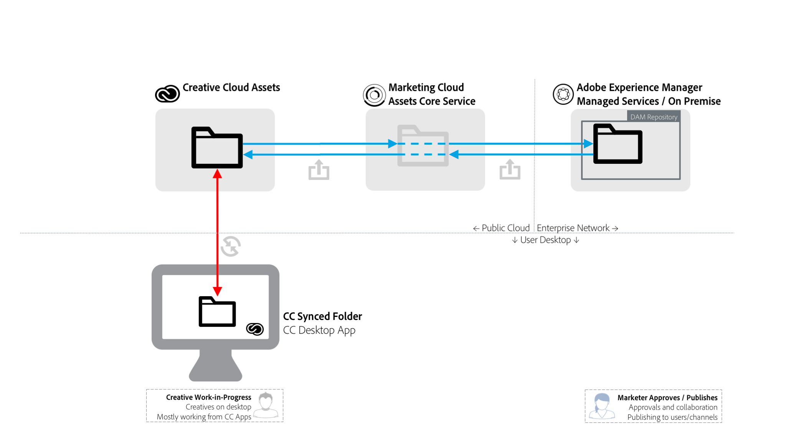

# AEM-Creative Cloud 폴더 공유 우수 사례 {#aem-to-creative-cloud-folder-sharing-best-practices}

>[!CAUTION]
>
>AEM-Creative Cloud 폴더 공유 기능은 더 이상 사용되지 않습니다. Adobe은 [Adobe 자산 링크](https://helpx.adobe.com/enterprise/admin-guide.html/enterprise/using/adobe-asset-link.ug.html) 또는 [AEM 데스크탑 앱](https://experienceleague.adobe.com/docs/experience-manager-desktop-app/using/using.html)과 같은 최신 기능을 사용할 것을 강력히 권장합니다. 자세한 내용은 [AEM 및 Creative Cloud 통합 우수 사례](/help/assets/aem-cc-integration-best-practices.md)를 참조하십시오.

AEM(Adobe Experience Manager)은 AEM Assets 사용자가 Creative Cloud 사용자와 폴더를 공유할 수 있도록 구성할 수 있으므로 Creative Cloud 자산 서비스에서 공유 폴더로 사용할 수 있습니다. 이 기능은 크리에이티브 팀과 AEM Assets 사용자 간에 파일을 교환하는 데 사용할 수 있습니다. 특히 크리에이티브 사용자가 AEM Assets 인스턴스에 액세스할 수 없는 경우(엔터프라이즈 네트워크에 있지 않은 경우).

이 유형의 통합은 두 사용 사례 모두에서 사용할 수 있습니다. 특히 AEM Assets에 직접 액세스할 수 없는 사용자와 작업할 때 사용됩니다.

* Creative Cloud 파일 사용자와 AEM Assets의 특정 자산 집합 공유(예: 새 마케팅 활동에 대해 디자인용으로 승인된 자산의 세트)
* Creative Cloud 사용자로부터 새 파일을 받는 중입니다.

>[!NOTE]
>
>이 문서를 읽기 전에 전체 [AEM 및 Creative Cloud 통합 우수 사례](aem-cc-integration-best-practices.md)를 검토하여 해당 주제에 대한 상위 수준의 개요를 확인할 수 있습니다.

## 개요 {#overview}

AEM-Creative Cloud 폴더 공유는 AEM Assets과 Creative Cloud 계정 간에 폴더 및 파일을 서버측 공유로 사용합니다. 데스크탑에서 Creative Cloud 데스크탑 애플리케이션을 사용하는 크리에이티브 전문가가 Adobe CreativeSync 기술을 사용하여 공유 폴더를 디스크에서 직접 사용할 수 있게 만들 수도 있습니다.

다음 다이어그램은 통합에 대한 개요를 제공합니다.

통합에는 다음 요소가 포함됩니다.

* **엔터프라이즈** 네트워크에 배포된 AEM Assets 서버(관리 서비스 또는 온-프레미스):여기에서 폴더 공유가 시작됩니다.
* **Adobe Marketing Cloud Assets 핵심 서비스**:AEM과 Creative Cloud 스토리지 서비스 간의 중간 역할을 합니다. 통합을 사용하는 회사의 관리자는 Marketing Cloud 조직과 AEM Assets 인스턴스 간의 신뢰 관계를 설정해야 합니다. 또한 [AEM Assets 사용자가 추가 보안을 위해 폴더를 공유하도록 승인된 Creative Cloud 협력자 목록](https://experienceleague.adobe.com/docs/core-services/interface/assets/t-admin-add-cc-user.html?lang=en#assets)을 정의합니다.
* **Creative Cloud 자산 웹 서비스** (저장소 및 Creative Cloud 파일 웹 UI):여기서 AEM Assets 폴더가 공유된 특정 Creative Cloud 사용자는 초대를 수락하고 Creative Cloud 계정 저장소에서 폴더를 볼 수 있습니다.
* **Creative Cloud 데스크탑 애플리케이션**:(선택 사항) Creative Cloud 자산 저장소와 동기화를 통해 크리에이티브 사용자의 데스크탑에서 공유 폴더/파일에 직접 액세스할 수 있습니다.

## 특성 및 제한 사항 {#characteristics-and-limitations}

* **변경 사항의 단방향 전파:**  파일 변경 사항은 처음에 자산을 생성(업로드됨)한 시스템(AEM 또는 Creative Cloud 자산)에서 한 방향으로만 전파됩니다. 통합은 두 시스템 간에 완전히 자동화된 양방향 동기화를 제공하지 않습니다.

* **버전 관리:**

   * AEM은 파일이 AEM에서 시작되어 이 파일에서 업데이트되는 경우에만 업데이트 시 자산 버전을 생성합니다.
   * Creative Cloud Assets는 진행 중인 작업 업데이트를 타깃팅하는 자체 [버전 관리 기능](https://helpx.adobe.com/creative-cloud/help/versioning-faq.html)을 제공합니다(기본적으로 최대 10일 동안의 업데이트 저장)

* **공간 제한:** 교환된 파일의 크기와 볼륨은 크리에이티브 사용자 [를 위한 특정 ](https://helpx.adobe.com/creative-cloud/kb/file-storage-quota.html) Creative Cloud 자산 수( 구독 수준에 따라 다름)로 제한되고 최대 파일 크기는 5GB로 제한됩니다. 조직은 Adobe Marketing Cloud Assets 핵심 서비스에 있는 자산 할당량에 의해 공간이 추가로 제한됩니다.

* **공간 요구 사항:** 공유 폴더의 파일도 AEM에 물리적으로 저장한 다음 Marketing Cloud Assets 핵심 서비스에서 캐시된 복사본을 사용하여 Creative Cloud 계정에 저장해야 합니다.
* **네트워킹 및 대역폭:**  공유 폴더의 파일과 모든 업데이트를 시스템 간 네트워크를 통해 전송해야 합니다. 관련 파일 및 업데이트만 공유되도록 해야 합니다.
* **폴더 유형**:유형의 자산 폴더를 공유할  `sling:OrderedFolder`수 없습니다. 폴더를 공유하려면 AEM Assets에서 만들 때 순서 지정 옵션을 선택하지 마십시오.

## 우수 사례 {#best-practices}

AEM을 Creative Cloud 폴더 공유에 활용하는 우수 사례는 다음과 같습니다.

* **볼륨 고려 사항:** AEM/Creative Cloud 폴더 공유 를 사용하여 특정 캠페인이나 활동과 관련된 작은 수의 파일을 공유해야 합니다. 조직에서 승인된 모든 자산과 같이 더 큰 자산 세트를 공유하려면 다른 배포 방법(예: AEM Assets Brand Portal) 또는 AEM 데스크탑 앱을 사용합니다.
* **딥 계층을 공유하지 마십시오:**  공유는 재귀적으로 작동하며 선택적 공유 해제를 허용하지 않습니다. 일반적으로 하위 폴더가 없거나 하위 폴더 레벨과 같이 매우 낮은 계층 구조를 갖는 폴더만 공유로 간주해야 합니다.
* **단방향 공유를 위한 별도의 폴더:** AEM Assets에서 Creative Cloud 파일로 최종 자산을 공유하고 Creative Cloud 파일에서 AEM Assets으로 바로 크리에이티브 자산을 공유하려면 별도의 폴더를 사용해야 합니다. 이러한 폴더에 대한 훌륭한 명명 규칙과 함께 AEM Assets과 Creative Cloud 사용자 모두를 위한 이해하기 쉬운 작업 환경을 만듭니다.
* **공유 폴더의 WIP를 피하십시오.** 진행 중인 작업에 공유 폴더를 사용하지 마십시오. 파일을 자주 변경해야 하는 작업을 수행하려면 Creative Cloud 파일의 별도의 폴더를 사용하십시오.
* **공유 폴더 외부에서 새 작업 시작:**  새 디자인(크리에이티브 파일)은 Creative Cloud 파일의 별도의 WIP 폴더에서 시작해야 하며 AEM Assets 사용자와 공유할 준비가 되면 공유 폴더로 이동하거나 저장해야 합니다.
* **공유 구조 간소화:** 관리할 수 있는 운영 체제를 갖추려면 공유 구조를 간소화하는 것이 좋습니다. 모든 크리에이티브 사용자와 공유하는 대신, AEM Assets 폴더를 크리에이티브 디렉터나 팀 관리자와 같은 팀 담당자만 공유해야 합니다. 크리에이티브 측의 관리자는 최종 자산을 수신하고, 작업 지정을 결정한 다음, 디자이너가 WIP 자산에서 자신의 Creative Cloud 계정으로 작업할 수 있도록 합니다. Creative Cloud 공동 작업 기능을 사용하여 작업을 조정하고, 마지막으로 AEM Assets에 다시 공유할 준비가 된 자산을 선택하여 크리에이티브 지원 공유 폴더에 배치할 수 있습니다.

다음 다이어그램은 AEM Assets의 기존 최종 자산을 기반으로 새 디자인을 만드는 예제 구성을 보여줍니다.

