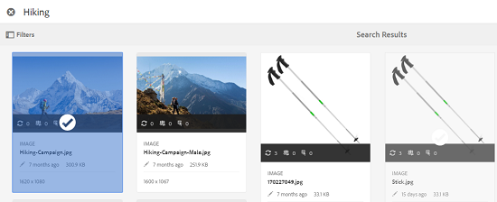

# Asset selector {#asset-selector}

>[!NOTE]
>
>이전 버전의 AEM에서는 자산 선택기를 [자산 선택기라고](https://helpx.adobe.com/experience-manager/6-2/assets/using/asset-picker.html) 불렀습니다.

자산 선택기를 사용하면 자산에서 자산을 검색, 검색 및 필터링할 수 [!DNL Adobe Experience Manager] 있습니다. 자산 선택기를 사용하여 선택한 자산의 메타데이터를 가져올 수도 있습니다. 자산 선택기 인터페이스를 사용자 정의하려면 지원되는 요청 매개 변수를 사용하여 시작할 수 있습니다. 이러한 매개 변수는 특정 시나리오에 대한 자산 선택기 컨텍스트를 설정합니다.

현재, 요청 매개 변수 `assettype` (*이미지/비디오/텍스트*)와 선택 `mode` (*단일/복수*)을 자산 선택기의 상황에 맞는 정보로 전달할 수 있으며, 이러한 정보는 선택 항목 전체에서 그대로 유지됩니다.

자산 선택기는 HTML5 **Window.postMessage** 메시지를 사용하여 선택한 자산에 대한 데이터를 수신자에게 보냅니다.

자산 선택기는 Granite의 foundation picker 어휘를 기반으로 합니다. 기본적으로 자산 선택기는 검색 모드에서 작동합니다. 그러나 Omnisearch 경험을 사용하여 필터를 적용하여 특정 자산에 대한 검색을 세분화할 수 있습니다.

CQ 컨테이너의 일부인지 여부에 관계없이 모든 웹 페이지를 자산 선택기(`https://[AEM_server]:[port]/aem/assetpicker.html`)와 통합할 수 있습니다.

## 컨텍스트 매개 변수 {#contextual-parameters}

다음 요청 매개 변수를 URL에 전달하여 특정 컨텍스트에서 자산 선택기를 시작할 수 있습니다.

| 이름 | 값 | 예 | 목적 |
|---|---|---|---|
| 리소스 접미어(B) | URL에서 리소스 접미어로 폴더 경로:`http://localhost:4502/aem/` `assetpicker.html/<folder_path>` | 특정 폴더가 선택된 상태로 자산 선택기를 실행하려면(예: 폴더를 선택한 경우) `/content/dam/we-retail/en/activities` URL이 형식이어야 합니다. `http://localhost:4502/aem/assetpicker.html` `/content/dam/we-retail/en/activities?assettype=images` | 자산 선택기가 시작될 때 특정 폴더를 선택해야 하는 경우 리소스 접미어로 전달합니다. |
| mode | 단일, 다중 | `http://localhost:4502/aem/assetpicker.html` `?mode=multiple`   `http://localhost:4502/aem/assetpicker.html` `?mode=single` | 여러 모드에서 자산 선택기를 사용하여 여러 자산을 동시에 선택할 수 있습니다. |
| 문제가 발생합니다 | true, false | `http://localhost:4502/aem/assetpicker.html` `?dialog=true` | 이러한 매개 변수를 사용하여 자산 선택기를 [화강암 대화 상자]로 엽니다. 이 옵션은 [화강암 경로 필드]를 통해 자산 선택기를 실행하고 pickerSrc URL로 구성하는 경우에만 적용됩니다. |
| 루트 | `<folder_path>` | `http://localhost:4502/aem/` `assetpicker.html?assettype=images` `&root=/content/dam/we-retail/en/activities` | 자산 선택기의 루트 폴더를 지정하려면 이 옵션을 사용합니다. 이 경우 자산 선택기를 사용하면 루트 폴더 아래에서 하위 자산(직접/간접)만 선택할 수 있습니다. |
| 보기 모드 | 검색을 |  | 자산 유형 및 MIMETYPE 매개 변수를 사용하여 검색 모드에서 자산 선택기를 실행하려면 |
| 자산 유형(S) | 이미지, 문서, 멀티미디어, 아카이브 | <ul><li>`http://localhost:4502/aem/assetpicker.html?viewmode=search&assettype=images`</li> <li>`http://localhost:4502/aem/assetpicker.html?viewmode=search&assettype=documents`</li> <li>`http://localhost:4502/aem/assetpicker.html?viewmode=search&assettype=multimedia`</li> <li>`http://localhost:4502/aem/assetpicker.html?viewmode=search&assettype=archives`</li> | 전달된 값을 기준으로 자산 유형을 필터링하려면 이 옵션을 사용합니다. |
| mimetype | 자산의 MIMETYPE(`/jcr:content/metadata/dc:format`와일드카드가 지원됨) | <ul><li>`http://localhost:4502/aem/assetpicker.html?viewmode=search&mimetype=image/png`</li>  <li>`http://localhost:4502/aem/assetpicker.html?viewmode=search&?mimetype=*png`</li>  <li>`http://localhost:4502/aem/assetpicker.html?viewmode=search&mimetype=*presentation`</li>  <li>`http://localhost:4502/aem/assetpicker?viewmode=search&mimetype=*presentation&mimetype=*png`</li></ul> | MIME 형식을 기반으로 자산을 필터링하는 데 사용합니다. |

## 자산 선택기 사용 {#using-the-asset-selector}

1. 자산 선택기 인터페이스에 액세스하려면 로 이동합니다 `https://[AEM_server]:[port]/aem/assetpicker`.
1. 원하는 폴더로 이동하고 하나 이상의 자산을 선택합니다.

   

   또는 옴니검색 상자에서 원하는 자산을 검색한 다음 선택할 수 있습니다.

   

   OmniSearch 상자를 사용하여 자산을 검색하는 경우 [필터] 창에서 다양한 필터 **[!UICONTROL 를 선택하여]** 검색을 세분화할 수 있습니다.

   

1. 도구 모음에서 선택 **[!UICONTROL 을]** 탭/클릭합니다.
