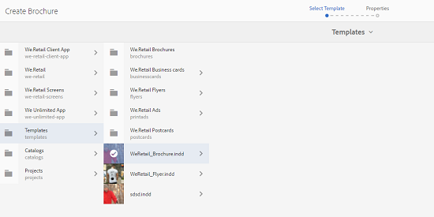
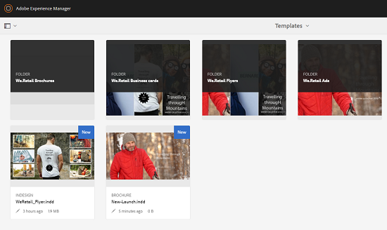
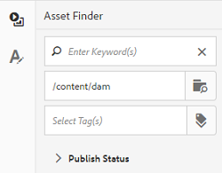

# 자산 템플릿 {#asset-templates}

에셋 템플릿은 디지털 및 인쇄 미디어에 시각적으로 풍부한 컨텐츠를 신속하게 재활용할 수 있는 에셋의 특별한 클래스입니다. 자산 템플릿에는 고정 메시징 섹션과 편집 가능한 섹션이 포함되어 있습니다.

고정 메시징 섹션에는 브랜드 로고 및 편집을 위해 비활성화된 저작권 정보와 같은 독점 컨텐츠가 포함될 수 있습니다. 편집 가능한 섹션에는 메시지를 사용자 지정하기 위해 편집할 수 있는 필드에 시각적 컨텐츠와 텍스트 컨텐츠가 포함될 수 있습니다.

글로벌 사이니지를 보호하면서 제한된 편집 작업을 할 수 있는 유연성을 갖춘 에셋 템플릿을 사용하면 콘텐츠를 빠르게 조정하고 다양한 기능을 위해 컨텐츠를 가공물로 배포할 수 있습니다. 컨텐츠를 재활용하면 인쇄 및 디지털 채널을 관리하는 데 소요되는 비용을 줄일 수 있고 이러한 채널에서 전체적이고 일관된 경험을 제공할 수 있습니다.

마케터는 AEM Assets 내에서 템플릿을 저장 및 관리할 수 있고 단일 기본 템플릿을 사용하여 개인화된 여러 인쇄 경험을 손쉽게 제작할 수 있습니다. 브로셔, 전단지, 엽서, 명함 등 다양한 유형의 마케팅 자료를 만들어 고객에게 마케팅 메시지를 신속하게 전달할 수 있습니다. 또한 기존 또는 새로운 인쇄 출력에서 여러 페이지의 인쇄 출력을 취합할 수 있습니다. 무엇보다도 디지털 경험과 인쇄 경험을 동시에 간편하게 전달하여 사용자에게 일관된 통합 경험을 제공할 수 있습니다.

에셋 템플릿이 대부분 InDesign 파일이지만 InDesign을 능숙하게 사용해도 뛰어난 아티팩트를 만들 수 있습니다. InDesign 템플릿의 필드를 제품 필드와 매핑하지 않아도 됩니다. 그렇지 않으면 카탈로그를 만들 때 필요합니다. 웹 인터페이스에서 직접 WYSIWYG 모드에서 템플릿을 편집할 수 있습니다. 그러나 InDesign에서 편집 변경 사항을 처리하려면 먼저 InDesign 서버와 통합되도록 AEM Assets을 구성해야 합니다.

웹 인터페이스에서 InDesign 템플릿을 편집할 수 있으므로 크리에이티브 및 마케팅 담당자 간의 공동 작업을 향상시킬 수 있고 로컬 프로모션 이니셔티브를 위한 출시 시간을 단축할 수 있습니다.

자산 템플릿으로 다음을 수행할 수 있습니다.

* 웹 인터페이스에서 편집 가능한 템플릿 필드 수정
* 글꼴 크기, 스타일 및 태그 수준의 문자 등 텍스트의 기본 스타일을 제어합니다.
* 컨텐츠 선택기를 사용하여 템플릿 내의 이미지 변경
* 템플릿 편집 내용 미리 보기
* 여러 템플릿 파일을 병합하여 여러 페이지로 된 아티팩트를 만들 수 있습니다.

마케팅 자료 템플릿을 선택하면 AEM Assets에서 편집할 수 있는 템플릿 사본을 만듭니다. 원본 템플릿은 그대로 유지되므로 글로벌 사이니지는 그대로 유지되고 브랜드 일관성을 유지하기 위해 다시 사용할 수 있습니다.

업데이트된 파일을 상위 폴더 내의 다음 형식으로 내보낼 수 있습니다.

* INDD
* PDF
* JPG

이러한 형식의 출력을 로컬 시스템에 다운로드할 수도 있습니다.

## 자료 만들기 {#creating-a-collateral}

향후 캠페인을 위해 브로셔, 전단지 및 광고와 같은 디지털 인쇄 가능한 자료를 만들고 전 세계적으로 아울렛 매장과 공유하는 시나리오를 생각해 보십시오. 템플릿을 기반으로 마케팅 자료를 만들어 다양한 채널에서 일관된 고객 경험을 제공할 수 있습니다. 디자이너는 InDesign과 같은 크리에이티브 솔루션을 사용하여 캠페인 템플릿(단일 페이지 또는 다중 페이지)을 만들고 템플릿을 AEM Assets에 업로드할 수 있습니다. 자료를 만들기 전에 하나 이상의 INDD 템플릿을 Experience Manager에 업로드하여 미리 사용할 수 있도록 하십시오.

1. AEM 로고를 클릭하거나 탭한 다음 탐색 페이지에서 **[!UICONTROL 자산]**&#x200B;을 클릭/탭합니다.
1. 옵션에서 **[!UICONTROL 템플릿]**&#x200B;을 선택합니다.

   

1. **[!UICONTROL 만들기]**&#x200B;를 클릭/탭한 다음 메뉴에서 만들 자료를 선택합니다. 예를 들어 **[!UICONTROL 브로셔]**&#x200B;를 선택합니다.

   

1. 하나 이상의 INDD 템플릿이 미리 Experience Manager에 업로드되어 사용할 수 있도록 합니다. 브로셔에 사용할 템플릿을 선택하고 **[!UICONTROL 다음]**&#x200B;을 클릭/탭합니다.

   

1. 브로셔의 이름과 선택적 설명을 지정합니다.

   

1. (선택 사항) **[!UICONTROL 태그]** 필드 옆에 있는 **[!UICONTROL 태그]** 아이콘을 클릭/탭하고 브로셔에 대해 하나 이상의 태그를 선택합니다. **[!UICONTROL 확인]**&#x200B;을 클릭/탭하여 선택을 확인합니다.

   

1. **[!UICONTROL 만들기]**&#x200B;를 클릭합니다. 새 브로셔가 만들어졌는지 확인하는 대화 상자가 표시됩니다. **[!UICONTROL 열기]**&#x200B;를 클릭/탭하여 브로셔를 편집 모드로 엽니다.

   

   또는 대화 상자를 닫고 시작했던 템플릿 페이지의 폴더로 이동하여 만든 브로셔를 확인합니다. 카드 보기의 축소판에 자료 유형이 표시됩니다. 예를 들어 이 경우 축소판에 브로셔가 표시됩니다.

   

## 자료 편집 {#editing-a-collateral}

자료를 만든 직후 자료를 편집할 수 있습니다. 또는 템플릿 페이지 또는 자산 페이지에서 엽니다.

1. 편집할 자료를 열려면 다음 중 하나를 수행합니다.

   * [보조 자료 만들기](asset-templates.md#creating-a-collateral)의 7단계에서 만든 자료(이 경우에는 브로셔)를 엽니다.
   * 템플릿 페이지에서 자료를 만든 폴더로 이동한 다음, 자료 축소판에서 빠른 편집 작업을 클릭/탭합니다.
   * 보조 자료의 자산 페이지의 도구 모음에서 편집 아이콘을 클릭/탭합니다.
   * 자료를 선택하고 도구 모음에서 편집 아이콘을 클릭/탭합니다.

   

   자산 파인더와 텍스트 편집기가 페이지 왼쪽에 표시됩니다. 텍스트 편집기는 기본적으로 열려 있습니다.

   텍스트 편집기를 사용하여 텍스트 필드에 표시할 텍스트를 수정할 수 있습니다. 태그 수준에서 글꼴 크기, 스타일, 색상 및 문자를 수정할 수 있습니다.

   자산 파인더를 사용하면 AEM Assets 내에서 이미지를 찾거나 검색할 수 있고 템플릿의 편집 가능한 이미지를 원하는 이미지로 바꿀 수 있습니다.

   

   편집 가능 영역이 오른쪽에 표시됩니다. AEM Assets에서 필드를 편집하려면 템플릿의 해당 필드에 InDesign에서 태그가 지정되어 있어야 합니다. 즉, InDesign에서 편집 가능한 것으로 만들어야 합니다.

   

   >[!NOTE]
   >
   >AEM 인스턴스가 InDesign 서버와 통합되므로 AEM Assets에서 InDesign 템플릿에서 데이터를 추출하여 편집할 수 있습니다. 자세한 내용은 [InDesign Server](indesign.md)과 AEM Assets 통합을 참조하십시오.

1. 편집 가능한 필드의 텍스트를 수정하려면 편집 가능한 필드 목록에서 텍스트 필드를 클릭/탭하고 필드에서 텍스트를 편집합니다.

   

   제공된 옵션을 사용하여 글꼴 스타일, 색상, 크기 등 텍스트 속성을 편집할 수 있습니다.

1. 텍스트 변경 내용을 미리 보려면 **[!UICONTROL 미리 보기]** 아이콘을 클릭/탭합니다.

   

1. 이미지를 교체하려면 **[!UICONTROL 자산 파인더]** 아이콘을 클릭/탭합니다.

   

1. 편집 가능한 필드 목록에서 이미지 필드를 선택한 다음 자산 선택기에서 원하는 이미지를 편집 가능한 필드로 드래그합니다.

   

   키워드, 태그 및 게시 상태를 기반으로 이미지를 검색할 수도 있습니다. AEM Assets 저장소를 탐색하고 원하는 이미지의 위치로 이동할 수 있습니다.

   

1. 이미지를 미리 보려면 **[!UICONTROL 미리 보기]** 아이콘을 클릭/탭합니다.

   

1. 여러 페이지로 된 자료에서 특정 페이지를 편집하려면 하단에 있는 페이지 탐색기를 사용합니다.

   

1. 도구 모음에서 **[!UICONTROL 미리 보기]** 아이콘을 클릭/탭하여 모든 변경 사항을 미리 봅니다. **[!UICONTROL 완료]**&#x200B;를 클릭/탭하여 마케팅 자료에 대한 편집 변경 내용을 저장합니다.

   >[!NOTE]
   >
   >미리 보기 및 완료 아이콘은 자료 내의 편집 가능한 이미지 필드에 누락된 아이콘이 없는 경우에만 활성화됩니다. 보조 항목에 누락된 아이콘이 있는 경우 AEM에서 InDesign 템플릿의 이미지를 확인할 수 없기 때문입니다. 일반적으로 AEM은 다음 경우 이미지를 해결할 수 없습니다.
   >
   >* 이미지는 기본 InDesign 템플릿에 포함되지 않습니다.
   >* 이미지가 로컬 파일 시스템에서 연결되어 있습니다.

   >
   >AEM에서 이미지를 해결하려면 다음을 수행합니다.
   >
   >* InDesign 템플릿을 만드는 동안 이미지 포함([링크 및 포함된 그래픽 정보](https://helpx.adobe.com/indesign/using/graphics-links.html) 참조).
   >* AEM을 로컬 파일 시스템에 마운트한 다음 누락된 아이콘을 기존 AEM 자산에 매핑할 수 있습니다.

   >
   >InDesign 문서 작업에 대한 자세한 내용은 [AEM](https://helpx.adobe.com/experience-manager/kb/best-practices-idd-docs-aem.html)에서 InDesign 문서 작업을 위한 우수 사례를 참조하십시오.

1. 브로셔에 대한 PDF 변환을 생성하려면 대화 상자에서 Acrobat 옵션을 선택한 다음 **[!UICONTROL 계속]**&#x200B;을 클릭합니다.
1. 보조 자료는 처음 사용한 폴더에 만들어집니다. 변환을 보려면, 자료를 열고 GlobalNav 목록에서 **[!UICONTROL 표현물]**&#x200B;을 선택합니다.

   

1. 변환 목록에서 PDF 변환을 클릭/탭하여 PDF 파일을 다운로드합니다. PDF 파일을 열어 자료를 검토합니다.

   

## 자료 병합 {#merge-collateral}

1. **[!UICONTROL 도구 > 자산]**&#x200B;을 클릭하거나 탭합니다.
1. 옵션에서 **[!UICONTROL 템플릿]**&#x200B;을 선택합니다.
1. **[!UICONTROL 만들기]**&#x200B;를 클릭/탭하고 메뉴에서 **[!UICONTROL 병합]**&#x200B;을 선택합니다.

   

1. 템플릿 병합 페이지에서 병합 아이콘을 클릭/탭합니다.

   

1. 병합할 자료의 위치로 이동하고 병합할 자료의 축소판을 클릭/탭하여 선택합니다.

   

   OmniSearch 상자에서 템플릿을 검색할 수도 있습니다.

   

   AEM Assets 저장소 또는 컬렉션을 탐색하고 원하는 템플릿의 위치로 이동한 다음 병합할 템플릿을 선택할 수 있습니다.

   

   다양한 필터를 적용하여 원하는 템플릿을 검색할 수 있습니다. 예를 들어 파일 유형 또는 태그를 기반으로 템플릿을 검색할 수 있습니다.

   

1. 도구 모음에서 **[!UICONTROL 다음]**&#x200B;을 클릭/탭합니다.
1. **[!UICONTROL 미리 보기 및 순서 바꾸기]** 화면에서 필요에 따라 템플릿을 다시 정렬하고 병합할 템플릿 선택을 미리 봅니다. 그런 다음 도구 모음에서 **[!UICONTROL 다음]**&#x200B;을 클릭/탭합니다.

   

1. 템플릿 구성 화면에서 보조 항목의 이름을 지정합니다. 원하는 경우, 적절하다고 생각하는 태그를 지정합니다. 출력을 PDF 형식으로 내보내려면 **[!UICONTROL Acrobat(.PDF)]** 옵션을 선택합니다. 기본적으로 보조 자료는 JPG 및 InDesign 형식으로 내보내집니다. 여러 페이지로 된 자료에 대한 표시 축소판을 변경하려면 **[!UICONTROL 축소판 변경]**&#x200B;을 클릭/탭합니다.

   

1. 대화 상자에서 **[!UICONTROL 저장]**&#x200B;을 클릭/탭한 다음 **[!UICONTROL 확인]**&#x200B;을 클릭/탭하여 대화 상자를 닫습니다. 여러 페이지로 된 자료는 처음 시작한 폴더에 만들어집니다.

   >[!NOTE]
   >
   >나중에 병합된 자료를 편집하거나 다른 자료를 만들 수 없습니다.

