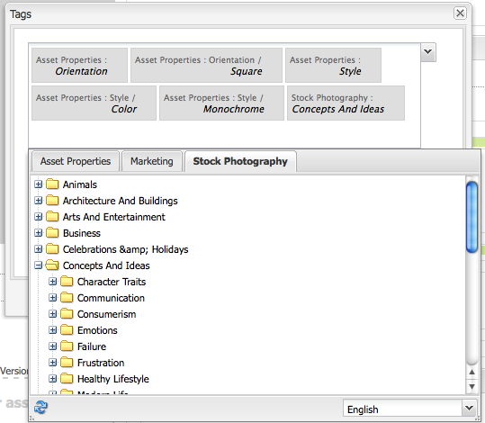

# 자산 편집기 페이지 만들기 및 구성 {#creating-and-configuring-asset-editor-pages}

이 문서에서는 다음 사항에 대해 설명합니다.

* 사용자 지정된 자산 편집기 페이지를 만드는 이유
* 자산에서 작업을 수행할 뿐만 아니라 메타데이터를 보고 편집할 수 있는 WCM 페이지인 자산 편집기 페이지를 만들고 사용자 지정하는 방법
* 여러 자산을 동시에 편집하는 방법

>[!NOTE]
>
>자산 공유는 오픈 소스 참조 구현으로 사용할 수 있습니다. 자산 [공유 공유기를 참조하십시오](https://adobe-marketing-cloud.github.io/asset-share-commons/) . 공식적으로 지원되지 않습니다.

## Why Create and Configure Asset Editor Pages? {#why-create-and-configure-asset-editor-pages}

디지털 자산 관리는 점점 더 많은 시나리오에서 사용되고 있습니다. 전문 사용자용 Adobe Experience Manager(AEM) 에셋의 강력한 유저 인터페이스를 사용하면 많은 정보를 제공할 수 있고 이해 관계자는 특정 유저 인터페이스 또는 애플리케이션을 요청하여 고객과 연관성이 높은 디지털 에셋에 액세스할 수 있도록 전문 지식을 갖춘 소규모 사용자 그룹(예: 사진 작가 또는 택소노믹스 전문가)에서 다양한 사용자 그룹으로 이동할 수 있습니다.

이러한 자산 중심의 애플리케이션은 인트라넷의 간단한 사진 갤러리로서 직원이 트레이드쇼 방문 또는 Geometrixx과 함께 제공되는 것과 같은 공개 웹 사이트의 보도 센터에서 사진을 업로드할 수 있습니다. 자산 중심의 애플리케이션은 장바구니, 체크아웃 및 확인 프로세스를 포함한 전체 솔루션으로 확장할 수 있습니다.

에셋 중심의 애플리케이션을 만드는 것은 코딩 작업이 필요 없는 구성 프로세스, 사용 중인 메타데이터에 대한 지식 및 사용자 그룹 및 요구 사항에 대한 지식만 있을 뿐만 아니라 AEM Assets으로 만든 자산 중심의 애플리케이션은 확장 가능합니다. 에셋 검색, 보기 및 수정에 사용할 수 있는 재사용 가능한 구성 요소를 중재하여 만들 수 있습니다.

AEM의 자산 중심의 응용 프로그램은 자산 편집기 페이지로 구성되며, 이를 사용하여 특정 자산을 자세히 볼 수 있습니다. 자산 편집기 페이지에서는 메타데이터의 편집도 허용할 수 있습니다. 단, 자산에 액세스하는 사용자에게 필요한 권한이 있어야 합니다.

## 자산 공유 페이지 만들기 및 구성 {#creating-and-configuring-an-asset-share-page}

DAM Finder 기능을 사용자 정의하고 필요한 모든 기능을 포함하는 페이지를 만들어 자산 공유 페이지라고 합니다. 새 자산 공유 페이지를 만들려면 [자산 공유] 템플릿을 사용하여 페이지를 추가한 다음 해당 페이지에서 사용자가 수행할 수 있는 작업을 사용자 지정하고, 뷰어에서 자산을 보는 방법을 결정하고, 사용자가 쿼리를 작성할 수 있는 방법을 결정합니다.

다음은 사용자 지정된 자산 공유 페이지를 만드는 데 사용되는 몇 가지 사용 사례입니다.

* 기자실을 위한 보도 센터
* 내부 비즈니스 사용자를 위한 이미지 검색 엔진
* 웹 사이트 사용자를 위한 이미지 데이터베이스
* 메타데이터 편집기를 위한 미디어 태깅 인터페이스

### 자산 공유 페이지 만들기 {#creating-an-asset-share-page}

새 자산 공유 페이지를 만들려면 웹 사이트에서 작업 중일 때 또는 디지털 자산 관리자로부터 자산을 만들 수 있습니다.

>[!NOTE]
>
>기본적으로 Digital Asset Manager에서 [ **새로 만들기]** 에서 [자산 공유] 페이지를 만들면 에셋 뷰어 및 에셋 편집기가 자동으로 만들어집니다.

웹 사이트 콘솔에서 새 자산 공유 페이지를 **만들려면** :

1. 웹 **[!UICONTROL 사이트]** 탭에서 자산 공유 페이지를 만들 위치로 이동하고 새로 만들기를 **[!UICONTROL 클릭합니다]**.

1. 자산 공유 **[!UICONTROL 페이지를]** 선택하고 만들기를 **[!UICONTROL 클릭합니다]**. 새 페이지가 만들어지고 자산 공유 페이지가 웹 사이트 **[!UICONTROL 탭에]** 나열됩니다.

Geometrixx DAM 자산 공유 템플릿을 사용하여 만든 기본 페이지는 다음과 같습니다.

자산 공유 페이지를 사용자 정의하려면 사이드 킥의 요소를 사용하고 쿼리 빌더 속성을 편집합니다. 페이지 **[!UICONTROL Geometrixx 보도]** 센터는 다음 템플릿을 기반으로 한 페이지의 사용자 정의 버전입니다.

디지털 자산 관리자를 통해 새 자산 공유 페이지를 만들려면:

1. 디지털 자산 관리자의 **[!UICONTROL 새로]**&#x200B;만들기에서 **[!UICONTROL 새 자산 공유를 선택합니다]**.
1. [ **[!UICONTROL 제목]**]에 자산 공유 페이지의 이름을 입력합니다. 원하는 경우 URL의 이름을 입력합니다.

   

1. 자산 공유 페이지를 두 번 클릭하여 열고 페이지를 구성합니다.

   

   기본적으로 [새로 만들기]에서 [자산 공유] 페이지를 만들면 **[!UICONTROL 자산]**&#x200B;뷰어 및 자산 편집기가 자동으로 만들어집니다.

#### 작업 사용자 정의 {#customizing-actions}

선택한 디지털 자산에 대해 사용자가 수행할 수 있는 작업은 사전 정의된 작업 중에서 선택할 수 있습니다.

자산 공유 페이지에 작업을 추가하려면:

1. 사용자 정의할 자산 공유 페이지에서 사이드 킥에서 **[!UICONTROL 작업을]** 클릭합니다.

   다음 작업을 사용할 수 있습니다.
   

| 작업 | 설명 |
|---|---|
| [!UICONTROL 삭제 작업] | 사용자는 선택한 자산을 삭제할 수 있습니다. |
| [!UICONTROL 다운로드 작업] | 사용자가 컴퓨터에 선택한 자산을 다운로드할 수 있도록 해줍니다. |
| [!UICONTROL Lightbox 작업] | 에셋을 &quot;lightbox&quot;에 저장하여 다른 작업을 수행할 수 있습니다. 여러 페이지에서 에셋을 사용하여 작업할 때 유용합니다. 또한 lightbox를 자산의 장바구니로 사용할 수도 있습니다. |
| [!UICONTROL 이동 작업] | 사용자는 자산을 다른 위치로 이동할 수 있습니다. |
| [!UICONTROL 태그 작업] | 선택한 자산에 태그를 추가할 수 있습니다. |
| [!UICONTROL 자산 보기 작업] | 사용자 조작을 위해 자산 편집기에서 자산을 엽니다. |

1. 페이지의 **작업** 영역으로 적절한 작업을 드래그합니다. 이렇게 하면 해당 작업을 실행하는 데 사용되는 단추가 만들어집니다.

   

#### 검색 결과 표시 방법 결정 {#determining-how-search-results-are-presented}

사전 정의된 렌즈 목록에서 결과가 표시되는 방식을 결정합니다.

검색 결과를 보는 방법을 변경하려면 다음을 수행하십시오.

1. 사용자 지정할 자산 공유 페이지에서 검색을 **[!UICONTROL 클릭합니다]**.

   

1. 적절한 렌즈를 페이지 위쪽 가운데로 드래그합니다. 프레스센터에서 렌즈는 이미 사용 가능합니다 사용자가 원하는 대로 검색 결과를 표시하려면 해당 렌즈 아이콘을 누릅니다.

다음 렌즈를 사용할 수 있습니다.

| 렌즈 | 설명 |
|---|---|
| **[!UICONTROL 목록 렌즈]** | 자산을 목록 방식으로 세부적으로 표시합니다. |
| **[!UICONTROL 모자이크 렌즈]** | 모자이크 방식으로 자산을 제공합니다. |

#### 모자이크 렌즈 {#mosaic-lens}

#### 목록 렌즈 {#list-lens}

#### 쿼리 빌더 사용자 지정 {#customizing-the-query-builder}

쿼리 빌더를 사용하면 검색어를 입력하고 [자산 공유] 페이지의 콘텐츠를 만들 수 있습니다. 쿼리 빌더를 편집할 때 페이지당 표시되는 검색 결과 수를 결정할 수도 있습니다. 자산을 두 번 클릭하면 자산 편집기가 열리고, 쿼리가 검색하는 경로나 사용자 정의된 노드 수도 확인할 수 있습니다.

쿼리 빌더를 사용자 정의하려면

1. 사용자 지정할 자산 공유 페이지의 쿼리 빌더에서 **[!UICONTROL 편집을]** 클릭합니다. By default, the **[!UICONTROL General]** tab opens.

1. 페이지당 결과 수, 자산 편집기의 경로(사용자 정의된 자산 편집기가 있는 경우) 및 작업 제목을 선택합니다.

   

1. Click the **[!UICONTROL Paths]** tab. 검색을 실행할 경로 또는 여러 경로를 입력합니다. 사용자가 경로 조건자를 사용하는 경우 이러한 경로를 덮어씁니다.

   

1. 원하는 경우 다른 노드 유형을 입력합니다.

1. 쿼리 **[!UICONTROL 빌더 URL]** 필드에서 쿼리 빌더를 대체하거나 래핑하고 기존 쿼리 빌더 구성 요소로 새 서블릿 URL을 입력할 수 있습니다. 피드 **[!UICONTROL URL]** 필드에서도 피드 URL을 무시할 수 있습니다.

   

1. 텍스트 **** 필드에 결과 및 결과 페이지 번호에 표시할 텍스트를 입력합니다. 변경을 **[!UICONTROL 완료하면]** 확인을 클릭합니다.

   

#### 설명 추가 {#adding-predicates}

AEM Assets에는 자산 공유 페이지에 추가할 수 있는 여러 가지 예측이 포함되어 있습니다. 사용자가 검색 범위를 더 좁힐 수 있도록 해줍니다. 경우에 따라 쿼리 빌더 매개 변수(예: 경로 매개 변수)를 무시할 수 있습니다.

설명 추가 방법:

1. 사용자 지정할 자산 공유 페이지에서 검색을 **[!UICONTROL 클릭합니다]**.

   

1. 적절한 설명을 쿼리 빌더 아래에 있는 자산 공유 페이지로 드래그합니다. 이렇게 하면 적절한 필드가 만들어집니다.

   

   다음 예측 자료를 사용할 수 있습니다.

| 설명 | 설명 |
|---|---|
| **[!UICONTROL 날짜 설명]** | 특정 날짜 전후에 수정된 자산을 검색할 수 있습니다. |
| **[!UICONTROL 옵션 설명]** | 사이트 소유자는 검색할 속성을 지정할 수 있습니다(예: cq:tags). 컨텐츠 트리에서 옵션을 채울 수 있습니다(예: 태그 트리). 이렇게 하면 사용자가 선택한 속성(태그 속성)이 가져야 하는 값(태그)을 선택할 수 있는 옵션 목록이 생성됩니다. 이 조건자를 사용하면 태그 목록, 파일 유형, 이미지 방향 등과 같은 목록 컨트롤을 만들 수 있습니다. 고정된 옵션 세트에 적합합니다. |
| **[!UICONTROL 경로 설명]** | 원하는 경우 경로 및 하위 폴더를 정의할 수 있습니다. |
| **[!UICONTROL 속성 설명]** | 사이트 소유자는 검색할 속성을 지정합니다(예: tiff:ImageLength). 사용자는 값을 입력할 수 있습니다(예: 800). 그러면 800픽셀의 모든 이미지가 반환됩니다. 속성에 임의 값이 있을 수 있는 경우 유용한 설명 |

자세한 내용은 [설명 javadocs를 참조하십시오](https://helpx.adobe.com/experience-manager/6-4/sites/developing/using/reference-materials/javadoc/com/day/cq/search/eval/package-summary.html).

1. 추가로 술어를 구성하려면 이 술어를 두 번 클릭합니다. 예를 들어 경로 설명 을 열면 루트 경로를 지정해야 합니다.

   

## 자산 편집기 페이지 만들기 및 구성 {#creating-and-configuring-an-asset-editor-page}

자산 편집기를 사용자 지정하여 사용자가 디지털 자산을 보고 편집할 수 있는 방법을 결정합니다. 이렇게 하려면 새 자산 편집기 페이지를 만든 다음 해당 페이지에서 사용자가 수행할 수 있는 보기 및 작업을 사용자 지정합니다.

>[!NOTE]
>
>DAM 자산 편집기에 사용자 정의 필드를 추가하려면 `/apps/dam/content/asseteditors.`

### 자산 편집기 페이지 만들기 {#creating-the-asset-editor-page}

자산 편집기 페이지를 만들 때는 자산 공유 페이지 바로 아래에 페이지를 만드는 것이 좋습니다.

자산 편집기 페이지를 만들려면:

1. 웹 **[!UICONTROL 사이트]** 탭에서 자산 편집기 페이지를 만들 위치로 이동하고 새로 만들기를 **[!UICONTROL 클릭합니다]**.

1. 자산 **[!UICONTROL 편집기 Geometrixx을]** 선택하고 **[!UICONTROL 만들기를 클릭합니다]**. 새 페이지가 만들어지고 페이지가 웹 사이트 **[!UICONTROL 탭에]** 나열됩니다.

Geometrixx 자산 편집기 템플릿을 사용하여 만든 기본 페이지는 다음과 같습니다.

자산 편집기 페이지를 사용자 정의하려면 사이드 킥의 요소를 사용합니다. Geometrixx **[!UICONTROL 보도]** 센터에서 액세스하는 자산 편집기 페이지는 다음 템플릿을 기반으로 한 페이지의 사용자 정의 버전입니다.

#### 자산 공유 페이지에서 여는 자산 편집기 설정 {#setting-which-asset-editor-opens-from-an-asset-share-page}

사용자 지정된 자산 편집기 페이지를 만든 후, 만든 사용자 지정된 자산 공유를 만든 자산을 두 번 클릭하면 사용자 지정된 [편집기] 페이지에서 자산이 열리는지 확인해야 합니다.

자산 편집기 페이지를 설정하려면

1. 자산 공유 페이지에서 쿼리 **[!UICONTROL 빌더]** 옆에 있는 편집을 클릭합니다.

   

1. 아직 **[!UICONTROL 선택되지]** 않은 경우 일반 탭을 클릭합니다.

1. 자산 편집기의 **[!UICONTROL 경로]** 필드에 자산 공유 페이지에서 자산을 열 자산 편집기의 경로를 입력하고 확인을 **[!UICONTROL 클릭합니다]**.

   

#### 자산 편집기 구성 요소 추가 {#adding-asset-editor-components}

페이지에 구성 요소를 추가하여 자산 편집기의 기능을 결정합니다.

자산 편집기 구성 요소를 추가하려면:

1. 사용자 지정할 자산 편집기 페이지의 사이드킥에서 **[!UICONTROL 자산 편집기를]** 선택합니다. 사용 가능한 모든 자산 편집기 구성 요소가 표시됩니다.

   >[!NOTE]
   >
   >사용자 정의할 수 있는 내용은 사용 가능한 구성 요소에 따라 다릅니다. 구성 요소를 활성화하려면 디자인 모드로 이동하고 활성화해야 하는 구성 요소를 선택합니다.

1. 사이드 킥의 구성 요소를 자산 편집기로 드래그하고 구성 요소 대화 상자에서 모든 사항을 수정합니다. 구성 요소는 다음 표에 설명되어 있으며 다음에 나오는 자세한 지침에 설명되어 있습니다.

   >[!NOTE]
   >
   >자산 편집기 페이지를 디자인할 때 읽기 전용 또는 편집 가능한 구성 요소를 만듭니다. 사용자는 해당 구성 요소에 연필의 이미지가 표시되는 경우 필드를 편집할 수 있음을 알고 있습니다. 기본적으로 대부분의 구성 요소는 읽기 전용으로 설정됩니다.

   | 구성 요소 | 설명 |
   |---|---|
   | **[!UICONTROL 메타데이터 양식]및[!UICONTROL 메타데이터 텍스트 필드]** | 자산에 추가 메타데이터를 추가하고 해당 자산에 제출하는 등의 작업을 수행할 수 있도록 해줍니다. |
   | **[!UICONTROL 하위 자산]** | 하위 자산을 사용자 정의할 수 있습니다. |
   | **태그** | 사용자가 자산을 선택하고 추가할 수 있습니다. |
   | **[!UICONTROL 썸네일]** | 자산의 축소판과 해당 파일 이름을 보여주며 대체 텍스트를 추가할 수 있습니다. 여기에 자산 편집기 작업도 추가할 수 있습니다. |
   | **[!UICONTROL 제목]** | 사용자 지정할 수 있는 자산 제목을 표시합니다. |

   

#### 메타데이터 양식 및 텍스트 필드 - 메타데이터 보기 구성 요소 구성 {#metadata-form-and-text-field-configuring-the-view-metadata-component}

메타데이터 양식은 시작 및 종료 동작을 포함하는 양식입니다. 그 사이에 **[!UICONTROL 텍스트]** 필드를 입력합니다. 양식 작업에 대한 자세한 내용은 [Forms](../sites-authoring/default-components.md) 를 참조하십시오.

1. 양식의 시작 영역에서 **[!UICONTROL 편집을]** 클릭하여 시작 동작을 만듭니다. 원하는 경우 상자 제목을 입력할 수 있습니다. 기본적으로 상자 제목은 **[!UICONTROL 메타데이터입니다]**. 유효성 검사를 위해 java-script 클라이언트 코드를 생성하려는 경우 클라이언트 유효성 검사 확인란을 선택합니다.

   

1. 양식의 끝 영역에서 **[!UICONTROL 편집을]** 클릭하여 종료 작업을 만듭니다. 예를 들어 사용자가 메타데이터 변경 내용을 제출할 수 있도록 **[!UICONTROL 전송]** 단추를 만들 수 있습니다. 선택적으로 메타데이터를 원래 상태로 재설정하는 **[!UICONTROL 재설정]** 단추를 추가할 수 있습니다.

   

1. 양식 **[!UICONTROL 시작과]** 양식 끝 **에서**&#x200B;메타데이터 텍스트 필드를 양식으로 드래그합니다. 사용자는 이러한 텍스트 필드에 메타데이터를 채우고 다른 작업을 제출하거나 완료할 수 있습니다.

1. 필드 이름(예: **제목** )을 두 번 클릭하여 메타데이터 필드를 열고 변경합니다. 구성 요소 **[!UICONTROL 편집]** 창의 [!UICONTROL 일반] 탭에서 이름 공간 및 필드 레이블뿐만 아니라 유형(예: `dc:title`유형)도 정의합니다.

   

   메타데이터 [양식에서 사용 가능한 네임스페이스를 수정하는 방법은 AEM Assets](extending-assets.md) 사용자 지정 및 확장을 참조하십시오.

1. Click the **[!UICONTROL Constraints]** tab. 여기에서 필수 필드인지 여부를 선택하고 필요한 경우 제한 사항을 추가할 수 있습니다.

   

1. Click the **[!UICONTROL Display]** tab. 여기에서 메타데이터 필드에 대한 새 폭 및 행 수를 입력할 수 있습니다. 사용자가 메타데이터를 편집할 수 있도록 **하려면 [필드가 읽기 전용** ] 확인란을 선택합니다.

   

   다음은 다양한 필드가 있는 메타데이터 양식의 예입니다.

   

그런 다음 자산 편집기 페이지에서 메타데이터 필드에 값을 입력하고(편집 가능한 경우) 최종 작업을 수행할 수 있습니다(예: 변경 내용 제출).

#### 하위 자산 {#sub-assets}

하위 자산 구성 요소는 하위 자산을 보고 선택할 수 있는 곳입니다. 기본 자산  및 하위 자산 아래에 표시되는 이름을 결정할 수 있습니다.

하위 자산 구성 요소를 두 번 클릭하여 기본 자산 및 하위 자산의 제목을 변경할 수 있는 하위 자산 대화 상자를 엽니다. 기본값은 해당 필드 아래에 나타납니다.

다음은 채워진 하위 자산 구성 요소의 예입니다.

예를 들어 하위 자산을 선택하는 경우 구성 요소에 적절한 페이지가 표시되는 방법과 상자 제목이 하위 자산에서 형제 그룹으로 바뀌는 방법을 확인하십시오.

#### 태그 {#tags}

태그 구성 요소는 사용자가 자산에 기존 태그를 할당할 수 있는 구성 요소로서, 나중에 조직과 검색에 도움이 됩니다. 이 구성 요소를 읽기 전용으로 설정할 수 있으므로 사용자는 태그를 추가할 수 없지만 보기만 할 수 있습니다.

태그 구성 요소를 두 번 클릭하여 태그 대화 상자를 엽니다. 이 대화 상자에서는 원할 경우 태그에서 제목을 변경할 수 있으며 할당된 네임스페이스를 선택할 수 있습니다. 이 필드를 편집 가능하도록 하려면 편집 **숨기기** 단추 확인란의 선택을 취소합니다. 기본적으로 태그는 편집 가능합니다.

태그를 편집할 수 있는 경우 태그 드롭다운 메뉴에서 태그를 선택하여 연필을 클릭하여 태그를 추가할 수 있습니다.

다음은 채워진 태그 구성 요소입니다.

#### 썸네일 {#thumbnail}

Thumbnail 구성 요소는 자산에 선택한 축소판이 표시되는 곳입니다. (많은 포맷의 경우 축소판은 자동으로 압축됩니다.) 또한 구성 요소에는 파일 이름 및 수정할 수 있는 [작업이 표시됩니다](assets-finder-editor.md#adding-asset-editor-actions).

축소판 구성 요소를 두 번 클릭하여 대체 텍스트를 변경할 수 있는 축소판 대화 상자를 엽니다. 기본적으로 축소판 대체 텍스트는 기본적으로 **[!UICONTROL 클릭하여 자산을 다운로드합니다]** .

다음은 채워진 축소판 구성 요소의 예입니다.

#### 제목 {#title}

제목 구성 요소는 자산의 제목과 설명을 표시합니다.

기본적으로 읽기 전용 모드이므로 사용자가 편집할 수 없습니다. 편집 가능하려면 구성 요소를 두 번 클릭하고 편집 **단추** 숨기기 확인란의 선택을 취소합니다. 또한 여러 자산의 제목을 입력합니다.

제목을 편집할 수 있는 경우 연필을 클릭하여 자산 속성 창을 열어 제목과 설명을 추가할 수 **있습니다** . 또한 날짜 및 시간을 선택하여 자산을 켜거나 끌 수 있습니다.

사용자가 연필 아이콘을 클릭하여 제목을 편집할 때 **제목**, **설명**&#x200B;을 **변경하고** On **및 Off Times를 입력하여** 자산을켜고 끌 수 있습니다.

다음은 채워진 제목 구성 요소의 예입니다.

#### 자산 편집기 작업 추가 {#adding-asset-editor-actions}

선택한 디지털 자산에 대해 사용자가 수행할 수 있는 작업은 사전 정의된 작업 중에서 선택할 수 있습니다.

자산 편집기 페이지에 작업을 추가하려면:

1. 사용자 정의할 자산 편집기 페이지에서 사이드 킥에서 **[!UICONTROL 자산 편집기를]** 클릭합니다. 

   

   다음 작업을 사용할 수 있습니다.

   | 작업 | 설명 |
   |---|---|
   | [!UICONTROL 다운로드] | 사용자가 컴퓨터에 선택한 자산을 다운로드할 수 있도록 해줍니다. |
   | [!UICONTROL 편집자] | 사용자가 이미지 편집(인터랙티브한 편집) 가능 |
   | [!UICONTROL Lightbox] | 에셋을 &quot;lightbox&quot;에 저장하여 다른 작업을 수행할 수 있습니다. 여러 페이지에서 에셋을 사용하여 작업할 때 유용합니다. |
   | [!UICONTROL 잠금] | 사용자가 자산을 잠글 수 있습니다. 이 기능은 기본적으로 활성화되지 않으며 구성 요소 목록에서 활성화해야 합니다. |
   | [!UICONTROL 참조] | 자산이 사용되는 페이지를 표시하려면 이 아이콘을 클릭합니다. |
   | [!UICONTROL 버전 관리] | 자산의 버전을 만들고 복원할 수 있습니다. |

1. 페이지의 **작업** 영역으로 적절한 작업을 드래그합니다. 이렇게 하면 해당 작업을 실행하는 데 사용되는 단추가 만들어집니다.

## 자산 편집기 페이지에서 여러 자산 편집 {#multi-editing-assets-with-the-asset-editor-page}

AEM Assets을 사용하면 여러 자산을 한 번에 변경할 수 있습니다. 자산을 선택한 후 해당 자산을 동시에 변경할 수 있습니다.

* 태그
* 메타데이터

자산 편집기 페이지를 사용하여 자산을 다중 편집하려면:

1. 의 Geometrixx **[!UICONTROL 프레스 센터]** 페이지를 엽니다 `http://localhost:4502/content/geometrixx/en/company/press.html`.
1. 자산을 선택합니다.

   * Windows: `Ctrl + click` 각 에셋.
   * Mac: `Cmd + click` 각 에셋.

   자산 범위를 선택하려면 첫 번째 자산을 클릭한 다음 마지막 자산 `Shift + click` 을 클릭합니다.

1. 작업 **[!UICONTROL 필드]** (페이지의 왼쪽 부분) **에서 메타데이터** 편집을 클릭합니다.

1. Geometrixx **[!UICONTROL 프레싱 센터 자산 편집기]** 페이지가 새 탭에 열립니다. 자산의 메타데이터는 다음과 같이 표시됩니다.

   * 일부 자산에만 적용되는 태그는 기울임꼴로 표시됩니다.
   * 모든 자산에 적용되는 태그는 일반 글꼴로 표시됩니다.
   * 태그 이외의 메타데이터: 필드의 값은 선택한 모든 자산에 대해 동일한 경우에만 표시됩니다.

1. 다운로드 **[!UICONTROL 를]** 클릭하여 자산 원본 변환이 들어 있는 ZIP 파일을 다운로드합니다.
1. 태그 필드 옆에 있는 **[!UICONTROL 연필]** 아이콘을 클릭하여 태그를 편집합니다.

   * 일부 자산에만 적용되는 태그는 회색 배경입니다.
   * 모든 자산에 적용되는 태그에는 흰색 배경이 있습니다.

   다음을 작업을 수행할 수 있습니다.

   * 모든 자산에 대한 태그를 제거하려면 `x` 아이콘을 클릭합니다.
   * 모든 자산에 태그를 추가하려면 `+` 아이콘을 클릭합니다.
   * 태그를 `arrow` 클릭하고 태그를 선택하여 모든 자산에 새 태그를 추가합니다.

   확인 **[!UICONTROL 을]** 클릭하여 양식의 변경 내용을 기록합니다. 태그 필드 옆의 **상자가** 자동으로 선택됩니다.

1. 설명 필드를 편집합니다. 예를 들어 다음과 같이 설정합니다. `This is a common description`. 필드를 편집하면 양식이 제출되면 필드가 선택한 자산의 기존 값을 덮어씁니다. 필드를 편집하면 필드 옆의 상자가 자동으로 선택됩니다.

   `This is a common description`

   필드를 편집하면 양식이 제출되면 필드가 선택한 자산의 기존 값을 덮어씁니다.

   참고: 필드를 편집하면 필드 옆의 상자가 자동으로 선택됩니다.

1. 메타데이터 **[!UICONTROL 업데이트를]** 클릭하여 양식을 제출하고 모든 자산에 대한 변경 사항을 저장합니다. 선택한 메타데이터만 수정됩니다.
