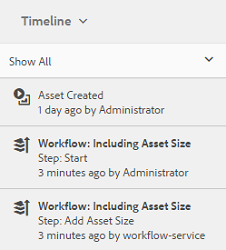

# 디지털 자산 처리 {#process-assets}

[!DNL Adobe Experience Manager Assets] 강력한 자산 처리를 위해 다양한 방법으로 디지털 자산 작업을 할 수 있습니다. 사용 가능한 처리 방법을 사용하거나 이러한 방법을 확장하여 디지털 자산의 검색 및 배포, 기본 상태 등을 사용하여 전체 비즈니스 프로세스를 완료할 수 있습니다. 이 모든 작업은 필요한 규모와 맞춤화를 통해 수행할 수 있습니다.

## 워크플로우 이해 {#understand-workflows}

자산 처리를 위해 [!DNL Experience Manager]은(는) 워크플로우를 사용합니다. 워크플로우는 비즈니스 논리 또는 활동을 자동화하는 데 도움이 됩니다. 특정 작업을 수행하는 세부 단계는 기본적으로 제공되며 개발자는 고유한 사용자 지정 단계를 만들 수 있습니다. 이러한 단계를 논리적 순서로 결합하여 워크플로우를 만들 수 있습니다. 예를 들어 워크플로우는 이미지에 포함된 메타데이터, 업로드된 폴더, 이미지 해상도 등과 같은 특정 기준을 기반으로 업로드된 이미지에 워터마크를 자동으로 적용할 수 있습니다. 또 다른 예로, 이러한 방식으로 이미지를 워터마킹하고 메타데이터 추가, 변환 만들기, 자산 검색을 위한 지능형 태그 추가, 데이터 저장소에 게시, 사용자 액세스에 대한 권한 설정 등과 같은 여러 자산 관리 요구 사항을 동시에 해결하도록 구성된 워크플로우가 있습니다.

## Experience Manager {#default-workflows}에서 사용할 수 있는 기본 워크플로

기본적으로 업로드된 모든 자산은 [!UICONTROL DAM 자산 업데이트] 작업 과정을 사용하여 처리됩니다. 이 워크플로우는 업로드된 각 자산에 대해 실행되며 변환 생성, 메타데이터 쓰기 되돌리기, 페이지 추출, 미디어 추출 및 트랜스코딩과 같은 기본 자산 관리 작업을 수행합니다.

기본적으로 사용 가능한 다양한 워크플로우 모델을 보려면 ]도구 > 워크플로우 > 모델[!UICONTROL 을 참조하십시오.[!DNL Experience Manager]

*그림:에서 사용할 수 있는 일부 기본 작업 과정입니다 [!DNL Experience Manager].*

## 자산에 워크플로우 적용 {#applying-workflows-to-assets}

디지털 자산에 워크플로우를 적용하는 것은 웹 사이트 페이지의 워크플로우와 동일합니다. 워크플로우를 만들고 사용하는 방법에 대한 전체 지침은 [워크플로우 시작](/help/sites-authoring/workflows-participating.md)을 참조하십시오.

디지털 자산의 워크플로우를 사용하여 자산을 활성화하거나 워터마크를 만듭니다. 자산에 대한 많은 워크플로우가 자동으로 설정됩니다. 예를 들어, 이미지를 편집한 후 자동으로 표현물을 만드는 워크플로우가 자동으로 설정됩니다.

>[!NOTE]
>
>[!UICONTROL 활성화 요청] 및 [!UICONTROL 비활성화 요청]과 같이 클래식 UI에서 사용할 수 있는 작업 흐름을 터치 활성화 UI에서 사용할 수 없는 경우 [워크플로우 모델 만들기](/help/sites-developing/workflows-models.md#make-workflow-models-available-in-touchui)를 참조하십시오.

## AEM 자산 {#apply-a-workflow-to-an-aem-asset}에 워크플로우 적용

<!-- 
TBD: Add animated GIF for these steps instead of all these screenshots.
-->

자산에 워크플로우를 적용하려면 다음 단계를 따르십시오.

1. 워크플로우를 시작할 자산의 위치로 이동하고 자산을 클릭하여 자산 페이지를 엽니다.

1. 워크플로우를 시작할 자산의 위치로 이동하고 자산을 클릭하여 자산 페이지를 엽니다. 타임라인을 표시하려면 메뉴에서 **[!UICONTROL 타임라인]**&#x200B;을 선택합니다.

   

1. 하단에 있는 **[!UICONTROL 작업]**&#x200B;을 클릭하여 자산에 사용할 수 있는 작업 목록을 엽니다.

1. 목록에서 **[!UICONTROL 워크플로우 시작]**&#x200B;을 클릭합니다.

1. **[!UICONTROL 워크플로우 시작]** 대화 상자의 목록에서 워크플로우 모델을 선택합니다.

   

1. (선택 사항) 워크플로우 인스턴스를 참조하는 데 사용할 수 있는 워크플로우의 제목을 지정합니다.

   

1. **[!UICONTROL 시작]**&#x200B;을 클릭한 다음 대화 상자에서 **[!UICONTROL 계속]**&#x200B;을 클릭하여 확인합니다. 각 워크플로우 단계가 이벤트로 타임라인에 표시됩니다.

   

## 여러 자산 {#applying-a-workflow-to-multiple-assets}에 워크플로우 적용

1. 자산 콘솔에서 워크플로우를 시작할 자산의 위치로 이동하고 자산을 선택합니다. 타임라인을 표시하려면 메뉴에서 **[!UICONTROL 타임라인]**&#x200B;을 선택합니다.

   

1. 맨 아래에 있는 **[!UICONTROL 작업]**&#x200B;을 클릭합니다.

1. **[!UICONTROL 워크플로우 시작]**&#x200B;을 클릭합니다. **[!UICONTROL 워크플로우 시작]** 대화 상자의 목록에서 워크플로우 모델을 선택합니다.

   

1. (선택 사항) 워크플로우 인스턴스를 참조하는 데 사용할 수 있는 워크플로우의 제목을 지정합니다.

1. **[!UICONTROL 시작]**&#x200B;을 클릭한 다음 대화 상자에서 **[!UICONTROL 확인]**&#x200B;을 클릭합니다. 워크플로우는 선택한 모든 자산에서 실행됩니다.

## 여러 폴더 {#applying-a-workflow-to-multiple-folders}에 작업 흐름 적용

여러 폴더에 워크플로우를 적용하는 절차는 여러 자산에 워크플로우를 적용하는 절차와 유사합니다. 자산 콘솔에서 폴더를 선택하고 [ 절차의 2-7단계를 수행하여 여러 자산](assets-workflow.md#applying-a-workflow-to-multiple-assets)에 워크플로우를 적용합니다.

## 컬렉션 {#applying-a-workflow-to-a-collection}에 워크플로우 적용

컬렉션에 워크플로우를 적용하는 방법에 대한 자세한 내용은 [컬렉션](managing-collections-touch-ui.md#running-a-workflow-on-a-collection)에 워크플로우 적용을 참조하십시오.

## 조건부로 {#auto-execute-workflow-on-some-assets} 에셋을 처리하는 워크플로 자동 시작

관리자는 미리 정의된 조건을 기반으로 자산을 자동으로 실행하고 처리하도록 워크플로우를 구성할 수 있습니다. 이 기능은 사업 부문의 사용자 및 마케터에게 유용합니다. 예를 들어 특정 폴더에 사용자 정의 워크플로우를 만들 수 있습니다. 에이전시의 사진 촬영에서 나온 모든 에셋을 워터마크가 될 수 있고 프리랜서가 업로드한 모든 에셋을 처리하여 특정 변환을 만들 수 있다고 가정해 보십시오.

워크플로우 모델의 경우 사용자는 워크플로우 런처를 실행하는 워크플로우 런처를 만들 수 있습니다. 워크플로우 런처는 컨텐츠 저장소의 변경 사항을 모니터링하고 사전 정의된 조건이 충족되면 워크플로우를 실행합니다. 관리자는 마케터에게 워크플로우를 만들고 런처를 구성할 수 있는 액세스 권한을 제공할 수 있습니다. 사용자는 기본 [!UICONTROL DAM 자산 업데이트] 작업 과정을 수정하여 특정 자산을 처리하는 데 필요한 추가 단계를 추가할 수 있습니다. 워크플로우는 새로 업로드된 모든 자산에서 실행됩니다. 다음 방법 중 하나를 사용하여 특정 자산에 대한 추가 단계 실행을 제한합니다.

* [!UICONTROL DAM 자산 업데이트] 작업 과정의 복사본을 만들고 특정 폴더 계층 구조에서 실행되도록 수정합니다. 이 방법은 몇 개의 폴더에 유용합니다.
* 필요한 만큼 많은 폴더에 조건부로 적용할 수 있는 [OR split](/help/sites-developing/workflows-step-ref.md#or-split)을 사용하여 추가 처리 단계를 추가할 수 있습니다.

## 우수 사례 및 제한 사항 {#best-practices-limitations-tips}

* 워크플로우를 디자인할 때 모든 유형의 변환에 대한 요구 사항을 고려하십시오. 나중에 변환의 필요성을 예측할 수 없는 경우 워크플로우에서 변환 생성 단계를 제거합니다. 나중에 변환을 일괄 삭제할 수 없습니다. 원치 않는 변환은 [!DNL Experience Manager]을(를) 장시간 사용한 후 많은 저장 공간을 확보할 수 있습니다. 개별 자산의 경우 사용자 인터페이스에서 수동으로 변환을 제거할 수 있습니다. 여러 자산의 경우 [!DNL Experience Manager]을(를) 사용자 지정하여 특정 표현물을 삭제하거나 자산을 삭제하고 다시 업로드할 수 있습니다.
* 기본적으로 [!UICONTROL DAM 자산 업데이트] 작업 과정에는 축소판과 웹 변환을 만드는 몇 가지 단계가 포함되어 있습니다. 워크플로우에서 기본 변환이 제거되면 [!DNL Assets]의 사용자 인터페이스가 제대로 렌더링되지 않습니다.

>[!MORELIKETHIS]
>
>* [워크플로우 적용 및 참여](/help/sites-authoring/workflows.md)
>* [워크플로우 모델 생성 및 워크플로우 기능 확장](/help/sites-developing/workflows.md)
>* [워크플로우 실행 방법](/help/sites-administering/workflows-starting.md)
>* [워크플로우 모범 사례](/help/sites-developing/workflows-best-practices.md)
>* [워크플로우를 사용하여 자산 수정에 대한 커뮤니티 아티클](https://helpx.adobe.com/experience-manager/using/modify_asset_workflow.html)

