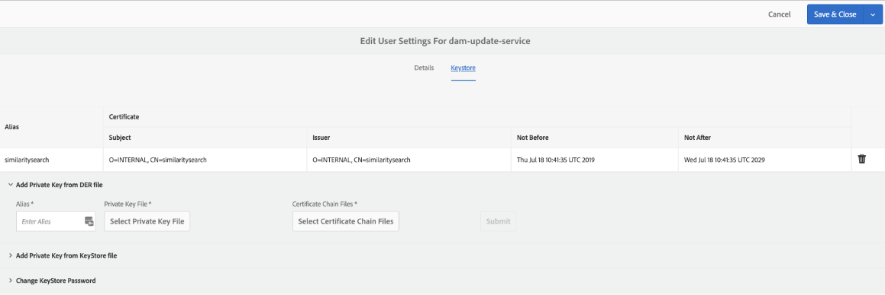

# 스마트 컨텐츠 서비스를 사용하여 자산 태그 지정 구성 {#configure-asset-tagging-using-the-smart-content-service}

통합할 수 있습니다 [!DNL Adobe Experience Manager] 을 사용하여 스마트 컨텐츠 서비스 사용 [!DNL Adobe Developer Console]. 내에서 스마트 컨텐츠 서비스에 액세스하려면 이 구성을 사용하십시오 [!DNL Experience Manager].

>[!NOTE]
>
>* 스마트 컨텐츠 서비스는 더 이상 새로운 페이지에서 사용할 수 없습니다 [!DNL Experience Manager Assets] 온-프레미스 고객. 이 기능이 이미 활성화되어 있는 기존 온-프레미스 고객은 스마트 컨텐츠 서비스를 계속 사용할 수 있습니다.
>* Smart Content Services는 기존 [!DNL Experience Manager Assets] 이 기능이 이미 활성화된 Managed Services 고객.
>* 새로 만들기 [!DNL Experience Manager Assets] Managed Services 고객은 이 문서에 언급된 지침에 따라 스마트 컨텐츠 서비스를 설정할 수 있습니다.

이 문서에서는 Smart Content Service를 구성하는 데 필요한 다음과 같은 주요 작업에 대해 자세히 설명합니다. 백 엔드에서 [!DNL Experience Manager] 서버는 [!DNL Adobe Developer Console] Smart Content Service에 요청을 전달하기 전에 게이트웨이

1. [스마트 컨텐츠 서비스 만들기](#obtain-public-certificate) 의 구성 [!DNL Experience Manager] 공개 키를 생성합니다. OAuth 통합을 위한 [공개 인증서를 받습니다](#obtain-public-certificate).

1. [Adobe 개발자 콘솔에서 통합을 만들고](#create-adobe-i-o-integration) 생성된 공개 키를 업로드합니다.

1. [배포 구성](#configure-smart-content-service) api 키 및 기타 자격 증명 사용 [!DNL Adobe Developer Console].

1. [구성을 테스트합니다](#validate-the-configuration).

1. 원할 경우, [자산 업로드에서 자동 태그 지정 사용](#enable-smart-tagging-in-the-update-asset-workflow-optional).

## 사전 요구 사항 {#prerequisites}

스마트 컨텐츠 서비스를 사용하기 전에 다음을 확인하여 통합을 만드십시오 [!DNL Adobe Developer Console]:

* 조직에 대한 관리자 권한이 부여된 Adobe ID 계정이 있습니다.

* 조직에서 스마트 컨텐츠 서비스를 사용할 수 있습니다.

고급 스마트 태그를 활성화하려면 위의 항목 외에 최신 히트도 설치하십시오 [Experience Manager 서비스 팩](https://helpx.adobe.com/kr/experience-manager/aem-releases-updates.html).

## 공개 인증서를 가져오려면 스마트 컨텐츠 서비스 구성을 만드십시오 {#obtain-public-certificate}

공개 인증서를 사용하면 프로필을 인증할 수 있습니다 [!DNL Adobe Developer Console].

1. 에서 [!DNL Experience Manager] 사용자 인터페이스, 액세스 **[!UICONTROL 도구]** > **[!UICONTROL Cloud Services]** > **[!UICONTROL 기존 Cloud Services]**.

1. Cloud Services 페이지에서 **[!UICONTROL 지금 구성]** 아래에 **[!UICONTROL 자산 스마트 태그]**.

1. 에서 **[!UICONTROL 구성 만들기]** 대화 상자에서 스마트 태그 구성의 제목과 이름을 지정합니다. **[!UICONTROL 만들기]**&#x200B;를 클릭합니다.

1. 에서 **[!UICONTROL AEM 스마트 컨텐츠 서비스]** 대화 상자에서 다음 값을 사용합니다.

   **[!UICONTROL 서비스 URL]**: `https://smartcontent.adobe.io/<region where your Experience Manager author instance is hosted>`

   예, `https://smartcontent.adobe.io/apac`. 다음을 지정할 수 있습니다 `na`, `emea`, 또는, `apac` Experience Manager 작성자 인스턴스가 호스팅되는 영역입니다.

   >[!NOTE]
   >
   >Experience Manager 관리 서비스가 2022년 9월 1일 이전에 프로비저닝된 경우, 다음 서비스 URL을 사용하십시오.
   >`https://mc.adobe.io/marketingcloud/smartcontent`

   **[!UICONTROL 인증 서버]**: `https://ims-na1.adobelogin.com`

   다른 필드는 비워 둡니다(나중에 제공). **[!UICONTROL 확인]**&#x200B;을 클릭합니다.

   

   *그림: 콘텐츠 서비스 URL을 제공하는 스마트 컨텐츠 서비스 대화 상자*

   >[!NOTE]
   >
   >다음과 같이 제공된 URL [!UICONTROL 서비스 URL] 를 브라우저를 통해 액세스할 수 없으며 404 오류가 발생합니다. 구성이 의 동일한 값으로 작동합니다 [!UICONTROL 서비스 URL] 매개 변수. 전체 서비스 상태 및 유지 관리 일정은 다음을 참조하십시오. [https://status.adobe.com](https://status.adobe.com).

1. 클릭 **[!UICONTROL OAuth 통합을 위한 공개 인증서 다운로드]**, 공개 인증서 파일 다운로드 `AEM-SmartTags.crt`.

   

   *그림: 스마트 태그 지정 서비스에 대한 설정*

### 인증서가 만료되면 다시 구성 {#certrenew}

인증서가 만료되면 더 이상 신뢰할 수 없습니다. 만료된 인증서는 갱신할 수 없습니다. 새 인증서를 추가하려면 다음 단계를 따르십시오.

1. 관리자로 [!DNL Experience Manager] 배포에 로그인합니다. **[!UICONTROL 도구]** > **[!UICONTROL 보안]** > **[!UICONTROL 사용자]**&#x200B;를 클릭합니다.

1. **[!UICONTROL dam-update-service]** 사용자를 찾아 클릭합니다. 클릭 **[!UICONTROL 키 저장소]** 탭.

1. 만료된 인증서로 기존의 **[!UICONTROL 유사 검색]** 키 저장소를 삭제합니다. **[!UICONTROL 저장 후 닫기]**&#x200B;를 클릭합니다.

   

   *그림: 새 보안 인증서를 추가하려면 키 저장소에서 기존 `similaritysearch` 항목을 삭제합니다.*

1. Navigate to **[!UICONTROL Tools]** > **[!UICONTROL Cloud Services]** > **[!UICONTROL Legacy Cloud Services]**. Click **[!UICONTROL Asset Smart Tags]** > **[!UICONTROL Show Configuration]** > **[!UICONTROL Available Configurations]**. Click the required configuration.

1. 공개 인증서를 다운로드하려면 **[!UICONTROL OAuth 통합을 위한 공개 인증서 다운로드]**.

1. 액세스 [https://console.adobe.io](https://console.adobe.io) 에서 기존 스마트 컨텐츠 서비스로 이동합니다. **[!UICONTROL 통합]** 페이지. 새 인증서를 업로드합니다. 자세한 내용은 [Adobe Developer 콘솔 통합 만들기](#create-adobe-i-o-integration).

## Adobe Developer 콘솔 통합 만들기 {#create-adobe-i-o-integration}

스마트 컨텐츠 서비스 API를 사용하려면 Adobe Developer 콘솔에서 통합을 만들어 얻습니다 [!UICONTROL API 키] (생성됨) [!UICONTROL 클라이언트 ID] Adobe Developer 콘솔 통합 필드), [!UICONTROL 기술 계정 ID], [!UICONTROL 조직 ID], 및 [!UICONTROL 클라이언트 암호] 대상 [!UICONTROL 자산 스마트 태그 지정 서비스 설정] 의 클라우드 구성 [!DNL Experience Manager].

1. 브라우저에서 [https://console.adobe.io](https://console.adobe.io/)에 액세스합니다. 적절한 계정을 선택하고 관련 조직 역할이 시스템 관리자인지 확인합니다.

1. 원하는 이름으로 프로젝트를 만듭니다. **[!UICONTROL API 추가]**&#x200B;를 클릭합니다.

1. 설정 **[!UICONTROL API 추가]** 페이지를 선택하고 **[!UICONTROL Experience Cloud]** 그런 다음 **[!UICONTROL 스마트 컨텐츠]**. **[!UICONTROL 다음]**&#x200B;을 클릭합니다.

1. **[!UICONTROL 공개 키 업로드]**&#x200B;를 선택합니다. [!DNL Experience Manager]에서 다운로드한 인증서 파일을 제공합니다. [!UICONTROL 공개 키가 업로드되었습니다] 메시지가 표시됩니다. **[!UICONTROL 다음]**&#x200B;을 클릭합니다.

   [!UICONTROL 새 서비스 계정(JWT) 자격 증명 만들기] 페이지에는 방금 구성된 서비스 계정에 대한 공개 키가 표시됩니다.

1. **[!UICONTROL 다음]**&#x200B;을 클릭합니다.

1. **[!UICONTROL 제품 프로필 선택]** 페이지에서 **[!UICONTROL 스마트 컨텐츠 서비스]**&#x200B;를 선택합니다. **[!UICONTROL 구성된 API 저장]**&#x200B;을 클릭합니다.

   페이지에 구성에 대한 자세한 정보가 표시됩니다. 이 값을 복사하고 추가하려면 이 페이지를 열어 둡니다. [!UICONTROL 자산 스마트 태그 지정 서비스 설정] 의 클라우드 구성 [!DNL Experience Manager] 를 입력하여 스마트 태그를 구성할 수 있습니다.

   

   *그림: Adobe Developer 콘솔의 통합 세부 정보*

## 스마트 컨텐츠 서비스 구성 {#configure-smart-content-service}

통합을 구성하려면 다음 값을 사용합니다. [!UICONTROL 기술 계정 ID], [!UICONTROL 조직 ID], [!UICONTROL 클라이언트 암호], 및 [!UICONTROL 클라이언트 ID] Adobe Developer 콘솔 통합에서 가져온 필드. 스마트 태그 클라우드 구성을 만들면 [!DNL Experience Manager] 배포.

1. in [!DNL Experience Manager], 다음 위치로 이동합니다. **[!UICONTROL 도구 > Cloud Service > 이전 Cloud Services]** 열다 [!UICONTROL Cloud Services] 콘솔.

1. 아래에 **[!UICONTROL 자산 스마트 태그]**&#x200B;위에서 만든 구성을 엽니다. 서비스 설정 페이지에서 **[!UICONTROL 편집]**.

1. In the **[!UICONTROL AEM Smart Content Service]** dialog, use the pre-populated values for the **[!UICONTROL Service URL]** and **[!UICONTROL Authorization Server]** fields.

1. 필드 [!UICONTROL Api 키], [!UICONTROL 기술 계정 ID], [!UICONTROL 조직 ID], 및 [!UICONTROL 클라이언트 암호]에서 생성한 다음 값을 복사하여 사용하십시오. [Adobe Developer 콘솔 통합](#create-adobe-i-o-integration).

   | [!UICONTROL 자산 스마트 태깅 서비스 설정] | [!DNL Adobe Developer Console] 통합 필드 |
   |--- |--- |
   | [!UICONTROL Api 키] | [!UICONTROL 클라이언트 ID] |
   | [!UICONTROL 기술 계정 ID] | [!UICONTROL 기술 계정 ID] |
   | [!UICONTROL 조직 ID] | [!UICONTROL 조직 ID] |
   | [!UICONTROL 클라이언트 암호] | [!UICONTROL 클라이언트 암호] |

## 구성 유효성 확인 {#validate-the-configuration}

구성을 완료한 후 JMX MBean을 사용하여 구성을 확인합니다. 유효성을 검사하려면 다음 단계를 수행합니다.

1. 액세스 권한 [!DNL Experience Manager] 서버 위치 `https://[aem_server]:[port]`.

1. 이동 **[!UICONTROL 도구 > 작업 > 웹 콘솔]** OSGi 콘솔을 엽니다. 클릭 **[!UICONTROL 기본 > JMX]**.

1. 클릭 **[!UICONTROL com.day.cq.dam.similaritysearch.internal.impl]**. 열립니다 **[!UICONTROL 유사성 검색 기타 작업]**.

1. 클릭 **[!UICONTROL validateConfigs()]**. 에서 **[!UICONTROL 구성 유효성 검사]** 대화 상자 **[!UICONTROL 호출]**.

   유효성 검사 결과가 동일한 대화 상자에 표시됩니다.

## DAM 자산 업데이트 워크플로우에서 스마트 태그 지정 사용(선택 사항) {#enable-smart-tagging-in-the-update-asset-workflow-optional}

1. in [!DNL Experience Manager], 이동 **[!UICONTROL 도구]** > **[!UICONTROL 워크플로우]** > **[!UICONTROL 모델]**.

1. **[!UICONTROL 워크플로우 모델]** 페이지에서 **[!UICONTROL DAM 자산 업데이트]** 워크플로우 모델을 선택합니다.

1. 도구 모음에서 **[!UICONTROL 편집]**&#x200B;을 클릭합니다.

1. 사이드 패널을 확장하여 단계를 표시합니다. DAM 워크플로우 섹션에서 사용할 수 있는 **[!UICONTROL 스마트 태그 자산]** 단계를 드래그하여 **[!UICONTROL 프로세스 썸네일]** 단계 이후에 배치합니다.

   

   *그림: DAM 자산 업데이트 워크플로우에서 프로세스 썸네일 단계 이후에 스마트 태그 자산 단계를 추가합니다.*

1. Open the step in edit mode. **[!UICONTROL 고급 설정]**&#x200B;에서 **[!UICONTROL 핸들러 고급]** 옵션을 선택해야 합니다.

   

   *그림: DAM 자산 업데이트 워크플로우 구성 및 스마트 태그 추가 단계*

1. In the **[!UICONTROL Arguments]** tab, select **[!UICONTROL Ignore Errors]** if you want the workflow to complete even if the automatic tagging step fails.

   

   *그림: 스마트 태그 단계를 추가하고 핸들러 사전 선택을 하도록 DAM 자산 업데이트 워크플로우를 구성합니다*

   폴더에서 스마트 태그 지정 사용 여부와 관계없이 업로드될 때 자산에 태그를 지정하려면 **[!UICONTROL 스마트 태그 플래그 무시]**&#x200B;를 선택합니다.

   

   *그림: 스마트 태그 단계를 추가하고 스마트 태그 플래그 무시 를 선택하도록 DAM 자산 업데이트 워크플로우를 구성합니다*

1. **[!UICONTROL 확인]**&#x200B;을 클릭하여 프로세스 단계를 닫은 다음 워크플로우를 저장합니다.

>[!MORELIKETHIS]
>
>* [스마트 태그 관리](managing-smart-tags.md)
>* [스마트 태그 교육 개요 및 방법](enhanced-smart-tags.md)
>* [스마트 컨텐츠 서비스 교육 지침 및 규칙](smart-tags-training-guidelines.md)

