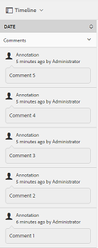

# AEM의 향상된 자산 정렬 {#enhanced-sorting-of-assets-in-aem}

AEM Assets이 서버측 정렬을 배포하여 폴더 자산 또는 검색 쿼리를 클라이언트 쪽의 배치로 정렬하는 대신 한 번에 정렬하는 방법을 알아봅니다.

Adobe Experience Manager(AEM) 자산의 검색 기능이 향상되어 폴더 목록 보기 및 검색 결과 페이지에서 많은 자산을 효율적으로 정렬할 수 있습니다. 타임라인 항목을 정렬할 수도 있습니다.

AEM Assets은 서버측 정렬을 배포하여 클라이언트 쪽의 배치로 정렬하지 않고 폴더 또는 검색 쿼리 내에서 전체 자산 집합(얼마만큼 큰 것)을 정렬하거나 한 번에 검색 쿼리를 정렬합니다. 이렇게 하면 프리페치된 결과를 사용자 인터페이스에 빠르게 표시할 수 있으므로 정렬 작업이 더 응답 속도가 빠르고 활발해집니다.

## 목록 보기에서 자산 정렬 {#sorting-assets-in-list-view}

AEM Assets을 사용하면 다음 필드를 기반으로 폴더 자산을 정렬할 수 있습니다.

* 로케일
* 상태
* 유형
* 크기
* 등급
* 수정한 날짜
* 게시일
* 사용량
* 클릭 수
* 노출 횟수
* 체크아웃함

1. 자산이 많은 폴더로 이동합니다.
1. 레이아웃 아이콘을 클릭/탭하고 목록 보기로 전환합니다.

   

1. 자산 목록의 열 헤더 옆에 있는 정렬 아이콘을 클릭/탭합니다.

   

   자산 목록은 필드 값에 따라 정렬됩니다.

   

>[!NOTE]
>
>열 `Name` 또는 `Title`열의 값을 정렬하려면 값을 오버레이 `/libs/dam/gui/content/commons/availablecolumns` 하고 값 `sortable` 으로 변경합니다 `True`.

## 검색 결과의 자산 정렬 {#sorting-assets-in-search-results}

다음 필드를 기반으로 검색 결과를 정렬할 수 있습니다.

* 제목
* 상태
* 유형
* 크기
* 수정한 날짜
* 게시일

1. OmniSearch 상자에서 원하는 기준을 기반으로 자산을 검색합니다.

   

1. 레이아웃 아이콘을 클릭/탭하고 목록 보기로 전환합니다. 검색 결과가 목록 보기에 이미 표시되면 이 단계를 건너뜁니다.
1. 자산 목록의 열 헤더 옆에 있는 정렬 아이콘을 클릭/탭합니다. 자산 목록은 필드 값에 따라 정렬됩니다.

   

## 타임라인에서 에셋 정렬 {#sorting-assets-in-timeline}

AEM Assets을 사용하면 주석, 버전, 워크플로우 및 활동과 같은 타임라인 항목을 시간순으로 정렬할 수 있습니다.

1. 자산 UI에서 타임라인을 표시할 자산을 선택합니다.
1. GlobalNav 아이콘을 클릭/탭하고 **[!UICONTROL 타임라인을 선택합니다]**.

   

1. 타임라인의 목록에서 항목을 선택합니다. 예를 들어, 주석 **[!UICONTROL 을]** 선택하여 자산과 연관된 주석 목록을 표시합니다.

   

1. 날짜 레이블 옆에 있는 **[!UICONTROL 정렬]** 아이콘을 **[!UICONTROL 클릭/]** 탭합니다. 선택한 내용에 따라 주석은 자산에 추가된 시간순/시간순 순서로 나열됩니다.

   

