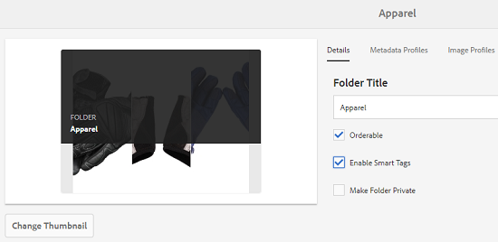

# 향상된 스마트 태그 {#enhanced-smart-tags}

## 향상된 스마트 태그 개요 {#overview-of-enhanced-smart-tags}

디지털 자산을 다루는 조직은 자산 메타데이터에 분류 제어 용어를 점점 더 사용하고 있습니다. 기본적으로 직원, 파트너 및 고객이 특정 클래스의 디지털 자산을 참조하고 검색하는 데 일반적으로 사용하는 키워드 목록이 포함되어 있습니다. 분류법 제어 어휘로 자산에 태그를 지정하면 태그 기반 검색으로 쉽게 식별 및 검색할 수 있습니다.

자연어 어휘와 비교하여 비즈니스 분류 방식을 기반으로 디지털 자산을 태그 지정하여 회사의 비즈니스에 맞게 태그를 지정할 수 있고 검색에 가장 연관성 있는 자산이 표시되도록 할 수 있습니다.

예를 들어 자동차 제조업체는 자동차 이미지에 모델 이름을 태그로 지정할 수 있으므로 다양한 모델의 이미지를 검색하여 프로모션 캠페인을 디자인할 때 관련 이미지만 표시됩니다.

Smart Content Service가 올바른 태그를 적용하려면 분류 방식을 인식하도록 훈련해야 합니다. 서비스를 교육하려면 먼저 이러한 자산을 가장 잘 설명하는 자산 및 태그 세트를 조정하십시오. 자산에 이러한 태그를 적용하고 교육 워크플로우를 실행하여 서비스 학습을 돕습니다.

태그가 교육 및 준비되면, 이제 서비스가 태그 지정 워크플로우를 통해 자산에 이러한 태그를 적용할 수 있습니다.

백그라운드에서 Smart Content Service는 Adobe Sensei의 AI 프레임워크를 사용하여 태그 구조 및 비즈니스 분류법에 대한 이미지 인식 알고리즘을 교육합니다. 그런 다음 이 컨텐츠 인텔리전스를 사용하여 다른 자산 세트에 관련 태그를 적용합니다.

스마트 콘텐츠 서비스는 Adobe I/O에서 호스팅되는 클라우드 서비스입니다.AEM(Adobe Experience Manager)에서 사용하려면 시스템 관리자가 AEM 인스턴스를 Adobe IO와 통합해야 합니다.

요약하면 스마트 콘텐츠 서비스를 사용하는 주요 단계는 다음과 같습니다.

* 온보딩
* 자산 및 태그 검토(분류 정의)
* 스마트 콘텐츠 서비스 교육
* 자동 태그 지정

## 전제 조건 {#prerequisites}

Smart Content Service를 사용하려면 먼저 다음을 통해 Adobe I/O에 통합을 만드십시오.

* 조직에 대한 관리자 권한이 부여된 Adobe ID 계정이 있습니다.
* 조직에서 스마트 콘텐츠 서비스 서비스를 사용할 수 있습니다.

## 온보딩 {#onboarding}

스마트 콘텐츠 서비스는 AEM의 추가 기능으로 구매할 수 있습니다. 구입하면 Adobe IO에 대한 링크가 포함된 이메일이 조직 관리자에게 전송됩니다.

관리자는 링크를 따라 Smart Content Service를 AEM과 통합할 수 있습니다. 서비스를 AEM Assets과 통합하려면 [스마트 태그 구성](config-smart-tagging.md)을 참조하십시오.

온보딩 프로세스는 관리자가 서비스를 구성하고 AEM의 사용자를 추가하면 완료됩니다.

>[!NOTE]
>
>AEM 6.3 이전 버전을 사용하고 자산에 대한 자동 태그 지정 서비스가 필요한 경우 [스마트 태그](https://helpx.adobe.com/experience-manager/6-3/assets/using/touch-ui-smart-tags.html)를 참조하십시오. 스마트 태그는 AI 기능을 사용하지 않으며 향상된 고급 태그 지정 기능보다 정확하지 않습니다.

## 자산 및 태그 검토 {#reviewing-assets-and-tags}

온보드 방식이 만들어지면 먼저 비즈니스 컨텍스트에서 이러한 이미지를 가장 잘 설명하는 태그 세트를 식별합니다.

이미지를 검토하여 특정 비즈니스 요구 사항에 맞게 제품을 가장 잘 나타내는 이미지 세트를 확인합니다. 선별된 세트의 에셋이 [Smart Content Service 교육 지침](smart-tags-training-guidelines.md)에 부합하는지 확인합니다.

자산을 폴더에 추가하고 속성 페이지의 각 자산에 태그를 적용합니다. 그런 다음 이 폴더에서 교육 워크플로우를 실행합니다. 선별된 자산 세트를 사용하면 Smart Content Service에서 분류 정의를 사용하여 보다 많은 자산을 효과적으로 트레이닝할 수 있습니다.

>[!NOTE]
>
>1. 훈련은 취소할 수 없는 과정이다. Adobe에서는 태그에 대해 스마트 콘텐츠 서비스를 교육하기 전에 선별된 자산 세트의 태그를 검토할 것을 권장합니다.
>1. 태그에 대한 교육을 시작하기 전에 [스마트 콘텐츠 서비스 교육 지침](smart-tags-training-guidelines.md)을 읽으십시오.
>1. 스마트 콘텐츠 서비스를 처음으로 교육할 때 Adobe은 두 개 이상의 개별 태그로 교육할 것을 권장합니다.

>

## 스마트 콘텐츠 서비스 교육 {#training-the-smart-content-service}

Smart Content Service가 비즈니스 분류 방식을 인식하려면 비즈니스와 관련이 있는 태그를 이미 포함하는 자산 세트에서 실행합니다. 트레이닝 후 서비스는 유사한 자산 세트에 동일한 분류법을 적용할 수 있습니다.

관련 태그를 적용할 수 있도록 서비스를 여러 번 트레이닝할 수 있습니다. 각 교육 주기 후에 태그 지정 워크플로우를 실행하고 에셋에 태그가 적절하게 지정되어 있는지 확인합니다.

Smart Content Service를 정기적으로 또는 필요에 따라 트레이닝할 수 있습니다.

>[!NOTE]
>
>교육 워크플로우는 폴더에서만 실행됩니다.

### 정기적인 교육 {#periodic-training}

Smart Content Service를 사용하여 폴더 내의 자산 및 관련 태그를 정기적으로 교육할 수 있습니다. 자산 폴더의 속성 페이지를 열고 **[!UICONTROL 세부 사항]** 탭 아래에서 **[!UICONTROL 스마트 태그 활성화]**&#x200B;를 선택하고 변경 내용을 저장합니다.

폴더에 대해 이 옵션을 선택하면 AEM은 자동으로 교육 워크플로우를 실행하여 폴더 에셋 및 해당 태그에서 스마트 콘텐츠 서비스를 교육합니다. 기본적으로 교육 워크플로우는 매주 토요일 오전 12시 30분에 실행됩니다.

### 주문형 교육 {#on-demand-training}

워크플로우 콘솔에서 필요할 때마다 스마트 콘텐츠 서비스를 트레이닝할 수 있습니다.

1. AEM 로고를 탭/클릭하고 **[!UICONTROL 도구 > 워크플로 > 모델]**&#x200B;으로 이동합니다.
1. **[!UICONTROL 워크플로우 모델]** 페이지에서 **[!UICONTROL 스마트 태그 교육]** 작업 과정을 선택한 다음 도구 모음에서 **[!UICONTROL 워크플로우 시작]**&#x200B;을 탭/클릭합니다.
1. **[!UICONTROL 워크플로우 실행]** 대화 상자에서 서비스 교육을 위해 태그가 지정된 에셋이 포함된 페이로드 폴더를 찾습니다.
1. 워크플로우의 제목을 지정하고 주석을 추가합니다. 그런 다음 **[!UICONTROL 실행]**&#x200B;을 탭/클릭합니다. 교육과 관련하여 자산 및 태그가 제출됩니다.

   

>[!NOTE]
>
>한 폴더의 자산이 교육을 위해 처리되면 후속 교육 주기에 수정된 자산만 처리됩니다.

### 교육 보고서 보기 {#viewing-training-reports}

Smart Content Service가 자산 트레이닝 세트의 태그에 대해 교육 받았는지 확인하려면 보고서 콘솔에서 교육 워크플로우 보고서를 검토하십시오.

1. AEM 로고를 탭/클릭하고 **[!UICONTROL 도구 > 자산 > 보고서]**&#x200B;로 이동합니다.
1. **[!UICONTROL 자산 보고서]** 페이지에서 **[!UICONTROL 만들기]**&#x200B;를 탭/클릭합니다.
1. **[!UICONTROL 스마트 태그 교육]** 보고서를 선택한 다음 도구 모음에서 **[!UICONTROL 다음]**&#x200B;을 탭/클릭합니다.
1. 보고서의 제목과 설명을 지정합니다. **[!UICONTROL 보고서 예약]**&#x200B;에서 **[!UICONTROL 지금]** 옵션을 선택한 상태로 두십시오. 나중에 보고서를 예약하려면 **[!UICONTROL 나중에]**&#x200B;를 선택하고 날짜와 시간을 지정합니다. 그런 다음 도구 모음에서 **[!UICONTROL 만들기]**&#x200B;를 탭/클릭합니다.
1. **[!UICONTROL 자산 보고서]** 페이지에서 생성한 보고서를 선택합니다. 보고서를 보려면 도구 모음에서 **[!UICONTROL 보기]** 아이콘을 탭/클릭합니다.
1. 보고서의 세부 사항을 검토합니다.

   보고서에는 교육 받은 태그에 대한 교육 상태가 표시됩니다. **[!UICONTROL 교육 상태]** 열의 녹색 색상은 스마트 콘텐츠 서비스가 태그에 대해 교육 받았음을 나타냅니다. 노란색 색상은 서비스가 특정 태그에 대해 완전히 훈련되지 않음을 나타냅니다. 이 경우 특정 태그로 이미지를 더 추가하고 교육 워크플로우를 실행하여 태그에서 서비스를 완전히 교육할 수 있습니다.

   이 보고서에 태그가 표시되지 않으면 이러한 태그에 대해 교육 워크플로우를 다시 실행하십시오.

1. 보고서를 다운로드하려면 목록에서 해당 보고서를 선택하고 도구 모음에서 **[!UICONTROL 다운로드]** 아이콘을 탭/클릭합니다. 보고서가 Excel 파일로 다운로드됩니다.

## 자동으로 {#tagging-assets-automatically} 자산 태그 지정

스마트 콘텐츠 서비스를 교육한 후 다른 유사한 에셋 세트에 적절한 태그를 자동으로 적용하도록 태그 지정 워크플로우를 트리거할 수 있습니다.

정기적으로 또는 필요할 때마다 태그 지정 워크플로우를 실행할 수 있습니다.

>[!NOTE]
>
>태그 지정 워크플로우는 자산과 폴더 모두에서 실행됩니다.

### 정기적인 태그 지정 {#periodic-tagging}

Smart Content Service를 활성화하여 폴더 내의 자산에 주기적으로 태그를 지정할 수 있습니다. 자산 폴더의 속성 페이지를 열고 **[!UICONTROL 세부 사항]** 탭 아래에서 **[!UICONTROL 스마트 태그 활성화]**&#x200B;를 선택하고 변경 내용을 저장합니다.

폴더에 대해 이 옵션을 선택하면 Smart Content Service는 폴더 내의 자산에 자동으로 태그를 지정합니다. 기본적으로 태깅 워크플로우는 매일 오전 12시에 실행됩니다.

### 요청 시 태깅 {#on-demand-tagging}

다음과 같이 태그 지정 워크플로우를 트리거하여 자산에 즉시 태그를 지정할 수 있습니다.

* 워크플로우 콘솔
* 타임라인

>[!NOTE]
>
>타임라인에서 태그 지정 워크플로우를 실행하는 경우 한 번에 최대 15개의 자산에 태그를 적용할 수 있습니다.

#### 워크플로 콘솔 {#tagging-assets-from-the-workflow-console}에서 자산 태그 지정

1. AEM 로고를 탭/클릭하고 **[!UICONTROL 도구 > 워크플로 > 모델]**&#x200B;으로 이동합니다.
1. **[!UICONTROL 워크플로우 모델]** 페이지에서 **[!UICONTROL DAM 스마트 태그 자산]** 작업 과정을 선택한 다음 도구 모음에서 **[!UICONTROL 워크플로우 시작]**&#x200B;을 탭/클릭합니다.

   

1. **[!UICONTROL 워크플로우 실행]** 대화 상자에서 태그를 자동으로 적용할 에셋이 포함된 페이로드 폴더를 찾습니다.
1. 워크플로우의 제목과 선택적 주석을 지정합니다. 그런 다음 **[!UICONTROL 실행]**&#x200B;을 탭/클릭합니다.

   

   Smart Content Service에서 에셋에 태그가 제대로 지정되었는지 확인하려면 에셋 폴더로 이동하고 태그를 검토합니다. 자세한 내용은 [스마트 태그 관리](managing-smart-tags.md)를 참조하십시오.

#### 타임라인 {#tagging-assets-from-the-timeline}에서 자산 태그 지정

1. 자산 사용자 인터페이스에서 스마트 태그를 적용할 자산 또는 특정 자산이 들어 있는 폴더를 선택합니다.
1. 전역 탐색 아이콘을 탭/클릭하고 타임라인을 엽니다.
1. 하단에 있는 화살표를 탭/클릭한 다음 **[!UICONTROL 워크플로우 시작]**&#x200B;을 탭/클릭합니다.

   

1. **[!UICONTROL DAM 스마트 태그 자산]** 작업 과정을 선택하고 작업 과정의 제목을 지정합니다.
1. **[!UICONTROL 시작]**&#x200B;을 탭/클릭합니다. 워크플로우는 자산에 태그를 적용합니다. Smart Content Service에서 에셋에 태그가 제대로 지정되었는지 확인하려면 에셋 폴더로 이동하고 태그를 검토합니다. 자세한 내용은 [스마트 태그 관리](managing-smart-tags.md)를 참조하십시오.

>[!NOTE]
>
>후속 태그 지정 주기 동안 새로 훈련된 태그로 수정된 자산에만 다시 태그가 지정됩니다.
>
>하지만 태그 지정 작업 과정에 대한 마지막 태그 주기와 현재 태그 지정 주기 사이의 간격이 24시간이 넘는 경우에도 변경되지 않은 자산도 태그로 지정됩니다.
>
>주기적인 태그 지정 워크플로우의 경우, 6개월이 지나면 변경되지 않은 자산에 태그가 지정됩니다.
