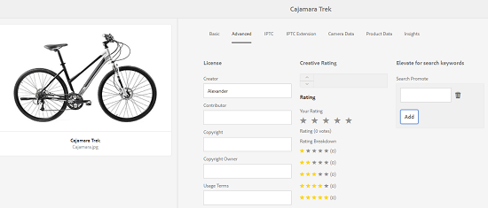

# GQL 전체 텍스트 검색 {#gql-full-text-search}

AEM Assets에서 GQL 전체 텍스트 검색 기능을 살펴보십시오. 제목, 설명 및 작성자 이름과 같은 특정 메타데이터를 기반으로 자산을 검색할 수 있도록 해줍니다.

GQL 전체 텍스트 검색 기능을 사용하면 제목, 설명, 작성자 등과 같은 특정 메타데이터를 기반으로 자산을 검색할 수 있습니다.

메타데이터를 기반으로 자산을 검색하려면(예: 제목) 검색 패널에서 메타데이터 키워드 뒤에 해당 값을 추가합니다. GQL 전체 텍스트 검색 기능은 입력한 해당 값과 메타데이터가 정확히 일치하는 자산만 가져옵니다.

예를 들어 제목이 &quot;Target&quot;인 자산을 검색하려면 다음 단계를 수행하십시오.

## 자산 검색 {#searching-assets}

1. Assets 사용자 인터페이스의 도구 모음에서 **[!UICONTROL 검색]** 아이콘을 클릭하거나 탭하여 Omnisearch 상자를 표시합니다.

   

1. Omnisearch 상자에 커서를 두고 Enter 키를 누릅니다.
1. GlobalNav 아이콘을 클릭하거나 탭하여 **[!UICONTROL 필터]** 패널을 표시합니다.
1. 옴니 검색 상자에서 &quot;Target&quot; 값을 지정합니다. 검색을 특정 폴더로 제한하려면 필터 패널에서 찾아보기 아이콘을 클릭하거나 탭하고 폴더를 선택합니다. 이 경우 폴더 및 하위 폴더 내에서만 일치 항목을 검색합니다.

   >[!NOTE]
   >
   >폴더에서 전체 텍스트 검색을 수행할 수도 있습니다. 이 경우 비어 있지 않은 전체 텍스트 검색어를 지정해야 합니다.

   

1. **[!UICONTROL Enter]** 키를 누릅니다. AEM Assets 사용자 인터페이스에는 제목이 &quot;Target&quot;과 정확히 일치하는 자산만 표시됩니다.

GQL 전체 텍스트 검색 기능을 사용하여 다음을 기준으로 자산을 검색할 수 있습니다.

* 여러 메타데이터 필드(속성)에 대해 지정하는 값인 And 작업을 통해 결합하여 작성된 복잡한 쿼리
* 단일 메타데이터 필드에 대한 여러 값
* Substring 일치

GQL 전체 텍스트 검색 기능을 사용하면 다음 메타데이터 속성을 기반으로 자산을 검색할 수 있습니다. 속성과 속성(예: 작성자, 제목 등)의 이름은 대/소문자를 구분합니다.

>[!NOTE]
>
>GQL 전체 텍스트 검색은 전체 텍스트 조건자만 작동합니다.

| 속성 | 검색 형식(패싯 값) |
|---|---|
| [!UICONTROL 제목] | title:John |
| [!UICONTROL 작성자] | 작성자:John |
| [!UICONTROL 내용 작성자] | 기여자:John |
| [!UICONTROL 위치] | 위치:인도 |
| [!UICONTROL 설명] | description:&quot;샘플 이미지&quot; |
| [!UICONTROL 작성자 도구] | createtool:&quot;Adobe Photoshop 7.0&quot; |
| [!UICONTROL 저작권 소유자] | copyrightowner:&quot;Adobe Systems&quot; |
| [!UICONTROL 내용 작성자] | 기여자:John |
| [!UICONTROL 사용 약관] | usagterms:&quot;CopyRights Reserved&quot; |
| [!UICONTROL 생성됨] | 작성일:YYYY-MM-DDHH:MM:SS.000+05:30.YYYY-MM-DDHH:MM:SS.000+05:30 |
| [!UICONTROL 만료 날짜] | expires:YYYY-MM-DDHH:MM:SS.000+05:30.YYYY-MM-DDHH:MM:SS.000+05:30 |
| [!UICONTROL 시간] | ontime:YYYY-MM-DDHH:MM:SS.000+05:30.YYYY-MM-DDHH:MM:SS.000+05:30 |
| [!UICONTROL 해제 시간] | offtime:YYYY-MM-DDHH:MM:SS.000+05:30.YYYY-MM-DDHH:MM:SS.000+05:30 |
| [!UICONTROL 시간 범위] (expires dateontime,offtime) | 패싯 필드:소행..상단 |
| [!UICONTROL 경로] | /content/dam/&lt;폴더 이름> |
| [!UICONTROL PDF 제목] | pdftitle:&quot;Adobe 문서&quot; |
| [!UICONTROL 제목] | 제목:&quot;교육&quot; |
| [!UICONTROL 태그] | 태그:&quot;위치 및 여행&quot; |
| [!UICONTROL 유형] | 유형:&quot;image\png&quot; |
| [!UICONTROL 이미지 너비] | width:lower bound..상단 |
| [!UICONTROL 이미지 높이] | height:lowbound.상단 |
| [!UICONTROL 개인] | 사람: John |

다음은 복잡한 쿼리에 대한 검색 형식의 예입니다.

* 여러 패싯 필드가 있는 모든 자산을 표시하려면(예:title=John Doe 및 creator tool = Adobe Photoshop):

tiltle:&quot;John Doe&quot; creatortool :Adobe;amp;ast;

* 패싯 값이 단일 단어가 아닌 문장이 될 때 모든 자산을 표시하려면(예:title=스콧 레이놀즈)

타이틀:&quot;스캇 레이놀즈&quot;

* 단일 속성의 여러 값이 있는 자산을 표시하려면(예:title=스캇 레이놀즈 또는 존 도)

제목: &quot;Scott Reynolds&quot; 또는 &quot;John Doe&quot;

* 특정 문자열로 시작하는 속성 값이 있는 자산을 표시하려면(예:제목이 스콧 레이놀즈)

title:&quot;Scott&quot;

* 특정 문자열로 끝나는 속성 값이 있는 자산을 표시하려면(예:제목이 스콧 레이놀즈)

제목: &quot;Reynolds&quot;

* 특정 문자열을 포함하는 속성 값이 있는 자산을 표시하려면 다음을 수행하십시오.title = Basel 회의실)

title:&quot;모임&quot;;

* 특정 문자열을 포함하고 특정 속성 값을 갖는 자산을 표시하려면(예:title=John Doe)가 있는 자산에서 문자열 Adobe 검색

&amp;ast;Adobe&amp;ast;title:&quot;John Doe &quot;OR title:&quot;John Doe&quot; &amp;ast;Adobe&amp;ast;

>[!NOTE]
>
>속성 경로, 제한, 크기 및 orderby는 다른 속성과 함께 OR를 사용할 수 없습니다.
>
>사용자가 생성한 속성의 키워드는 속성 편집기의 필드 레이블이며 공백이 제거되어 있습니다.

>[!NOTE]
>
>JCR 쿼리를 작성하여 하위 자산만 검색하는 경우 일치하는 참조된 자산도 일치하는 하위 자산과 함께 표시됩니다.

전체 텍스트 검색에서도 -,^ 등의 연산자를 지원합니다. 이러한 문자를 문자열 리터럴으로 검색하려면 검색 표현식을 큰따옴표로 묶습니다. 예를 들어, 노트북 - 미용 대신 &quot;노트북 - 뷰티&quot;를 사용합니다.

## 검색 증폭 {#boosting-search}

특정 자산에 대한 키워드의 관련성을 개선하여 키워드를 기반으로 검색을 높일 수 있습니다. 즉, 특정 키워드를 프로모션하는 이미지가 이러한 키워드를 기반으로 검색할 때 검색 결과 맨 위에 나타납니다.

1. 자산 UI에서 키워드를 판촉할 자산의 속성 페이지를 엽니다.
1. **[!UICONTROL 고급]** 탭으로 전환하고 **[!UICONTROL 검색 키워드 가져오기]**&#x200B;에서 **[!UICONTROL 추가]**&#x200B;를 클릭/탭합니다.

   

1. **[!UICONTROL Search Promote]** 상자에서 이미지 검색을 강화할 키워드를 지정한 후 **[!UICONTROL 추가]**&#x200B;를 클릭/탭합니다. 필요한 경우 동일한 방법으로 여러 키워드를 지정합니다.

   

1. **[!UICONTROL 저장 및 닫기]**&#x200B;를 클릭/탭합니다.
1. Omnisearch 상자를 사용하여 키워드를 검색합니다. 이 키워드를 프로모션한 자산이 상위 검색 결과 중에 나타납니다.
