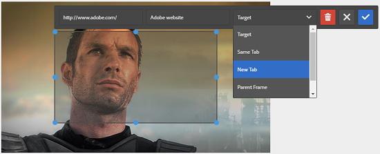

# 이미지 맵 추가 {#adding-image-maps}

하이퍼링크 이미지 맵을 이미지 자산에 추가하는 방법을 알아봅니다.

이미지 맵을 사용하면 다른 하이퍼링크처럼 작동하는 하이퍼링크된 영역을 하나 이상 추가할 수 있습니다.

1. 다음 중 하나를 수행하여 **[!UICONTROL 즉석 이미지 편집기]**&#x200B;를 엽니다.

   * 빠른 작업을 사용하여 **[!UICONTROL 카드]** 보기의 자산에 표시되는 **[!UICONTROL 편집]** 아이콘을 탭합니다. 목록 보기에서 자산을 선택하고 도구 모음에서 **편집** 아이콘을 누릅니다.

      >[!NOTE]
      >
      >빠른 작업은 **[!UICONTROL 목록]** 보기에서 사용할 수 없습니다.

   * **[!UICONTROL Card]** 또는 **[!UICONTROL List]** 보기에서 자산을 선택하고 도구 모음에서 **[!UICONTROL 편집]** 아이콘을 탭합니다.
   * 자산 페이지에서 **[!UICONTROL 편집]** 아이콘을 누릅니다.

      

1. 이미지 맵을 삽입하려면 도구 모음에서 **[!UICONTROL Launch Map]** 아이콘을 누릅니다.

   

1. 이미지 맵의 모양을 선택합니다. 선택한 모양의 핫 스팟이 이미지에 배치됩니다.

   

1. 핫 스팟을 탭하고 URL 및 대체 텍스트를 입력합니다. **[!UICONTROL Target]** 목록에서 이미지 맵을 표시할 위치(예: 동일한 탭, 새 탭 또는 iFrame)를 지정합니다. 예를 들어, `https://www.adobe.com` 을 URL로 입력하고, `Adobe website` 을 Alt 텍스트로 입력하고, 이미지 맵이 새 탭에서 열릴 Target ]**목록에서**[!UICONTROL &#x200B;새 탭&#x200B;]**을 지정합니다.**[!UICONTROL 

   

1. **[!UICONTROL Confirm]** 아이콘을 탭한 다음, 도구 모음에서 **[!UICONTROL Finish]** 아이콘을 탭하여 변경 사항을 저장합니다.

   

   이미지 맵을 삭제하려면 핫 스팟(hot-spot)을 탭하고 **[!UICONTROL 삭제]** 아이콘을 누릅니다.

   

1. 이미지 맵을 보려면 자산 세부 사항 페이지로 이동한 다음 이미지 위에 커서를 놓습니다.

   

   Dynamic Media 옵션이 활성화되어 있으면 자산 편집기로 이동하고 **[!UICONTROL 맵]** 아이콘을 탭하여 적용된 모든 이미지 맵을 봅니다.
