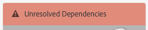
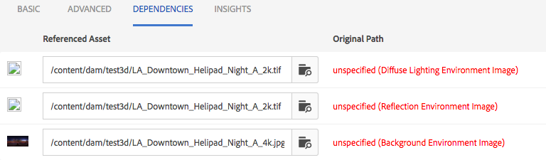

# AEM 3D {#installing-and-configuring-aem-d} 설치 및 구성

>[!IMPORTANT]
>
>AEM 6.4의 AEM 3D는 더 이상 지원되지 않습니다. Adobe에서는 [AEM의 3D 자산 기능을 Cloud Service](https://docs.adobe.com/content/help/en/experience-manager-cloud-service/assets/dynamicmedia/assets-3d.html) 또는 [AEM 6.5.3 이상으로 사용하는 것이 좋습니다.](https://docs.adobe.com/content/help/en/experience-manager-65/assets/dynamic/assets-3d.html)

AEM 3D(버전 3.0)의 설치 및 구성에는 다음이 포함됩니다.

1. Autodesk® FBX® SDK 라이브러리 설치
1. 기본 3D 코드 패키지 다운로드 및 설치
1. 3D 자산 통합 작업 과정을 구성하고 AEM을 다시 시작합니다.
1. AEM 3D 설정의 유효성을 확인합니다.

[3D 자산 작업](assets-3d.md)도 참조하십시오.

사전 요구 사항, 지원되는 브라우저 및 기타 중요 릴리스 정보는 [AEM 3D 자산 릴리스 노트](/help/release-notes/aem3d-release-notes.md)를 참조하십시오.

[3D 사이트 구성 요소 사용](using-the-3d-sites-component.md)도 참조하십시오.

>[!NOTE]
>
>3D 패키지를 다운로드하고 설치하기 전에 모든 사전 요구 사항 AEM 패키지를 성공적으로 설치했는지 확인하십시오. [AEM 3D 릴리스 정보를 참조하십시오.](install-config-3d.md)

## Autodesk FBX SDK 라이브러리 설치 {#installing-the-autodesk-fbx-sdk-library}

기본 AEM 3D 코드는 FBX 파일 형식을 지원하기 위해 Autodesk FBX 라이브러리가 필요합니다. (Adobe은 현재 이 라이브러리를 재배포할 수 없습니다.)

[고급 구성 설정](advanced-config-3d.md)도 참조하십시오.

1. AEM이 설치된 호스트에 로그인합니다.

   * Windows Server 배포인 경우 서버로 관리자로 로그온합니다.
   * MAC 또는 Windows 데스크탑인 경우 관리자 권한이 있는지 확인하십시오.

1. 운영 체제에 적합한 링크를 사용하여 **FBX SDK 버전 2016.1.2** 다운로드

   * **Windows**

      [https://download.autodesk.com/us/fbx_release_older/2016.1.2/fbx20161_2_fbxsdk_vs2010_win.exe](https://download.autodesk.com/us/fbx_release_older/2016.1.2/fbx20161_2_fbxsdk_vs2010_win.exe)

   * **OS X**

      [https://download.autodesk.com/us/fbx_release_older/2016.1.2/fbx20161_2_fbxsdk_clang_mac.pkg.tgz](https://download.autodesk.com/us/fbx_release_older/2016.1.2/fbx20161_2_fbxsdk_clang_mac.pkg.tgz)

   * **Linux**

      [https://download.autodesk.com/us/fbx_release_older/2016.1.2/fbx20161_2_fbxsdk_linux.tar.gz](https://download.autodesk.com/us/fbx_release_older/2016.1.2/fbx20161_2_fbxsdk_linux.tar.gz)

1. FBX SDK 설치:

   * Windows. AEM이 있는 동일한 드라이브에 설치합니다.
   * 맥. AEM이 있는 동일한 파티션에 설치합니다.
   * Linux. 다운로드한 패키지를 추출하고 `<yourFBXSDKpath>/Install_FbxFileSdk.txt`의 지침을 따릅니다. `/usr`에 SDK를 설치합니다.

## 기본 3D 코드 패키지 {#downloading-and-installing-the-native-d-code-package} 다운로드 및 설치

>[!NOTE]
>
>AEM 3D 설치 및 구성을 진행하기 전에 Adobe에서 해당 서비스 팩과 기타 관련 기능 팩을 배포하는 것이 좋습니다. [AEM 3D 릴리스 노트](/help/release-notes/aem3d-release-notes.md)를 참조하십시오.

[고급 구성 설정](advanced-config-3d.md)도 참조하십시오.

**기본 3D 코드 패키지를 설치하려면**:

1. 다음 중 하나를 수행하십시오.

   * Windows Server 배포인 경우 서버로 관리자로 로그온합니다.
   * Mac 또는 Windows 데스크탑인 경우 관리자 권한이 있어야 합니다.

1. AEM에 액세스할 수 있는 지원되는 브라우저가 있는지 확인합니다.

   [시스템 요구 사항](/help/release-notes/aem3d-release-notes.md#system-requirements)을 참조하십시오.

1. [소프트웨어 배포 포털](https://experience.adobe.com/#/downloads/content/software-distribution/en/aem.html)에 액세스합니다. `AEM-6.4-DynamicMedia-3D` 기능 팩 3.0.1 버전을 찾아 다운로드합니다.

1. AEM에서 **[!UICONTROL 도구 > 관리 > 배포 > 패키지 관리자]**&#x200B;를 클릭합니다.

1. 다운로드한 기능 팩을 AEM에 업로드합니다. 위치를 찾아 **[!UICONTROL 설치]**&#x200B;를 클릭합니다.

1. **[!UICONTROL 패키지]** 설치 대화 상자에서 **고급 설정**&#x200B;을 확장한 다음 **[!UICONTROL 액세스 제어 처리]**&#x200B;을 **병합**&#x200B;으로 설정합니다.
1. **[!UICONTROL 설치]**&#x200B;를 클릭하여 패키지 설치를 시작합니다.

   `sample-3D-content.zip` 파일은 **[!UICONTROL Assets]** 루트 폴더에 있습니다. 자세한 내용은 [AEM 3D 설정 확인](#validating-the-setup-of-aem-d)을 참조하십시오.

## 3D 자산 통합 작업 과정을 구성하고 AEM {#configuring-the-d-asset-ingestion-workflow-and-restarting-aem}을(를) 다시 시작합니다.

**3D 자산 통합 워크플로우를 구성하려면 다음을 수행하십시오**.

1. AEM에서 AEM 로고를 클릭하여 글로벌 탐색 콘솔에 액세스한 다음 **[!UICONTROL 도구]** 아이콘을 클릭하고 **[!UICONTROL 워크플로우 > 모델]**&#x200B;으로 이동합니다.
1. **[!UICONTROL 워크플로우 모델]** 페이지에서 **[!UICONTROL DAM 자산 업데이트]** 작업 과정 위로 마우스를 가져가 확인 표시가 나타나면 선택합니다.

1. 도구 모음에서 **[!UICONTROL 편집]**&#x200B;을 클릭합니다.
1. **[!UICONTROL DAM 자산 업데이트]** 화면의 AEM 부동 패널에서 워크플로우 오른쪽의 **[!UICONTROL 플러스]** 아이콘을 클릭하여 목록을 확장합니다. 목록에서 **[!UICONTROL 프로세스 단계]**&#x200B;를 선택합니다.
1. **[!UICONTROL 프로세스 단계]**&#x200B;를 드래그하여 워크플로의 끝 근처에 있는 **[!UICONTROL DAM 자산 업데이트 워크플로 완료]** 구성 요소 바로 전에 워크플로에 놓습니다.

   

1. 새로 추가된 프로세스 단계를 두 번 클릭합니다.
1. **[!UICONTROL 단계 속성]** 대화 상자의 **[!UICONTROL 일반]** 탭의 **[!UICONTROL 제목]** 필드에 `Process 3D content`과 같은 프로세스에 대한 적절한 설명을 입력합니다.
1. **[!UICONTROL 프로세스]** 탭을 클릭합니다.

1. **[!UICONTROL 프로세스]** 드롭다운 메뉴에서 **[!UICONTROL 기하학적 3D 개체 서비스]**&#x200B;를 선택한 다음 **[!UICONTROL 핸들러 고급]** 확인란을 선택합니다.

   

1. 대화 상자의 오른쪽 위 모서리 근처에 있는 확인 표시 아이콘을 클릭하여 DAM 자산 업데이트 페이지로 돌아갑니다.
1. **[!UICONTROL DAM 자산 업데이트]** 페이지의 오른쪽 위 모서리 근처에 있는 **[!UICONTROL 동기화]**&#x200B;를 클릭하여 편집한 워크플로우 모델을 저장합니다.
1. AEM을 다시 시작합니다.

   다시 시작한 후 3D 컨텐츠를 업로드할 준비가 되었으며 AEM에서 처리할 수 있습니다.

   [AEM 3D 설정 확인](#validating-the-setup-of-aem-d)을 계속합니다.

## AEM 3D {#validating-the-setup-of-aem-d} 설정의 유효성을 검사하는 중

1. AEM에서 **[!UICONTROL 도구 > 자산]**&#x200B;을 클릭한 다음 `sample-3D-content.zip`를 다운로드하고 다운로드한 파일을 확장합니다. 이제 AEM에서 `sample-3D-content.zip`을(를) 삭제할 수 있습니다.

   나머지 단계에서 업로드 및 처리 피드백을 보려면 **[!UICONTROL 카드 보기]**&#x200B;에 있어야 합니다.

1. 테스트 콘텐트를 수신할 `test3d` 폴더를 만듭니다.
1. `sample-3D-content/images`의 모든 파일을 `test3d` 폴더로 업로드합니다.
1. 업로드 및 처리가 완료될 때까지 기다립니다. 브라우저를 새로 고쳐야 할 수도 있습니다.

   `sample-3D-content/`의 세 `.fbx` 파일을 `test3d` 폴더로 업로드합니다.

   .ma 모델 파일을 아직 업로드하지 마십시오.

1. 카드 보기에서 3d 자산 카드에 표시되는 메시지 배너를 확인합니다.

   각 자산은 여러 처리 단계를 거쳐 진행됩니다. **[!UICONTROL 미리 보기 만들기...]** 처리 단계가 완료되면 카드는 축소판 이미지로 업데이트됩니다. 최종 처리가 완료되면 배너가 **[!UICONTROL NEW]** 표시기로 바뀝니다.

   >[!NOTE]
   >
   >3D 처리가 진행되는 동안 CPU 사용률이 매우 높습니다. 사용 가능한 CPU 용량에 따라 모든 처리를 완료하는 데 상당한 시간이 걸릴 수 있습니다.

   

1. 이제 파일 종속성을 해결하는 방법을 알아봅니다.

   `stage-helipad.fbx` 카드의 **[!UICONTROL 해결되지 않은 종속성]** 배너에서 **[!UICONTROL 느낌표]** 아이콘을 클릭하여 자산의 속성을 탐색하고 **종속성** 탭을 엽니다.

   

1. 파일 이름 오른쪽에 있는 **[!UICONTROL 폴더/확대경]** 아이콘을 클릭하여 자산 브라우저를 열고 다음과 같이 종속성을 확인합니다.

   

1. **[!UICONTROL 저장]** 및 **[!UICONTROL 닫기]**&#x200B;를 클릭하여 자산 처리를 완료하고 각각 **[!UICONTROL 카드 보기]**&#x200B;로 돌아갑니다.
1. 처리가 완료되면 **[!UICONTROL 카드 보기]**&#x200B;에 다음 내용이 표시됩니다.

   

1. test3d 페이지에서 `logo-sphere.fbx` 카드를 클릭하여 **[!UICONTROL 세부 사항 보기]**&#x200B;에서 모델을 엽니다.

   logo-sphere.fbx 페이지의 오른쪽 위 모서리 근처에 있는 [스테이지 스포트라이트] 아이콘을 클릭하여 드롭다운 메뉴를 확장한 다음 `stage-spotlights.fbx`을 선택합니다.

   

1. **[!UICONTROL 스테이지 스포트라이트]** 드롭다운 목록에서 `stage-helipad.fbx`를 선택합니다.

   왼쪽 마우스 단추를 사용하여 보기를 조정합니다. 배경 및 모델 조명이 새로운 스테이지 선택 영역을 반영하도록 변경됩니다.

   

## Adobe Dimension 자산에 대한 지원 구성 중 {#configuring-support-for-adobe-dimension-assets}

>[!NOTE]
>
>이 구성 작업은 선택 사항입니다.

Adobe Dimension 자산에 대한 AEM 3D 지원을 선택적으로 구성할 수 있습니다.

AEM에서 Adobe Dimension 3D 자산을 수집, 미리 보기 및 게시할 수 있도록 외부 변환 서비스를 구성해야 합니다. 서비스는 전용 Adobe Dimension(`.dn`) 형식에서 Dn 자산에 변환으로 저장된 glTF(`.glb` 파일 형식)의 변형으로 변환합니다. `.glb` 변환은 AEM Assets, 사이트 및 화면에서 3D 자산을 웹 기반으로 보는 데 사용되며 타사 응용 프로그램에서 사용하기 위해 다운로드할 수도 있습니다.

>[!NOTE]
>
>전환 서비스는 Amazon AWS의 Adobe에 의해 호스팅됩니다. 서비스를 적절히 구성한 후 AEM에 업로드된 `.dn` 파일은 Amazon S3의 임시 저장소를 통해 변환 서비스로 안전하게 복사됩니다. 전환 결과는 임시 S3 스토리지를 통해 AEM으로 다시 전송됩니다. 모든 전송과 스토리지는 안전하게 보호됩니다. 또한 컨텐츠는 S3 및 전환 서비스에서 간단하게 유지됩니다(일반적으로 몇 분 이내).

**Adobe Dimension 자산에 대한 Suport를 구성하려면**:

1. **AEM3D 서비스**&#x200B;에 대한 자격 증명을 요청하려면 Adobe AEM 계정 관리자, 프로비저닝 전문가 또는 지원 담당자에게 문의하십시오.

   >[!NOTE]
   >
   >자격 증명이 설치된 AEM 인스턴스 수에 관계없이 각 조직에 대해 하나의 자격 증명 세트만 필요합니다.

1. 다음 정보를 받았는지 확인합니다.

   * accountId
   * customerId
   * 암호
   * identityPoolId
   * userPoolId
   * clientId

1. 관리자는 자격 증명을 설치할 AEM 작성자 인스턴스에 로그인한 다음 **[!UICONTROL CRXDE Lite]**&#x200B;을 엽니다.
1. CRXDE Lite에서 다음을 수행하여 새 자격 증명 정보를 구성합니다.

   1. `/libs/settings/dam/v3D/services/dncr`으로 이동하여 `clientId` 속성을 새 값으로 설정합니다.
   1. `/libs/settings/dam/v3D/services/aws`으로 이동하여 `accountId`, `customerId`, `identityPoolId` 및 `userPoolId` 속성을 새 값으로 설정합니다.
   1. 새 암호 값을 `encryptedPassword` 속성에 로드합니다. 이 값은 **[!UICONTROL 모두 저장]**&#x200B;을 탭하면 자동으로 암호화됩니다.
   1. **[!UICONTROL 모두 저장]**&#x200B;을 누르고 페이지를 다시 로드한 다음 `encryptedPassword` 속성에 중괄호로 둘러싸인 다른 문자열이 표시되는지 확인합니다. 이 모양은 암호가 올바르게 암호화되어 있고 안전함을 나타냅니다.

1. **[!UICONTROL CRXDE Lite]**&#x200B;에서 다음을 수행하여 `.glb` 변환 변환의 형식을 지정합니다.

   1. **[!UICONTROL CRXDE Lite]**&#x200B;의 `/libs/settings/dam/v3D/services/dncr`으로 이동합니다.
   1. `outputFormat` 속성을 `Dn` 또는 `generic` 중 하나로 설정합니다.

      `Dn`으로 설정하면 `.glb` 변환에는 AEM에서 Dn 자산을 볼 때 최상의 품질을 얻기 위해 IBL 조명 등의 Adobe 전용 확장이 포함됩니다. 그러나 변환된 .gb 변환은 타사 응용 프로그램에서 제대로 렌더링되지 않을 수 있습니다.

      `generic`으로 설정하면 Adobe 전용 확장 없이 `.glb` 변환이 일반적입니다. 이 설정을 사용하면 AEM 3D 뷰어를 통해 보는 것이 시각적으로 최적의 상태가 될 때 제3자 응용 프로그램에서 사용할 수 있습니다.

1. **[!UICONTROL CRXDE Lite]**&#x200B;에서 다음을 수행하여 Dn 파일 형식을 활성화합니다.

   1. 다음으로 이동 `/libs/settings/dam/v3D/assetTypes/Dn`.
   1. `Enabled` 속성을 true로 설정합니다.

1. 다음을 수행하여 구성을 확인합니다.

   1. AEM Assets을 엽니다.
   1. `logo_sphere.dn`을(를) `test3d` 폴더에 업로드합니다. 파일이 `sample-3D-content/models`에 있습니다.

      `sample-3D-content.zip`은(는) 기본 3D 기능의 유효성을 검사하기 위해 이전에 다운로드되었습니다.
   1. **[!UICONTROL 카드 보기]**&#x200B;로 돌아가서 업로드된 자산에 표시된 메시지 배너를 확인합니다. **[!UICONTROL 형식 변환 중...전환 프로세스가 진행되는 동안]** 배너가 표시됩니다.
   1. 모든 처리가 완료되면 **[!UICONTROL 세부 사항 보기]**&#x200B;에서 자산을 열어 변환된 에셋이 올바르게 표시되고 뷰어의 내비게이션 컨트롤을 사용할 수 있는지 확인합니다.

   

   10-15분 후 **[!UICONTROL 카드 보기]**&#x200B;의 DN 자산에 &quot;처리 오류&quot;가 표시되는 경우 변환이 실패했습니다.

   이러한 경우 다음을 수행하여 전환 문제를 해결할 수 있습니다.

   * 자산을 삭제한 다음 다시 업로드합니다.
   * **[!UICONTROL CRXDE Lite]**&#x200B;에서 모든 구성 매개 변수를 올바르게 설정했는지 확인하십시오.
   * 방화벽이 전환 서비스 및 AWS 끝점에 대한 액세스를 차단하지 않는지 확인합니다.
