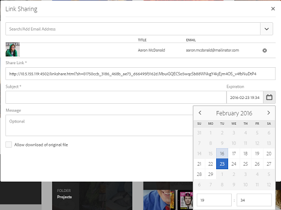
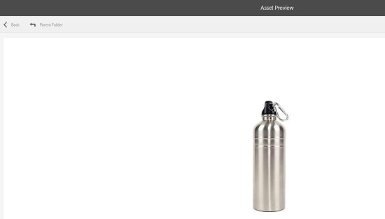

# 자산 링크 공유 {#asset-link-sharing}

Adobe Experience Manager(AEM) 자산을 사용하여 자산, 폴더 및 컬렉션을 조직 및 외부 개체의 구성원(파트너 및 공급업체 등)과 URL로 공유할 수 있습니다. 링크를 통해 자산을 공유하는 것은 외부 당사자가 먼저 AEM Assets에 로그인하지 않고도 리소스를 사용할 수 있도록 하는 편리한 방법입니다.

>[!NOTE]
>
>링크로 공유할 폴더 및 자산에 대해 ACL 편집 권한이 필요합니다.

## 자산 공유 {#share-assets}

사용자와 공유할 에셋의 URL을 생성하려면 링크 공유 대화 상자를 사용합니다. 관리자 권한이 있거나 읽기 권한이 있는 사용자는 자신과 공유된 링크를 볼 수 `/var/dam/share` 있습니다.

>[!NOTE]
>
>사용자와 링크를 공유하기 전에 [!UICONTROL 요일 CQ 메일 서비스가] 구성되어 있는지 확인합니다. 일 CQ 메일 서비스를 먼저 [구성하지 않고 링크를 공유하려고 하면 오류가 발생합니다](link-sharing.md#configure-day-cq-mail-service).

1. 자산 사용자 인터페이스에서 링크로 공유할 자산을 선택합니다.
1. 도구 모음에서 **[!UICONTROL 링크]** 자산 공유 아이콘을 클릭/ .

   [링크 공유] 필드에 자산 링크가 **[!UICONTROL 자동으로]** 만들어집니다. 이 링크를 복사하고 사용자와 공유합니다. 링크에 대한 기본 만료 시간은 하루입니다.

   

   또는 이 절차의 3-7단계를 수행하여 이메일 수신자를 추가하고 링크에 대한 만료 시간을 구성한 다음 대화 상자에서 보냅니다.

   >[!NOTE]
   >
   >AEM 작성자의 링크를 외부 엔티티에 공유하려면 링크 공유에 사용되는 다음 URL만 GET 요청에 노출하십시오. AEM 배포이 안전한지 확인하기 위해 다른 URL을 차단합니다.
   >
   >* &lt;AEM Server>/linkshare.html
   * &lt;AEM Server>/linksharepreview.html
   * &lt;AEM Server>/linkexpired.html

   >[!NOTE]
   공유 에셋이 다른 위치로 이동되면 해당 링크가 작동하지 않습니다. 링크를 다시 만들고 사용자와 다시 공유합니다.

1. 웹 콘솔에서 **[!UICONTROL Day CQ Link Externalizer]** 구성을 열고 도메인 **** 필드에서 각각에 대해 언급된 값을 사용하여 다음 속성을 수정합니다.

   * 로컬
   * 작성자
   * 페이지를

   속성 `local` 및 `author` 속성에 대해 로컬 및 작성자 인스턴스의 URL을 각각 제공합니다. 단일 AEM 작성자 인스턴스 `local` 를 실행하는 경우 두 속성 모두 동일한 값을 `author` 갖습니다. 예를 `publish`들어 게시 인스턴스의 URL을 제공합니다.

1. [ **[!UICONTROL 링크 공유]** ] 대화 상자의 이메일 주소 상자에 링크를 공유할 사용자의 이메일 ID를 입력합니다. 여러 사용자와 링크를 공유할 수도 있습니다.

   사용자가 조직의 구성원인 경우 입력 영역 아래 목록에 표시되는 제안된 이메일 ID에서 사용자의 이메일 ID를 선택합니다. 외부 사용자의 경우 전체 이메일 ID를 입력한 다음 목록에서 선택합니다.

   사용자에게 보낼 이메일을 활성화하려면 [요일 CQ 메일 서비스에서 SMTP 서버 세부 사항을 구성합니다](link-sharing.md#configure-day-cq-mail-service).

   

   링크 공유 대화 상자에서 바로 에셋에 대한 링크 공유

   >[!NOTE]
   조직의 구성원이 아닌 사용자의 이메일 ID를 입력하면 &quot;외부 사용자&quot;라는 단어 앞에 사용자의 이메일 ID가 붙습니다.

1. 제목 **** 상자에 공유할 자산의 제목을 입력합니다.
1. 메시지 **[!UICONTROL 상자에]** 선택적 메시지를 입력합니다.
1. 만료 **** 필드에서 날짜 선택기를 사용하여 링크의 만료 날짜 및 시간을 지정합니다. 기본적으로 만료 날짜는 링크를 공유하는 날짜로부터 1주일 동안 설정됩니다.

   

1. 사용자가 표현물과 함께 원본 이미지를 다운로드할 수 있도록 하려면 원본 파일 **[!UICONTROL 의 다운로드 허용을 선택합니다]**.

   >[!NOTE]
   기본적으로 사용자는 링크로 공유하는 자산의 표현물만 다운로드할 수 있습니다.

1. **[!UICONTROL 공유]**&#x200B;를 클릭합니다. 링크가 이메일을 통해 사용자와 공유되고 있음을 확인하는 메시지가 표시됩니다.
1. 공유 자산을 보려면 사용자에게 전송되는 이메일의 링크를 클릭/탭합니다. 공유 자산이 [!UICONTROL Adobe Marketing Cloud] 페이지에 표시됩니다.

   

   목록 보기로 전환하려면 도구 모음에서 레이아웃 아이콘을 클릭/탭합니다.

1. 자산의 미리 보기를 생성하려면 공유 자산을 클릭/탭합니다. 도구 모음에서 **[!UICONTROL 뒤로를]** 클릭/탭하여 미리 보기를 닫고 [!UICONTROL Marketing Cloud] 페이지로 돌아갑니다. 폴더를 공유한 경우 상위 폴더 **[!UICONTROL 를 클릭/탭하여]** 상위 폴더로 돌아갑니다.

   

   >[!NOTE]
   AEM에서는 이러한 MIME 유형의 자산 미리 보기 생성을 지원합니다. JPG, PNG, GIF, BMP, INDD, PDF 및 PPT입니다. 다른 MIME 형식의 자산만 다운로드할 수 있습니다.

1. 공유 자산을 다운로드하려면 도구 모음에서 **[!UICONTROL 선택]** 아이콘을 클릭/탭하고 자산을 클릭/탭한 다음 도구 모음에서 **[!UICONTROL 다운로드를 클릭/탭합니다]** .

   

1. 링크로 공유한 자산을 보려면 자산 UI로 이동하고 **[!UICONTROL 글로벌 탐색 아이콘을 클릭/탭합니다]** . 목록에서 **[!UICONTROL 탐색]** 을 선택하여 탐색 창을 표시합니다.
1. 탐색 창에서 **[!UICONTROL 공유 링크]** 를 선택하여 공유 에셋 목록을 표시합니다.
1. 자산 공유를 취소하려면 자산을 선택하고 도구 모음에서 **[!UICONTROL 공유]** 해제를 탭/클릭합니다. 자산의 공유를 해제했음을 확인하는 메시지가 나타납니다. 또한 자산 항목이 목록에서 제거됩니다.

## 일 CQ 메일 서비스 구성 {#configure-day-cq-mail-service}

1. AEM 로고를 클릭하거나 탭한 다음 **[!UICONTROL 도구 > 작업 > 웹 콘솔로 이동합니다]**.
1. 서비스 목록에서 **[!UICONTROL Day CQ Mail Service를 찾습니다]**.
1. 서비스 옆의 **[!UICONTROL 편집]** 아이콘을 클릭하고 이름에 대한 세부 사항과 함께 **[!UICONTROL Day CQ Mail Service]** 에 대해 다음 매개 변수를 구성합니다.

   * SMTP 서버 호스트 이름: 이메일 서버 호스트 이름
   * SMTP 서버 포트: 이메일 서버 포트
   * SMTP 사용자: 이메일 서버 사용자 이름
   * SMTP 암호: 이메일 서버 암호

   

1. Click/tap **[!UICONTROL Save]**.

## 최대 데이터 크기 구성 {#configure-maximum-data-size}

링크 공유 기능을 사용하여 공유된 링크에서 자산을 다운로드할 때 AEM은 저장소에서 전체 자산 계층을 압축한 다음 ZIP 파일의 자산을 반환합니다. 그러나 ZIP 파일에서 압축할 수 있는 데이터 양에 대한 제한이 없는 경우 엄청난 양의 데이터가 압축될 수 있으므로 JVM에서 메모리 오류가 발생하지 않습니다. 이러한 상황에서 시스템을 잠재적 서비스 거부 공격으로부터 보호하려면 Configuration Manager의 **[!UICONTROL 일 CQ DAM Adhoc 에셋 공유 프록시 서블릿에 대한 최대 컨텐트 크기(비압축)]** 매개 변수를 사용하여 최대 크기를 **** 구성합니다. 압축되지 않은 자산 크기가 구성된 값을 초과하는 경우 자산 다운로드 요청이 거부됩니다. 기본값은 100MB입니다.

1. AEM 로고를 클릭/탭한 다음 **[!UICONTROL 도구 > 작업 > 웹 콘솔로 이동합니다]**.
1. 웹 콘솔에서 **[!UICONTROL 일 CQ DAM 애드혹 자산 공유 프록시 서블릿 구성을]** 찾습니다.
1. 편집 모드에서 **[!UICONTROL 일 CQ DAM Adhoc 에셋 공유 프록시 서블릿]** 구성을 열고 **[!UICONTROL 최대 컨텐트 크기(압축되지 않은) 매개 변수의 값을]** 수정합니다.

   

1. 변경 사항을 저장합니다.

## Best practices and troubleshooting {#best-practices-and-troubleshooting}

* 이름에 공백이 포함된 자산 폴더 또는 컬렉션은 공유되지 않을 수 있습니다.
* 사용자가 공유 에셋을 다운로드할 수 없는 경우 AEM 관리자에게 [다운로드 제한](#configure-maximum-data-size) 사항을 문의하십시오.
* 공유 자산에 대한 링크가 포함된 이메일을 보낼 수 없거나 다른 사용자가 이메일을 받을 수 없는 경우 [이메일 서비스가](#configure-day-cq-mail-service) 구성되었는지 여부를 AEM 관리자에게 문의하십시오.
* 링크 공유 기능을 사용하여 자산을 공유할 수 없는 경우 적절한 권한이 있는지 확인하십시오. 자산 [공유를 참조하십시오](#share-assets).
