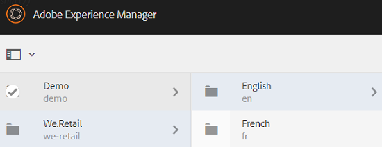

# 디지털 자산 관리 {#managing-assets-with-the-touch-optimized-ui}

AEM Assets의 터치에 적합한 사용자 인터페이스를 사용하여 수행할 수 있는 다양한 자산 관리 및 편집 작업에 대해 알아봅니다.

이 문서에서는 Adobe Experience Manager(AEM) Assets 터치에 적합한 사용자 인터페이스를 사용하여 자산을 관리하고 편집하는 방법에 대해 설명합니다. 사용자 인터페이스에 대한 기본적인 지식이 필요하면 [Touch UI의 기본 처리](/help/sites-authoring/basic-handling.md)를 참조하십시오. 컨텐츠 조각을 관리하려면 [컨텐츠 조각 관리](content-fragments-managing.md) 자산 을 참조하십시오.

## 폴더 만들기 {#create-folders}

자산 컬렉션을 구성할 때(예: 모든 `Nature` 이미지) 폴더를 만들어 함께 유지할 수 있습니다. 폴더를 사용하여 자산을 분류하고 구성할 수 있습니다. AEM Assets에서는 더 잘 작동하도록 자산을 폴더에서 구성할 필요가 없습니다.

>[!NOTE]
>
>* Marketing Cloud에 공유할 때 `sling:OrderedFolder` 유형의 자산 폴더를 공유할 수 없습니다. 폴더를 공유하려면 폴더를 만들 때 [정렬됨]을 선택하지 마십시오.
>* Experience Manager은 `subassets` 단어를 폴더 이름으로 사용할 수 없습니다. 복합 자산에 대한 하위 자산을 포함하는 노드에 예약된 키워드입니다.

1. 새 폴더를 만들 디지털 자산 폴더의 위치로 이동합니다.
1. 메뉴에서 **[!UICONTROL 만들기]**&#x200B;를 클릭합니다. **[!UICONTROL 새 폴더]**&#x200B;를 선택합니다.
1. **[!UICONTROL 제목]** 필드에서 폴더 이름을 입력합니다. 기본적으로 DAM은 폴더 이름으로 제공한 제목을 사용합니다. 폴더를 만들면 기본값을 무시하고 다른 폴더 이름을 지정할 수 있습니다.
1. **[!UICONTROL 만들기]**&#x200B;를 클릭합니다. 폴더가 디지털 자산 폴더에 표시됩니다.

다음(공백으로 구분된 목록) 문자는 지원되지 않습니다.

* 자산 파일 이름에 `* / : [ \ \ ] | # % { } ? &`을(를) 포함하지 않아야 합니다.
* 자산 폴더 이름은 `* / : [ \ \ ] | # % { } ? \" . ^ ; + & \t`을 포함하지 않아야 합니다.

## 자산 업로드 {#uploading-assets}

로컬 폴더 또는 네트워크 드라이브에서 AEM Assets으로 다양한 유형의 자산(이미지, PDF 파일, RAW 파일 등)을 업로드할 수 있습니다.

>[!NOTE]
>
>Dynamic Media - Scene7 모드에서 파일 크기가 2GB 이하인 자산만 업로드할 수 있습니다.

처리 프로필이 할당된 폴더에 자산을 업로드하도록 선택할 수 있습니다.

처리 프로필이 할당된 폴더의 경우 카드 보기의 축소판에 프로필 이름이 나타납니다. 목록 보기에서 프로필 이름이 **[!UICONTROL 처리 프로필]** 열에 나타납니다. [처리 프로필](processing-profiles.md)을 참조하십시오.

자산을 업로드하기 전에 [지원되는 형식](assets-formats.md)인지 확인하십시오.

**자산을 업로드하려면 다음을 수행하십시오**.

1. Assets 웹 인터페이스에서 디지털 자산을 추가할 위치로 이동합니다.
1. 자산을 업로드하려면 다음 중 하나를 수행합니다.

   * 도구 모음에서 **[!UICONTROL 만들기]** 아이콘을 누릅니다. 그런 다음 메뉴에서 **[!UICONTROL 파일]**&#x200B;을 누릅니다. 필요한 경우 제공된 대화 상자에서 파일의 이름을 변경할 수 있습니다.
   * HTML5를 지원하는 브라우저에서 자산을 인터페이스에서 바로 드래그합니다. 파일 이름을 바꿀 대화 상자가 표시되지 않습니다.

   

   여러 파일을 선택하려면 Ctrl/Command 키를 누르고 파일 선택기 대화 상자에서 자산을 선택합니다. iPad에서는 한 번에 하나의 파일만 선택할 수 있습니다.

   큰 자산(500MB 이상)의 업로드를 일시 중지하고 동일한 페이지에서 나중에 다시 시작할 수 있습니다. 업로드가 시작될 때 나타나는 진행률 표시줄 옆에 있는 **[!UICONTROL 일시 중지]** 아이콘을 탭합니다.

   

   자산이 큰 자산으로 간주되는 위의 크기를 구성할 수 있습니다. 예를 들어 시스템이 1000MB 이상의 자산(500MB 대신)을 큰 자산으로 간주하도록 구성할 수 있습니다. 이 경우 크기가 1000MB보다 큰 자산을 업로드하면 진행률 표시줄의 **[!UICONTROL 일시 중지]** 단추가 표시됩니다.

   **[!UICONTROL 일시 중지]** 단추가 1000MB 미만의 파일이 업로드된 경우 표시되지 않습니다. 그러나 1,000MB 미만의 파일 업로드를 취소하면 **[!UICONTROL 일시 중지]** 단추가 나타납니다.

   크기 제한을 수정하려면 CRX 저장소에서 `fileupload` 노드의 `chunkUploadMinFileSize` 속성을 구성합니다.

   **[!UICONTROL 일시 중지]** 아이콘을 클릭하면 **[!UICONTROL 재생]** 아이콘으로 전환합니다. 업로드를 재개하려면 **[!UICONTROL 재생]** 아이콘을 클릭합니다.

   

   진행 중인 업로드를 취소하려면 진행률 표시줄 옆에 있는 `X` 버튼을 클릭합니다. 업로드 작업을 취소하면 AEM Assets이 자산의 부분적으로 업로드된 부분을 삭제합니다.

   업로드를 다시 시작하는 기능은 특히 큰 자산을 업로드하는 데 시간이 오래 걸리는 낮은 대역폭 시나리오 및 네트워크 결함 시 유용합니다. 업로드 작업을 일시 중지하고 상황이 개선되면 나중에 계속 진행할 수 있습니다. 다시 시작하면 업로드가 일시 중지된 지점부터 시작됩니다.

   업로드 작업 중에 AEM은 업로드되는 자산의 일부를 CRX 저장소에 데이터 청크로 저장합니다. 업로드가 완료되면 AEM에서는 이 청크를 저장소의 단일 데이터 블록으로 통합합니다.

   완료되지 않은 청크 업로드 작업에 대한 정리 작업을 구성하려면 `https://[aem_server]:[port]/system/console/configMgr/org.apache.sling.servlets.post.impl.helper.ChunkCleanUpTask`(으)로 이동합니다.

   자산을 업로드하고 있는 위치에서 이미 사용할 수 있는 자산의 이름과 같은 이름을 사용하는 자산을 업로드하면 경고 대화 상자가 표시됩니다.

   기존 자산을 대체하거나, 다른 버전을 만들거나, 업로드된 새 자산의 이름을 바꾸면서 두 자산을 모두 유지하도록 선택할 수 있습니다. 기존 자산을 바꿀 경우, 자산의 메타데이터와 이전 수정 및 내역(예: 주석, 자르기 등)이 삭제됩니다. 두 자산을 모두 유지하도록 선택하면 새 자산의 이름이 바뀝니다.

   

   >[!NOTE]
   >
   >**[!UICONTROL 이름 충돌]** 대화 상자에서 **[!UICONTROL 바꾸기]**&#x200B;를 선택하면 새 자산에 대해 자산 ID가 다시 생성됩니다. 이 ID는 이전 자산의 ID와 다릅니다.
   >
   >**[!UICONTROL 자산 통찰력]**&#x200B;이 활성화되어 Adobe Analytics에서 노출/클릭을 추적할 수 있는 경우, 이 재생성된 자산 ID는 Adobe Analytics에서 자산에 대해 캡처된 데이터를 무효화합니다.

   업로드한 자산이 AEM Assets에 있는 경우 **[!UICONTROL 중복 감지]** 대화 상자는 중복 자산을 업로드하려고 한다는 경고를 표시합니다. 이 대화 상자는 기존 자산의 바이너리의 SHA 1 체크섬 값이 업로드하는 자산의 체크섬 값과 일치하는 경우에만 나타납니다. 이 경우 자산의 이름은 중요하지 않습니다. 즉, 바이너리의 SHA 1 값이 동일한 경우 이름이 다른 자산에 대해서도 대화 상자가 표시될 수 있습니다.

   >[!NOTE]
   >
   >**[!UICONTROL 중복 감지]** 대화 상자는 **[!UICONTROL 중복 감지]** 기능이 활성화된 경우에만 나타납니다. **[!UICONTROL 중복 감지]** 기능을 활성화하려면 [중복 감지 활성화](duplicate-detection.md)를 참조하십시오.

   

   AEM Assets에서 중복 자산을 유지하려면 **[!UICONTROL Keep]**&#x200B;을 탭하십시오. 업로드한 중복 자산을 삭제하려면 **[!UICONTROL 삭제]**&#x200B;를 누릅니다.

   AEM Assets에서는 파일 이름에 금지된 문자가 있는 자산을 업로드할 수 없습니다. 허용되지 않는 문자가 포함된 자산을 업로드하려고 하면 AEM Assets에서 파일 이름에 금지된 문자가 있는지 여부에 대한 경고 메시지를 표시하고 이러한 문자를 제거하거나 허용되는 이름으로 업로드할 때까지 업로드를 중지합니다.

   조직에 대한 특정 파일 이름 지정 규칙에 맞게 **[!UICONTROL 자산 업로드]** 대화 상자를 사용하면 업로드하는 파일에 대해 긴 이름을 지정할 수 있습니다.

   

   그러나 다음(공백으로 구분된 목록) 문자는 지원되지 않습니다.
   * 자산 파일 이름에 `* / : [ \ \ ] | # % { } ? &`을(를) 포함하지 않아야 합니다.
   * 자산 폴더 이름은 `* / : [ \ \ ] | # % { } ? \" . ^ ; + & \t`을 포함하지 않아야 합니다.

   또한 자산 인터페이스에는 업로드하는 가장 최근 자산 또는 모든 보기(**[!UICONTROL 카드 보기]**, **[!UICONTROL 목록 보기]** 및 **[!UICONTROL 열 보기]**)에서 처음 만드는 폴더가 표시됩니다.

   종종 큰 자산이나 여러 자산을 동시에 업로드하는 동안 시각적 지표를 통해 진행 상황을 평가할 수 있습니다. **[!UICONTROL 업로드 진행률]** 대화 상자에는 업로드된 파일 수와 업로드하지 못한 파일이 표시됩니다.

   

   파일이 업로드되기 전에 업로드 작업을 취소하면 AEM Assets에서 현재 파일 업로드를 중지하고 컨텐츠를 새로 고칩니다. 그러나 이미 업로드된 파일은 삭제되지 않습니다.

### 직렬 업로드 {#serial-uploads}

많은 자산을 일괄적으로 업로드하면 상당한 시스템 리소스가 소비되므로 AEM 배포 성능에 부정적인 영향을 줄 수 있습니다. 잠재적인 병목 현상은 인터넷 연결, 디스크의 읽기 쓰기 작업, 동시 자산 업로드 시 POST 요청 수에 대한 웹 브라우저 제한 사항이 될 수 있습니다. 대량 업로드 작업이 실패하거나 조기에 종료될 수 있습니다. 즉, AEM Assets는 여러 파일을 섭취할 때 일부 파일을 누락하거나 모두 파일을 수집하지 못할 수 있습니다.

이 문제를 해결하기 위해 AEM Assets은 모든 자산을 동시에 섭취하는 대신 일괄 업로드 작업 동안 한 번에 하나의 자산(직렬 업로드)을 수집합니다.

자산의 직렬 업로드는 기본적으로 활성화되어 있습니다. 기능을 비활성화하고 동시 업로드를 허용하려면 CRXDe에서 `fileupload` 노드를 오버레이하고 `parallelUploads` 속성 값을 `true`로 설정하십시오.

### FTP를 사용하여 자산 업로드 {#uploading-assets-using-ftp}

Dynamic Media을 사용하면 FTP 서버를 통해 자산을 일괄적으로 업로드할 수 있습니다. 큰 자산(>1GB)을 업로드하거나 전체 폴더와 하위 폴더를 업로드하려면 FTP를 사용해야 합니다. FTP 업로드를 반복 예약된 시간에 발생하도록 설정할 수도 있습니다.

>[!NOTE]
>
>Dynamic Media - Scene7 모드에서 파일 크기가 2GB 이하인 자산만 업로드할 수 있습니다.

>[!NOTE]
>
>Dynamic Media에서 FTP를 통해 자산을 업로드하려면 - Scene7 모드 설치 기능 팩(FP) 18912 AEM 작성자를 참조하십시오. FP-18912에 액세스하고 FTP 계정 설정을 완료하려면 Adobe 고객 지원 센터에 문의하십시오. 벌크 자산 마이그레이션에 대해서는 [기능 팩 18912 설치](/help/assets/bulk-ingest-migrate.md)를 참조하십시오.
>
>자산을 업로드하는 데 FTP를 사용하는 경우 AEM에 지정된 업로드 설정이 무시됩니다. 대신 Dynamic Media Classic에 정의된 대로 파일 처리 규칙이 사용됩니다.

**FTP를 사용하여 자산을 업로드하려면**

1. 원하는 FTP 클라이언트를 사용하여 프로비저닝 이메일에서 받은 FTP 사용자 이름과 암호를 사용하여 FTP 서버에 로그인합니다. FTP 클라이언트에서 파일 또는 폴더를 FTP 서버에 업로드합니다.
1. [Dynamic Media Classic 데스크탑 응용 프로그램](https://experienceleague.adobe.com/docs/dynamic-media-classic/using/getting-started/signing-out.html#getting-started)을 연 다음, 프로비저닝 이메일에서 받은 자격 증명을 사용하여 계정에 로그인합니다.
1. 전역 탐색 막대에서 **[!UICONTROL 업로드]**&#x200B;를 누릅니다.
1. 왼쪽 위 모서리 근처에 있는 **[!UICONTROL 업로드]** 페이지에서 **[!UICONTROL FTP]** 탭을 탭합니다.
1. 페이지 왼쪽에서 파일을 업로드할 FTP 폴더를 선택합니다.페이지 오른쪽에서 대상 폴더를 선택합니다.
1. 페이지의 오른쪽 아래 모서리 근처에 있는 **[!UICONTROL 작업 옵션]**&#x200B;을 탭한 다음, 선택한 폴더의 자산을 기준으로 원하는 옵션을 설정합니다.

   [업로드 작업 옵션](#upload-job-options)을 참조하십시오.

   >[!NOTE]
   >
   >FTP를 통해 자산을 업로드하면 Dynamic Media Classic에서 설정한 업로드 작업 옵션이 AEM에 설정된 자산 처리 매개 변수보다 우선합니다.

1. **[!UICONTROL 업로드 작업 옵션]** 대화 상자의 오른쪽 아래 모서리에서 **[!UICONTROL 저장]**&#x200B;을 탭합니다.
1. **[!UICONTROL 업로드]** 페이지의 오른쪽 아래 모서리에서 **[!UICONTROL 업로드]**&#x200B;를 탭합니다.

   업로드의 진행 상황을 보려면 전역 탐색 모음에서 **[!UICONTROL 작업]**&#x200B;을 누릅니다. **[!UICONTROL 작업]** 페이지에는 업로드의 진행 상태가 표시됩니다. AEM에서 계속 작업하고 언제든지 Dynamic Media Classic의 작업 페이지로 돌아가 진행 중인 작업을 검토할 수 있습니다.

   진행 중인 업로드 작업을 취소하려면 **[!UICONTROL 기간]** 시간 옆에 있는 **[!UICONTROL 취소]**&#x200B;를 누릅니다.

#### 업로드 작업 옵션 {#upload-job-options}

| 업로드 옵션 | 하위 옵션 | 설명 |
|---|---|---|
| 작업 이름 |  | 텍스트 필드에 미리 입력되는 기본 이름은 이름의 사용자 입력 부분과 날짜 및 시간 스탬프를 포함합니다. 기본 이름을 사용하거나 이 업로드 작업에 대해 고유한 작성 이름을 입력할 수 있습니다.  작업 및 기타 업로드 및 게시 작업이 작업 페이지에 기록되며, 이 페이지에서 작업 상태를 확인할 수 있습니다. |
| 업로드 후 게시 |  | 업로드한 자산을 자동으로 게시합니다. |
| 확장에 관계없이 동일한 기본 자산 이름으로 모든 폴더에 덮어쓰기 |  | 업로드하는 파일을 동일한 이름으로 바꾸도록 하려면 이 옵션을 선택합니다. 이 옵션의 이름은 **[!UICONTROL 응용 프로그램 설정]** > **[!UICONTROL 일반 설정]** > **[!UICONTROL 응용 프로그램에 업로드]** > **[!UICONTROL 이미지 덮어쓰기]**&#x200B;의 설정에 따라 다를 수 있습니다. |
| 업로드 시 ZIP 또는 TAR 파일 압축 해제 |  |  |
| 작업 옵션 |  | **[!UICONTROL 작업 옵션]**&#x200B;을 탭/클릭하여 [!UICONTROL 업로드 작업 옵션] 대화 상자를 열고 전체 업로드 작업에 영향을 주는 옵션을 선택합니다. 이러한 옵션은 모든 파일 유형에 대해 동일합니다. [응용 프로그램 일반 설정] 페이지에서 시작하여 파일을 업로드하기 위한 기본 옵션을 선택할 수 있습니다. 이 페이지를 열려면 **[!UICONTROL 설정]** > **[!UICONTROL 응용 프로그램 설정]**&#x200B;을 선택하십시오. **[!UICONTROL 기본 업로드 옵션]** 단추를 눌러 [!UICONTROL 업로드 작업 옵션] 대화 상자를 엽니다. |
|  | http 화이트보드 | 1회 또는 반복을 선택합니다. 반복 작업을 설정하려면 반복 옵션(일별, 주별, 월별 또는 사용자 지정)을 선택하여 FTP 업로드 작업을 반복할 시기를 지정합니다. 그런 다음 필요에 따라 예약 옵션을 지정합니다. |
|  | 하위 폴더 포함 | 업로드할 폴더 내에서 모든 하위 폴더를 업로드합니다. 업로드하는 폴더 및 하위 폴더의 이름은 AEM Assets에 자동으로 입력됩니다. |
|  | 자르기 옵션 | 이미지의 양쪽에서 수동으로 자르려면 [자르기] 메뉴를 선택하고 [수동]을 선택합니다. 그런 다음 이미지의 측면이나 양쪽에서 자를 픽셀 수를 입력합니다. 이미지가 잘리는 양은 이미지 파일의 ppi(인치당 픽셀) 설정에 따라 달라집니다. 예를 들어, 이미지가 150ppi를 표시하고 [위쪽], [오른쪽], [아래쪽] 및 [왼쪽] 텍스트 상자에 75를 입력하면 각 면에서 1/2인치 잘립니다.  이미지에서 공백 픽셀을 자동으로 자르려면 [자르기] 메뉴를 열고 [수동]을 선택한 다음 [위쪽], [오른쪽], [아래쪽] 및 [왼쪽] 필드에 픽셀 측정 값을 입력하여 양쪽에서 자를 수 있습니다. 자르기 메뉴에서 트림 을 선택하고 다음 옵션을 선택할 수도 있습니다.  **기준 재단** <ul><li>**색상**  - 색상 옵션을 선택합니다. 그런 다음 [모퉁이] 메뉴를 선택하고 자르려는 공백 색상을 가장 잘 나타내는 색상이 있는 이미지 모서리를 선택합니다.</li><li>**투명도**  - 투명도 옵션을 선택합니다.  **허용치**  - 슬라이더를 드래그하여 0에서 1까지의 허용치를 지정합니다.색상을 기준으로 트리밍의 경우 0을 지정하여 이미지 모서리에서 선택한 색상과 정확히 일치하는 경우에만 픽셀을 자릅니다. 1에 가까운 숫자는 더 많은 색상 차이를 허용합니다. 투명도를 기반으로 트리밍하는 경우 픽셀이 투명할 경우에만 픽셀을 자르도록 0을 지정합니다. 1에 가까운 숫자는 더 투명할 수 있도록 해줍니다.</li></ul> 이러한 자르기 옵션은 원본에 영향을 주지 않습니다. |
|  | 색상 프로필 옵션 | 게재에 사용되는 최적화된 파일을 만들 때 색상 변환을 선택합니다.<ul><li>기본 색상 유지:이미지에 색상 공간 정보가 포함될 때마다 소스 이미지 색상을 유지합니다.색상 변환이 없습니다. 현재 거의 모든 이미지에 적절한 색상 프로필이 이미 포함되어 있습니다. 그러나 CMYK 소스 이미지에 포함된 색상 프로파일이 없으면 색상이 sRGB(표준 빨간색 녹색 파란색) 색상 공간으로 변환됩니다. sRGB는 웹 페이지에 이미지를 표시하는 데 권장되는 색상 공간입니다.</li><li>원래 색상 공간 유지:점에서 색상 변환 없이 원래 색상을 유지합니다. 포함된 색상 프로필이 없는 이미지의 경우, 모든 색상 변환은 게시 설정에 구성된 기본 색상 프로필을 사용하여 수행됩니다. 색상 프로필이 이 옵션으로 만든 파일의 색상과 일치하지 않을 수 있습니다. 따라서 기본 색상 유지 옵션을 사용하는 것이 좋습니다.</li><li>[사용자 정의 시작] >   [변환 대상] 및 [색상 공간으로 변환]을 선택할 수 있도록 메뉴를 엽니다. 이 고급 옵션은 소스 파일에 포함된 모든 색상 정보를 무시합니다. 제출하는 모든 이미지에 잘못되었거나 누락된 색상 프로필 데이터가 포함되어 있으면 이 옵션을 선택합니다.</li></ul> |
|  | 이미지 편집 옵션 | 이미지의 클리핑 마스크를 유지하고 색상 프로파일을 선택할 수 있습니다.  업로드  [시 이미지 편집 옵션 설정 을 참조하십시오](#setting-image-editing-options-at-upload). |
|  | Postscript 옵션 | PostScript® 파일을 래스터화하고, 파일을 자르며, 투명한 배경을 유지하고, 해상도를 선택하고, 색상 공간을 선택할 수 있습니다.  PostScript  [및 Illustrator 업로드 옵션 설정 을 참조하십시오](#setting-postscript-and-illustrator-upload-options). |
|  | Photoshop 옵션 | Adobe® Photoshop® 파일에서 템플릿을 만들고, 레이어를 유지 관리하며, 레이어의 이름을 지정하는 방법을 지정하고, 텍스트를 추출하고, 이미지가 템플릿에 고정된 방식을 지정할 수 있습니다.  템플릿은 AEM에서 지원되지 않습니다.  Photoshop  [업로드 옵션 설정](#setting-photoshop-upload-options)을 참조하십시오. |
|  | PDF 옵션 | 파일을 래스터화하고, 검색어와 링크를 추출하고, eCatalog를 자동으로 생성하고, 해상도를 설정하고, 색상 공간을 선택할 수 있습니다.  eCatalog 는 AEM에서 지원되지 않습니다.   PDF  [업로드 옵션 설정](#setting-pdf-upload-options)을 참조하십시오. |
|  | Illustrator 옵션 | Adobe Illustrator® 파일을 래스터화하고 투명한 배경을 유지하고 해상도를 선택한 다음 색상 공간을 선택할 수 있습니다.  PostScript  [및 Illustrator 업로드 옵션 설정 을 참조하십시오](#setting-postscript-and-illustrator-upload-options). |
|  | 비디오 옵션 | 비디오 사전 설정을 선택하여 비디오 파일을 변환할 수 있습니다.  비디오  [업로드 옵션 설정](#setting-evideo-upload-options)을 참조하십시오. |
|  | 일괄처리 집합 사전 설정 | 업로드된 파일에서 이미지 세트 또는 스핀 세트를 만들려면 사용할 사전 설정에 대해 활성 열을 클릭합니다. 두 개 이상의 사전 설정을 선택할 수 있습니다. Dynamic Media Classic의 애플리케이션 설정/일괄처리 집합 사전 설정 페이지에서 사전 설정을 만듭니다.  일괄처리  [집합 사전 설정 만들기에 대한 자세한 내용은 이미지 세트 자동 생성을 위한 일괄처리 집합 사전 ](config-dms7.md#creating-batch-set-presets-to-auto-generate-image-sets-and-spin-sets) 설정 구성 및 스핀 세트 를 참조하십시오.  업로드  [시 일괄처리 집합 사전 설정 설정을 참조하십시오](#setting-batch-set-presets-at-upload). |

#### 업로드 {#setting-image-editing-options-at-upload}에 이미지 편집 옵션을 설정합니다.

AI, EPS 및 PSD 파일을 비롯한 이미지 파일을 업로드할 때 **[!UICONTROL 업로드 작업 옵션]** 대화 상자에서 다음 편집 작업을 수행할 수 있습니다.

* 이미지 가장자리에서 공백을 자릅니다(위 표에서 설명 참조).
* 이미지의 측면에서 수동으로 자르십시오(위 표의 설명 참조).
* 색상 프로필을 선택합니다(위의 표에서 옵션 설명 참조).
* 클리핑 패스에서 마스크를 만듭니다.
* 선명하게 하기 마스크 옵션을 사용하여 이미지 선명하게 하기
* 녹아웃 배경

| 옵션 | 하위 옵션 | 설명 |
|---|---|---|
| 클리핑 패스에서 마스크 만들기 |  | 클리핑 패스 정보를 기반으로 이미지의 마스크를 만듭니다. 이 옵션은 클리핑 패스를 만든 이미지 편집 응용 프로그램으로 만든 이미지에 적용됩니다. |
| 언샵 마스킹 |  | 최종 다운샘플링된 이미지에 선명도 필터 효과를 세밀하게 조정하고 효과의 강도, 효과의 반경(픽셀 단위 측정) 및 무시되는 대비 임계값을 제어할 수 있습니다.  이 효과는 Photoshop의 언샵 마스크 필터와 동일한 옵션을 사용합니다. 이름에서 알 수 있듯이 언샵 마스크는 선명하게 하는 필터입니다. 언샵 마스킹(Unsharp Masking)에서 원하는 옵션을 설정합니다. 설정 옵션은 다음과 같습니다. |
|  | 양 | 가장자리 픽셀에 적용되는 대비 양을 제어합니다.  그것을 효과의 강도로 생각해 보세요. Dynamic Media의 언샵 마스크 값과 Adobe Photoshop의 금액 값의 주요 차이점은 Photoshop의 크기가 1%~500%라는 것입니다. 반면에, Dynamic Media에서 값 범위는 0.0에서 5.0입니다. 5.0의 값은 Photoshop의 500%에 해당하는 대략적인 값입니다.0.9값은 90%와 같은 값입니다. |
|  | 반경 | 효과의 반경을 제어합니다. 값 범위는 0-250입니다.  효과는 이미지의 모든 픽셀에서 실행되며 모든 방향으로 모든 픽셀에서 발산됩니다. 반지름은 픽셀 단위로 측정됩니다. 예를 들어 2000 x 2000 픽셀 이미지와 500 x 500 픽셀 이미지에 대해 비슷한 선명하게 하기 효과를 가져오려면 2000 x 200 픽셀 이미지에 두 픽셀의 반경과 500 x 500 픽셀 이미지에 한 픽셀의 반경 값을 설정합니다. 픽셀이 많은 이미지에 더 큰 값이 사용됩니다. |
|  | 임계값 | 임계값은 언샵 마스크 필터를 적용할 때 무시되는 대비 범위입니다. 이 필터를 사용할 때 이미지에 &quot;영향&quot;이 발생하지 않도록 해야 합니다. 값 범위는 0-255이며, 이 값은 회색 음영 이미지에 있는 밝기 단계 수입니다. 0=검정, 128=50% 회색, 255=흰색.  예를 들어, 12의 임계값은 약간의 변화를 무시하며 노이즈를 추가하지 않도록 피부 색조 밝기를 적용하지만, 속눈썹이 피부와 만나는 것과 같은 대조적인 영역에 가장자리 대비를 추가합니다.  예를 들어, 어떤 사람의 얼굴 사진이 있는 경우, 언샵 마스크는 눈에 띄는 대조 영역을 만들기 위해 속눈썹과 피부가 만나는 것과 부드러운 피부 그 자체와 같은 이미지의 대조적인 부분에 영향을 줍니다. 아무리 매끄러운 피부라도 휘도 값의 미묘한 변화를 나타낸다. 임계값을 사용하지 않는 경우 필터는 스킨 픽셀에서 이러한 미묘한 변경 사항을 적용합니다. 이에 따라, 속눈썹의 대비가 증가하면서 잡음과 바람직하지 않은 효과를 만들어 냄으로써 선명도가 향상된다.  이 문제를 방지하기 위해 부드러운 피부와 같이 대비가 크게 변경되지 않는 픽셀을 무시하도록 필터에 알리는 임계값 이 도입되었습니다.  앞서 표시된 지퍼 그래픽에서 지퍼 옆에 있는 텍스처를 확인합니다. 임계값이 너무 낮아 노이즈를 억제할 수 없으므로 이미지 소음이 표시됩니다. |
|  | 단색 | 선명하게 마스크 이미지 밝기(강도)를 해제하려면 선택합니다.  각 색상 구성 요소를 개별적으로 언샵 마스크하려면 선택 취소합니다. |
| 녹아웃 배경 |  | 이미지를 업로드할 때 이미지 배경을 자동으로 제거합니다. 이 기법은 특정 객체에 주의를 집중하여 사용 중인 배경에서 두드러지게 만드는 데 유용합니다. 배경 녹아웃 기능과 다음 하위 옵션을 활성화하거나 &quot;켜기&quot;하려면 선택합니다. |
|  | 코너 | 필수.  녹아웃할 배경색을 정의하는 데 사용되는 이미지의 모서리입니다.  왼쪽  **위**,  **왼쪽 아래**,  **오른쪽 위** 또는  **오른쪽 아래** 중에서 선택할 수 있습니다. |
|  | 채우기 방법 | 필수.  설정한 코너 위치에서 픽셀 투명도를 제어합니다.  다음 채우기 방법 중에서 선택할 수 있습니다. <ul><li>**Flood 채우기**  - 지정한 모서리와 일치하는 모든 픽셀을 투명하게 바꿉니다.</li><li>**일치 픽셀**  - 이미지의 위치에 관계없이 일치하는 모든 픽셀을 투명하게 만듭니다.</li></ul> |
|  | 허용치 | 선택 사항입니다.  설정한 코너 위치를 기반으로 픽셀 색상 일치의 허용 가능한 변형 양을 제어합니다.  픽셀 색상을 정확하게 일치시키려면 0.0 값을 사용하거나 1.0 값을 사용하여 가장 큰 변형을 허용합니다. |

#### PostScript 및 Illustrator 업로드 옵션 설정 {#setting-postscript-and-illustrator-upload-options}

PostScript(EPS) 또는 AI(Illustrator) 이미지 파일을 업로드할 때 다양한 방법으로 형식을 지정할 수 있습니다. 파일을 래스터화하고 투명한 배경을 유지하고 해상도를 선택한 다음 색상 공간을 선택할 수 있습니다. PostScript 및 Illustrator 파일 형식 옵션은 PostScript 옵션 및 Illustrator 옵션 아래의 업로드 작업 옵션 대화 상자에서 사용할 수 있습니다.

| 옵션 | 하위 옵션 | 설명 |
|---|---|---|
| 처리 중 |  | 파일의 벡터 그래픽을 비트맵 형식으로 변환하려면 **[!UICONTROL 래스터화]**&#x200B;를 선택합니다. |
| 렌더링된 이미지에서 투명한 배경 유지 |  | 파일의 배경 투명도를 유지합니다. |
| 해상도 |  | 해상도 설정을 결정합니다. 이 설정은 파일에 인치당 표시되는 픽셀 수를 결정합니다. |
| 색상 공간 |  | [색상 공간] 메뉴를 선택하고 다음 색상 공간 옵션 중에서 선택합니다. |
|  | 자동으로 검색 | 파일의 색상 공간을 유지합니다. |
|  | RGB로 강제 적용 | RGB 색상 공간으로 변환합니다. |
|  | CMYK로 강제 적용 | CMYK 색상 공간으로 변환합니다. |
|  | 회색 음영으로 강제 적용 | 회색 음영 색상 공간으로 변환합니다. |

#### Photoshop 업로드 옵션 설정 {#setting-photoshop-upload-options}

PSD(Photoshop 문서) 파일은 이미지 템플릿을 만드는 데 가장 많이 사용됩니다. PSD 파일을 업로드할 때 파일에서 자동으로 이미지 템플릿을 만들 수 있습니다(업로드 화면에서 템플릿 만들기 옵션 선택).

Dynamic Media은 파일을 사용하여 템플릿을 만들 경우 레이어가 있는 PSD 파일에서 여러 이미지를 만듭니다.각 레이어에 대해 하나의 이미지를 만듭니다.

위에 설명된 **[!UICONTROL 자르기 옵션]** 및 **[!UICONTROL 색상 프로필 옵션]**&#x200B;을 Photoshop 업로드 옵션과 함께 사용합니다.

>[!NOTE]
>
>템플릿은 AEM에서 지원되지 않습니다.

| 옵션 | 하위 옵션 | 설명 |
|---|---|---|
| 레이어 유지 |  | PSD의 레이어(있는 경우)를 개별 자산으로 리프합니다. 자산 레이어는 PSD와 연결된 상태로 유지됩니다. 세부 사항 보기에서 PSD 파일을 열고 레이어 패널을 선택하여 볼 수 있습니다. |
| 템플릿 만들기 |  | PSD 파일의 레이어에서 템플릿을 만듭니다. |
| 텍스트 추출 |  | 사용자가 뷰어에서 텍스트를 검색할 수 있도록 텍스트를 추출합니다. |
| 레이어를 배경 크기로 확장 |  | 분리된 이미지 레이어의 크기를 배경 레이어의 크기로 확장합니다. |
| 레이어 이름 지정 |  | PSD 파일의 레이어는 별도의 이미지로 업로드됩니다. |
|  | 레이어 이름 | PSD 파일에서 레이어 이름 뒤에 이미지 이름을 지정합니다. 예를 들어 원본 PSD 파일의 Price Tag라는 레이어는 Price Tag라는 이미지가 됩니다. 그러나 PSD 파일의 레이어 이름이 기본 Photoshop 레이어 이름(배경, 레이어 1, 레이어 2 등)인 경우 해당 이미지의 이름은 기본 레이어 이름이 아니라 PSD 파일의 레이어 번호 뒤에 지정됩니다. |
|  | Photoshop 및 레이어 번호 | 원본 레이어 이름을 무시하고 PSD 파일에서 레이어 번호 뒤에 이미지 이름을 지정합니다. 이미지의 이름은 Photoshop 파일 이름과 추가된 레이어 번호로 지정됩니다. 예를 들어, Spring Ad.psd라는 파일의 두 번째 레이어는 Photoshop에서 기본이 아닌 이름이 있더라도 Spring Ad_2로 이름이 지정됩니다. |
|  | Photoshop 및 레이어 이름 | PSD 파일 뒤에 레이어 이름 또는 레이어 번호가 나오는 이미지 이름을 지정합니다. PSD 파일의 레이어 이름이 기본 Photoshop 레이어 이름인 경우 레이어 번호가 사용됩니다. 예를 들어 SpringAd라는 PSD 파일에서 Price Tag라는 레이어의 이름은 Spring Ad_Price Tag입니다. 기본 이름이 Layer 2인 레이어를 Spring Ad_2라고 합니다. |
| 앵커 |  | PSD 파일에서 생성된 레이어 컴포지션에서 생성된 템플릿에 이미지가 고정된 방식을 지정합니다. 기본적으로 앵커는 중심입니다. 가운데 앵커는 교체 이미지의 종횡비에 상관없이 교체 이미지가 동일한 공간을 가장 잘 채울 수 있도록 합니다. 템플릿을 참조하고 매개 변수 대체를 사용할 때 이 이미지를 대체하는 다른 측면을 가진 이미지가 동일한 공간을 효과적으로 차지합니다. 템플릿의 할당된 공간을 채우기 위해 응용 프로그램에 교체 이미지가 필요한 경우 다른 설정으로 변경합니다. |

#### PDF 업로드 옵션 설정 {#setting-pdf-upload-options}

PDF 파일을 업로드할 때 다양한 방법으로 형식을 지정할 수 있습니다. 페이지를 자릅니다. 검색 단어를 추출하고 인치당 픽셀 수를 입력하고 색상 공간을 선택합니다. PDF 파일에는 트림 여백, 재단선 표시, 등록 표시 및 기타 프린터 표시가 들어 있습니다. PDF 파일을 업로드할 때 페이지 측면에서 이러한 표시를 자를 수 있습니다.

>[!NOTE]
>
>eCatalog 는 AEM에서 지원되지 않습니다.

다음 옵션 중에서 선택합니다.

| 옵션 | 하위 옵션 | 설명 |
|---|---|---|
| 처리 중 | 래스터화 | (기본값) PDF 파일의 페이지를 잘라내고 벡터 그래픽을 비트맵 이미지로 변환합니다. eCatalog를 만들려면 이 옵션을 선택합니다. |
| 추출 | 검색어 | eCatalog 뷰어에서 키워드로 파일을 검색할 수 있도록 PDF 파일에서 단어를 추출합니다. |
|  | 링크 | PDF 파일에서 링크를 추출하여 eCatalog 뷰어에서 사용되는 이미지 맵으로 변환합니다. |
| 여러 페이지 PDF에서 eCatalog 자동 생성 |  | PDF 파일에서 eCatalog를 자동으로 만듭니다. eCatalog 는 업로드한 PDF 파일의 이름을 따라 명명됩니다. (이 옵션은 PDF 파일을 업로드할 때 래스터화하는 경우에만 사용할 수 있습니다.) |
| 해상도 |  | 해상도 설정을 결정합니다. 이 설정은 PDF 파일에 인치당 표시되는 픽셀 수를 결정합니다. 기본값은 150입니다. |
| 색상 공간 |  | [색상 공간] 메뉴를 선택하고 PDF 파일의 색상 공간을 선택합니다. 대부분의 PDF 파일에는 RGB 및 CMYK 색상 이미지가 모두 있습니다. 온라인 보기에서는 RGB 색상 공간이 더 좋습니다. |
|  | 자동 감지 | PDF 파일의 색상 공간을 유지합니다. |
|  | RGB로 강제 적용 | RGB 색상 공간으로 변환합니다. |
|  | CMYK로 강제 적용 | CMYK 색상 공간으로 변환합니다. |
|  | 회색 음영으로 강제 적용 | 회색 음영 색상 공간으로 변환합니다. |

#### eVideo 업로드 옵션 설정 {#setting-evideo-upload-options}

다양한 비디오 사전 설정 중에서 선택하여 비디오 파일을 트랜스코딩할 수 있습니다.

| 옵션 | 하위 옵션 | 설명 |
|---|---|---|
| 응용 비디오 |  | 모바일, 태블릿 및 데스크톱에 게재할 비디오를 만들기 위해 모든 종횡비에서 작동하는 단일 인코딩 사전 설정입니다. 이 사전 설정으로 인코딩된 업로드된 소스 비디오는 고정된 높이로 설정됩니다. 그러나 너비는 비디오의 종횡비를 유지하기 위해 자동으로 조정됩니다.  가장 좋은 방법은 응용 비디오 인코딩을 사용하는 것입니다. |
| 단일 인코딩 사전 설정 | 인코딩 사전 설정 정렬 | 이름 또는 크기 를 선택하여 이름 또는 해상도 크기별로 데스크탑, 모바일 및 태블릿 아래에 나열된 인코딩 사전 설정을 정렬합니다. |
|  | 데스크톱 | 데스크톱 컴퓨터에 스트리밍 또는 점진적 비디오 환경을 제공하기 위한 MP4 파일을 만듭니다.해상도 크기와 원하는 대상 데이터 비율로 하나 이상의 종횡비를 선택하십시오. |
|  | 모바일 | iPhone 또는 Android 모바일 장치에서 전달할 MP4 파일을 만듭니다.해상도 크기와 원하는 대상 데이터 비율로 하나 이상의 종횡비를 선택하십시오. |
|  | 태블릿 | iPad 또는 Android 태블릿 장치에서 전달할 MP4 파일을 만듭니다.해상도 크기와 원하는 대상 데이터 비율로 하나 이상의 종횡비를 선택하십시오. |

#### 업로드 {#setting-batch-set-presets-at-upload}에 일괄처리 집합 사전 설정 설정 지정

업로드된 이미지에서 이미지 세트 또는 스핀 세트를 자동으로 만들려면 사용할 사전 설정에 대해 **[!UICONTROL 활성]** 열을 클릭합니다. 두 개 이상의 사전 설정을 선택할 수 있습니다.

일괄처리 집합 사전 설정 만들기에 대한 자세한 내용은 [일괄처리 집합 사전 설정을 이미지 세트 자동 생성 및 스핀 세트](config-dms7.md#creating-batch-set-presets-to-auto-generate-image-sets-and-spin-sets)로 구성 을 참조하십시오.

### 스트리밍된 업로드 {#streamed-uploads}

많은 자산을 업로드하면 AEM 서버에 대한 I/O 호출이 크게 증가하여 업로드 효율을 줄이고 시간 초과도 발생할 수 있습니다. AEM Assets은 스트리밍되는 자산 업로드를 지원합니다. 스트리밍된 업로드는 저장소에 복사하기 전에 서버의 임시 폴더에 있는 자산 저장소를 방지하여 업로드 작업 중에 디스크 I/O를 줄입니다. 대신 데이터가 리포지토리로 직접 전송됩니다. 이 방법으로 큰 자산을 업로드하는 시간과 시간 초과가 발생할 가능성이 줄어듭니다. AEM Assets에서 기본적으로 스트리밍되는 업로드가 활성화됩니다.

3.1 이하의 서블릿-api 버전을 사용하는 JEE 서버에서 실행되는 AEM에 대해 스트리밍 업로드가 비활성화됩니다.

### 자산 {#extract-zip-archive-containing-assets}이 포함된 ZIP 아카이브 추출

지원되는 다른 자산처럼 ZIP 아카이브를 업로드할 수 있습니다. 동일한 파일 이름 규칙이 ZIP 파일에 적용됩니다. AEM에서 ZIP 아카이브를 DAM 위치에 추출할 수 있습니다.

한 번에 하나의 ZIP 아카이브를 선택하고 **[!UICONTROL 아카이브 추출]**&#x200B;을 클릭한 다음 대상 폴더를 선택합니다. 충돌을 처리할 옵션이 있으면 선택합니다. ZIP 파일의 자산이 이미 대상 폴더에 있는 경우 다음 옵션 중 하나를 선택할 수 있습니다.추출 건너뛰기, 기존 파일 바꾸기, 이름을 변경하여 두 자산을 유지하거나 새 버전을 만듭니다.

추출이 완료되면 AEM에서 알림 영역에서 알림을 보냅니다. AEM에서 ZIP을 추출하는 동안 추출을 중단하지 않고 작업으로 돌아갈 수 있습니다.

이 기능의 일부 제한 사항은 다음과 같습니다.

* 대상에 이름이 같은 폴더가 있는 경우 ZIP 파일의 자산은 기존 폴더에서 추출됩니다.

* 추출을 취소하면 이미 추출된 자산이 삭제되지 않습니다.

* ZIP 파일 두 개를 동시에 선택하고 추출할 수 없습니다. 한 번에 하나의 ZIP 아카이브를 추출할 수 있습니다.

## 자산 미리 보기 {#previewing-assets}

**자산을 미리 보려면 다음을 수행하십시오**.

1. 자산 UI에서 미리 보려는 자산의 위치로 이동합니다.
1. 원하는 자산을 탭하여 엽니다.

1. 미리 보기 모드에서 지원되는 이미지 유형](assets-formats.md#supported-raster-image-formats)에 대해 확대/축소 옵션을 사용할 수 있습니다(대화형 편집 사용).[

   자산을 확대하려면 **[!UICONTROL +]**(또는 자산의 돋보기를 탭함)를 탭합니다. 축소하려면 **[!UICONTROL -]**&#x200B;을 누릅니다. 확대하면 패닝하여 이미지의 모든 영역을 자세히 볼 수 있습니다. **[!UICONTROL 확대/축소 재설정]** 화살표가 원래 보기로 돌아갑니다.

   

   **[!UICONTROL 재설정]** 단추를 눌러 보기를 원래 크기로 재설정합니다.

   

>[!MORELIKETHIS]
>
>* [Dynamic Media 자산 미리 보기](/help/assets/previewing-assets.md).
>* [하위 자산 보기](managing-linked-subassets.md#viewing-subassets).

## 속성 편집 {#editing-properties}

1. 메타데이터를 편집할 자산의 위치로 이동합니다.

1. 자산을 선택하고 도구 모음에서 **[!UICONTROL 속성]**&#x200B;을 탭하여 자산 속성을 봅니다. 또는 자산 카드에서 **[!UICONTROL 속성]** 빠른 작업을 선택합니다.

   

1. **[!UICONTROL 속성]** 페이지에서 다양한 탭에서 메타데이터 속성을 편집합니다. 예를 들어, **[!UICONTROL 기본]** 탭에서 제목, 설명 등을 편집합니다.

   **[!UICONTROL 속성]** 페이지의 레이아웃 및 사용 가능한 메타데이터 속성은 기본 메타데이터 스키마에 따라 다릅니다. **[!UICONTROL 속성]** 페이지의 레이아웃을 수정하는 방법에 대한 자세한 내용은 [메타데이터 스키마](metadata-schemas.md)를 참조하십시오.

1. 자산의 활성화를 위한 특정 날짜/시간을 예약하려면 **[!UICONTROL 설정 시간]** 필드 옆에 있는 날짜 선택기를 사용하십시오.

   

1. 특정 기간 후에 자산을 비활성화하려면 **[!UICONTROL 해제 시간]** 필드 옆에 있는 날짜 선택기에서 비활성화 날짜 및 시간을 선택합니다.

   비활성화 날짜는 자산의 활성화 날짜보다 이후여야 합니다. [!UICONTROL 해제 시간] 이후에는 자산 및 해당 표현물을 Assets 웹 인터페이스나 HTTP API를 통해 사용할 수 없습니다.

   

1. **[!UICONTROL 태그]** 필드에서 하나 이상의 태그를 선택합니다. 사용자 지정 태그를 추가하려면 상자에 태그 이름을 입력하고 **[!UICONTROL Enter]** 키를 누릅니다. 새 태그가 AEM에 저장됩니다.

   YouTube을 게시하려면 태그가 필요하며 YouTube에 대한 링크가 있어야 합니다(적절한 링크를 찾을 수 있는 경우).
태그를 만들려면 CRX 저장소에서 `/content/cq:tags/default`에 대한 쓰기 권한이 필요합니다.

1. 자산에 등급을 제공하려면 **[!UICONTROL 고급]** 탭을 탭한 다음, 적절한 위치에서 별을 탭하여 원하는 등급을 지정합니다.

   

   자산에 지정하는 등급 점수는 **[!UICONTROL 등급]** 아래에 표시됩니다. 자산을 평가한 사용자로부터 받은 평균 등급 점수는 **[!UICONTROL Rating]** 아래에 표시됩니다. 또한, 평균 등급 점수에 기여하는 등급 점수가 **[!UICONTROL 등급 분류]** 아래에 표시됩니다. 평균 등급 점수를 기준으로 자산을 검색할 수 있습니다.

1. 자산에 대한 사용량 통계를 보려면 **[!UICONTROL 통찰력]** 탭을 탭합니다.

   사용 통계에는 다음이 포함됩니다.

   * 자산을 보거나 다운로드한 횟수입니다.
   * 자산이 사용된 채널/장치.
   * 최근 자산이 사용된 크리에이티브 솔루션.

   자세한 내용은 [자산 통찰력](touch-ui-asset-insights.md)을 참조하십시오.

1. **[!UICONTROL 저장 및 닫기]**&#x200B;를 누릅니다.
1. 자산 UI로 이동합니다. 제목, 설명, 등급 등을 포함한 편집된 메타데이터 속성이 카드 보기의 자산 카드 및 목록 보기의 관련 열 아래에 표시됩니다.

## 자산 복사 {#copying-assets}

자산 또는 폴더를 복사하면 전체 자산 또는 폴더가 해당 컨텐츠 구조와 함께 복사됩니다. 복사된 자산 또는 폴더는 대상 위치에 복제됩니다. 소스 위치의 자산은 변경되지 않습니다.

특정 자산 사본에 고유한 몇 가지 속성은 전달되지 않습니다. 예를 들면 다음과 같습니다.

* 자산 ID, 생성 날짜 및 시간, 버전 및 버전 내역. 이러한 속성 중 일부는 `jcr:uuid`, `jcr:created` 및 `cq:name` 속성으로 표시됩니다.

* 작성 시간 및 참조된 경로는 각 자산 및 해당 표현물에 대해 고유합니다.

다른 속성 및 메타데이터 정보는 유지됩니다. 자산을 복사할 때 부분 복사본이 만들어지지 않습니다.

1. Assets UI에서 자산을 한 개 이상 선택한 다음 도구 모음에서 **[!UICONTROL 복사]** 아이콘을 탭합니다. 또는 자산 카드에서 **[!UICONTROL 복사]** 빠른 작업을 선택합니다.

   

   >[!NOTE]
   >
   >**[!UICONTROL 복사]** 빠른 작업을 사용하는 경우 한 번에 하나의 자산만 복사할 수 있습니다.

1. 자산을 복사할 위치로 이동합니다.

   >[!NOTE]
   >
   >자산을 동일한 위치에 복사하는 경우 AEM에서 자동으로 변형된 이름이 생성됩니다. 예를 들어, Square라는 자산을 복사하면 AEM에서 자동으로 해당 사본의 제목을 Square1로 생성합니다.

1. 도구 모음에서 **[!UICONTROL 붙여넣기]** 자산 아이콘을 탭합니다.

   

   자산이 이 위치에 복사됩니다.

   >[!NOTE]
   >
   >**[!UICONTROL 붙여넣기]** 아이콘은 붙여넣기 작업이 완료될 때까지 도구 모음에서 사용할 수 있습니다.

## 자산 이동 및 이름 바꾸기 {#moving-or-renaming-assets}

자산(또는 폴더)을 다른 위치로 이동하는 경우 자산을 복사하는 동안 자산(또는 폴더)이 중복되지 않습니다. 자산(또는 폴더)은 대상 위치에 배치되고 소스 위치에서 제거됩니다. 자산을 새 위치로 이동할 때 자산의 이름을 바꿀 수도 있습니다. 게시된 자산을 다른 위치로 이동하는 경우 자산을 다시 게시할 수 있는 옵션이 제공됩니다. 게시된 자산에 대한 기본적으로 이동 작업이 자동으로 게시 취소됩니다. 이동된 자산은 작성자가 자산을 이동할 때 [!UICONTROL 다시 게시] 옵션을 선택하면 다시 게시됩니다.

자산 또는 폴더를 이동하려면 다음을 수행하십시오.

1. 이동할 자산의 위치로 이동합니다.

자산 또는 폴더를 이동하려면 다음을 수행하십시오.

1. 이동할 자산의 위치로 이동합니다.

1. 자산을 선택하고 도구 모음에서 **[!UICONTROL 이동]** 옵션을 클릭합니다.
   

1. [!UICONTROL 자산 이동] 마법사에서 다음 중 하나를 수행합니다.

   * 자산을 이동한 후 자산의 이름을 지정합니다. 그런 다음 **[!UICONTROL 다음]**&#x200B;을 클릭하여 진행하십시오.

   * **[!UICONTROL 취소]**&#x200B;를 클릭하여 프로세스를 중지합니다.
   >[!NOTE]
   >
   >* 새 위치에 해당 이름의 자산이 없는 경우 자산에 대해 동일한 이름을 지정할 수 있습니다. 하지만 자산을 동일한 이름의 자산이 있는 위치로 이동하는 경우 다른 이름을 사용해야 합니다. 동일한 이름을 사용하는 경우 변형된 이름이 자동으로 생성됩니다. 예를 들어, 자산의 이름이 Square인 경우, 시스템은 해당 사본의 이름 Square1을 생성합니다.
   >* 이름을 바꿀 때 파일 이름에 공백을 사용할 수 없습니다.

1. **[!UICONTROL 대상 선택]** 대화 상자에서 다음 중 하나를 수행합니다.

   * 자산의 새 위치로 이동한 다음 **[!UICONTROL 다음]**&#x200B;을 클릭하여 진행하십시오.

   * **[!UICONTROL 뒤로]**&#x200B;를 클릭하여 **[!UICONTROL 이름 바꾸기]** 화면으로 돌아갑니다.

1. 이동되는 자산에 참조 페이지, 자산 또는 컬렉션이 있는 경우 **[!UICONTROL 참조 조정]** 탭이 **[!UICONTROL 대상 선택]** 탭 옆에 나타납니다.

   **[!UICONTROL 참조 조정]** 화면에서 다음 중 하나를 수행합니다.

   * 새 세부 정보에 따라 조정할 참조를 지정한 다음 **[!UICONTROL 이동]**&#x200B;을 클릭하여 진행합니다.

   * **[!UICONTROL 조정]** 열에서 자산에 대한 참조를 선택/선택 취소합니다.
   * **[!UICONTROL 뒤로]**&#x200B;를 클릭하여 **[!UICONTROL 대상 선택]** 화면으로 돌아갑니다.

   * 이동 작업을 중지하려면 **[!UICONTROL 취소]**&#x200B;를 클릭하십시오.

   참조를 업데이트하지 않으면 이 참조는 자산의 이전 경로를 계속 가리킵니다. 참조를 조정하면 새 자산 경로로 업데이트됩니다.

### 드래그 작업 {#move-using-drag}을 사용하여 자산 이동

사용자 인터페이스에서 [!UICONTROL 이동] 옵션을 사용하는 대신 자산을 대상 위치로 끌어 동위 폴더로 이동할 수 있습니다. 그러나 이 작업은 목록 보기에서만 수행할 수 있습니다.

자산을 드래그하여 이동해도 [!UICONTROL 자산 이동] 마법사가 열리지 않으므로 이동하는 동안 자산 이름을 변경할 수 있는 옵션이 표시되지 않습니다. 또한 다시 게시하기 위한 사용자의 승인을 찾지 않고 드래그하여 자산을 이동할 때 이미 게시된 자산이 다시 게시됩니다.

## 표현물 관리 {#managing-renditions}

1. 원본을 제외하고 자산에 대한 표현물을 추가하거나 제거할 수 있습니다. 표현물을 추가하거나 제거할 자산의 위치로 이동합니다.

1. 자산을 탭하여 자산 페이지를 엽니다.

   

1. **[!UICONTROL 전역 탐색]** 아이콘을 탭하고 목록에서 **[!UICONTROL 표현물]**&#x200B;을 선택합니다.

   

1. **[!UICONTROL 표현물]** 패널에서 자산에 대해 생성된 표현물 목록을 확인합니다.

   

   >[!NOTE]
   >
   >기본적으로 AEM Assets에서는 자산의 원래 표현물이 미리 보기 모드에 표시되지 않습니다. 관리자의 경우 오버레이를 사용하여 미리 보기 모드에서 원래 렌디션을 표시하도록 AEM Assets을 구성할 수 있습니다.

1. 변환을 보거나 삭제할 변환을 선택합니다.

   **표현물 삭제**

   **[!UICONTROL 표현물]** 패널에서 표현물을 선택한 다음 [도구 모음](/help/sites-authoring/basic-handling.md)에서 **[!UICONTROL 표현물 삭제]** 아이콘을 탭합니다. 자산 처리가 완료된 후에는 렌디션을 일괄적으로 삭제할 수 없습니다. 개별 자산의 경우 사용자 인터페이스에서 렌디션을 수동으로 제거할 수 있습니다. 여러 자산의 경우 특정 표현물을 삭제하거나 자산을 삭제한 다음 삭제된 자산을 다시 업로드하도록 Experience Manager을 사용자 지정할 수 있습니다.

   

   **새 표현물 업로드**

   자산에 대한 자산 세부 사항 페이지로 이동하고 도구 모음에서 **[!UICONTROL 표현물 추가]** 아이콘을 탭하여 자산에 대한 새 표현물을 업로드합니다.

   

   >[!NOTE]
   >
   >**[!UICONTROL 표현물]** 패널에서 표현물을 선택하면 도구 모음이 컨텍스트를 변경하고 표현물과 관련된 작업만 표시합니다. **[!UICONTROL 변환 업로드]** 아이콘과 같은 옵션이 표시되지 않습니다. 도구 모음에서 이러한 옵션을 보려면 자산의 세부 사항 페이지로 이동합니다.

   이미지 또는 비디오 자산의 세부 사항 페이지에 표시할 표현물에 대한 차원을 구성할 수 있습니다. 지정한 차원에 따라 AEM Assets에 정확히 또는 가장 가까운 차원이 있는 표현물이 표시됩니다.

   이미지의 표현물 차원을 자산 세부 사항 수준에서 구성하려면 **[!UICONTROL 표현물 선택기]** 노드 `libs/dam/gui/content/assets/assetpage/jcr:content/body/content/content/items/assetdetail/items/col1/items/assetview/renditionpicker`를 오버레이하고 width 속성의 값을 구성합니다. 이미지 크기에 따라 자산 세부 사항 페이지에서 렌디션을 사용자 지정할 수 있도록 속성 **[!UICONTROL 크기(Long)를 KB]** 너비 대신 구성합니다. 크기 기반 사용자 지정의 경우, 속성 **[!UICONTROL preferOriginal]**&#x200B;은 일치하는 표현물의 크기가 원본보다 큰 경우 원본에 기본 설정을 지정합니다.

   마찬가지로 `libs/dam/gui/content/assets/annotate/jcr:content/body/content/content/items/content/renditionpicker`주석&#x200B;]**페이지 이미지를 오버레이하여 사용자 지정할 수 있습니다.**[!UICONTROL 

   

   비디오 자산에 대한 표현물 차원을 구성하려면 `/libs/dam/gui/content/assets/assetpage/jcr:content/body/content/content/items/assetdetail/items/col1/items/assetview/videopicker` 위치의 CRX 저장소에서 **[!UICONTROL videopicker]** 노드로 이동하여 노드를 오버레이한 다음 적절한 속성을 편집하십시오.

   >[!NOTE]
   >
   >비디오 주석은 HTML5 호환 비디오 형식이 있는 브라우저에서만 지원됩니다. 또한 브라우저에 따라 다른 비디오 형식이 지원됩니다.

하위 자산에 대한 자세한 내용은 [하위 자산 관리](managing-linked-subassets.md)를 참조하십시오.

## 자산 삭제 {#deleting-assets}

다른 페이지에서 들어오는 참조를 해결하거나 제거하려면 자산을 삭제하기 전에 관련 참조를 업데이트하십시오.

또한 오버레이를 사용하여 강제 삭제 단추를 비활성화하여 사용자가 참조된 자산을 삭제하고 끊어진 링크를 떠나지 못하도록 합니다.

자산을 삭제할 수 있으려면 dam/asset에 대한 삭제 권한이 필요합니다. 수정 권한만 있는 경우 자산 메타데이터를 편집하고 자산에 주석을 추가할 수 있습니다. 하지만 자산이나 해당 메타데이터는 삭제할 수 없습니다.

**자산을 삭제하려면 다음을 수행하십시오**.

1. 삭제할 자산의 위치로 이동합니다.

1. 자산을 선택하고 도구 모음에서 **[!UICONTROL 삭제]** 아이콘을 탭합니다.

   

1. 확인 대화 상자에서 다음을 탭합니다.

   * **** 작업을 중지하려면 취소하십시오
   * **** 를 삭제하여 다음을 기반으로 작업을 확인합니다.

      * 자산에 참조가 없으면, 자산이 삭제됩니다.
      * 자산에 참조가 있으면, 오류 메시지에 **[!UICONTROL 하나 이상의 자산이 참조되었습니다]**&#x200B;라고 표시됩니다. **[!UICONTROL 강제 삭제]**&#x200B;나 **[!UICONTROL 취소]**&#x200B;를 선택할 수 있습니다.

   >[!NOTE]
   >
   >다른 페이지에서 들어오는 참조를 해결하거나 제거하려면 자산을 삭제하기 전에 관련 참조를 업데이트하십시오.
   >
   >또한 사용자가 참조된 자산을 삭제하고 끊어진 링크를 떠나는 것을 방지하기 위해 오버레이를 사용하여 **[!UICONTROL 강제 삭제]** 단추를 비활성화합니다.

## 자산 다운로드 {#downloading-assets}

[AEM](download-assets-from-aem.md)에서 자산 다운로드 를 참조하십시오.

## 자산 게시 및 게시 취소 {#publish-assets}

[!DNL Experience Manager] 작성자에서 자산을 업로드, 처리 또는 편집한 후 자산을 게시 서버에 게시합니다. 게시를 사용하면 자산을 공개적으로 사용할 수 있습니다. 게시 취소 작업으로 게시 서버에서 자산이 제거되었지만 작성 서버에서 자산이 제거되었습니다.

[!DNL Dynamic Media]에 대한 자세한 내용은 [publishing [!DNL Dynamic Media] assets](publishing-dynamicmedia-assets.md)을 참조하십시오.

1. 게시하려는 자산 또는 게시 환경에서 제거하려는 자산 폴더의 위치(게시 취소)로 이동합니다.

1. 게시를 취소할 자산 또는 폴더를 선택하고 도구 모음에서 **[!UICONTROL 게시 관리]**  옵션을 클릭합니다. 또는 빠르게 게시하려면 도구 모음에서 **[!UICONTROL 빠른 게시]** 옵션을 선택합니다. 게시하려는 폴더에 빈 폴더가 포함되어 있으면 빈 폴더가 게시되지 않습니다.

1. 필요에 따라 **[!UICONTROL 게시]** 또는 **[!UICONTROL 게시 취소]** 옵션을 선택합니다.

   
   *그림:게시 및 게시 취소 옵션 및 예약 옵션.*

1. **[!UICONTROL 지금]**&#x200B;을 선택하여 자산을 바로 사용하거나 **[!UICONTROL 나중에]**&#x200B;를 선택하여 작업을 예약하십시오. **[!UICONTROL 나중에]** 옵션을 선택하는 경우 날짜 및 시간을 선택합니다. **[!UICONTROL 다음]**&#x200B;을 클릭합니다.

1. 게시할 때 자산이 다른 자산을 참조하는 경우 해당 참조가 마법사에 나열됩니다. 마지막 게시 이후 게시 취소되거나 수정된 참조만 표시됩니다. 게시할 참조를 선택합니다.

1. 게시를 취소할 때 자산이 다른 자산을 참조하는 경우 게시를 취소하려는 참조를 선택합니다. **[!UICONTROL 게시 취소]**&#x200B;를 클릭합니다. 확인 대화 상자에서 **[!UICONTROL 취소]**&#x200B;를 클릭하여 작업을 중지하거나 **[!UICONTROL 게시 취소]**&#x200B;를 클릭하여 지정된 날짜에 자산의 게시를 취소할지 확인합니다.

자산 또는 폴더의 게시 또는 게시 취소와 관련된 다음 제한 사항과 팁을 이해합니다.

* [!UICONTROL 게시 관리] 옵션은 복제 권한이 있는 사용자 계정에서만 사용할 수 있습니다.
* 복잡한 자산의 게시를 취소하는 동안 자산만 게시 취소합니다. 게시된 다른 자산에서 참조될 수 있으므로 참조 게시를 취소하지 마십시오.
* 빈 폴더가 게시되지 않습니다.
* 처리 중인 자산을 게시하면 원래 컨텐츠만 게시됩니다. 표현물이 없습니다. 처리가 완료될 때까지 기다렸다가 처리가 완료되면 자산을 게시하거나 다시 게시하십시오.

## 닫힌 사용자 그룹 {#closed-user-group} 만들기

CUG(닫힌 사용자 그룹)는 AEM에서 게시된 특정 자산 폴더에 대한 액세스를 제한하는 데 사용됩니다. 폴더에 대한 CUG를 만드는 경우 폴더(폴더 자산 및 하위 폴더 포함)에 대한 액세스가 할당된 구성원 또는 그룹으로만 제한됩니다. 폴더에 액세스하려면 보안 자격 증명을 사용하여 로그인해야 합니다.

CUG는 자산에 대한 액세스를 제한하는 추가 방법입니다. 폴더에 대한 로그인 페이지를 구성할 수도 있습니다.

**폐쇄된 사용자 그룹을 생성하려면 다음을 수행합니다**.

1. 자산 UI에서 폴더를 선택하고 도구 모음에서 **[!UICONTROL 속성]** 아이콘을 탭하여 속성 페이지를 표시합니다.
1. **[!UICONTROL 권한]** 탭에서 **[!UICONTROL 닫힌 사용자 그룹]**&#x200B;에 구성원 또는 그룹을 추가합니다.

   

1. 사용자가 폴더에 액세스할 때 로그인 화면을 표시하려면 **[!UICONTROL 활성화]** 옵션을 선택합니다. 그런 다음 AEM에서 로그인 페이지의 경로를 선택하고 변경 사항을 저장합니다.

   

   로그인 페이지에 대한 경로를 지정하지 않으면 게시 인스턴스에 기본 로그인 페이지가 표시됩니다.

1. 폴더를 게시한 다음 게시 인스턴스에서 해당 폴더에 액세스해 보십시오. 로그인 화면이 표시됩니다.
1. CUG 멤버인 경우 보안 자격 증명을 입력합니다. AEM이 사용자를 인증하면 폴더가 표시됩니다.

## 자산 검색 {#searching-assets}

기본 검색은 [검색 및 필터](/help/sites-authoring/search.md#search-and-filter) 섹션에 자세히 설명되어 있습니다. **[!UICONTROL 검색]** 패널을 사용하여 자산, 태그 및 메타데이터를 검색합니다. 와일드카드 별표를 사용하여 문자열의 일부를 검색할 수 있습니다. 또한 [검색 패싯](search-facets.md)을 사용하여 **[!UICONTROL 검색]** 패널을 사용자 지정할 수 있습니다.

최근에 업로드한 자산의 경우, Omnisearch 상자에 입력할 때 표시되는 제안 목록에서 해당 메타데이터(제목, 태그 등)를 즉시 사용할 수 없습니다.

이는 AEM Assets이 새로 업로드되거나 업데이트된 모든 자산의 메타데이터를 색인화하고, 제안 목록에 추가하기 전에 시간 제한 기간(기본적으로 1시간)이 만료될 때까지 대기하기 때문입니다.

## 빠른 작업 사용 {#quick-actions}

빠른 작업 아이콘은 한 번에 한 자산에 사용할 수 있습니다. 장치에 따라 다음 작업을 수행하여 빠른 작업 아이콘을 표시합니다.

* 터치 장치:길게 터치하세요. 예를 들어, iPad에서 빠른 작업이 표시되도록 자산을 길게 탭할 수 있습니다.
* 비터치 장치:포인터를 가져갑니다. 예를 들어, 데스크탑 장치에서 포인터를 자산 축소판 위에 두면 빠른 작업 모음이 표시됩니다.

### 자산으로 이동하여 {#navigating-and-selecting-assets} 을 선택합니다.

**[!UICONTROL 선택]** 아이콘을 사용하여 사용 가능한 보기(카드, 열, 목록)가 있는 자산을 보고, 탐색하고 선택할 수 있습니다. **** 카드 보기에서 빠른 작업으로 표시됩니다.

목록 보기에서 목록의 자산/폴더 이름 앞에 있는 축소판 위에 마우스 아이콘을 가리키면 **[!UICONTROL 선택]**&#x200B;이 나타납니다.

목록 보기와 마찬가지로, 열 보기에서 자산 또는 폴더의 이름 앞에 있는 축소판 위에 마우스 아이콘을 마우스로 가리키면 **[!UICONTROL 선택]**&#x200B;이 표시됩니다.

자세한 내용은 [리소스 보기 및 선택](/help/sites-authoring/basic-handling.md#viewing-and-selecting-resources)을 참조하십시오.

## 이미지 편집 {#editing-images}

AEM Assets 인터페이스의 편집 도구를 사용하여 이미지 자산에 대해 작은 편집 작업을 수행할 수 있습니다. 이미지에서 자르기, 회전, 뒤집기 및 기타 편집 작업을 수행할 수 있습니다. 이미지 맵을 자산에 추가할 수도 있습니다.

이미지 편집은 다음 형식의 파일에 대해 지원됩니다.

* BMP
* GIF
* PNG
* JPEG

일부 구성 요소의 경우 **[!UICONTROL 전체 화면]** 모드에서는 추가 옵션을 사용할 수 있습니다.

TXT 파일을 편집하려면 구성 관리자 내에서 **[!UICONTROL Day CQ Link Externalizer]**&#x200B;를 설정합니다.

이미지 편집기를 사용하여 이미지 맵을 추가할 수도 있습니다. 자세한 내용은 [이미지 맵 추가](image-maps.md)를 참조하십시오.

**이미지를 편집하려면**:

1. 다음 중 하나를 수행하여 편집 모드에서 자산을 엽니다.

   * 자산을 선택한 다음 도구 모음에서 **[!UICONTROL 편집]** 아이콘을 클릭합니다.
   * 카드 보기에서 자산에 표시되는 **[!UICONTROL 편집]** 옵션을 누릅니다.
   * 자산 페이지의 도구 모음에서 **[!UICONTROL 편집]** 아이콘을 누릅니다.

   

1. 이미지를 자르려면 **[!UICONTROL 자르기]**&#x200B;를 누릅니다.

   

1. 목록에서 원하는 옵션을 선택합니다. 자르기 영역은 선택한 옵션에 따라 이미지에 나타납니다. **[!UICONTROL 자유 손]** 옵션을 사용하면 종횡비 제한 없이 이미지를 자를 수 있습니다.

   

1. 자르려는 영역을 선택하고 이미지에서 크기를 조정하거나 위치를 변경합니다.
1. 오른쪽 위 모서리의 **[!UICONTROL 완료]** 옵션을 사용하여 이미지를 자릅니다. **[!UICONTROL 완료]**&#x200B;를 탭하면 표현물의 재생성이 트리거됩니다.

   

1. 오른쪽 상단에 있는 **[!UICONTROL 실행 취소]** 및 **[!UICONTROL 다시 실행]** 아이콘을 사용하여 잘리지 않은 이미지로 되돌리거나 잘려진 이미지를 각각 유지합니다.

   

1. 적절한 **[!UICONTROL 회전]** 아이콘을 탭하여 이미지를 시계 방향이나 반시계방향으로 회전하십시오.

   

1. 해당 **[!UICONTROL 뒤집기]** 아이콘을 탭하여 이미지를 수평 또는 수직으로 뒤집습니다.

   

1. **[!UICONTROL 완료]** 아이콘을 탭하여 변경 사항을 저장합니다.

   

## 타임라인 사용 {#timeline}

**[!UICONTROL 타임라인]**&#x200B;을 사용하면 자산, 댓글, 주석, 활동 로그 및 버전에 대한 활성 워크플로우와 같이 선택한 항목에 대한 다양한 이벤트를 볼 수 있습니다.

[컬렉션 콘솔](managing-collections-touch-ui.md#navigating-the-collections-console)에서 **[!UICONTROL 모두 표시]** 목록은 주석 및 워크플로우만 볼 수 있는 옵션을 제공합니다. 또한 타임라인은 콘솔에 나열된 최상위 수준의 컬렉션에만 표시됩니다. 컬렉션 내부를 탐색하는 경우에는 표시되지 않습니다.

**** 타임라인 에는 컨텐츠 조각에  [관련된 몇 가지 옵션이 포함되어 있습니다](content-fragments-managing.md#timeline-for-content-fragments).이 기능을 사용하려면  [AEM 6.4 서비스 팩 2(6.4.2.0)](/help/release-notes/sp-release-notes.md)  이상이 필요합니다.

**타임라인을 사용하려면 다음을 수행합니다**.

1. 자산에 대한 자산 페이지를 열거나 자산 UI에서 선택합니다.
1. **[!UICONTROL 전역 탐색]** 아이콘을 탭하고 목록에서 **[타임라인]**&#x200B;을 선택합니다.

   

1. 나타나는 목록에서 **[!UICONTROL 모두 표시]** 목록을 사용하여 주석, 버전, 워크플로우 및 활동에 따라 결과를 필터링합니다.

   

## 주석 추가 {#annotating}

주석은 이미지나 비디오에 추가된 주석 또는 설명 노트입니다. 주석은 마케터가 자산에 대한 공동 작업을 수행하고 피드백을 남길 수 있는 기능을 제공합니다.

비디오 주석은 HTML5 호환 비디오 형식이 있는 브라우저에서만 지원됩니다. AEM Assets에서 지원하는 비디오 형식은 브라우저에 따라 다릅니다.

컨텐츠 조각의 경우 [주석은 편집기](content-fragments-variations.md#annotating-a-content-fragment)에 만들어집니다.이 기능을 사용하려면 [AEM 6.4 서비스 팩 2(6.4.2.0)](/help/release-notes/sp-release-notes.md) 이상이 필요합니다.

주석을 저장하기 전에 여러 주석을 추가할 수 있습니다.

비디오 자산에 주석을 추가할 수 있습니다. 비디오에 주석을 추가하는 동안 플레이어는 프레임에 주석을 달 수 있도록 일시 중지합니다. 자세한 내용은 [비디오 자산 관리](managing-video-assets.md)를 참조하십시오.

컬렉션에 주석을 추가할 수도 있습니다. 그러나 컬렉션에 하위 컬렉션이 포함되어 있으면 상위 컬렉션에만 주석이나 주석을 추가할 수 있습니다. **[!UICONTROL 주석 달기]** 옵션은 하위 컬렉션에 사용할 수 없습니다.

**주석을 추가하려면 다음을 수행하십시오**.

1. 주석을 추가할 자산의 위치로 이동합니다.
1. 다음 중 하나에서 **[!UICONTROL 주석]** 아이콘을 탭합니다.

   * [빠른 작업](managing-assets-touch-ui.md#quick-actions)
   * 자산을 선택하거나 자산 페이지로 이동한 후 도구 모음에서

   

1. 타임라인 하단의 **[!UICONTROL 주석]** 상자에 주석을 추가합니다. 또는 이미지에서 영역을 표시하고 **[!UICONTROL 주석 추가]** 대화 상자에서 주석을 추가합니다.

   

1. 사용자에게 주석에 대해 알리려면 사용자의 이메일 주소를 지정하고 설명을 추가합니다. 예를 들어, Aaron McDonald에 주석을 알리려면 @aa을 입력합니다. 일치하는 모든 사용자에 대한 힌트가 목록에 표시됩니다. 목록에서 Aaron의 이메일 주소를 선택하여 주석으로 그에게 태그를 지정합니다. 마찬가지로 주석 내 또는 그 전 또는 후에 더 많은 사용자에게 태그를 지정할 수 있습니다.

   >[!NOTE]
   >
   >관리자가 아닌 사용자의 경우 사용자에게 CRXDE의 `/home`에 대한 읽기 권한이 있는 경우에만 제안이 표시됩니다.

   

1. 주석을 추가한 후 **[!UICONTROL 추가]**&#x200B;를 눌러 저장합니다. 노트에 대한 알림이 Aaron에게 전송됩니다.

   

1. **[!UICONTROL Close]** 를 눌러 **[!UICONTROL 주석]** 모드를 종료합니다.
1. 알림을 보려면 Aaron MacDonald의 자격 증명으로 AEM Assets에 로그인하고 **[!UICONTROL 알림]** 아이콘을 탭하여 알림을 봅니다.

1. 사용자를 구분하기 위해 다른 색상을 선택하려면 **[!UICONTROL 프로필]** 아이콘을 탭하고 **[!UICONTROL 내 환경 설정]**&#x200B;을 탭합니다.

   

1. **[!UICONTROL 주석 색상]** 상자에서 원하는 색상을 지정한 다음 **[!UICONTROL Accept]**&#x200B;를 누릅니다.

   

### 저장된 주석 보기 {#viewing-saved-annotations}

1. 자산에 대해 저장된 주석을 보려면 자산의 위치로 이동하고 자산의 자산 페이지를 엽니다.

1. **[!UICONTROL 전역 탐색]** 아이콘을 탭하고 목록에서 **[!UICONTROL 타임라인]**&#x200B;을 탭합니다.

   

1. 타임라인의 **[!UICONTROL 모두 표시]** 목록에서 **[!UICONTROL 주석]**&#x200B;을 선택하여 주석을 기반으로 결과를 필터링합니다.

   

1. **[!UICONTROL 타임라인]** 패널에서 주석을 탭하여 이미지에 있는 해당 주석을 봅니다.

   

1. **[!UICONTROL 삭제]**&#x200B;를 눌러 특정 주석을 제거합니다.

### 주석 인쇄 {#printing-annotations}

자산에 주석이 있거나 검토 워크플로우가 있었던 경우, 오프라인 검토를 위해 주석과 함께 자산을 인쇄하고 상태를 PDF 파일로 검토할 수 있습니다.

주석이나 검토 상태만 인쇄하도록 선택할 수도 있습니다.

PDF 파일에서 긴 주석이 제대로 렌더링되지 않을 수 있습니다. 최적의 렌더링을 위해 주석을 50단어로 제한하는 것이 좋습니다.

주석 및 검토 상태를 인쇄하려면 **[!UICONTROL 인쇄]** 아이콘을 탭하고 마법사의 지침을 따릅니다. 자산에 하나 이상의 주석 또는 검토 상태가 지정된 경우에만 **[!UICONTROL 인쇄]** 아이콘이 도구 모음에 표시됩니다.

1. 자산 UI에서 자산에 대한 미리 보기 페이지를 엽니다.
1. 다음 중 하나를 수행하십시오.

   * 모든 주석과 검토 상태를 인쇄하려면 4단계로 이동합니다.
   * 특정 주석을 인쇄하고 검토 상태를 인쇄하려면 [타임라인](managing-assets-touch-ui.md#timeline)을 연 다음 3단계로 진행합니다.

1. 특정 주석을 인쇄하려면 **[!UICONTROL 타임라인]**&#x200B;에서 주석을 선택합니다.

   

   검토 상태만 인쇄하려면 **[!UICONTROL 타임라인]**&#x200B;에서 선택합니다.

   

1. 도구 모음에서 **[!UICONTROL 인쇄]** 아이콘을 누릅니다.

   

1. **[!UICONTROL 인쇄]** 대화 상자에서 PDF에 표시할 주석 또는 검토 상태를 선택합니다. 예를 들어, 인쇄된 이미지가 들어 있는 페이지의 오른쪽 상단에 주석이나 상태를 인쇄하려면 **[!UICONTROL 왼쪽 위]** (기본값) 설정을 사용합니다.

   

   인쇄된 PDF에 주석이나 상태를 표시할 위치에 따라 다른 설정을 선택할 수 있습니다. 인쇄된 자산과 별도의 페이지에 주석이나 상태를 표시하려면 **[!UICONTROL 다음 페이지]**&#x200B;를 선택합니다.

1. **[!UICONTROL Print]**&#x200B;를 누릅니다. 2단계에서 선택한 옵션에 따라 생성된 PDF에 지정된 위치에 주석이나 상태가 표시됩니다. 예를 들어, **[!UICONTROL 왼쪽 위]** 설정을 사용하여 주석 및 검토 상태를 모두 인쇄하도록 선택하면 생성된 출력이 여기에 표시된 PDF 파일과 유사합니다.

   

1. 오른쪽 상단에 있는 옵션을 사용하여 PDF를 다운로드하거나 인쇄합니다.

   

   >[!NOTE]
   >
   >자산에 하위 자산이 있는 경우, 모든 하위 자산을 특정 페이지 기반 주석과 함께 인쇄할 수 있습니다.

   글꼴 색상, 크기, 스타일, 주석 및 상태의 배경색 등 렌더링된 PDF 파일의 모양을 수정하려면 **[!UICONTROL 구성 관리자]**&#x200B;에서 **[!UICONTROL 주석 PDF 구성]**&#x200B;을 열고 원하는 옵션을 수정합니다. 예를 들어, 승인됨 상태의 표시 색상을 변경하려면 해당 필드에서 색상 코드를 수정합니다. 주석의 글꼴 색상 변경에 대한 자세한 내용은 [주석 달기](managing-assets-touch-ui.md#annotating)를 참조하십시오.

   

   렌더링된 PDF 파일로 돌아가서 새로 고칩니다. 새로 고친 PDF는 사용자가 변경한 내용을 반영합니다.

**외국어로 주석을 인쇄하려면**:자산에 외국어(특히 라틴어가 아닌 언어)의 주석이 포함되어 있는 경우, 먼저 AEM 서버에서 CQ-DAM-Handler-Gibson Font Manager Service를 구성하여 이러한 주석을 인쇄할 수 있어야 합니다. CQ-DAM-Handler-Gibson Font Manager 서비스를 구성할 때 원하는 언어의 글꼴이 있는 경로를 제공합니다.

1. URL [https://&lt;server>:&lt;port>/system/console/configMgr/com.day.cq.dam.handler.fontmanager.impl.FontManagerServiceImpl](http://localhost:4502/system/console/configMgr/com.day.cq.dam.handler.gibson.fontmanager.impl.FontManagerServiceImpl)에서 **[!UICONTROL CQ-DAM-Handler-Gibson Font Manager 서비스]** 구성 페이지를 엽니다.
1. **[!UICONTROL CQ-DAM-Handler-Gibson Font Manager Service]**&#x200B;를 구성하려면 다음 중 하나를 수행합니다.

   * **[!UICONTROL 시스템 글꼴]** 디렉토리 옵션에서 시스템의 fonts 디렉토리에 대한 전체 경로를 지정합니다. 예를 들어 Mac 사용자인 경우 **[!UICONTROL 시스템 글꼴]** 디렉토리 옵션에서 경로를 `/Library/Fonts` 로 지정할 수 있습니다. AEM은 이 디렉토리에서 글꼴을 가져옵니다.
   * **[!UICONTROL crx-quickstart]** 폴더 내에 **fonts**&#x200B;라는 디렉토리를 만듭니다. **[!UICONTROL CQ-DAM-Handler-Gibson Font Manager]** Service는 해당 위치에서 글꼴을 자동으로 가져옵니다  `crx-quickstart/fonts`. **[!UICONTROL Adobe 서버 글꼴]** 디렉토리 옵션 내에서 이 기본 경로를 재정의할 수 있습니다.
   * 시스템에서 글꼴의 새 폴더를 만들고 원하는 글꼴을 폴더에 저장합니다. 그런 다음 **[!UICONTROL 고객 글꼴]** 디렉토리 옵션에서 해당 폴더의 전체 경로를 지정합니다.

1. URL [https://&lt;server>:&lt;port>/system/console/configMgr/com.day.cq.dam.core.impl.annotation.pdf.AnnotationPdfConfig](http://localhost:4502/system/console/configMgr/com.day.cq.dam.core.impl.annotation.pdf.AnnotationPdfConfig)에서 **[!UICONTROL 주석 PDF]** 구성에 액세스합니다.
1. 다음과 같이 올바른 글꼴 패밀리 세트로 **[!UICONTROL 주석 PDF]**&#x200B;를 구성합니다.

   * 글꼴 패밀리 옵션 내에 문자열 `<font_family_name_of_custom_font, sans-serif>`을 포함합니다. 예를 들어, CJK(중국어, 일본어 및 한국어)로 주석을 인쇄하려면 글꼴 패밀리 옵션에 `Arial Unicode MS, Noto Sans, Noto Sans CJK JP, sans-serif` 문자열을 포함하십시오. 힌디어로 주석을 인쇄하려면 적절한 글꼴을 다운로드하고 글꼴 모음을 Arial Unicode MS, Noto Sans, Noto Sans CJK JP, Noto Sans Devanagari, sans-serif로 구성합니다.

1. AEM 인스턴스를 다시 시작합니다.

다음은 CJK(중국어, 일본어 및 한국어)로 주석을 인쇄하도록 AEM을 구성하는 방법의 예입니다.

1. 다음 링크에서 Google Noto CJK 글꼴을 다운로드하고 Font Manager Service에 구성된 글꼴 디렉토리에 저장합니다.

   * 모두 한 개의 슈퍼 CJK 글꼴입니다.[https://www.google.com/get/noto/help/cjk/](https://www.google.com/get/noto/help/cjk/)
   * Noto Sans(유럽 언어용):[https://www.google.com/get/noto/](https://www.google.com/get/noto/)
   * 원하는 언어의 노토 글꼴:[https://www.google.com/get/noto/](https://www.google.com/get/noto/)

1. font-family 매개 변수를 `Arial Unicode MS, Noto Sans, Noto Sans CJK JP, sans-serif`으로 설정하여 주석 PDF 파일을 구성합니다. 이 구성은 기본적으로 제공되며, 모든 유럽 및 CJK 언어에 대해 작동합니다.
1. 선택한 언어가 2단계에서 언급한 언어와 다른 경우 적절한(쉼표로 구분된) 항목을 기본 글꼴 패밀리에 추가합니다.

## 자산 버전 관리 만들기 {#asset-versioning}

버전 매기기를 통해 특정 시점의 디지털 자산 스냅샷을 만들 수 있습니다. 버전 관리를 사용하면 나중에 자산을 이전 상태로 복원할 수 있습니다. 예를 들어, 자산에 대한 변경 사항을 실행 취소하려면, 편집되지 않은 버전의 자산을 복원합니다.

다음은 버전을 만드는 시나리오입니다.

* 다른 애플리케이션에서 이미지를 수정하고 AEM Assets에 업로드합니다. 이미지의 버전이 만들어지므로 원본 이미지를 덮어쓰지 않습니다.
* 자산의 메타데이터를 편집합니다.
* AEM 데스크탑 앱을 사용하여 기존 자산을 체크아웃하고 변경 사항을 저장합니다. 자산이 저장될 때마다 새 버전이 만들어집니다.

워크플로우를 통해 자동 버전 지정을 활성화할 수도 있습니다. 자산에 대한 버전을 만들면 메타데이터 및 표현물이 버전과 함께 저장됩니다. 표현물은 동일한 이미지의 대체 요소(예: 업로드된 JPEG 파일의 PNG 표현물)로 렌더링됩니다.

버전 관리 기능을 사용하면 다음을 수행할 수 있습니다.

* 자산의 버전을 만듭니다.
* 자산에 대한 현재 개정을 확인합니다.
* 자산을 이전 버전으로 복원합니다.

**자산 버전 관리를 만들려면**:

1. 버전을 만들 자산의 위치로 이동하고 클릭하여 해당 자산 페이지를 엽니다.

1. **[!UICONTROL 전역 탐색]** 아이콘을 클릭하고 메뉴에서 **[!UICONTROL 타임라인]**&#x200B;을 선택합니다.

   

1. 맨 아래에 있는 **[!UICONTROL 작업]**&#x200B;을 클릭하여 자산에서 수행할 수 있는 사용 가능한 작업을 봅니다.

1. **[!UICONTROL 다른 버전으로 저장]** 을 클릭하여 자산의 버전을 만듭니다.

   

1. 레이블과 설명을 추가한 다음 **[!UICONTROL 만들기]**&#x200B;를 클릭하여 버전을 만듭니다. 또는 **[!UICONTROL 취소]**&#x200B;를 눌러 작업을 종료합니다.

   

1. 새 버전을 보려면 자산 세부 사항 페이지 또는 [!DNL Assets] 인터페이스에서 타임라인의 **[!UICONTROL 모두 표시]** 목록을 열고 **[!UICONTROL 버전]**&#x200B;을 선택합니다.

   

1. 자산을 미리 볼 특정 버전을 선택하거나 자산 UI에 표시되도록 설정합니다.

   

   >[!NOTE]
   >
   >[목록 보기](/help/sites-authoring/basic-handling.md#viewing-and-selecting-resources) 또는 [열 보기](/help/sites-authoring/basic-handling.md#viewing-and-selecting-resources)에서 자산을 선택할 수도 있습니다.

1. 버전에 대한 레이블과 설명을 추가하여 Assets UI의 특정 버전으로 되돌립니다.

   

1. 버전에 대한 미리 보기를 생성하려면 **[!UICONTROL 버전 미리 보기]**&#x200B;를 클릭하십시오.
1. 자산 UI에 이 버전을 표시하려면 **[!UICONTROL 이 버전으로 되돌리기]**&#x200B;를 선택합니다.
1. 두 버전 간에 비교하려면 자산의 자산 페이지로 이동하고 현재 버전과 비교할 버전을 클릭합니다.

   

1. 타임라인에서 비교할 버전을 선택하고 슬라이더를 왼쪽으로 드래그하여 현재 버전 위에 이 버전을 겹쳐놓고 비교합니다.

   

### 자산 {#starting-a-workflow-on-an-asset}에서 워크플로우 시작

[AEM 자산에 워크플로우 적용](/help/assets/assets-workflow.md#apply-a-workflow-to-an-aem-asset)을 참조하십시오.

## 컬렉션 기본 정보 {#collections}

컬렉션은 순서가 지정된 자산 세트입니다. 컬렉션을 사용하여 사용자 간에 자산을 공유합니다.

* 컬렉션에는 이러한 자산에 대한 참조만 포함되므로 다른 위치의 자산이 포함될 수 있습니다. 각 컬렉션은 자산의 참조 무결성을 유지합니다.
* 편집, 보기 등을 포함하여 권한 수준이 다른 여러 사용자와 컬렉션을 공유할 수 있습니다.

사용자는 여러 컬렉션에 액세스할 수 있습니다. 컬렉션은 자산을 수집하는 방식에 따라 다음 유형입니다.

* 자산, 폴더 및 기타 컬렉션의 **정적 참조 목록**&#x200B;이(가) 있는 컬렉션입니다.

* **검색 기준**&#x200B;을 사용하고 기준에 따라 자산을 동적으로 채우는 컬렉션. 이를 **스마트 컬렉션**&#x200B;이라고 합니다.

컬렉션 관리에 대한 자세한 내용은 [컬렉션 관리](managing-collections-touch-ui.md)를 참조하십시오.

>[!NOTE]
>
>자산을 만들거나 편집하려면 계정에 적절한 액세스 권한이 있어야 합니다.
