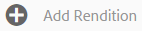
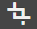
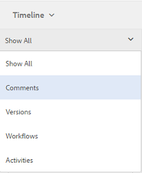

# 디지털 자산 관리 {#managing-assets-with-the-touch-optimized-ui}

AEM Assets의 터치에 적합한 사용자 인터페이스를 사용하여 수행할 수 있는 다양한 에셋 관리 및 편집 작업에 대해 알아봅니다.

이 문서에서는 Adobe Experience Manager(AEM) 자산 터치에 적합한 사용자 인터페이스를 사용하여 자산을 관리하고 편집하는 방법에 대해 설명합니다. 사용자 인터페이스에 대한 기본적인 정보는 터치 UI [의 기본 처리를 참조하십시오](/help/sites-authoring/basic-handling.md). 컨텐츠 조각을 관리하려면 컨텐츠 조각 [자산 관리를](content-fragments-managing.md) 참조하십시오.

## 폴더 만들기 {#create-folders}

모든 이미지 등 자산 컬렉션을 구성할 때 폴더를 만들어 함께 유지할 수 `Nature` 있습니다. 폴더를 사용하여 자산을 분류하고 구성할 수 있습니다. AEM Assets은 보다 효과적으로 작업하기 위해 폴더에서 자산을 구성할 필요가 없습니다.

>[!NOTE]
>
>* Marketing Cloud에 공유할 때는 해당 유형의 자산 폴더 `sling:OrderedFolder` 를 공유할 수 없습니다. 폴더를 공유하려면 폴더를 만들 때 [순서가 지정됨]을 선택하지 마십시오.
>* Experience Manager에서는 폴더 이름으로 `subassets` 단어를 사용할 수 없습니다. 복합 자산에 대한 하위 자산을 포함하는 노드에 예약된 키워드입니다.

1. 새 폴더를 만들 디지털 자산 폴더의 위치로 이동합니다.
1. 메뉴에서 만들기를 **[!UICONTROL 클릭합니다]**. [새 **[!UICONTROL 폴더]를 선택합니다]**.
1. [ **[!UICONTROL 제목]** ] 필드에 폴더 이름을 입력합니다. 기본적으로 DAM은 폴더 이름으로 제공한 제목을 사용합니다. 폴더가 만들어지면 기본값을 무시하고 다른 폴더 이름을 지정할 수 있습니다.
1. **[!UICONTROL 만들기]**&#x200B;를 클릭합니다. 디지털 자산 폴더에 폴더가 표시됩니다.

다음(공백으로 구분된 목록) 문자는 지원되지 않습니다.

* 자산 파일 이름에  `* / : [ \ \ ] | # % { } ? &`
* 에셋 폴더 이름은 포함할 수 없습니다.  `* / : [ \ \ ] | # % { } ? \" . ^ ; + & \t`

## Upload assets {#uploading-assets}

로컬 폴더 또는 네트워크 드라이브에서 AEM Assets으로 다양한 유형의 에셋(이미지, PDF 파일, RAW 파일 등)을 업로드할 수 있습니다.

>[!NOTE]
>
>다이내믹 미디어 - Scene7 모드에서는 파일 크기가 2GB 이하인 자산만 업로드할 수 있습니다.

처리 프로필이 폴더에 지정되거나 할당되지 않은 폴더에 자산을 업로드하도록 선택할 수 있습니다.

처리 프로필이 할당된 폴더의 경우 카드 보기의 축소판에 프로필 이름이 나타납니다. 목록 보기에서 프로필 이름이 처리 프로필 **[!UICONTROL 열에]** 나타납니다. 처리 [프로필을 참조하십시오](processing-profiles.md).

자산을 업로드하기 전에 [지원되는 형식인지 확인하십시오](assets-formats.md).

**자산을 업로드하려면**:

1. 자산 웹 인터페이스에서 디지털 자산을 추가할 위치로 이동합니다.
1. 자산을 업로드하려면 다음 중 하나를 수행합니다.

   * 도구 모음에서 **[!UICONTROL 만들기]** 아이콘을 누릅니다. 그런 다음 메뉴에서 **[!UICONTROL 파일을 누릅니다]**. 필요한 경우 표시된 대화 상자에서 파일의 이름을 변경할 수 있습니다.
   * HTML5를 지원하는 브라우저에서 자산을 인터페이스에서 바로 드래그합니다. 파일 이름 바꾸기 대화 상자가 표시되지 않습니다.

   

   여러 파일을 선택하려면 Ctrl/Command 키를 누르고 파일 선택기 대화 상자에서 자산을 선택합니다. iPad에서 한 번에 하나의 파일만 선택할 수 있습니다.

   큰 자산(500MB 이상)의 업로드를 일시 중지하고 나중에 동일한 페이지에서 다시 시작할 수 있습니다. 업로드가 시작될 때 **[!UICONTROL 나타나는 진행률 표시줄 옆에 있는 일시]** 중지 아이콘을 누릅니다.

   

   자산이 큰 자산으로 간주되는 크기를 구성할 수 있습니다. 예를 들어 1000MB 이상의 자산(500MB 대신)을 큰 자산으로 간주하도록 시스템을 구성할 수 있습니다. 이 경우 크기가 1000MB보다 큰 에셋이 업로드되면 진행률 표시줄의 **[!UICONTROL 일시]** 중지 버튼이 나타납니다.

   1000MB보다 큰 파일이 1000MB보다 작은 파일로 업로드되면 **[!UICONTROL 일시 중지]** 단추가 표시되지 않습니다. 그러나 1,000MB 미만의 파일 업로드를 취소하면 [일시 **[!UICONTROL 중지]** ] 단추가 나타납니다.

   크기 제한을 수정하려면 CRX 저장소의 `chunkUploadMinFileSize` 노드 `fileupload`속성을 구성합니다.

   [일시 정지] **** 아이콘을 클릭하면 **[!UICONTROL 재생]** 아이콘으로전환됩니다. 업로드를 다시 시작하려면 **[!UICONTROL 재생]** 아이콘을 클릭합니다.

   

   진행 중인 업로드를 취소하려면 진행률 표시줄 옆에 있는 `X` 단추를 클릭합니다. 업로드 작업을 취소하면 AEM Assets에서 자산의 부분적으로 업로드된 부분을 삭제합니다.

   업로드를 다시 시작하는 기능은 큰 자산을 업로드하는 데 시간이 오래 걸리는 저대역폭 시나리오 및 네트워크 결함 시 특히 유용합니다. 업로드 작업을 일시 중지하고 상황이 개선되면 나중에 계속할 수 있습니다. 다시 시작하면 업로드가 일시 중지된 지점부터 시작됩니다.

   업로드 작업 동안 AEM은 업로드되는 자산의 일부를 CRX 저장소에 데이터 청크로 저장합니다. 업로드가 완료되면 AEM은 이러한 청크를 저장소의 단일 데이터 블록으로 통합합니다.

   완료되지 않은 청크 업로드 작업에 대한 정리 작업을 구성하려면 로 이동하십시오 `https://[aem_server]:[port]/system/console/configMgr/org.apache.sling.servlets.post.impl.helper.ChunkCleanUpTask`.

   자산을 업로드하고 있는 위치에서 이미 사용할 수 있는 자산의 이름과 동일한 이름의 자산을 업로드하면 경고 대화 상자가 표시됩니다.

   기존 자산을 교체하거나, 다른 버전을 만들거나, 업로드된 새 자산의 이름을 변경하여 두 자산을 모두 유지하도록 선택할 수 있습니다. 기존 자산을 대체할 경우, 자산의 메타데이터와 이전 수정 및 기록(예: 주석, 자르기 등)이 삭제됩니다. 두 자산을 모두 유지하려면 새 자산의 이름이 바뀝니다.

   

   >[!NOTE]
   >
   >이름 충돌 **[!UICONTROL 대화]** 상자 **[!UICONTROL 에서 바꾸기를]** 선택하면 새 자산에 대해 자산 ID가 다시 생성됩니다. 이 ID는 이전 자산의 ID와 다릅니다.
   >
   >자산 **[!UICONTROL 인사이트]** 가 Adobe Analytics에서 노출/클릭 수를 추적하도록 활성화된 경우 재생성된 자산 ID는 Adobe Analytics에서 자산에 대해 캡처된 데이터를 무효화합니다.

   업로드한 자산이 AEM Assets에 있는 경우, 중복 **[!UICONTROL 검색]** 대화 상자에서 중복 자산을 업로드하려고 한다는 경고를 표시합니다. 대화 상자는 기존 자산의 바이너리의 SHA 1 체크섬 값이 업로드하는 자산의 체크섬 값과 일치하는 경우에만 나타납니다. 이 경우 자산의 이름은 중요하지 않습니다. 즉, 바이너리에 대한 SHA 1 값이 동일한 경우 이름이 다른 자산에 대해서도 대화 상자가 나타날 수 있습니다.

   >[!NOTE]
   >
   >중복 **[!UICONTROL 검색]** 대화 상자는 **[!UICONTROL 중복 검색 기능이 활성화된 경우에만]** 나타납니다. 중복 **[!UICONTROL 감지 기능을]** 활성화하려면 복제 감지 [활성화를 참조하십시오](duplicate-detection.md).

   

   AEM Assets **[!UICONTROL 에서]** 중복 자산을 유지하려면 유지를 누릅니다. 삭제 **[!UICONTROL 를]** 눌러 업로드한 중복된 자산을 삭제합니다.

   AEM Assets을 사용하면 파일 이름에 금지된 문자가 포함된 에셋을 업로드할 수 없습니다. 허용되지 않은 문자가 포함된 자산을 업로드하려고 하면, AEM Assets은 파일 이름에 금지된 문자가 있는 것에 대한 경고 메시지를 표시하고 이러한 문자를 제거하거나 허용되는 이름으로 업로드할 때까지 업로드를 중지합니다.

   조직의 특정 파일 이름 지정 규칙에 맞추기 위해 자산 **[!UICONTROL 업로드]** 대화 상자를 사용하면 업로드하는 파일의 긴 이름을 지정할 수 있습니다.

   

   그러나 다음(공백으로 구분된 목록) 문자는 지원되지 않습니다.
   * 자산 파일 이름에  `* / : [ \ \ ] | # % { } ? &`
   * 에셋 폴더 이름은 포함할 수 없습니다.  `* / : [ \ \ ] | # % { } ? \" . ^ ; + & \t`

   또한 자산 인터페이스에는 업로드한 가장 최근 자산이나 모든 보기(**[!UICONTROL 카드 보기]**, **[!UICONTROL 목록 보기]**&#x200B;및 **[!UICONTROL 열 보기]**)에서 처음 만드는 폴더가 표시됩니다.

   종종 대규모 자산이나 여러 자산을 동시에 업로드하는 동안 시각적 지표를 사용하여 진행 상황을 평가할 수 있습니다. [ **[!UICONTROL 업로드 진행]** ] 대화 상자에는 업로드된 파일의 수와 업로드하지 못한 파일의 수가 표시됩니다.

   

   파일이 업로드되기 전에 업로드 작업을 취소하면, AEM Assets에서 현재 파일 업로드를 중지하고 콘텐트를 새로 고칩니다. 하지만 이미 업로드된 파일은 삭제되지 않습니다.

### 직렬 업로드 {#serial-uploads}

대량의 자산을 업로드하면 상당한 시스템 리소스가 소비되므로 AEM 배포 성능에 부정적인 영향을 줄 수 있습니다. 잠재적인 병목 현상은 인터넷 연결, 디스크에 대한 읽기-쓰기 작업, 동시 에셋 업로드 시 POST 요청 수에 대한 웹 브라우저 제한 사항이 될 수 있습니다. 일괄 업로드 작업은 실패하거나 너무 빨리 종료할 수 있습니다. 즉, AEM 에셋은 여러 파일을 인제스트하는 동안 일부 파일을 놓칠 수 있으며 파일을 모두 인제스트하지 못할 수 있습니다.

이러한 상황을 극복하기 위해 AEM Assets은 일괄 업로드 작업 중에 모든 자산을 동시에 인제스트하는 대신 한 번에 하나의 자산을 인제스트합니다(시리얼 업로드).

자산의 직렬 업로드는 기본적으로 활성화되어 있습니다. 이 기능을 비활성화하고 동시 업로드를 허용하려면 CRXDe `fileupload` 의 노드를 오버레이하고 속성 값을 로 `parallelUploads` 설정합니다 `true`.

### FTP를 사용하여 자산 업로드 {#uploading-assets-using-ftp}

Dynamic Media를 사용하면 FTP 서버를 통해 자산을 일괄 업로드할 수 있습니다. 큰 자산(>1GB)을 업로드하거나 전체 폴더 및 하위 폴더를 업로드하려면 FTP를 사용해야 합니다. FTP 업로드가 반복적으로 예약되도록 설정할 수도 있습니다.

>[!NOTE]
>
>다이내믹 미디어 - Scene7 모드에서는 파일 크기가 2GB 이하인 자산만 업로드할 수 있습니다.

>[!NOTE]
>
>다이내믹 미디어의 FTP를 통해 자산을 업로드하려면 - AEM 작성자에 대한 Scene7 모드 설치 기능 팩(FP) 18912를 참조하십시오. FP-18912에 액세스하고 FTP 계정 설정을 완료하려면 Adobe 고객 지원 센터에 문의하십시오. See [Installing feature pack 18912 for bulk asset migration](/help/assets/bulk-ingest-migrate.md).
>
>FTP를 사용하여 자산을 업로드하면 AEM에 지정된 업로드 설정이 무시됩니다. 대신 Dynamic Media Classic에 정의된 파일 처리 규칙이 사용됩니다.

**FTP를 사용하여 자산을 업로드하려면**

1. 원하는 FTP 클라이언트를 사용하여 프로비저닝 이메일에서 받은 FTP 사용자 이름과 암호를 사용하여 FTP 서버에 로그인합니다. FTP 클라이언트에서 FTP 서버에 파일 또는 폴더를 업로드합니다.
1. [프로비전 이메일에서 받은 자격 증명을 사용하여 Dynamic Media](https://www.adobe.com/marketing-cloud/experience-manager/scene7-login.html) Classic에 로그인합니다. 전역 탐색 막대에서 **[!UICONTROL 업로드를 누릅니다]**.

1. 업로드 **** 페이지의 왼쪽 위 모서리 근처에 있는 FTP **[!UICONTROL 사용]** 탭을 탭합니다.
1. 페이지 왼쪽에서 파일을 업로드할 FTP 폴더를 선택합니다.페이지 오른쪽에서 대상 폴더를 선택합니다.
1. 페이지의 오른쪽 아래 모서리 근처에 있는 **[!UICONTROL 작업 옵션을]** 누른 다음 선택한 폴더의 자산을 기준으로 원하는 옵션을 설정합니다.

   작업 [옵션 업로드를 참조하십시오](#upload-job-options).

   >[!NOTE]
   >
   >FTP를 통해 자산을 업로드하면 Dynamic Media Classic(Scene7)에서 설정한 업로드 작업 옵션이 AEM에 설정된 자산 처리 매개 변수보다 우선합니다.

1. [작업 옵션 **[!UICONTROL 업로드] 대화]** 상자의 오른쪽 아래에 있는 **[!UICONTROL 저장을 탭합니다]**.
1. 업로드 페이지의 오른쪽 아래 **[!UICONTROL 모서리에서 업로드]** **[!UICONTROL 를 탭합니다]**.

   업로드의 진행 상태를 보려면 전역 탐색 막대에서 **[!UICONTROL 작업을 누릅니다]**. [ **[!UICONTROL 작업]** ] 페이지에는 업로드 진행률이 표시됩니다. AEM에서 계속 작업하고 Dynamic Media Classic의 작업 페이지로 돌아가 진행 중인 작업을 검토할 수 있습니다.

   진행 중인 업로드 작업을 취소하려면 기간 **[!UICONTROL 시간]** 옆에 있는 **[!UICONTROL 취소를]** 누릅니다.

#### 업로드 작업 옵션 {#upload-job-options}

| 업로드 옵션 | 하위 옵션 | 설명 |
|---|---|---|
| 작업 이름 |  | 텍스트 필드에 미리 입력되는 기본 이름에는 사용자 입력 부분과 날짜 및 시간 스탬프가 포함됩니다. 이 업로드 작업에 기본 이름을 사용하거나 직접 만든 이름을 입력할 수 있습니다.  작업 및 기타 업로드 및 게시 작업은 작업 페이지에 기록되므로 작업 상태를 확인할 수 있습니다. |
| 업로드 후 게시 |  | 업로드한 자산을 자동으로 게시합니다. |
| 확장명에 상관없이 동일한 기본 자산 이름으로 모든 폴더에 덮어쓰기 |  | 업로드한 파일을 동일한 이름으로 대체하려면 이 옵션을 선택합니다. 이 옵션의 이름은 [응용 프로그램 설정] > [ **[!UICONTROL 일반 설정]** ] > [응용 프로그램 **[!UICONTROL 으로]** ] > [ **[!UICONTROL 이미지]** 덮어쓰기] ****&#x200B;의 설정에 따라 달라질 수 있습니다. |
| 업로드 시 ZIP 또는 TAR 파일 압축 해제 |  |  |
| 작업 옵션 |  | 작업 옵션 **[!UICONTROL 을 탭/클릭하여]** [ [!UICONTROL 업로드 작업 옵션] ] 대화 상자를 열고 전체 업로드 작업에 영향을 주는 옵션을 선택합니다. 이러한 옵션은 모든 파일 유형에 대해 동일합니다. 응용 프로그램 일반 설정 페이지에서 시작하는 파일을 업로드하기 위한 기본 옵션을 선택할 수 있습니다. 이 페이지를 열려면 [설정] **[!UICONTROL > [응용 프로그램]** 설정] **[!UICONTROL 을 선택합니다]**. 기본 **[!UICONTROL 업로드 옵션]** 단추를 눌러 [!UICONTROL 업로드 작업 옵션] 대화 상자를 엽니다. |
|  | 화이트보드 | [1회] 또는 [반복]을 선택합니다. 반복 작업을 설정하려면 일별, 주별, 월별 또는 사용자 지정 반복 옵션을 선택하여 FTP 업로드 작업이 반복될 시기를 지정합니다. 그런 다음 필요에 따라 예약 옵션을 지정합니다. |
|  | 하위 폴더 포함 | 업로드할 폴더 내의 모든 하위 폴더를 업로드합니다. 업로드한 폴더 및 하위 폴더의 이름은 AEM Assets에 자동으로 입력됩니다. |
|  | 자르기 옵션 | 이미지의 양쪽에서 수동으로 자르려면 [자르기] 메뉴를 선택하고 [수동]을 선택합니다. 그런 다음 이미지의 어느 쪽이나 각 쪽에서 자를 픽셀 수를 입력합니다. 이미지 파일의 ppi(인치당 픽셀) 설정에 따라 잘리는 이미지의 양이 달라집니다. 예를 들어 이미지가 150ppi로 표시되고 [위쪽], [오른쪽], [아래쪽] 및 [왼쪽] 텍스트 상자에 75를 입력하면 각 면에서 1/2인치 잘립니다.  이미지에서 흰색 공간 픽셀을 자동으로 자르려면 [자르기] 메뉴를 열고 [수동]을 선택한 다음 [위쪽], [오른쪽], [아래쪽] 및 [왼쪽] 필드에 픽셀 측정을 입력하여 양쪽에서 자를 수 있습니다. 자르기 메뉴에서 트리밍을 선택하고 다음 옵션을 선택할 수도 있습니다.  **트리밍 기준** <ul><li>**색상** - 색상 옵션을 선택합니다. 그런 다음 [모서리] 메뉴를 선택하고 자르려는 흰색 공간 색상을 가장 잘 나타내는 색상으로 이미지의 모서리를 선택합니다.</li><li>**투명도** - 투명도 옵션을 선택합니다.  **허용치** - 슬라이더를 드래그하여 0에서 1까지의 허용치를 지정합니다. 색상을 기반으로 트리밍하는 경우 이미지 모서리에서 선택한 색상과 정확히 일치하는 경우에만 픽셀을 자르도록 0을 지정합니다. 1에 가까운 숫자는 더 많은 색상 차이를 허용합니다. 투명도를 기반으로 트리밍하는 경우 픽셀이 투명한 경우에만 픽셀을 자르도록 0을 지정합니다. 1에 가깝게 있는 숫자는 더 많은 투명성을 허용합니다.</li></ul> 이러한 자르기 옵션은 원본을 훼손하지 않습니다. |
|  | 색상 프로파일 옵션 | 전달에 사용되는 최적화된 파일을 만들 때 색상 변환을 선택합니다.<ul><li>기본 색상 보존:이미지에 색상 공간 정보가 포함될 때마다 소스 이미지 색상을 유지 관리합니다.색상 변환은 없습니다. 현재 거의 모든 이미지에 적합한 색상 프로필이 이미 포함되어 있습니다. 그러나 CMYK 소스 이미지에 포함된 색상 프로필이 없으면 색상이 sRGB(표준 Red Green Blue) 색상 공간으로 변환됩니다. sRGB는 웹 페이지에 이미지를 표시하는 데 권장되는 색상 공간입니다.</li><li>원본 색상 공간 유지:이때 색상 변환 없이 원래 색상을 유지합니다. 포함된 색상 프로필이 없는 이미지의 경우 모든 색상 변환은 [게시] 설정에 구성된 기본 색상 프로필을 사용하여 수행됩니다. 이 옵션으로 만든 파일의 색상 프로필과 일치하지 않을 수 있습니다. 따라서 기본 색상 보존 옵션을 사용하는 것이 좋습니다.</li><li>[사용자 정의 시작] > [열기]  메뉴를 열어 [전환] 및 [색상 공간으로 변환]을 선택할 수 있습니다. 이 고급 옵션은 소스 파일에 포함된 모든 색상 정보를 무시합니다. 제출하는 모든 이미지에 잘못된 색상 프로파일 데이터가 있거나 누락된 경우 이 옵션을 선택합니다.</li></ul> |
|  | 이미지 편집 옵션 | 이미지의 클리핑 마스크를 유지하고 색상 프로파일을 선택할 수 있습니다.  업로드할 때 [이미지 편집 옵션 설정을 참조하십시오](#setting-image-editing-options-at-upload). |
|  | Postscript 옵션 | PostScript ® 파일 래스터화, 파일 자르기, 투명한 배경 유지, 해상도 선택, 색상 공간 선택 등의 작업을 할 수 있습니다.  PostScript [및 Illustrator 업로드 옵션 설정을 참조하십시오](#setting-postscript-and-illustrator-upload-options). |
|  | Photoshop 옵션 | Adobe® Photoshop® 파일에서 템플릿을 만들고, 레이어를 유지하고, 레이어 이름을 지정하는 방법을 지정하고, 텍스트를 추출하고, 이미지가 템플릿에 고정된 방식을 지정할 수 있습니다.  템플릿은 AEM에서 지원되지 않습니다.  Photoshop [업로드 옵션 설정을 참조하십시오](#setting-photoshop-upload-options). |
|  | PDF 옵션 | 파일 래스터화, 검색 단어 및 링크 추출, eCatalog 자동 생성, 해상도 설정, 색상 공간 선택 등의 작업을 수행할 수 있습니다.  eCatalogs는 AEM에서 지원되지 않습니다.   PDF [업로드 옵션 설정을 참조하십시오](#setting-pdf-upload-options). |
|  | Illustrator 옵션 | Adobe Illustrator® 파일을 래스터화하고 투명한 배경을 유지하며 해상도를 선택하고 색상 공간을 선택할 수 있습니다.  PostScript [및 Illustrator 업로드 옵션 설정을 참조하십시오](#setting-postscript-and-illustrator-upload-options). |
|  | EVideo 옵션 | 비디오 사전 설정을 선택하여 비디오 파일을 트랜스코딩할 수 있습니다.  eVideo [업로드 옵션 설정을 참조하십시오](#setting-evideo-upload-options). |
|  | 배치 집합 사전 설정 | 업로드된 파일에서 이미지 세트 또는 회전 집합을 만들려면 사용할 사전 설정에 대한 활성 열을 클릭합니다. 두 개 이상의 사전 설정을 선택할 수 있습니다. Dynamic Media Classic의 응용 프로그램 설정/배치 집합 사전 설정 페이지에서 사전 설정을 만듭니다.  일괄 [세트 사전 설정 만들기에 대한 자세한 내용은 일괄 세트 사전 설정 구성을](config-dms7.md#creating-batch-set-presets-to-auto-generate-image-sets-and-spin-sets) 참조하십시오.  업로드 시 [배치 집합 사전 설정 설정을 참조하십시오](#setting-batch-set-presets-at-upload). |

#### 업로드 시 이미지 편집 옵션 설정 {#setting-image-editing-options-at-upload}

AI, EPS 및 PSD 파일을 비롯한 이미지 파일을 업로드할 때 [작업 옵션 **[!UICONTROL 업로드] 대화 상자에서 다음 편집 작업을 수행할 수]** 있습니다.

* 이미지 가장자리에서 공백을 자릅니다(위 표에 설명 참조).
* 이미지 양쪽에서 수동으로 자르기(위 표의 설명 참조)
* 색상 프로파일을 선택합니다(위의 표에서 옵션 설명 참조).
* 클리핑 패스에서 마스크를 만듭니다.
* 선명한 마스크 옵션을 사용하여 이미지 선명하게 하기
* 녹아웃 배경

| 옵션 | 하위 옵션 | 설명 |
|---|---|---|
| 클리핑 패스에서 마스크 만들기 |  | 클리핑 패스 정보를 기반으로 이미지의 마스크를 만듭니다. 이 옵션은 클리핑 패스를 만든 이미지 편집 응용 프로그램으로 만든 이미지에 적용됩니다. |
| 언샵 마스크 |  | 최종 다운샘플링된 이미지에 대해 선명하게 하기 필터 효과를 세밀하게 조정하여 효과의 강도, 효과의 반경(픽셀 단위 측정) 및 무시되는 대비 임계값을 제어할 수 있습니다.  이 효과는 Photoshop의 언샵 마스크 필터와 동일한 옵션을 사용합니다. 이름에서 알 수 있듯이 Unsharp Mask는 선명하게 하기 필터입니다. 언샵 마스킹 아래에서 원하는 옵션을 설정합니다. 설정 옵션은 다음과 같습니다. |
|  | 양 | 가장자리 픽셀에 적용되는 대비의 양을 제어합니다.  효과의 강도로 생각해 보세요. 다이내믹 미디어의 언샵 마스크 값과 Adobe Photoshop의 금액 값 간의 주요 차이점은 Photoshop의 양 범위는 1%에서 500%입니다. 반면에 다이내믹 미디어에서는 값 범위가 0.0에서 5.0입니다. 5.0의 값은 Photoshop의 500%에 해당하는 대략적인 값입니다.0.9의 값은 90%와 같은 값입니다. |
|  | 반경 | 효과의 반경을 제어합니다. 값 범위는 0-250입니다.  이 효과는 이미지의 모든 픽셀에 대해 실행되며 모든 방향에서 모든 픽셀에서 바깥쪽으로 방사됩니다. 반경은 픽셀 단위로 측정됩니다. 예를 들어 2000 x 2000 픽셀 이미지 및 500 x 500 픽셀 이미지에 대해 유사한 선명하게 하기 효과를 얻으려면 2000 x 2000 픽셀 이미지에 2픽셀의 반경을 설정하고 500 x 500 픽셀 이미지에 1픽셀의 반경 값을 설정합니다. 픽셀이 더 많은 이미지에 더 큰 값이 사용됩니다. |
|  | 임계값 | 임계값은 언샵 마스크 필터를 적용할 때 무시되는 대비 범위입니다. 이 필터를 사용할 때 이미지에 &quot;노이즈&quot;가 발생하지 않도록 해야 합니다. 값 범위는 0-255이며, 회색 음영 이미지의 명도 단계 수입니다. 0=검정, 128=50% 회색, 255=white.  예를 들어 임계값 12는 약간의 변형을 무시하면 노이즈를 추가하지 않도록 피부 톤 밝기가 약간 변경되지만 속눈썹이 피부와 만나는 것과 같은 대합 영역에 가장자리 대비를 추가할 수 있습니다.  예를 들어, 누군가의 얼굴 사진이 있는 경우, 언샵 마스크는 눈썹과 피부가 명백한 대비를 만들기 위해 만나는 위치, 부드러운 피부 자체의 등과 같은 이미지의 대조적인 부분에 영향을 줍니다. 매끄러운 피부는 명도 값의 미묘한 변화를 보여줍니다. 임계값 값을 사용하지 않는 경우 필터는 피부 픽셀의 이러한 미묘한 변경을 강조합니다. 눈꺼풀 대비 선명도가 높아진 가운데 잡음이 심하고 바람직하지 않은 효과가 발생한다.  이 문제를 방지하기 위해 부드러운 스킨과 같이 대비를 크게 변경하지 않는 픽셀을 무시하도록 필터를 알려주는 임계값 값이 도입되었습니다.  앞서 나온 지퍼 그래픽에서 지퍼 옆에 있는 텍스처를 확인합니다. 임계값이 너무 낮아 노이즈를 억제할 수 없기 때문에 이미지 노이즈가 표시됩니다. |
|  | 단색 | Select to unsharp-mask image brightness (intensity).  각 색상 구성 요소를 개별적으로 언샵 마스크하려면 선택 취소합니다. |
| 녹아웃 배경 |  | 업로드할 때 이미지의 배경이 자동으로 제거됩니다. 이 기술은 특정 개체에 주의를 기울여서 복잡한 배경에서 두드러지게 하는 데 유용합니다. 녹아웃 배경 기능과 다음 하위 옵션을 활성화하거나 &quot;켜기&quot;하려면 선택합니다. |
|  | 코너 | 필수.  녹아웃할 배경색을 정의하는 데 사용되는 이미지의 모서리.  왼쪽 **위**, 왼쪽 **아래**, **오른쪽 위**&#x200B;또는 **오른쪽 아래**&#x200B;중에서 선택할 수 있습니다. |
|  | 채우기 방법 | 필수.  설정한 모서리 위치에서 픽셀 투명도를 제어합니다.  다음 채우기 방법 중에서 선택할 수 있습니다. <ul><li>**Flood 채우기** - 지정한 모퉁이와 일치하는 모든 픽셀을 투명하게 바꿉니다.</li><li>**픽셀** 일치 - 이미지의 위치에 관계없이 일치하는 모든 픽셀을 투명하게 바꿉니다.</li></ul> |
|  | 허용치 | 선택 사항입니다.  설정한 모서리 위치를 기반으로 픽셀 색상 일치에서 허용되는 변형 양을 제어합니다.  픽셀 색상을 정확하게 일치시키려면 0.0 값을 사용하거나 1.0 값을 사용하여 가장 큰 변화를 허용하십시오. |

#### PostScript 및 Illustrator 업로드 옵션 설정 {#setting-postscript-and-illustrator-upload-options}

EPS(PostScript) 또는 Illustrator(AI) 이미지 파일을 업로드할 때 다양한 방법으로 형식을 지정할 수 있습니다. 파일을 래스터화하고 투명한 배경을 유지하며 해상도를 선택하고 색상 공간을 선택할 수 있습니다. PostScript 및 Illustrator 파일 서식 옵션은 PostScript 옵션 및 Illustrator 옵션 아래의 업로드 작업 옵션 대화 상자에서 사용할 수 있습니다.

| 옵션 | 하위 옵션 | 설명 |
|---|---|---|
| 처리 중 |  | 파일의 벡터 그래픽을 **[!UICONTROL 비트맵]** 포맷으로 변환하려면 래스터화를 선택합니다. |
| 렌더링된 이미지에서 투명 배경 유지 |  | 파일의 백그라운드 투명도를 유지합니다. |
| 해상도 |  | 해상도 설정을 결정합니다. 이 설정은 파일에 인치당 표시되는 픽셀 수를 결정합니다. |
| 색상 공간 |  | 색상 공간 메뉴를 선택하고 다음 색상 공간 옵션 중에서 선택합니다. |
|  | 자동 감지 | 파일의 색상 공간을 유지합니다. |
|  | RGB로 강제 적용 | RGB 색상 공간으로 변환합니다. |
|  | CMYK로 강제 적용 | CMYK 색상 공간으로 변환합니다. |
|  | 회색 음영으로 강제 적용 | 회색 음영 색상 공간으로 변환합니다. |

#### Photoshop 업로드 옵션 설정 {#setting-photoshop-upload-options}

PSD(Photoshop 문서) 파일은 이미지 템플릿을 만드는 데 가장 많이 사용됩니다. PSD 파일을 업로드할 때 파일에서 자동으로 이미지 템플릿을 만들 수 있습니다(업로드 화면에서 템플릿 만들기 옵션 선택).

파일을 사용하여 템플릿을 만드는 경우 Dynamic Media는 레이어가 포함된 PSD 파일에서 여러 이미지를 만듭니다.각 레이어에 대해 하나의 이미지를 만듭니다.

Photoshop 업로드 옵션 **[!UICONTROL 과]** 함께 위에 설명된 **[!UICONTROL 자르기 옵션]**&#x200B;및 색상 프로파일 옵션을 사용합니다.

>[!NOTE]
>
>템플릿은 AEM에서 지원되지 않습니다.

| 옵션 | 하위 옵션 | 설명 |
|---|---|---|
| 레이어 유지 |  | PSD의 레이어(있는 경우)를 개별 에셋으로 리핑합니다. 에셋 레이어는 PSD와 연결되어 있습니다. 세부 사항 보기에서 PSD 파일을 열고 레이어 패널을 선택하여 볼 수 있습니다. |
| 템플릿 만들기 |  | PSD 파일의 레이어에서 템플릿을 만듭니다. |
| 텍스트 추출 |  | 사용자가 뷰어에서 텍스트를 검색할 수 있도록 텍스트를 추출합니다. |
| 레이어를 배경 크기로 확장 |  | 분리된 이미지 레이어의 크기를 배경 레이어의 크기로 확장합니다. |
| 레이어 이름 지정 |  | PSD 파일의 레이어는 개별 이미지로 업로드됩니다. |
|  | 레이어 이름 | PSD 파일에서 이미지 이름 뒤에 이름을 지정합니다. 예를 들어 원본 PSD 파일의 가격 태그라는 레이어는 가격 태그라는 이미지가 됩니다. 그러나 PSD 파일의 레이어 이름이 기본 Photoshop 레이어 이름(배경, 레이어 1, 레이어 2 등)인 경우 이미지는 기본 레이어 이름이 아니라 PSD 파일에서 레이어 번호의 이름을 따릅니다. |
|  | Photoshop 및 레이어 번호 | 원본 레이어 이름은 무시하고 PSD 파일에서 레이어 번호 뒤에 이미지 이름을 지정합니다. 이미지 이름은 Photoshop 파일 이름과 레이어 번호가 추가됩니다. 예를 들어 Spring Ad.psd라는 파일의 두 번째 레이어 이름은 Spring Ad_2입니다. 이 파일의 이름은 Spring Ad_2입니다. |
|  | Photoshop 및 레이어 이름 | PSD 파일 뒤에 레이어 이름이나 레이어 번호가 나오는 이미지 이름을 지정합니다. PSD 파일의 레이어 이름이 기본 Photoshop 레이어 이름인 경우 레이어 번호가 사용됩니다. 예를 들어 SpringAd라는 PSD 파일의 Price Tag라는 레이어는 Spring Ad_Price Tag입니다. 기본 이름이 Layer 2인 레이어를 Spring Ad_2라고 합니다. |
| 앵커 |  | PSD 파일에서 생성된 레이어로 구성된 컴포지션에서 생성된 템플릿에 이미지가 고정되는 방식을 지정합니다. 기본적으로 앵커는 가운데입니다. 가운데 앵커를 사용하면 교체 이미지의 종횡비에 관계없이 동일한 공간을 대체할 수 있는 이미지를 사용할 수 있습니다. 템플릿을 참조하고 매개 변수 대체를 사용할 때 이 이미지를 대체하는 다른 측면을 가진 이미지가 동일한 공간을 효과적으로 차지합니다. 애플리케이션에서 템플릿의 할당된 공간을 채우려면 대체 이미지가 필요한 경우 다른 설정으로 변경합니다. |

#### PDF 업로드 옵션 설정 {#setting-pdf-upload-options}

PDF 파일을 업로드할 때 다양한 방법으로 형식을 지정할 수 있습니다. 페이지를 자르고, 검색어를 추출하고, 인치당 픽셀 해상도를 입력하고, 색상 공간을 선택합니다. PDF 파일에는 트림 여백, 자르기 마크, 등록 마크 및 기타 프린터 표시가 포함되어 있습니다. PDF 파일을 업로드할 때 페이지 측면에서 이러한 표시를 자를 수 있습니다.

>[!NOTE]
>
>eCatalogs는 AEM에서 지원되지 않습니다.

다음 옵션 중에서 선택합니다.

| 옵션 | 하위 옵션 | 설명 |
|---|---|---|
| 처리 중 | 래스터화 | (기본값) PDF 파일의 페이지를 자르고 벡터 그래픽을 비트맵 이미지로 변환합니다. eCatalog를 만들려면 이 옵션을 선택합니다. |
| 추출 | 검색어 | eCatalog 뷰어에서 파일을 키워드로 검색할 수 있도록 PDF 파일에서 단어를 추출합니다. |
|  | 링크 | PDF 파일에서 링크를 추출하여 eCatalog 뷰어에서 사용되는 이미지 맵으로 변환합니다. |
| 여러 페이지 PDF에서 전자 카탈로그 자동 생성 |  | PDF 파일에서 eCatalog를 자동으로 만듭니다. eCatalog는 업로드한 PDF 파일의 이름을 따릅니다. 이 옵션은 업로드할 때 PDF 파일을 래스터화하는 경우에만 사용할 수 있습니다. |
| 해상도 |  | 해상도 설정을 결정합니다. 이 설정은 PDF 파일에서 인치당 표시되는 픽셀 수를 결정합니다. 기본값은 150입니다. |
| 색상 공간 |  | 색상 공간 메뉴를 선택하고 PDF 파일의 색상 공간을 선택합니다. 대부분의 PDF 파일에는 RGB와 CMYK 색상 이미지가 모두 포함되어 있습니다. 온라인 보기에서는 RGB 색상 공간을 사용하는 것이 더 좋습니다. |
|  | 자동으로 검색 | PDF 파일의 색상 공간을 유지합니다. |
|  | RGB로 강제 적용 | RGB 색상 공간으로 변환합니다. |
|  | CMYK로 강제 적용 | CMYK 색상 공간으로 변환합니다. |
|  | 회색 음영으로 강제 적용 | 회색 음영 색상 공간으로 변환합니다. |

#### eVideo 업로드 옵션 설정 {#setting-evideo-upload-options}

다양한 비디오 사전 설정 중에서 선택하여 비디오 파일을 트랜스코딩할 수 있습니다.

| 옵션 | 하위 옵션 | 설명 |
|---|---|---|
| 응용 비디오 |  | 모바일, 태블릿 및 데스크탑에 전달할 비디오를 제작하기 위해 종횡비를 지원하는 단일 인코딩 사전 설정 이 사전 설정으로 인코딩된 업로드된 소스 비디오는 고정된 높이로 설정됩니다. 그러나 너비는 비디오의 종횡비를 유지하도록 자동으로 조정됩니다.  응용 비디오 인코딩을 사용하는 것이 좋습니다. |
| 단일 인코딩 사전 설정 | 인코딩 사전 설정 정렬 | 이름 또는 크기를 선택하여 이름 또는 해상도별로 데스크탑, 모바일 및 태블릿 아래에 나열된 인코딩 사전 설정을 정렬합니다. |
|  | 데스크톱 | 데스크탑 컴퓨터에 스트리밍 또는 점진적 비디오 경험을 제공하기 위한 MP4 파일을 만듭니다.해상도 크기와 원하는 대상 데이터 속도로 종횡비를 하나 이상 선택하십시오. |
|  | 모바일 | iPhone 또는 Android 모바일 장치에 전달할 MP4 파일을 만듭니다.해상도 크기와 원하는 대상 데이터 속도로 종횡비를 하나 이상 선택하십시오. |
|  | 태블릿 | iPad 또는 Android 태블릿 장치에 전달할 MP4 파일을 만듭니다.해상도 크기와 원하는 대상 데이터 속도로 종횡비를 하나 이상 선택하십시오. |

#### 업로드 시 배치 집합 사전 설정 설정 {#setting-batch-set-presets-at-upload}

업로드된 이미지에서 이미지 세트 또는 회전 집합을 자동으로 만들려면 사용할 사전 **[!UICONTROL 설정에]** 대해 [활성] 열을 클릭합니다. 두 개 이상의 사전 설정을 선택할 수 있습니다.

일괄 [세트 사전 설정 만들기에 대한 자세한 내용은 일괄 세트 사전 설정 구성을](config-dms7.md#creating-batch-set-presets-to-auto-generate-image-sets-and-spin-sets) 참조하십시오.

### 스트리밍된 업로드 {#streamed-uploads}

많은 에셋을 업로드하면 AEM 서버에 대한 I/O 호출이 크게 증가하므로 업로드 효율성이 떨어지고 시간 초과도 발생할 수 있습니다. AEM Assets은 스트리밍된 에셋 업로드를 지원합니다. 스트리밍된 업로드는 업로드 작업 중에 서버의 임시 폴더에서 에셋을 보관하도록 한 후 저장소에 복사함으로써 디스크 입출력을 줄입니다. 대신 데이터가 저장소로 직접 전송됩니다. 이렇게 하면 대용량 에셋을 업로드할 시간과 제한 시간이 줄어듭니다. 기본적으로 AEM Assets에서 스트리밍된 업로드가 활성화됩니다.

3.1 미만의 servlet-api 버전이 있는 JEE 서버에서 실행되는 AEM에 대해 스트리밍 업로드를 사용할 수 없습니다.

### 에셋이 포함된 ZIP 아카이브 추출 {#extract-zip-archive-containing-assets}

지원되는 다른 자산처럼 ZIP 보관 파일을 업로드할 수 있습니다. 동일한 파일 이름 규칙이 ZIP 파일에 적용됩니다. AEM에서는 ZIP 아카이브를 DAM 위치에 추출할 수 있습니다.

한 번에 하나의 ZIP 아카이브를 선택하고 아카이브 **[!UICONTROL 추출을]**&#x200B;클릭한 다음 대상 폴더를 선택합니다. 충돌을 처리할 옵션을 선택합니다(있는 경우). ZIP 파일의 자산이 이미 대상 폴더에 있는 경우 다음 옵션 중 하나를 선택할 수 있습니다.추출 건너뛰기, 기존 파일 바꾸기, 이름을 변경하여 두 에셋을 모두 유지하거나 새 버전을 만듭니다.

추적이 완료되면 AEM에서 알림 영역에 알려줍니다. AEM에서 ZIP을 추출하는 동안 압축 풀기를 중단하지 않고 다시 작업을 시작할 수 있습니다.

이 기능의 일부 제한 사항은 다음과 같습니다.

* 대상에 같은 이름의 폴더가 있을 경우 ZIP 파일의 에셋이 기존 폴더에 추출됩니다.

* 압축을 취소하면 이미 추출된 에셋이 삭제되지 않습니다.

* 두 개의 ZIP 파일을 동시에 선택하여 추출할 수 없습니다. 한 번에 하나의 ZIP 보관만 추출할 수 있습니다.

## 에셋 미리 보기 {#previewing-assets}

**자산을 미리 보려면**:

1. 자산 UI에서 미리 보려는 자산의 위치로 이동합니다.
1. 원하는 자산을 눌러 엽니다.

1. 미리 보기 모드에서는 [지원되는 이미지 유형](assets-formats.md#supported-raster-image-formats) (대화형 편집 포함)에 대해 확대/축소 옵션을 사용할 수 있습니다.

   자산을 확대하려면 **[!UICONTROL +]** (또는 자산의 돋보기를 탭합니다)를 누릅니다. 축소하려면 을 **[!UICONTROL 누릅니다]**. 확대하면 패닝하여 이미지의 모든 영역을 자세히 볼 수 있습니다. 확대/축소 **[!UICONTROL 재설정]** 화살표로 원래 보기로 돌아갑니다.

   

   [ **[!UICONTROL 재설정]** ] 단추를 눌러 보기를 원래 크기로 재설정합니다.

   

>[!MORELIKETHIS]
>
>* [다이내믹 미디어 자산 미리 보기를 참조하십시오](/help/assets/previewing-assets.md).
>* [하위 자산 보기](managing-linked-subassets.md#viewing-subassets).

## 속성 편집 {#editing-properties}

1. 편집할 메타데이터가 있는 자산의 위치로 이동합니다.

1. 자산을 선택하고 도구 모음에서 **[!UICONTROL 속성]** 을 탭하여 자산 속성을 봅니다. 또는 자산 카드에서 **[!UICONTROL 속성]** 빠른 작업을 선택합니다.

   

1. 속성 **[!UICONTROL 페이지에서]** 다양한 탭에서 메타데이터 속성을 편집합니다. 예를 들어 **[!UICONTROL 기본]** 탭 아래에서 제목, 설명 등을 편집합니다.

   속성 **[!UICONTROL 페이지]** 및 사용 가능한 메타데이터 속성은 기본 메타데이터 스키마에 따라 다릅니다. 속성 페이지의 레이아웃을 수정하는 방법에 대해 **[!UICONTROL 알려면]** [메타데이터 스키마를](metadata-schemas.md)참조하십시오.

1. 자산의 활성화를 위해 특정 날짜/시간을 예약하려면 설정 시간 필드 옆에 있는 날짜 **[!UICONTROL 선택기를]** 사용하십시오.

   

1. 특정 기간 후에 자산을 비활성화하려면 해제 시간 필드 옆에 있는 날짜 선택기에서 비활성화 날짜 및 시간을 **[!UICONTROL 선택합니다]** .

   비활성화 날짜는 자산의 활성화 날짜보다 나아야 합니다. 해제 [!UICONTROL 시간]후에는 자산 웹 인터페이스 또는 HTTP API를 통해 자산 및 해당 변환을 사용할 수 없습니다.

   

1. [ **[!UICONTROL 태그]** ] 필드에서 하나 이상의 태그를 선택합니다. 사용자 지정 태그를 추가하려면 상자에 태그 이름을 입력하고 Enter 키를 **[!UICONTROL 누릅니다]**. 새 태그가 AEM에 저장됩니다.

   YouTube를 게시하려면 태그가 필요하며 YouTube에 대한 링크가 있어야 합니다(적절한 링크를 찾을 수 있는 경우).
태그를 만들려면 CRX 저장소 `/content/cq:tags/default` 에서 쓰기 권한이 필요합니다.

1. 자산에 등급을 제공하려면 **[!UICONTROL 고급]** 탭을 누른 다음 적절한 위치에서 별을 탭하여 원하는 등급을 지정합니다.

   

   자산에 할당하는 등급 점수는 [등급] 아래에 **[!UICONTROL 표시됩니다]**. 자산을 평가한 사용자로부터 자산이 받은 평균 등급 점수가 **[!UICONTROL 등급 아래에 표시됩니다]**. 또한 평균 등급 점수에 기여하는 평점 점수가 **[!UICONTROL 등급 분류에서 표시됩니다]**. 평균 등급 점수를 기준으로 자산을 검색할 수 있습니다.

1. 자산에 대한 사용량 통계를 보려면 인사이트 **[!UICONTROL 탭을]** 누릅니다.

   사용 통계에는 다음이 포함됩니다.

   * 자산을 보거나 다운로드한 횟수입니다.
   * 자산이 사용된 채널/장치.
   * 자산이 최근 사용된 크리에이티브 솔루션.

   자세한 내용은 자산 [인사이트를 참조하십시오](touch-ui-asset-insights.md).

1. 저장 **[!UICONTROL 및 닫기를 누릅니다]**.
1. 자산 UI로 이동합니다. 제목, 설명, 등급 등을 비롯한 편집된 메타데이터 속성이 카드 보기의 자산 카드 및 목록 보기의 관련 열 아래에 표시됩니다.

## 자산 복사 {#copying-assets}

자산이나 폴더를 복사할 때 전체 자산이나 폴더가 컨텐츠 구조와 함께 복사됩니다. 복사된 자산 또는 폴더는 대상 위치에 복제됩니다. 원본 위치의 자산은 변경되지 않습니다.

자산의 특정 사본에 고유한 몇 가지 속성은 전달되지 않습니다. 몇 가지 예는 다음과 같습니다.

* 자산 ID, 작성 날짜 및 시간, 버전 및 버전 내역. 이러한 속성 중 일부는 속성, `jcr:uuid`및 `jcr:created`으로 표시됩니다 `cq:name`.

* 제작 시간 및 참조된 경로는 각 자산과 각 자산에 대해 고유합니다.

다른 속성과 메타데이터 정보는 그대로 유지됩니다. 자산을 복사할 때 부분 복사본이 만들어지지 않습니다.

1. 자산 UI에서 하나 이상의 자산을 선택한 다음 도구 모음에서 **[!UICONTROL 복사]** 아이콘을 누릅니다. 또는 자산 카드에서 **[!UICONTROL 빠른]** 작업 복사를 선택합니다.

   

   >[!NOTE]
   >
   >빠른 **[!UICONTROL 복사]** 작업을 사용하는 경우 한 번에 하나의 자산만 복사할 수 있습니다.

1. 자산을 복사할 위치로 이동합니다.

   >[!NOTE]
   >
   >동일한 위치에서 자산을 복사하면 AEM은 변형된 이름을 자동으로 생성합니다. 예를 들어 정사각형이라는 이름의 자산을 복사하면 AEM에서 자동으로 사본의 제목을 Square1로 생성합니다.

1. 도구 모음에서 **[!UICONTROL 자산 붙여넣기]** 아이콘을 누릅니다.

   

   자산이 이 위치에 복사됩니다.

   >[!NOTE]
   >
   >붙여넣기 **** 아이콘은 붙여넣기 작업이 완료될 때까지 도구 모음에서 사용할 수 있습니다.

### 자산 이동 또는 이름 바꾸기 {#moving-or-renaming-assets}

자산(또는 폴더)을 다른 위치로 이동할 때 자산을 복사하는 동안 자산(또는 폴더)이 중복되지 않습니다. 자산(또는 폴더)은 대상 위치에 배치되고 소스 위치에서 제거됩니다. 자산을 새 위치로 이동할 때 자산의 이름을 바꿀 수도 있습니다. 게시된 자산을 다른 위치로 이동하는 경우 자산을 다시 게시할 수 있는 옵션이 있습니다. 게시된 자산에 대한 기본적으로 이동 작업은 자동으로 게시 취소됩니다. 자산을 이동할 때 작성자가 [!UICONTROL 다시 게시] 옵션을 선택하면 이동된 자산이 다시 게시됩니다.

자산 또는 폴더를 이동하려면

1. 이동할 자산의 위치로 이동합니다.

1. 자산을 선택하고 도구 모음에서 **[!UICONTROL 이동]** 아이콘을 누릅니다.

   

1. 자산 **[!UICONTROL 이동]** 마법사에서 다음 중 하나를 수행합니다.

   * 자산을 이동한 후 자산의 이름을 지정합니다. 그런 다음 **[!UICONTROL 다음]** 을 눌러 진행합니다.
   * 취소를 **[!UICONTROL 눌러]** 프로세스를 중지합니다.

   >[!NOTE]
   >
   >새 위치에 해당 이름의 자산이 없는 경우 자산에 대해 동일한 이름을 지정할 수 있습니다. 하지만 자산을 같은 이름의 자산이 있는 위치로 이동하는 경우 다른 이름을 사용해야 합니다. 같은 이름을 사용하면 변형된 이름이 자동으로 생성됩니다. 예를 들어 자산의 이름이 Square인 경우 시스템에서는 해당 사본에 대해 Square1이라는 이름을 생성합니다.

   >[!NOTE]
   >
   >다음(공백으로 구분된 목록) 문자는 지원되지 않습니다.
   >* 자산 파일 이름에  `* / : [ \ \ ] | # % { } ? &`
   >* 에셋 폴더 이름은 포함할 수 없습니다.  `* / : [ \ \ ] | # % { } ? \" . ^ ; + & \t`

1. 대상 **[!UICONTROL 선택]** 페이지에서 다음 중 하나를 수행합니다.

   * Navigate to the new location for the assets, and then tap **[!UICONTROL Next]** to proceed.
   * 뒤로를 **[!UICONTROL 눌러]** 이름 변경 **[!UICONTROL 페이지로]** 돌아갑니다.

1. 이동하는 자산에 참조 페이지, 자산 또는 컬렉션이 있으면 대상 선택 탭 옆에 참조 **[!UICONTROL 조정]** 탭이 **[!UICONTROL 나타납니다]** .

   참조 **[!UICONTROL 조정 페이지에서 다음 중 하나를]** 수행합니다.

   * 새 세부 사항을 기준으로 조정할 참조를 지정한 다음 이동을 **[!UICONTROL 눌러]** 진행합니다.
   * [ **[!UICONTROL 조정]** ] 열에서 자산에 대한 참조를 선택하거나 선택 취소합니다.
   * 뒤로 **[!UICONTROL 를]** 눌러 **[!UICONTROL 대상]** 선택 페이지로 돌아갑니다.
   * 취소 **[!UICONTROL 를]** 눌러 이동 작업을 중지합니다.

   참조를 업데이트하지 않으면 자산의 이전 경로를 계속 가리킵니다. 참조를 조정하면 새 자산 경로로 업데이트됩니다.

### 드래그 작업을 사용하여 에셋 이동 {#move-using-drag}

사용자 인터페이스에서 [이동] [!UICONTROL 옵션을 사용하는 대신 자산을 대상 위치로 드래그하여 동위 폴더] (또는 폴더)로 이동할 수 있습니다. 하지만 이 작업은 목록 보기에서만 가능합니다.

자산을 드래그하여 이동하는 경우 자산 [!UICONTROL 이동] 마법사가 열리지 않으므로 이동하는 동안 자산 이름을 변경할 수 있는 옵션이 표시되지 않습니다. 게다가, 이미 게시된 자산은 사용자의 재게시 승인을 요청하지 않고 드래그하여 이동하는 방식으로 다시 게시됩니다.

## 변환 관리 {#managing-renditions}

1. 원본을 제외한 자산에 대한 변환을 추가하거나 제거할 수 있습니다. 표현물을 추가하거나 제거하려는 자산의 위치로 이동합니다.

1. 자산을 눌러 자산 페이지를 엽니다.

   

1. 글로벌 **[!UICONTROL 탐색]** 아이콘을 누르고 목록에서 **[!UICONTROL 표현물]** 을 선택합니다.

   

1. 표현물 **** 패널에서 자산에 대해 생성된 표현물 목록을 봅니다.

   

   >[!NOTE]
   >
   >기본적으로 AEM Assets은 자산의 원본 변환을 미리 보기 모드에 표시하지 않습니다. 관리자는 오버레이를 사용하여 미리 보기 모드에서 원본 표현물을 표시하도록 AEM Assets을 구성할 수 있습니다.

1. 변환을 보거나 삭제하려면 변환을 선택합니다.

   **변환 삭제**

   [변환] 패널에서 **[!UICONTROL 변환을]** 선택한 다음 **[!UICONTROL 도구 모음에서]** 변환 [삭제 아이콘을](/help/sites-authoring/basic-handling.md)누릅니다. 자산 처리가 완료된 후에는 변환을 일괄 삭제할 수 없습니다. 개별 자산의 경우 사용자 인터페이스에서 변환을 수동으로 제거할 수 있습니다. 여러 자산의 경우 Experience Manager을 사용자 지정하여 특정 표현물을 삭제하거나 자산을 삭제하고 삭제된 자산을 다시 업로드할 수 있습니다.

   

   **새 변환 업로드**

   자산에 대한 자산 세부 사항 페이지로 이동하고 도구 모음에서 **[!UICONTROL 변환]** 추가 아이콘을 눌러 자산에 대한 새 변환을 업로드합니다.

   

   >[!NOTE]
   >
   >표현물 패널에서 변환을 선택하면 **[!UICONTROL 도구 모음이]** 컨텍스트를 변경하고 표현물과 관련된 작업만 표시합니다. 변환 **[!UICONTROL 업로드]** 아이콘과 같은 옵션은 표시되지 않습니다. 도구 모음에서 이러한 옵션을 보려면 자산의 세부 사항 페이지로 이동합니다.

   이미지나 비디오 자산의 세부 정보 페이지에 표시할 변환의 크기를 구성할 수 있습니다. 지정한 차원에 따라 Facebook은 정확한 크기 또는 가장 가까운 크기로 표현물을 표시합니다.

   이미지의 변환 크기를 자산 세부 사항 수준에서 구성하려면 **[!UICONTROL 변환선택기]** 노드를 `libs/dam/gui/content/assets/assetpage/jcr:content/body/content/content/items/assetdetail/items/col1/items/assetview/renditionpicker` 오버레이하고 width 속성의 값을 구성합니다. 속성 **[!UICONTROL 크기(길이)를 너비 대신]** KB로 구성하여 이미지 크기에 따라 자산 세부 사항 페이지의 변환을 사용자 정의합니다. 크기 기반 맞춤화의 경우, **[!UICONTROL preferOriginal]** 속성은 일치하는 변환의 크기가 원본보다 큰 경우 원본에 환경 설정을 지정합니다.

   마찬가지로 오버레이하여 주석 **[!UICONTROL 페이지]** 이미지를 사용자 정의할 수 있습니다 `libs/dam/gui/content/assets/annotate/jcr:content/body/content/content/items/content/renditionpicker`.

   

   비디오 자산에 대한 변환 크기를 구성하려면 위치에 있는 CRX 저장소의 **[!UICONTROL videopicker]** 노드로 이동한 `/libs/dam/gui/content/assets/assetpage/jcr:content/body/content/content/items/assetdetail/items/col1/items/assetview/videopicker`후 해당 속성을 편집합니다.

   >[!NOTE]
   >
   >비디오 주석은 HTML5 호환 비디오 포맷이 있는 브라우저에서만 지원됩니다. 또한 브라우저에 따라 다른 비디오 포맷이 지원됩니다.

하위 자산에 대한 자세한 내용은 하위 자산 [관리를 참조하십시오](managing-linked-subassets.md).

## Delete assets {#deleting-assets}

다른 페이지에서 들어오는 참조를 해결하거나 제거하려면 자산을 삭제하기 전에 관련 참조를 업데이트하십시오.

또한 오버레이를 사용하여 강제 삭제 단추를 비활성화하여 사용자가 참조된 자산을 삭제하고 끊어진 링크를 남기지 못하도록 합니다.

자산을 삭제할 수 있으려면 dam/asset에 대한 삭제 권한이 필요합니다. 수정 권한만 있는 경우 자산 메타데이터만 편집하고 자산에 주석을 추가할 수 있습니다. 하지만 자산이나 해당 메타데이터를 삭제할 수는 없습니다.

**자산을 삭제하려면 다음을 수행하십시오**.

1. 삭제할 자산의 위치로 이동합니다.

1. 자산을 선택하고 도구 모음에서 **[!UICONTROL 삭제]** 아이콘을 누릅니다.

   

1. 확인 대화 상자에서 다음을 누릅니다.

   * **[!UICONTROL 작업을 중지하려면]** 취소
   * **[!UICONTROL 다음을 기준으로 작업을 확인하려면]** 삭제를 참조하십시오.

      * 자산에 참조가 없으면 자산이 삭제됩니다.
      * 자산에 참조가 있으면, 오류 메시지가 하나 **[!UICONTROL 이상의 자산이 참조되었다고]**&#x200B;알려줍니다. **[!UICONTROL 강제 삭제]**&#x200B;나 **[!UICONTROL 취소]**&#x200B;를 선택할 수 있습니다.

   >[!NOTE]
   >
   >다른 페이지에서 들어오는 참조를 해결하거나 제거하려면 자산을 삭제하기 전에 관련 참조를 업데이트하십시오.
   >
   >또한 오버레이를 사용하여 **[!UICONTROL 강제 삭제]** 단추를 비활성화하여 사용자가 참조된 자산을 삭제하지 않고 끊어진 링크를 남기도록 합니다.

## 자산 다운로드 {#downloading-assets}

See [Download assets from AEM](download-assets-from-aem.md)

## Publish assets {#publishing-assets}

처리 중인 자산을 게시하면 원래 컨텐츠만 게시됩니다. 변환이 없습니다. 처리가 완료될 때까지 기다렸다가 자산을 게시하거나 재게시하십시오.

게시할 폴더에 빈 폴더가 포함되어 있으면 빈 폴더가 게시되지 않습니다.

다이내믹 미디어에 대한 자세한 내용은 다이내믹 미디어 자산 [게시를 참조하십시오](publishing-dynamicmedia-assets.md).

**자산을 게시하려면**:

1. 게시할 자산/폴더의 위치로 이동합니다.

1. 자산 카드에서 **[!UICONTROL 빠른 게시]** 작업을 선택하거나 자산을 선택하고 도구 모음에서 **[!UICONTROL 빠른 게시]** 아이콘을누릅니다.
1. 자산이 다른 자산을 참조하는 경우 해당 참조가 마법사에 나열됩니다. 게시되었거나 게시 취소된 이후 게시 취소되거나 수정된 참조만 표시됩니다. 게시할 참조를 선택합니다.

   

1. 게시를 **[!UICONTROL 눌러]** 자산에 대한 활성화를 확인합니다.

## 자산 게시 취소 {#unpublishing-assets}

복잡한 자산을 게시 취소하는 동안 자산만 게시 취소합니다. 게시된 다른 자산에서 참조될 수 있으므로 참조 파일의 게시를 취소하지 마십시오.

**자산 게시를 취소하려면 다음을 수행합니다**.

1. 게시 환경에서 제거할 자산 또는 자산 폴더의 위치로 이동합니다(게시 취소).

1. 게시를 취소할 자산 또는 폴더를 선택하고 도구 모음에서 **[!UICONTROL 게시]** 관리 아이콘을 누릅니다.

   

1. 목록에서 **[!UICONTROL 게시]** 취소 작업을 선택합니다.

   

1. 나중에 자산을 게시 취소하려면 나중에 게시 **[!UICONTROL 취소]**&#x200B;를 선택한 다음 자산을 게시 취소할 날짜를 선택합니다.
1. 게시 환경에서 자산을 사용할 수 없는 날짜를 예약합니다.
1. 자산이 다른 자산을 참조하는 경우 게시 취소할 참조를 선택합니다. 게시 **[!UICONTROL 취소를 누릅니다]**.
1. 확인 대화 상자에서 다음 중 하나를 수행합니다.

   * 취소를 **[!UICONTROL 눌러]** 작업을 중지합니다
   * 게시 **[!UICONTROL 취소]** 를 눌러 지정된 날짜에 자산 게시 취소(더 이상 게시 환경에서 사용할 수 없음)가 되었는지 확인합니다.

## 닫힌 사용자 그룹 만들기 {#closed-user-group}

AEM에서 게시한 특정 자산 폴더에 대한 액세스를 제한하는 데 CUG(폐쇄된 사용자 그룹)가 사용됩니다. 폴더에 대한 CUG를 만드는 경우 폴더(폴더 자산 및 하위 폴더 포함)에 대한 액세스 권한은 할당된 구성원 또는 그룹으로만 제한됩니다. 폴더에 액세스하려면 보안 자격 증명을 사용하여 로그인해야 합니다.

CUG는 자산에 대한 액세스를 제한하는 별도의 방법입니다. 폴더에 대한 로그인 페이지를 구성할 수도 있습니다.

**닫힌 사용자 그룹을 만들려면 다음을 수행하십시오**.

1. 자산 UI에서 폴더를 선택하고 도구 모음에서 **[!UICONTROL 속성]** 아이콘을 눌러 속성 페이지를 표시합니다.
1. [ **[!UICONTROL 권한]** ] 탭에서 [폐쇄된 사용자 그룹] 아래에 **[!UICONTROL 구성원 또는 그룹을 추가합니다]**.

   

1. 사용자가 폴더에 액세스할 때 로그인 화면을 표시하려면 [사용] **[!UICONTROL 옵션을]** 선택합니다. 그런 다음 AEM에서 로그인 페이지의 경로를 선택하고 변경 내용을 저장합니다.

   

   로그인 페이지의 경로를 지정하지 않으면 AEM은 게시 인스턴스의 기본 로그인 페이지를 표시합니다.

1. 폴더를 게시한 다음 게시 인스턴스에서 액세스합니다. 로그인 화면이 표시됩니다.
1. CUG 멤버인 경우 보안 자격 증명을 입력합니다. AEM에서 사용자를 인증하면 폴더가 표시됩니다.

## 자산 검색 {#searching-assets}

기본 검색은 [검색 및 필터](/help/sites-authoring/search.md#search-and-filter) 섹션에 자세히 설명되어 있습니다. 검색 **[!UICONTROL 패널을]** 사용하여 자산, 태그 및 메타데이터를 검색할 수 있습니다. 와일드카드 별표를 사용하여 문자열의 일부를 검색할 수 있습니다. 또한 검색 패싯을 사용하여 **[!UICONTROL 검색]** 패널 [을 사용자 정의할 수 있습니다](search-facets.md).

최근에 업로드한 자산의 경우, Omnisearch 상자에 입력할 때 표시되는 제안 목록에서 해당 메타데이터(제목, 태그 등 포함)를 즉시 사용할 수 없습니다.

이것은 AEM Assets이 백그라운드 작업을 실행하기 전에 시간 제한 기간(기본적으로 1시간)이 만료될 때까지 기다렸다가 새로 업로드되거나 업데이트된 모든 자산에 대한 메타데이터를 색인화하고 이를 제안 목록에 추가하기 때문입니다.

## 빠른 작업 사용 {#quick-actions}

빠른 작업 아이콘은 한 번에 한 자산에 사용할 수 있습니다. 장치에 따라 다음 작업을 수행하여 빠른 작업 아이콘을 표시합니다.

* 터치 장치:길게 터치하세요. 예를 들어 iPad에서는 빠른 작업이 표시되도록 자산을 길게 탭할 수 있습니다.
* 비터치 장치:포인터를 가져갑니다. 예를 들어, 데스크톱 장치에서는 포인터를 에셋 축소판 위에 두면 빠른 작업 막대가 표시됩니다.

### 자산 탐색 및 선택 {#navigating-and-selecting-assets}

선택 아이콘을 사용하여 사용 가능한 보기(카드, 열, 목록)가 있는 자산을 보고, 탐색하고 **[!UICONTROL 선택할]** 수 있습니다. **[!UICONTROL 카드 보기에 빠른 작업으로 나타납니다]** .

목록 보기에서 **[!UICONTROL 선택]** 옵션은 목록의 자산/폴더 이름 앞에 마우스 아이콘을 가리키면 나타납니다.

목록 보기와 유사하게, **[!UICONTROL 선택]** 기능은 열 보기에서 자산 또는 폴더의 이름 앞에 마우스 아이콘을 가져가면 나타납니다.

자세한 내용은 리소스 [보기 및 선택을 참조하십시오](/help/sites-authoring/basic-handling.md#viewing-and-selecting-resources).

## 이미지 편집 {#editing-images}

AEM Assets 인터페이스의 편집 도구를 사용하여 이미지 자산에 대해 작은 편집 작업을 수행할 수 있습니다. 이미지의 다른 편집 작업을 자르거나 회전, 뒤집거나 수행할 수 있습니다. 이미지 맵을 자산에 추가할 수도 있습니다.

이미지 편집은 다음과 같은 형식의 파일에 대해 지원됩니다.

* BMP
* GIF
* PNG
* JPEG

일부 구성 요소의 경우 **[!UICONTROL 전체 화면]** 모드에는 추가 옵션을 사용할 수 있습니다.

TXT 파일을 편집하려면 Configuration Manager 내에서 **[!UICONTROL Day CQ Link Externalizer를]** 설정합니다.

이미지 편집기를 사용하여 이미지 맵을 추가할 수도 있습니다. 자세한 내용은 이미지 맵 [추가를 참조하십시오](image-maps.md).

**이미지를 편집하려면 다음을 수행하십시오**.

1. 편집 모드에서 자산을 열려면 다음 중 하나를 수행합니다.

   * 자산을 선택한 다음 도구 모음에서 **[!UICONTROL 편집]** 아이콘을 클릭합니다.
   * 카드 **[!UICONTROL 보기에서 자산에 표시되는 편집]** 옵션을 누릅니다.
   * 자산 페이지의 도구 모음에서 **[!UICONTROL 편집]** 아이콘을 누릅니다.

   

1. 이미지를 자르려면 자르기를 **[!UICONTROL 누릅니다]**.

   

1. 목록에서 원하는 옵션을 선택합니다. 자르기 영역은 선택한 옵션에 따라 이미지에 나타납니다. [ **[!UICONTROL 손]** 무료] 옵션을 사용하면 종횡비 제한 없이 이미지를 자를 수 있습니다.

   

1. 자를 영역을 선택하고 이미지에서 크기를 조정하거나 위치를 변경합니다.
1. 오른쪽 **[!UICONTROL 위 모서리에 있는 [마침]** ] 옵션을 사용하여 이미지를 자릅니다. 마침 **[!UICONTROL 을]** 탭하면 표현물의 재재생도 트리거됩니다.

   

1. 오른쪽 위에 있는 **[!UICONTROL 실행]** **[!UICONTROL 취소]** 및재실행아이콘을 사용하여 잘리지 않은 이미지로 되돌리거나 잘린 이미지를 각각 유지합니다.

   

1. 이미지를 시계 방향 또는 **[!UICONTROL 반시계 방향으로 회전하려면 해당]** 회전 아이콘을 누릅니다.

   

1. 이미지를 가로 또는 세로 **[!UICONTROL 로]** 뒤집으려면 적절한 뒤집기 아이콘을 누릅니다.

   

1. Tap the **[!UICONTROL Finish]** icon to save the changes.

   

## 타임라인 사용 {#timeline}

타임라인을 **[!UICONTROL 사용하면]** 자산, 주석, 주석, 활동 로그 및 버전에 대한 활성 워크플로우 등 선택한 항목에 대한 다양한 이벤트를 볼 수 있습니다.

컬렉션 [콘솔에서](managing-collections-touch-ui.md#navigating-the-collections-console)모두 **[!UICONTROL 표시]** 목록은 댓글 및 워크플로우만 볼 수 있는 옵션을 제공합니다. 또한 타임라인은 콘솔에 나열된 최상위 수준의 컬렉션에 대해서만 표시됩니다. 컬렉션 내에서 탐색하는 경우에는 표시되지 않습니다.

**[!UICONTROL 타임라인에는]** 컨텐츠 조각에만 [해당되는 몇 가지 옵션이 포함되어 있습니다](content-fragments-managing.md#timeline-for-content-fragments).이 기능을 사용하려면 [AEM 6.4 서비스 팩 2(6.4.2.0)](/help/release-notes/sp-release-notes.md) 이상이 필요합니다.

**타임라인을 사용하려면**:

1. 자산에 대한 자산 페이지를 열거나 자산 UI에서 선택합니다.
1. 전역 **[!UICONTROL 탐색]** 아이콘을 누르고 목록에서 **[타임라인을]** 선택합니다.

   

1. 표시되는 목록에서 모두 **[!UICONTROL 표시]** 목록을 사용하여 주석, 버전, 워크플로우 및 활동을 기준으로 결과를 필터링합니다.

   

## 주석 추가 {#annotating}

주석은 이미지나 비디오에 추가된 주석이나 설명 메모입니다. 주석을 통해 마케터는 공동 작업을 수행하고 에셋에 대한 피드백을 남길 수 있습니다.

비디오 주석은 HTML5 호환 비디오 포맷이 있는 브라우저에서만 지원됩니다. AEM Assets에서 지원하는 비디오 포맷은 브라우저에 따라 다릅니다.

컨텐츠 조각의 경우 [주석이 편집기에 생성됩니다](content-fragments-variations.md#annotating-a-content-fragment).이 기능을 사용하려면 [AEM 6.4 서비스 팩 2(6.4.2.0)](/help/release-notes/sp-release-notes.md) 이상이 필요합니다.

여러 개의 주석을 저장할 수 있습니다.

비디오 자산에 주석을 추가할 수 있습니다. 비디오에 주석을 추가하는 동안 플레이어는 프레임에 주석을 달 수 있도록 일시 중지됩니다. 자세한 내용은 비디오 자산 [관리를 참조하십시오](managing-video-assets.md).

컬렉션에 주석을 추가할 수도 있습니다. 그러나 컬렉션에 하위 컬렉션이 포함된 경우 상위 컬렉션에만 주석이나 주석을 추가할 수 있습니다. [ **[!UICONTROL 주석]** ] 옵션은 하위 컬렉션에 사용할 수 없습니다.

**주석을 추가하려면 다음을 수행하십시오**.

1. 주석을 추가할 자산의 위치로 이동합니다.
1. 다음 중 **[!UICONTROL 하나에서 주석]** 아이콘을 누릅니다.

   * [빠른 작업](managing-assets-touch-ui.md#quick-actions)
   * 자산을 선택하거나 자산 페이지로 이동한 후 도구 모음에서

   

1. 타임라인 아래쪽에 있는 **[!UICONTROL 주석]** 상자에 주석을 추가합니다. 또는, 이미지에서 영역을 마크업하고 주석 **[!UICONTROL 추가 대화 상자에서 주석을]** 추가합니다.

   

1. 주석에 대해 사용자에게 알리려면 사용자의 이메일 주소를 지정하고 주석을 추가합니다. 예를 들어 주석을 Aaron McDonald에게 알리려면 @aa를 입력합니다. 일치하는 모든 사용자에 대한 힌트가 목록에 표시됩니다. 목록에서 Aaron의 이메일 주소를 선택하여 주석에 태그를 지정합니다. 마찬가지로 주석 내 또는 그 전 또는 후에 더 많은 사용자에게 태그를 지정할 수 있습니다.

   >[!NOTE]
   >
   >관리자가 아닌 사용자의 경우 CRXDE에서 사용자에게 읽기 권한이 있는 경우에만 제안 `/home` 이 표시됩니다.

   

1. 주석을 추가한 후 **[!UICONTROL 추가를]** 눌러 저장합니다. 주석에 대한 알림이 Aaron에게 전송됩니다.

   

1. 닫기 **[!UICONTROL 를]** 눌러 주석 **[!UICONTROL 모드를]** 종료합니다.
1. 알림을 보려면 Aaron MacDonald의 자격 증명으로 AEM Assets에 로그인한 다음 **[!UICONTROL 알림]** 아이콘을 눌러 알림을 확인합니다.

1. 사용자 간에 다른 색상을 선택하려면 **[!UICONTROL 프로필]** 아이콘을 누르고 **[!UICONTROL 내 환경 설정을 누릅니다]**.

   

1. [주석 색상] 상자에서 원하는 **[!UICONTROL 색상을]** 지정한 다음 **[!UICONTROL 승인을]**&#x200B;누릅니다.

   

### 저장된 주석 보기 {#viewing-saved-annotations}

1. 자산에 대해 저장된 주석을 보려면 자산의 위치로 이동하고 자산의 자산 페이지를 엽니다.

1. 전역 **[!UICONTROL 탐색]** 아이콘을 누르고 목록에서 **[!UICONTROL 타임라인을]** 누릅니다.

   

1. 타임라인의 **[!UICONTROL 모두]** 표시 목록에서 **[!UICONTROL 주석을]** 기준으로 결과를 필터링하려면 주석을 선택합니다.

   

1. [ **[!UICONTROL 타임라인]** ] 패널에서 주석을 눌러 이미지에 해당하는 주석을 봅니다.

   

1. 삭제 **[!UICONTROL 를]** 눌러 특정 주석을 제거합니다.

### 주석 인쇄 {#printing-annotations}

자산에 주석이 있거나 검토 워크플로우가 있을 경우 오프라인 검토를 위해 주석 및 검토 상태와 함께 자산을 PDF 파일로 인쇄할 수 있습니다.

주석만 인쇄하거나 상태를 검토하도록 선택할 수도 있습니다.

긴 주석이 PDF 파일에서 제대로 렌더링되지 않을 수 있습니다. 렌더링을 최적화하려면 주석을 50단어로 제한하는 것이 좋습니다.

주석을 인쇄하고 상태를 검토하려면 **[!UICONTROL 인쇄]** 아이콘을 누르고 마법사의 지침을 따릅니다. 인쇄 **** 아이콘은 자산에 하나 이상의 주석 또는 검토 상태가 할당된 경우에만 도구 모음에 표시됩니다.

1. 자산 UI에서 자산의 미리 보기 페이지를 엽니다.
1. 다음 중 하나를 수행하십시오.

   * 모든 주석과 검토 상태를 인쇄하려면 4단계로 이동합니다.
   * 특정 주석을 인쇄하고 상태를 검토하려면 [타임라인을](managing-assets-touch-ui.md#timeline) 연 다음 3단계로 진행합니다.

1. 특정 주석을 인쇄하려면 **[!UICONTROL 타임라인에서 주석을 선택합니다]**.

   

   검토 상태만 인쇄하려면 **[!UICONTROL 타임라인에서 선택합니다]**.

   

1. 도구 모음에서 **[!UICONTROL 인쇄]** 아이콘을 누릅니다.

   

1. [ **[!UICONTROL 인쇄]** ] 대화 상자에서 PDF에 표시할 주석 또는 검토 상태의 위치를 선택합니다. 예를 들어 인쇄된 이미지가 포함된 페이지의 오른쪽 위에 주석 또는 상태를 인쇄하려면 왼쪽 **[!UICONTROL 위]** (기본값) 설정을 사용합니다.

   

   인쇄 PDF에 주석의 위치나 상태를 표시할 위치에 따라 다른 설정을 선택할 수 있습니다. 인쇄된 자산과 별개인 페이지에 주석이나 상태를 표시하려면 **[!UICONTROL 다음 페이지를 선택합니다]**.

1. 인쇄를 **[!UICONTROL 누릅니다]**. 2단계에서 선택한 옵션에 따라, 생성된 PDF에 지정된 위치에 주석이나 상태가 표시됩니다. 예를 들어 왼쪽 **[!UICONTROL 위]** 설정을 사용하여 주석과 검토 상태를 모두 인쇄하도록 선택하면 생성된 출력이 여기에 설명된 PDF 파일과 유사합니다.

   

1. 오른쪽 상단에 있는 옵션을 사용하여 PDF를 다운로드하거나 인쇄할 수 있습니다.

   

   >[!NOTE]
   >
   >자산에 하위 자산이 있는 경우 모든 하위 자산을 특정 페이지 기반 주석과 함께 인쇄할 수 있습니다.

   글꼴 색상, 크기 및 스타일, 주석과 상태에 대한 배경색 등 렌더링된 PDF 파일의 모양을 수정하려면 Configuration Manager에서 **[!UICONTROL 주석 PDF 구성]** 을 열고 **[!UICONTROL 원하는 옵션을]**&#x200B;수정합니다. 예를 들어, 승인된 상태의 표시 색상을 변경하려면 해당 필드에서 색상 코드를 수정합니다. 주석의 글꼴 색상 변경에 대한 자세한 내용은 주석 달기를 [참조하십시오](managing-assets-touch-ui.md#annotating).

   

   렌더링된 PDF 파일로 돌아가 새로 고칩니다. 새로 고친 PDF는 변경 사항을 반영합니다.

**외국어로 주석을 인쇄하려면 다음을 수행하십시오**.자산에 외국어(특히 라틴어가 아닌 언어)의 주석이 포함되어 있는 경우, 먼저 AEM 서버에서 이러한 주석을 인쇄할 수 있도록 CQ-DAM-Handler-Gibson Font Manager Service를 구성해야 합니다. CQ-DAM-Handler-Gibson Font Manager Service를 구성할 때 원하는 언어의 글꼴이 있는 경로를 제공하십시오.

1. URL **[!UICONTROL https://&lt;server>:&lt;port>/system/console/configMgr/com.day.cq.dam.handler.gibson.fontmanager.impl.FontManagerServiceImpl의 CQ-DAM-Handler-Gibson Font Manager 서비스]** 구성 페이지를 엽니다 .
1. CQ- **[!UICONTROL DAM-Handler-Gibson Font Manager Service를]**&#x200B;구성하려면 다음 중 하나를 수행합니다.

   * 시스템 **[!UICONTROL 글꼴]** 디렉토리 옵션에서 시스템에 있는 글꼴 디렉토리의 전체 경로를 지정합니다. 예를 들어 Mac 사용자의 경우 `/Library/Fonts` 시스템 글꼴 **[!UICONTROL 디렉토리 옵션]** 과 같이 경로를 지정할 수 있습니다. AEM은 이 디렉토리에서 글꼴을 가져옵니다.
   * crx-quickstart **폴더 내에** fonts라는 디렉토리를 만듭니다 **** . **[!UICONTROL CQ-DAM-Handler-Gibson Font Manager Service]** 는 해당 위치에서 글꼴을 자동으로 가져옵니다 `crx-quickstart/fonts`. Adobe 서버 글꼴 디렉토리 옵션 내에서 이 기본 경로를 **[!UICONTROL 재정의할]** 수 있습니다.
   * 시스템에 글꼴을 위한 새 폴더를 만들고 원하는 글꼴을 폴더에 저장합니다. 그런 다음 **[!UICONTROL 고객 글꼴]** 디렉토리 옵션에서 해당 폴더의 전체 경로를 지정합니다.

1. URL **[!UICONTROL https://&lt;server>:&lt;port>/system/console/configMgr/com.day.cq.dam.core.impl.annotation.pdf.AnnotationPdfConfig에서 주석 PDF]** 구성에 액세스합니다 .
1. 다음과 같이 올바른 글꼴 모음 **[!UICONTROL 으로 주석]** PDF를 구성합니다.

   * 글꼴 모음 옵션 `<font_family_name_of_custom_font, sans-serif>` 에 문자열을 포함합니다. 예를 들어 CJK(중국어, 일본어 및 한국어)로 주석을 인쇄하려면 글꼴 모음 옵션 `Arial Unicode MS, Noto Sans, Noto Sans CJK JP, sans-serif` 에 문자열을 포함시킵니다. 힌디어로 주석을 인쇄하려면 해당 글꼴을 다운로드하고 글꼴 제품군을 Arial Unicode MS, Noto Sans, Noto Sans CJK JP, Noto Sans Devanagari, sans-serif로 구성합니다.

1. AEM 인스턴스를 다시 시작합니다.

다음은 CJK(중국어, 일본어 및 한국어)로 주석을 인쇄하도록 AEM을 구성하는 방법의 예입니다.

1. 다음 링크에서 Google Noto CJK 글꼴을 다운로드하여 Font Manager Service에 구성된 글꼴 디렉토리에 저장합니다.

   * 하나의 슈퍼 CJK 글꼴로 모두 포함: [https://www.google.com/get/noto/help/cjk/](https://www.google.com/get/noto/help/cjk/)
   * Noto Sans(유럽 언어용): [https://www.google.com/get/noto/](https://www.google.com/get/noto/)
   * 원하는 언어를 위한 글꼴 없음: [https://www.google.com/get/noto/](https://www.google.com/get/noto/)

1. font-family 매개 변수를 로 설정하여 주석 PDF 파일을 구성합니다 `Arial Unicode MS, Noto Sans, Noto Sans CJK JP, sans-serif`. 이 구성은 기본적으로 사용할 수 있으며 모든 유럽 및 CJK 언어로 작동합니다.
1. 선택한 언어가 2단계에서 언급한 언어와 다른 경우 기본 글꼴 패밀리에 적절한(쉼표로 구분된) 항목을 추가합니다.

## 에셋 버전 관리 만들기 {#asset-versioning}

버전 매기기를 통해 특정 시점의 디지털 자산 스냅샷을 만들 수 있습니다. 버전 관리를 통해 나중에 에셋을 이전 상태로 복원할 수 있습니다. 예를 들어, 자산에 대한 변경 사항을 취소하려는 경우 편집되지 않은 버전의 자산을 복원합니다.

다음은 버전을 만드는 시나리오입니다.

* 다른 애플리케이션에서 이미지를 수정하고 AEM Assets에 업로드합니다. 이미지의 버전이 생성되므로 원본 이미지를 덮어쓰지 않습니다.
* 자산의 메타데이터를 편집합니다.
* AEM 데스크탑 앱을 사용하여 기존 자산을 체크 아웃하고 변경 내용을 저장합니다. 자산이 저장될 때마다 새 버전이 만들어집니다.

워크플로우를 통해 자동 버전 관리를 활성화할 수도 있습니다. 자산에 대한 버전을 만들면 메타데이터 및 표현물이 버전과 함께 저장됩니다. 변환은 업로드된 JPEG 파일의 PNG 변환과 같은 이미지의 대체 요소가 렌더링됩니다.

버전 관리 기능을 사용하면 다음을 수행할 수 있습니다.

* 자산의 버전을 만듭니다.
* 자산에 대한 현재 개정판을 봅니다.
* 자산을 이전 버전으로 복원합니다.

**자산 버전 관리를 만들려면 다음을 수행하십시오**.

1. 버전을 만들 자산의 위치로 이동하고 클릭하여 자산 페이지를 엽니다.

1. [ **[!UICONTROL 전역 탐색]** ] 아이콘을 클릭하고 메뉴에서 **[!UICONTROL 타임라인]** 선택

   

1. 자산에 대해 수행할 수 있는 사용 가능한 작업을 보려면 **[!UICONTROL 하단의 작업을]** 클릭합니다.

1. 버전으로 **[!UICONTROL 저장을]** 클릭하여 자산의 버전을 만듭니다.

   

1. 레이블과 주석을 추가한 다음 **[!UICONTROL 만들기를]** 클릭하여 버전을 만듭니다. 또는 **[!UICONTROL 취소를]** 눌러 작업을 종료합니다.

   

1. 새 버전을 보려면, 자산 세부 사항 페이지 또는 **[!UICONTROL 인터페이스에서 타임라인에서 모두]** 표시 목록을 열고 [!DNL Assets] 버전을 선택합니다 ****.

   

1. 자산을 미리 보거나 자산 UI에 표시할 특정 버전을 선택합니다.

   

   >[!NOTE]
   >
   >목록 보기 [또는 열 보기에서 자산을 선택할 수도](/help/sites-authoring/basic-handling.md#viewing-and-selecting-resources) 있습니다 .

1. 자산 UI의 특정 버전으로 되돌리려면 버전에 대한 레이블과 주석을 추가합니다.

   

1. 버전에 대한 미리 보기를 생성하려면 버전 미리 **[!UICONTROL 보기를 클릭합니다]**.
1. 자산 UI에서 이 버전을 표시하려면 이 버전으로 **[!UICONTROL 되돌리기를 선택합니다]**.
1. 두 버전 간에 비교하려면 자산의 자산 페이지로 이동하고 현재 버전과 비교할 버전을 클릭합니다.

   

1. 타임라인에서 비교할 버전을 선택하고 슬라이더를 왼쪽으로 드래그하면 현재 버전에 이 버전을 상위 부하가 적용하고 비교할 수 있습니다.

   

### 자산에서 워크플로우 시작 {#starting-a-workflow-on-an-asset}

AEM 자산에 워크플로우 [적용을 참조하십시오](/help/assets/assets-workflow.md#apply-a-workflow-to-an-aem-asset).

## 컬렉션 정보 {#collections}

컬렉션은 순차적 자산 집합입니다. 컬렉션을 사용하여 사용자 간에 자산을 공유합니다.

* 컬렉션은 이러한 자산에 대한 참조만 포함되기 때문에 다른 위치의 자산을 포함할 수 있습니다. 각 컬렉션은 자산의 참조 무결성을 유지합니다.
* 편집, 보기 등 다양한 권한 수준을 가진 여러 사용자와 컬렉션을 공유할 수 있습니다.

사용자는 여러 컬렉션에 액세스할 수 있습니다. 컬렉션은 자산을 수집하는 방법에 따라 다음과 같은 유형이 있습니다.

* 자산, 폴더 및 기타 컬렉션의 **정적 참조 목록이** 있는 컬렉션입니다.

* 검색 기준을 사용하고 기준에 따라 자산을 동적으로 **** 채우는 컬렉션입니다. 이를 **스마트 컬렉션이라고 합니다**.

컬렉션 [관리에](managing-collections-touch-ui.md) 대한 자세한 내용은 컬렉션 관리를 참조하십시오.

>[!NOTE]
>
>자산을 만들거나 편집하려면 계정에 적절한 액세스 권한이 필요합니다.
