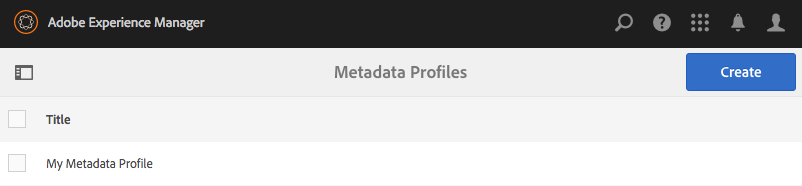
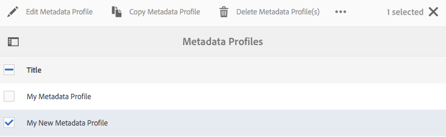

# 메타데이터 프로필 {#metadata-profiles}

메타데이터 프로필을 사용하면 폴더 내의 자산에 기본 메타데이터를 적용할 수 있습니다. 메타데이터 프로필을 만들어 폴더에 적용합니다. 나중에 폴더에 업로드하는 모든 자산은 메타데이터 프로필에서 구성한 기본 메타데이터를 상속합니다.

## 메타데이터 프로필 {#adding-a-metadata-profile} 추가

1. AEM 로고를 탭하거나 클릭하고 **[!UICONTROL 도구 > 자산 > 메타데이터 프로필]**&#x200B;으로 이동한 다음 **[!UICONTROL 만들기]**&#x200B;를 탭합니다.
1. 메타데이터 프로필의 제목(예: 샘플 메타데이터)을 입력하고 **[!UICONTROL 제출]**&#x200B;을 클릭합니다. 메타데이터 프로필에 대한 **[!UICONTROL 양식 편집]**&#x200B;이 표시됩니다.

   

1. 구성 요소를 클릭하고 **[!UICONTROL 설정]** 탭에서 해당 속성을 구성합니다. 예를 들어 **[!UICONTROL 설명]** 구성 요소를 클릭하고 해당 속성을 편집합니다.

   

   **[!UICONTROL 설명]** 구성 요소에 대해 다음 속성을 편집합니다.

   * **[!UICONTROL 필드 레이블]**:메타데이터 속성의 표시 이름입니다. 사용자 참조용입니다.
   * **[!UICONTROL 속성에 매핑]**:이 속성의 값은 저장소에 저장된 자산 노드의 상대 경로/이름을 제공합니다. 이 값은 경로가 자산의 노드 아래에 있음을 나타내므로 항상 `./`으로 시작해야 합니다.

   

   **[!UICONTROL 속성]**&#x200B;에 매핑에 지정하는 값은 자산의 메타데이터 노드 아래에 속성으로 저장됩니다. 예를 들어 를 지정하는 경우 . `/jcr:content/metadata/dc:desc` aem assets은 속성에  **[!UICONTROL 매핑의]** 이름으로 자산의 메타데이터 노드 `dc:desc` 에 값을 저장합니다.

   * **[!UICONTROL 기본값]**:이 속성을 사용하여 메타데이터 구성 요소의 기본값을 추가합니다. 예를 들어 &quot;My description&quot;을 지정하면 이 값이 자산의 메타데이터 노드의 속성 `dc:desc`에 할당됩니다.

   

   >[!NOTE]
   >
   >새 메타데이터 속성에 기본값을 추가합니다(이 속성은 이미 에 존재하지 않음). `/jcr:content/metadata` node)는 기본적으로 자산의 속성 페이지에 속성 및 해당  **** 값을 표시하지 않습니다. 자산의 [!UICONTROL 속성] 페이지에서 새 속성을 보려면 해당 스키마 양식을 수정합니다.

1. (선택 사항) **[!UICONTROL 양식 작성]** 탭에서 **[!UICONTROL 양식 편집]**&#x200B;에 구성 요소를 더 추가하고 **[!UICONTROL 설정]** 탭에서 해당 속성을 구성합니다. 다음 속성은 **[!UICONTROL 빌드 양식]** 탭에서 사용할 수 있습니다.

| 구성 요소 | 속성 |
|---|---|
| [!UICONTROL 섹션 머리글] | 필드 레이블,   설명 |
| [!UICONTROL 한 줄 텍스트] | 필드 레이블,   속성에 매핑,   기본값 |
| [!UICONTROL 다중 값 텍스트] | 필드 레이블,   속성에 매핑,   기본값 |
| [!UICONTROL 번호] | 필드 레이블,   속성에 매핑,   기본값 |
| [!UICONTROL 날짜] | 필드 레이블,   속성에 매핑,   기본값 |
| [!UICONTROL 표준 태그] | 필드 레이블,   속성에 매핑,   기본값,   설명 |

1. **[!UICONTROL 완료]**&#x200B;를 클릭합니다. 메타데이터 프로필이 **[!UICONTROL 메타데이터 프로필]** 페이지의 프로필 목록에 추가됩니다.

   

## 메타데이터 프로필 {#copying-a-metadata-profile} 복사

1. **[!UICONTROL 메타데이터 프로필]** 페이지에서 복사할 프로파일을 선택합니다.

   

1. 도구 모음에서 **[!UICONTROL 복사]**&#x200B;를 클릭합니다.
1. **[!UICONTROL 메타데이터 프로필 복사]** 대화 상자에서 프로필의 새 사본에 대한 제목을 입력합니다.
1. **[!UICONTROL 복사]**&#x200B;를 클릭합니다. 프로필 사본이 **[!UICONTROL 메타데이터 프로필]** 페이지의 프로필 목록에 나타납니다.

   

## 메타데이터 프로필 {#deleting-a-metadata-profile} 삭제

1. **[!UICONTROL 메타데이터 프로필]** 페이지에서 삭제할 프로파일을 선택합니다.

   

1. 도구 모음에서 **[!UICONTROL 메타데이터 프로필 삭제]**&#x200B;를 클릭합니다.
1. 대화 상자에서 **[!UICONTROL 삭제]**&#x200B;를 클릭하여 삭제 작업을 확인합니다. 메타데이터 프로필이 목록에서 삭제됩니다.

## {#applying-a-metadata-profile-to-folders} 폴더에 메타데이터 프로필 적용

메타데이터 프로필을 폴더에 할당하면 모든 하위 폴더는 해당 상위 폴더의 프로필을 자동으로 상속합니다. 즉, 하나의 메타데이터 프로필만 폴더에 할당할 수 있습니다. 따라서 에셋을 업로드, 저장, 사용 및 보관하는 폴더 구조를 주의 깊게 고려합니다.

폴더에 다른 메타데이터 프로필을 할당하면 새 프로필이 이전 프로필을 무시합니다. 이전 기존 폴더 자산은 변경되지 않습니다. 새 프로필이 나중에 폴더에 추가되는 자산에 적용됩니다.

프로필이 할당된 폴더는 카드 이름에 나타나는 프로필의 이름으로 사용자 인터페이스에 표시됩니다.

메타데이터 프로필을 특정 폴더에 적용하거나 모든 자산에 전역적으로 적용할 수 있습니다.

### 특정 폴더 {#applying-metadata-profiles-to-specific-folders}에 메타데이터 프로필 적용

**[!UICONTROL 도구]** 메뉴 내에서 또는 폴더에 있는 경우 **[!UICONTROL 속성]**&#x200B;에서 메타데이터 프로필을 폴더에 적용할 수 있습니다. 이 섹션에서는 두 가지 방법으로 폴더에 메타데이터 프로필을 적용하는 방법을 설명합니다.

프로파일이 이미 할당된 폴더가 폴더 이름 바로 아래에 프로파일 이름이 표시되어 표시됩니다.

#### 프로필 사용자 인터페이스 {#applying-metadata-profiles-to-folders-from-profiles-user-interface}의 폴더에 메타데이터 프로필 적용

1. AEM 로고를 누르고 **[!UICONTROL 도구 > 자산 > 메타데이터 프로필]**&#x200B;으로 이동합니다.
1. 폴더 또는 여러 폴더에 적용할 메타데이터 프로필을 선택합니다.

   

1. **[!UICONTROL 폴더에 메타데이터 프로필 적용]**&#x200B;을 누르고 새로 업로드된 자산을 받는 데 사용할 폴더 또는 여러 폴더를 선택하고 **[!UICONTROL 완료]**&#x200B;를 누릅니다. 프로파일이 이미 할당된 폴더가 폴더 이름 바로 아래에 프로파일 이름이 표시되어 표시됩니다.

#### 속성 {#applying-metadata-profiles-to-folders-from-properties}의 폴더에 메타데이터 프로필 적용

1. 왼쪽 레일에서 **[!UICONTROL 자산]**&#x200B;을 탭한 다음 메타데이터 프로필을 적용할 폴더로 이동합니다.
1. 폴더에서 확인 표시를 눌러 선택한 다음 **[!UICONTROL 속성]**&#x200B;을 누릅니다.

1. **[!UICONTROL 메타데이터 프로필]** 탭을 선택하고 드롭다운 메뉴에서 프로필을 선택하고 **[!UICONTROL 저장]**&#x200B;을 클릭합니다.

   

   프로파일이 이미 할당된 폴더가 폴더 이름 바로 아래에 프로파일 이름이 표시되어 표시됩니다.

### 메타데이터 프로필을 전역적으로 적용 {#applying-a-metadata-profile-globally}

프로필을 폴더에 적용하는 것 외에도 하나의 프로필을 전역적으로 적용할 수 있으므로 모든 폴더의 AEM 자산에 업로드된 콘텐트에 선택한 프로필이 적용되도록 할 수 있습니다. 메타데이터 프로필을 전역적으로 적용하려면 다음 단계를 따르십시오.

1. 다음 중 하나를 수행하십시오.

   * `https://[aem_server]:[port]/mnt/overlay/dam/gui/content/assets/foldersharewizard.html/content/dam`으로 이동하여 적절한 프로필을 적용하고 **[!UICONTROL 저장]**&#x200B;을 탭하거나 클릭합니다.

      

   * 다음 노드로 CRXDE Lite으로 이동합니다.`/content/dam/jcr:content`. `metadataProfile:/etc/dam/metadata/dynamicmedia/<name_of_metadata_profile>` 속성을 추가하고 **[!UICONTROL 모두 저장]**&#x200B;을 탭합니다.

      

## {#removing-a-metadata-profile-from-folders} 폴더에서 메타데이터 프로필 제거

폴더에서 메타데이터 프로필을 제거하면 모든 하위 폴더는 해당 상위 폴더에서 자동으로 프로필 제거를 상속합니다. 그러나 폴더 내에서 발생한 파일 처리는 그대로 유지됩니다.

**[!UICONTROL 도구]** 메뉴 내에서 또는 폴더에 있는 경우 **[!UICONTROL 속성]**&#x200B;에서 메타데이터 프로필을 제거할 수 있습니다. 이 섹션에서는 두 가지 방법으로 폴더에서 메타데이터 프로필을 제거하는 방법에 대해 설명합니다.

### 프로필 사용자 인터페이스 {#removing-metadata-profiles-from-folders-via-profiles-user-interface}을(를) 통해 폴더에서 메타데이터 프로필 제거

프로필 사용자 인터페이스를 통해 폴더에서 메타데이터 프로필을 제거하려면 다음 단계를 수행합니다.

1. AEM 로고를 누르고 **[!UICONTROL 도구 > 자산 > 메타데이터 프로필]**&#x200B;으로 이동합니다.
1. 폴더 또는 여러 폴더에서 제거할 메타데이터 프로필을 선택합니다.
1. **[!UICONTROL 폴더에서 메타데이터 프로필 제거]**&#x200B;를 누르고 프로필을 제거할 폴더 또는 여러 폴더를 선택한 다음 **[!UICONTROL 완료]**&#x200B;를 누릅니다.

   이름이 폴더 이름 아래에 더 이상 나타나지 않으므로 메타데이터 프로필이 폴더에 더 이상 적용되지 않음을 확인할 수 있습니다.

### {#removing-metadata-profiles-from-folders-via-properties} 속성을 통해 폴더에서 메타데이터 프로필 제거

1. AEM 로고를 누르고 **[!UICONTROL 자산]**&#x200B;으로 이동한 다음 메타데이터 프로필을 제거할 폴더로 이동합니다.
1. 폴더에서 확인 표시를 눌러 선택한 다음 **[!UICONTROL 속성]**&#x200B;을 누릅니다.
1. **[!UICONTROL 메타데이터 프로필]** 탭을 선택한 다음 드롭다운 메뉴에서 **[!UICONTROL 없음]**&#x200B;을 선택합니다. **[!UICONTROL 저장]**&#x200B;을 누릅니다.

프로파일이 이미 할당된 폴더가 폴더 이름 바로 아래에 프로파일 이름이 표시되어 표시됩니다.
