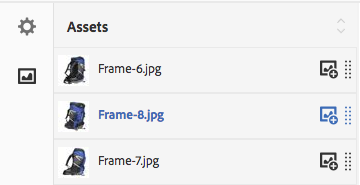

# 혼합 미디어 세트 {#mixed-media-sets}

>[!CAUTION]
>
>AEM 6.4가 확장 지원이 종료되었으며 이 설명서는 더 이상 업데이트되지 않습니다. 자세한 내용은 [기술 지원 기간](https://helpx.adobe.com/kr/support/programs/eol-matrix.html). 지원되는 버전 찾기 [여기](https://experienceleague.adobe.com/docs/).

혼합 미디어 세트를 사용하면 이미지, 이미지 세트, 스핀 세트 및 비디오를 한 프레젠테이션에 혼합할 수 있습니다.

Mixed Media Sets are designated by a banner with the word **[!UICONTROL MixedMediaSet]**. In addition, if the Mixed Media Set is published, then the publish date, indicated by the **[!UICONTROL World]** icon is on the banner along with the last modification date, indicated by the **[!UICONTROL Pencil]** icon displays.

>[!NOTE]
>
>Assets 사용자 인터페이스에 대한 자세한 내용은 [Touch UI를 사용하여 자산 관리](managing-assets-touch-ui.md).

## 빠른 시작: 혼합 미디어 집합 {#quick-start-mixed-media-sets}

혼합 미디어 세트를 사용하여 빠르게 시작하고 실행하려면 다음 단계를 수행합니다.

1. [자산 업로드](#uploading-assets).

   Start by uploading the images and videos for your Mixed Media Sets. If necessary, create your [Image Sets](image-sets.md) and [Spin Sets](spin-sets.md). Because users can zoom on images in the Mixed Media Set Viewer, take zooming into account when you choose images. Make sure that the images are least 2000 pixels in the largest dimension.

1. [혼합 미디어 세트를 만듭니다.](#creating-mixed-media-sets)

   혼합 미디어 세트를 만들려면 **[!UICONTROL 자산]** 페이지, 탭 **[!UICONTROL 만들기 > 혼합 미디어 세트]**&#x200B;를 입력한 다음 세트 이름을 지정합니다. 자산을 선택한 다음 이미지가 나타나는 순서를 선택합니다.

   자세한 내용은 [선택기를 사용한 작업.](working-with-selectors.md)

1. 설정 [혼합 미디어 뷰어 사전 설정](managing-viewer-presets.md)필요한 경우 ).

   Administrators can create or modify Mixed Media Set Viewer Presets. To see your mixed media with a viewer preset, select the mixed media set, and in the left-rail drop-down menu, select **[!UICONTROL Viewers]**.

   자세한 내용은 **[!UICONTROL 도구 > 자산 > 뷰어 사전 설정]** 뷰어 사전 설정을 만들거나 편집하려면 다음을 수행하십시오.

   자세한 내용은 [뷰어 사전 설정 추가 및 편집.](managing-viewer-presets.md)

1. [혼합 미디어 세트를 미리 봅니다.](#previewing-mixed-media-sets)

   혼합 미디어 세트를 선택하면 미리 볼 수 있습니다. 축소판 아이콘을 클릭하여 선택한 뷰어에서 혼합 미디어 세트를 검사합니다. 에서 다른 뷰어를 선택할 수 있습니다 **[!UICONTROL 뷰어]** 메뉴 아래의 왼쪽 레일 드롭다운 메뉴에서 사용할 수 있습니다.

1. [혼합 미디어 세트를 게시합니다.](#publishing-mixed-media-sets)

   혼합 미디어 세트를 게시하면 URL 및 포함 문자열이 활성화됩니다. 또한 다음을 수행해야 합니다 [뷰어 사전 설정 게시](managing-viewer-presets.md#publishing-viewer-presets).

1. [웹 응용 프로그램에 URL 연결](linking-urls-to-yourwebapplication.md) 또는 [비디오 또는 이미지 뷰어 포함](embed-code.md).

   AEM Assets은 혼합 미디어 세트에 대한 URL 호출을 만들고 혼합 미디어 세트를 게시한 후 활성화합니다. 자산을 미리 볼 때 이러한 URL을 복사할 수 있습니다. 또는 웹 사이트에 포함할 수 있습니다.

   혼합 미디어 세트를 선택한 다음 왼쪽 레일 드롭다운 메뉴에서 을 선택합니다 **[!UICONTROL 뷰어]**.

   See [Linking a Mixed Media Set to a web page](linking-urls-to-yourwebapplication.md) and [Embedding the Video or Image Viewer](embed-code.md).

필요한 경우 편집할 수 있습니다 [혼합 미디어 집합](#editing-mixed-media-sets). 또한 를 보고 수정할 수 있습니다 [혼합 미디어 집합 속성](managing-assets-touch-ui.md#editing-properties).

>[!NOTE]
>
>세트를 만드는 데 문제가 있다면 다음을 참조하십시오 [Dynamic Media 문제 해결 - Scene7 모드](troubleshoot-dms7.md).

## 자산 업로드 {#uploading-assets}

Start by uploading the images and videos for your Mixed Media Sets. 사용자는 혼합 미디어 세트 뷰어에서 이미지를 확대할 수 있으므로, 이미지를 선택할 때 확대/축소를 고려해야 합니다. Make sure that the images are least 2000 pixels in the largest dimension.

또한 스핀 세트 또는 이미지 세트를 혼합 미디어 세트에 추가하려면 해당 세트도 만듭니다.

## 혼합 미디어 집합 만들기 {#creating-mixed-media-sets}

이미지, 이미지 세트, 스핀 세트 및 비디오를 혼합 미디어 세트에 추가할 수 있습니다. 혼합 미디어 세트에 추가하기 전에 파일, 이미지 세트 및 스핀 세트를 게시할 준비가 되었는지 확인합니다.

세트에 자산을 추가하면 자동으로 영숫자 순서로 추가됩니다. 자산이 추가된 후 수동으로 자산 순서를 변경하거나 정렬할 수 있습니다.

**혼합 미디어 세트를 만들려면**:

1. In Assets, navigate to where you want to create a mixed media set, and click **Create**, and select **[!UICONTROL Mixed Media Set]**. You can also create the set from inside a folder that contains your assets.

   

1. 에서 **[!UICONTROL 혼합 미디어 세트 편집기]** 페이지, 위치 **[!UICONTROL 제목]**&#x200B;를 입력합니다. 혼합 미디어 세트의 이름을 입력합니다. 이 이름은 혼합 미디어 집합 전체의 배너에 표시됩니다. 설명을 입력합니다(선택적).

   

   >[!NOTE]
   >
   >혼합 미디어 세트를 생성할 때 혼합 미디어 세트 축소판을 변경하거나 혼합 미디어 세트의 자산을 기반으로 AEM에서 자동으로 축소판을 선택할 수 있습니다. 축소판을 선택하려면 **[!UICONTROL 축소판 변경]** 이미지를 선택합니다(다른 폴더로 이동하여 이미지를 찾을 수도 있습니다.). 축소판을 선택한 다음 혼합 미디어 집합에서 AEM을 생성하도록 결정하려면 을 선택합니다 **[!UICONTROL 자동 축소판으로 전환]**.

1. 탭하기 **[!UICONTROL 자산 선택기]** 혼합 미디어 세트에 포함할 자산을 선택하려면 다음을 수행하십시오. 선택하고 탭합니다 **[!UICONTROL 선택]**.

   사용 **[!UICONTROL 자산 선택기]**, 키워드에 입력하고 을 탭하여 자산을 검색할 수 있습니다. **[!UICONTROL 반환]**. You can also apply filters to refine your search results. You can filter by path, collection, file type, and tag. Select the filter and then tap the **[!UICONTROL Filter]** icon from the toolbar. 보기 아이콘을 선택하고 을(를) 선택하여 보기를 변경합니다 **[!UICONTROL 목록]**, **[!UICONTROL 열]**, 또는 **[!UICONTROL 카드]** 보기.

   자세한 내용은 [선택기를 사용한 작업](working-with-selectors.md).

   

1. 필요에 따라 목록을 위나 아래로 끌어 자산 순서를 변경합니다(순서 조정 아이콘을 선택해야 함).

   

   If you want to add thumbnails, click the **[!UICONTROL +]**   icon next to the image and navigate to the thumbnail you want. 모든 축소판 이미지 선택이 끝나면 탭하기 **[!UICONTROL 저장]**.

   >[!NOTE]
   >
   >자산을 추가하려면 **[!UICONTROL 자산 추가]**.

1. 자산을 삭제하려면 해당 확인란을 선택하고 를 누릅니다 **[!UICONTROL 자산 삭제]**.
1. 사전 설정을 적용하려면 **[!UICONTROL 사전 설정]** 오른쪽 상단 모서리에서 사전 설정을 선택하여 자산에 적용합니다.
1. **[!UICONTROL 저장]**&#x200B;을 클릭합니다. 새로 만든 혼합 미디어 세트가 만든 폴더에 나타납니다.

## 혼합 미디어 집합 편집 {#editing-mixed-media-sets}

사용자 인터페이스에서 직접 혼합 미디어 세트의 자산에 다양한 편집 작업을 수행할 수 있습니다 [자산에서 모든 자산을](managing-assets-touch-ui.md). 혼합 미디어 세트에서 다음 작업을 수행할 수도 있습니다.

* 혼합 미디어 세트에 자산을 추가합니다.
* 혼합 미디어 세트에서 자산 순서를 변경합니다.
* 혼합 미디어 집합에서 자산을 삭제합니다.
* 뷰어 사전 설정을 적용합니다.
* 기본 축소판을 변경합니다.

**혼합 미디어 세트를 편집하려면**:

1. 다음 중 하나를 수행합니다.

   * 혼합 미디어 세트 자산을 마우스로 가리킨 다음, 탭합니다 **[!UICONTROL 편집]** (연필 아이콘).
   * 혼합 미디어 세트 자산을 마우스로 가리킨 다음 탭합니다 **[!UICONTROL 선택]** (확인 표시 아이콘)을 누른 다음 **[!UICONTROL 편집]** 클릭합니다.
   * 혼합 미디어 세트 자산을 탭한 다음, **[!UICONTROL 편집]** (연필 아이콘)을 클릭하여 제품에서 사용할 수 있습니다.

1. 혼합 미디어 세트 편집기에서 다음 중 하나를 수행합니다.

   * 자산 순서를 변경하려면 - 왼쪽 패널에서 **[!UICONTROL 자산]** (그림 아이콘) 자산을 새 위치로 드래그합니다.
   * 자산을 추가하려면 - 도구 모음에서 를 누릅니다 **[!UICONTROL 자산 추가]**. 자산으로 이동합니다. 추가할 각 자산에 대해, 자산의 이미지(자산 이름이 아님)를 마우스로 가리킨 다음, 확인 표시 아이콘을 탭합니다. 오른쪽 상단 모서리에서 을(를) 탭합니다. **[!UICONTROL 선택]**.
   * 자산을 삭제하려면 - 왼쪽 패널에서 **[!UICONTROL 자산]** (그림 아이콘)를 선택한 다음 자산을 선택합니다. 도구 모음 모음에서 탭 **[!UICONTROL 자산 삭제]**.
   * 자산을 오름차순이나 내림차순으로 정렬하려면 왼쪽 패널에서 를 탭합니다 **[!UICONTROL 자산]** (그림 아이콘) 오른쪽 **[!UICONTROL 자산]** 제목에서 위쪽 또는 아래쪽 캐럿 아이콘을 누릅니다.

   >[!NOTE]
   >
   >* 모든 보기 모드(예: **[!UICONTROL 카드]** 보기 또는 **[!UICONTROL 열]** 보기) 혼합 미디어 세트로 이동합니다. Hover over the asset and tap the checkmark icon to select it. 누르기 **[!UICONTROL 백스페이스]** 키보드에서 또는 **[!UICONTROL 자세히]** (세 점)을 도구 모음에서 를 누른 다음 **[!UICONTROL 삭제]**.
   >* 세트로 이동하여 를 탭하여 혼합 미디어 세트에서 자산을 편집할 수 있습니다 **[!UICONTROL 구성원 설정]** 왼쪽 레일에서 를 탭하고 **[!UICONTROL 연필]** 아이콘을 클릭하여 편집 창을 엽니다.

1. 탭 **[!UICONTROL 저장]** 편집을 완료하면 됩니다.

   >[!NOTE]
   >
   >* To edit the assets in a Mixed Media Set - Navigate to the Mixed Media Set. 세트를 탭(선택하지 않음)하여 AEM에서 엽니다. **[!UICONTROL 미리 보기 설정]** 페이지. 왼쪽 레일에서 드롭다운 캐럿을 눌러 드롭다운 목록을 연 다음 탭합니다 **[!UICONTROL 구성원 설정]**. 에서 **[!UICONTROL 구성원 설정]** 페이지를 마우스로 가리킨 다음, 자산을 탭합니다 **[!UICONTROL 편집]** (연필 아이콘)을 클릭하여 편집 페이지를 엽니다.
   >* 전체 혼합 미디어 세트를 삭제하려면 - 모든 보기 모드(예: **[!UICONTROL 카드]** 보기 또는 **[!UICONTROL 열]** 보기), 혼합 미디어 집합으로 이동합니다. 세트를 마우스로 가리킨 다음 탭합니다 **[!UICONTROL 선택]** (확인 표시 아이콘) 누르기 **[!UICONTROL 백스페이스]** 키보드에서 또는 **[!UICONTROL 자세히]** (세 점 행), **[!UICONTROL 삭제]**.

## 혼합 미디어 집합 미리 보기 {#previewing-mixed-media-sets}

자세한 내용은 [자산 미리 보기](previewing-assets.md) 혼합 미디어 세트를 미리 보는 방법에 대한 자세한 내용을 참조하십시오.

## 혼합 미디어 집합 게시 {#publishing-mixed-media-sets}

자세한 내용은 [자산 게시](publishing-dynamicmedia-assets.md) 혼합 미디어 세트를 게시하는 방법에 대한 자세한 내용.

>[!NOTE]
>
>처음 게시할 때 혼합 미디어 상태가 게재 서비스에 완전히 종료되지 않는 경우, 두 번째로 혼합 미디어 세트를 게시해야 할 수 있습니다.
