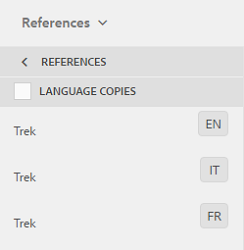

# 자산 번역 준비 중 {#preparing-assets-for-translation}

다국어 자산은 바이너리, 메타데이터 및 태그가 여러 언어로 있는 자산을 의미합니다. 일반적으로 자산에 대한 이진, 메타데이터 및 태그는 한 언어로 존재하며 다국어 프로젝트에서 사용할 수 있도록 다른 언어로 변환됩니다.

Adobe Experience Manager(AEM) Assets에서 다국어 자산은 폴더에 포함되며 이 폴더에는 다른 언어로 된 자산이 포함됩니다.

각 언어 폴더를 언어 사본이라고 합니다. 언어 복사본으로 알려진 언어 복사본의 루트 폴더는 언어 복사본에서 컨텐츠의 언어를 식별합니다. 예를 들어 */content/dam/it*&#x200B;은 이탈리아어 언어 복사본에 대한 이탈리아어 루트입니다. 소스 자산의 번역을 수행할 때 올바른 언어를 지정하도록 언어 사본은 [올바르게 구성된 언어 루트](preparing-assets-for-translation.md#creating-a-language-root)를 사용해야 합니다.

처음에 자산을 추가하는 언어 사본은 기본 언어입니다. Language Primary는 다른 언어로 번역되는 소스입니다.

샘플 폴더 계층 구조에는 다음과 같은 여러 언어 루트가 포함되어 있습니다.

```java
/content
    /- dam
             |- en
             |- fr
             |- de
             |- es
             |- it
             |- ja
             |- zh
```

자산 번역을 준비하려면 다음 단계를 수행하십시오.

1. 기본 언어의 언어 루트를 만듭니다. 예를 들어 샘플 폴더 계층 구조에서 영어 사본의 언어 루트는 `/content/dam/en`입니다. 언어 루트 만들기](preparing-assets-for-translation.md#creating-a-language-root)의 정보에 따라 언어 루트가 올바르게 구성되었는지 확인합니다.[

1. 기본 언어에 자산을 추가합니다.
1. 언어 사본이 필요한 각 대상 언어의 언어 루트를 만듭니다.

## 언어 루트 만들기 {#creating-a-language-root}

언어 루트를 만들려면 폴더를 만들고 ISO 언어 코드를 Name 속성 값으로 사용합니다. 언어 루트를 만든 후 언어 루트 내의 모든 수준에서 언어 사본을 만들 수 있습니다.

예를 들어 샘플 계층의 이탈리아어 언어 사본의 루트 페이지에는 `it`이 Name 속성으로 있습니다. 이름 속성은 저장소의 자산 노드의 이름으로 사용되므로 자산의 경로를 결정합니다.(`https://[AEM_server]:[port]/assets.html/content/dam/it/*`)

1. Assets 콘솔에서 **[!UICONTROL 만들기]**&#x200B;를 클릭/탭하고 메뉴에서 **[!UICONTROL 폴더]**&#x200B;를 선택합니다.

   

1. 이름 필드에 국가 코드를 `<language-code>` 형식으로 입력합니다.

   

1. **[!UICONTROL 만들기]**&#x200B;를 클릭하거나 탭합니다. 언어 루트는 자산 콘솔에서 만들어집니다.

## 언어 루트 보기 {#viewing-language-roots}

터치에 적합한 UI는 AEM Assets 내에서 만들어진 언어 루트 목록을 표시하는 참조 패널을 제공합니다.

1. Assets 콘솔에서 언어 사본을 만들 기본 언어를 선택합니다.
1. GlobalNav 아이콘을 클릭하거나 탭하고 **[!UICONTROL 참조]**&#x200B;를 선택하여 참조 창을 엽니다.

   

1. 참조 창에서 **[!UICONTROL 언어 사본]**&#x200B;을 클릭하거나 탭합니다. 언어 복사 패널에는 자산의 언어 사본이 표시됩니다.

   
