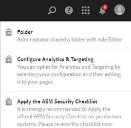

# 비공개 폴더 공유 {#private-folder-sharing}

배타적으로 사용할 수 있는 Adobe Experience Manager (AEM) Assets 사용자 인터페이스에서 비공개 폴더를 만들 수 있습니다. 이 비공개 폴더를 다른 사용자에게 공유하고 다양한 권한을 할당할 수 있습니다. 사용자가 지정하는 권한 수준에 따라 폴더에서 다양한 작업을 수행할 수 있습니다. 예를 들어 폴더 내의 자산을 보거나 자산을 편집할 수 있습니다.

1. Assets 콘솔의 도구 모음에서 **[!UICONTROL 만들기]** 를 탭/클릭한 다음 메뉴에서 **[!UICONTROL 폴더]**&#x200B;를 선택합니다.

   

1. **[!UICONTROL 폴더 추가]** 대화 상자에서 폴더의 제목과 이름(선택 사항)을 입력하고 **[!UICONTROL 개인]**&#x200B;을 선택합니다.

   

1. **[!UICONTROL 만들기]**&#x200B;를 탭/클릭합니다. 개인 폴더는 UI에 만들어집니다.

   

1. 폴더를 다른 사용자와 공유하고 해당 사용자에게 권한을 할당하려면 폴더를 선택하고 도구 모음에서 **[!UICONTROL 속성]** 아이콘을 클릭/탭합니다.

   

   >[!NOTE]
   >
   >폴더는 공유하기 전까지 다른 사용자에게 표시되지 않습니다.

1. 폴더 속성 페이지의 **[!UICONTROL 사용자 추가]** 목록에서 사용자를 선택하고 개인 폴더의 사용자에게 역할을 지정한 다음 **[!UICONTROL 추가]**&#x200B;를 클릭합니다.

   

   >[!NOTE]
   >
   >폴더를 공유하는 사용자에게 편집기, 소유자 또는 뷰어와 같은 다양한 역할을 할당할 수 있습니다. 사용자에게 소유자 역할을 할당하는 경우 사용자에게 폴더에 대한 편집기 권한이 있습니다. 또한 사용자는 다른 사용자와 폴더를 공유할 수 있습니다. 편집기 역할을 할당하는 경우 사용자는 개인 폴더에서 자산을 편집할 수 있습니다. 뷰어 역할을 할당하는 경우 사용자는 비공개 폴더의 자산만 볼 수 있습니다.

1. **[!UICONTROL 저장]**&#x200B;을 클릭합니다. 사용자가 AEM Assets에 로그인할 때 지정하는 역할에 따라 개인 폴더에 대한 권한 세트가 할당됩니다.
1. **[!UICONTROL 확인]**&#x200B;을 클릭하여 확인 메시지를 닫습니다.
1. 폴더를 공유하는 사용자는 공유 알림을 받습니다. 알림을 보려면 사용자의 자격 증명으로 AEM Assets에 로그인합니다.

   

1. 알림 아이콘을 탭/클릭하여 알림 목록을 엽니다.

   

1. 관리자가 공유하는 비공개 폴더의 항목을 클릭/탭하여 폴더를 엽니다.

>[!NOTE]
>
>비공개 폴더를 만들려면 개인 폴더를 만들 상위 폴더에 대한 ACL 읽기 및 편집 권한이 필요합니다. 관리자가 아닌 경우 이러한 권한은 기본적으로 */content/dam*&#x200B;에서 활성화되지 않습니다. 이 경우, 개인 폴더를 만들거나 폴더 설정을 보기 전에 먼저 사용자 ID/그룹에 대해 이러한 권한을 얻습니다.
