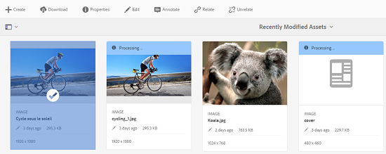
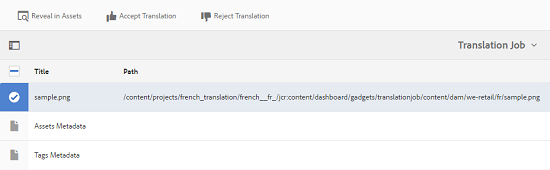

# 관련 자산 {#related-assets}

>[!CAUTION]
>
>AEM 6.4가 확장 지원이 종료되었으며 이 설명서는 더 이상 업데이트되지 않습니다. 자세한 내용은 [기술 지원 기간](https://helpx.adobe.com/kr/support/programs/eol-matrix.html). 지원되는 버전 찾기 [여기](https://experienceleague.adobe.com/docs/).

Adobe Experience Manager Assets를 사용하면 관련 자산 기능을 사용하여 조직의 요구 사항에 따라 자산을 수동으로 연결할 수 있습니다. 예를 들어 라이센스 파일을 유사한 주제에 대한 자산이나 이미지/비디오와 연결할 수 있습니다. 특정 공통 속성을 공유하는 자산을 연결할 수 있습니다. 이 기능을 사용하여 자산 간의 소스/파생 관계를 만들 수도 있습니다. 예를 들어 INDD 파일에서 생성된 PDF 파일이 있는 경우 해당 PDF 파일을 해당 소스 INDD 파일에 연결할 수 있습니다.

이렇게 하면 저해상도 파일(예: PDF/JPG)을 공급업체/에이전시에 공유하고 요청 시에만 고해상도 파일(예: INDD)을 사용할 수 있는 유연성을 가지게 됩니다.

## 자산 관련 {#relating-assets}

1. 자산 인터페이스에서 연결하려는 자산의 속성 페이지를 엽니다.

   

   또는 목록 보기에서 자산을 선택합니다.

   

   컬렉션에서 자산을 선택할 수도 있습니다.

   

1. 다른 자산을 선택한 자산과 연결하려면 **[!UICONTROL 관계]** 아이콘 을 클릭하여 제품에서 사용할 수 있습니다.

   

1. 다음 중 하나를 수행하십시오.

   * 자산에 대한 소스 파일을 연결하려면 을(를) 선택합니다 **[!UICONTROL 소스]** 참조하십시오.
   * 파생된 파일을 연결하려면 **[!UICONTROL 파생]** 참조하십시오.
   * 자산 간에 양방향 관계를 만들려면 **[!UICONTROL 기타]** 참조하십시오.

   

1. 에서 **[!UICONTROL 자산 선택]** 화면에서 연결할 자산의 위치로 이동하여 선택합니다.

   

1. 클릭/탭하기 **[!UICONTROL 확인]** 아이콘.
1. 클릭/탭 **[!UICONTROL 확인]** 을 클릭하여 대화 상자를 닫습니다. 3단계에서 선택한 관계에 따라 관련 자산이 의 적절한 카테고리 아래에 나열됩니다 **[!UICONTROL 관련]** 섹션을 참조하십시오. 예를 들어, 관련된 자산이 현재 자산의 소스 파일인 경우, 아래에 나열됩니다 **[!UICONTROL 소스]**.

   

1. 자산의 관계를 해제하려면 **[!UICONTROL 관계 없음]** 아이콘 을 클릭하여 제품에서 사용할 수 있습니다.

   

1. 관련을 해제할 자산을 선택합니다 **[!UICONTROL 관계 제거]** 대화 상자 및 클릭/탭 **[!UICONTROL 관계 없음]**.

   

1. 클릭/탭 **[!UICONTROL 확인]** 을 클릭하여 대화 상자를 닫습니다. 관계를 제거한 자산은 아래의 관련 자산 목록에서 삭제됩니다 **[!UICONTROL 관련]** 섹션을 참조하십시오.

## 관련 자산 번역 {#translating-related-assets}

관련 자산 기능을 사용하여 자산 간 소스/파생 관계를 만드는 것도 번역 워크플로우에서 유용합니다. 파생 자산에서 번역 워크플로우를 실행하면 [!DNL Experience Manager] 자산은 소스 파일이 참조하는 모든 자산을 자동으로 가져와서 번역을 위해 포함합니다. 이렇게 하면 소스 자산에서 참조하는 자산이 소스 및 파생된 자산과 함께 변환됩니다. 예를 들어, 영어 사본에 표시된 대로 파생된 자산 및 소스 파일이 포함된 시나리오를 생각해 보십시오.

소스 파일이 다른 자산과 관련된 경우 [!DNL Experience Manager] 자산은 참조되는 자산을 가져오고 이를 번역을 위해 포함합니다.

1. 의 단계에 따라 소스 폴더의 자산을 대상 언어로 변환합니다 [새 번역 프로젝트 만들기](translation-projects.md#create-a-new-translation-project). 예를 들어 이 경우 자산을 프랑스어로 번역합니다.
1. 프로젝트 페이지에서 번역 폴더를 엽니다.

   

1. 프로젝트 타일을 클릭/탭하여 세부 사항 페이지를 엽니다.

   

1. 번역 상태를 보려면 번역 작업 카드 아래의 줄임표를 클릭/탭하십시오.

   

1. 자산을 선택한 다음 클릭/탭합니다 **[!UICONTROL 자산에 표시]** 도구 모음에서 자산의 번역 상태를 볼 수 있습니다.

   

1. 소스와 관련된 자산이 번역되었는지 확인하려면 소스 자산을 클릭/탭합니다.

   

1. 소스와 관련된 자산을 선택한 다음 클릭/탭합니다 **[!UICONTROL 자산에 표시]**. 번역된 관련 자산이 표시됩니다.

   
