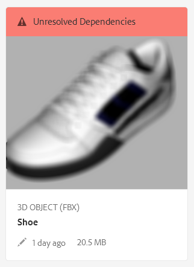

# 파일 종속성 해결 {#resolving-file-dependencies}

텍스처 맵 파일과 같은 기본 3D 모델 파일 종속성은 가능한 경우 자동으로 해결됩니다. 이 기능은 3D 파일에서 찾은 것과 동일한 이름의 파일을 AEM이 가까운 자산 폴더에서 검색하도록 함으로써 수행됩니다. If one or more dependencies are unresolvable during the Creating preview processing stage, the asset&#39;s card displays the following red banner message in the **[!UICONTROL Card View]**:

**파일 종속성을 해결하려면 다음을 수행하십시오**.

1. In the **[!UICONTROL Card View]**, hover the pointer over the **[!UICONTROL Unresolved Dependencies]** banner message on the card, then tap the **[!UICONTROL Exclamation Point]** icon.

   

1. On the **[!UICONTROL Metadata Properties]** page, tap the **[!UICONTROL Dependencies]** tab.

   The files that AEM could not auto-resolve are listed under the **[!UICONTROL Original Paths]** column, in red.

1. 다음 중 하나 이상을 수행하십시오.

   * **종속성을 찾아 선택합니다**. (이 선택 사항은 종속성 파일을 이미 업로드했다고 가정합니다.)

      1. Tap the **[!UICONTROL File Browse]** icon to the left of the red path.
      1. On the **[!UICONTROL Select Content]** page, navigate to the missing file, then tap on the file&#39;s card to select it.
      1. In the upper-left corner of the **[!UICONTROL Select Content]** page, tap **[!UICONTROL Close]** (X icon) to return to the **[!UICONTROL View Properties]** page.
   * **종속성을 업로드합니다**. (이 선택 사항은 누락된 파일을 아직 업로드하지 않았다고 가정합니다.)

      1. 누락된 경로 및 파일 이름을 확인합니다.
      1. 속성 페이지의 오른쪽 위 모서리 근처에 있는 **[!UICONTROL 닫기]**&#x200B;를 탭합니다.

   After the files are uploaded return to **[!UICONTROL View Properties > Dependencies]** page. 새로 업로드된 자산이 이제 참조된 자산으로 올바로 나열됩니다.

   * **종속성을 무시합니다**.

      If a missing dependency is no longer needed, under the **[!UICONTROL Referenced Asset]** column, in the text field to the left of the missing file, type `n/a` so that AEM 3D ignores the file.

1. Near the upper-right corner of the **[!UICONTROL View Properties]** page, tap **[!UICONTROL Save]**.
1. **[!UICONTROL 닫기]****[!UICONTROL 를 탭하여 [카드 보기]로 돌아갑니다]**.

   자산이 새로 해결된 종속성과 함께 자동으로 다시 처리됩니다.

