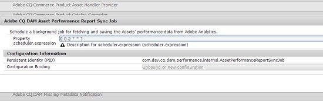

# 자산 통찰력 {#asset-insights}

자산 통찰력 기능을 사용하여 타사 웹 사이트, 마케팅 캠페인 및 Adobe의 크리에이티브 솔루션에서 사용되는 자산의 사용자 등급 및 사용 통계를 추적하는 방법을 알아봅니다.

자산 통찰력 기능을 사용하면 타사 웹 사이트, 마케팅 캠페인 및 Adobe의 크리에이티브 솔루션에서 사용되는 자산의 사용자 등급 및 사용 통계를 추적하여 해당 성능 및 인기도에 대한 통찰력을 얻을 수 있습니다.

자산 통찰력은 자산이 평가된 횟수, 클릭한 횟수 및 노출 횟수(웹 사이트에서 자산이 로드되는 횟수)와 같은 사용자 활동 세부 사항을 캡처합니다. 이 통계를 기반으로 자산에 점수를 할당합니다. 점수 및 성과 통계를 사용하여 카탈로그, 마케팅 캠페인 등에 포함할 인기 있는 자산을 선택할 수 있습니다. 이러한 통계를 기반으로 자산에 대한 아카이브 및 라이센스 갱신 정책을 작성할 수도 있습니다.

웹 사이트에서 자산에 대한 사용 통계를 캡처하려면 Assets Insights의 경우 웹 사이트 코드에 자산의 포함 코드를 포함해야 합니다.

자산 통찰력에 자산에 대한 사용 통계가 표시되도록 하려면 먼저 [!DNL Adobe Analytics]에서 보고 데이터를 가져오도록 기능을 구성하십시오. 자세한 내용은 [자산 통찰력 구성](touch-ui-configuring-asset-insights.md)을 참조하십시오. 온-프레미스 설치에서 이 기능을 사용하려면 [!DNL Adobe Analytics] 라이센스를 별도로 구입하십시오. [!DNL Managed Services] 의 고객은 [!DNL Experience Manager]와 번들로 제공되는 [!DNL Analytics] 라이센스를 받습니다. [Managed Services 제품 설명](https://helpx.adobe.com/legal/product-descriptions/adobe-experience-manager-managed-services.html)을 참조하십시오.

>[!NOTE]
>
>인사이트는 이미지에만 지원되고 제공됩니다.

## 자산에 대한 통계 보기 {#viewing-statistics-for-an-asset}

메타데이터 페이지에서 자산 통찰력 점수를 볼 수 있습니다.

1. Assets 사용자 인터페이스(UI)에서 자산을 선택한 다음 도구 모음에서 **[!UICONTROL 속성]** 아이콘을 탭/클릭합니다.
1. 속성 페이지에서 **[!UICONTROL 통찰력]** 탭을 탭/클릭합니다.
1. **[!UICONTROL Insights]** 탭에서 자산에 대한 사용 세부 사항을 검토합니다. **[!UICONTROL 점수]** 섹션에서는 자산의 총 자산 사용 및 성능 저장소에 대해 설명합니다.

   사용 점수는 다양한 솔루션에서 자산이 사용되는 횟수를 설명합니다.

   **[!UICONTROL Impressions]** 점수는 웹 사이트에서 자산이 로드되는 횟수입니다. **[!UICONTROL 클릭 수]** 아래에 표시되는 숫자는 자산을 클릭한 횟수입니다.

1. **[!UICONTROL 사용 통계]** 섹션을 검토하여 자산이 속한 엔티티와 최근에 사용한 크리에이티브 솔루션을 알아봅니다. 사용량이 많을수록 사용자 간에 자산이 인기 있을 가능성이 높습니다. 사용 데이터는 다음 헤드 아래에 표시됩니다.

   * **[!UICONTROL 자산]**:자산이 컬렉션 또는 복합 자산의 일부인 횟수입니다
   * **[!UICONTROL 웹 및 모바일]**:자산이 웹 사이트 및 앱의 일부인 횟수
   * **[!UICONTROL 소셜]**:Adobe Social 및 Adobe Campaign과 같은 솔루션에서 자산이 사용된 횟수입니다
   * **[!UICONTROL 이메일]**:이메일 캠페인에 자산이 사용된 횟수입니다

   

   >[!NOTE]
   >
   >자산 통찰력 기능은 정기적으로 [!DNL Adobe Analytics]의 솔루션 데이터를 가져옵니다. 솔루션 섹션에는 최신 데이터가 표시되지 않을 수 있습니다. 데이터가 표시되는 기간은 자산 인사이트가 [!DNL Analytics] 데이터를 검색하기 위해 실행하는 가져오기 작업의 예약에 따라 다릅니다.

1. 일정 기간 동안 자산에 대한 성능 통계를 그래픽으로 보려면 **[!UICONTROL 성능 통계]** 섹션에서 기간을 선택합니다. 클릭 및 노출 횟수를 포함한 세부 사항은 그래프의 트렌드 라인으로 표시됩니다.

   

   >[!NOTE]
   >
   >솔루션 섹션의 데이터와 달리 성능 통계 섹션에는 가장 최근 데이터가 표시됩니다.

1. 웹 사이트에 포함하여 성능 데이터를 가져올 자산의 포함 코드를 가져오려면 자산 축소판 아래의 **[!UICONTROL 포함 코드 가져오기]**&#x200B;를 클릭하십시오. 타사 웹 페이지에 포함 코드를 포함하는 방법에 대한 자세한 내용은 [웹 페이지에 페이지 추적기 및 포함 코드 사용](touch-ui-using-page-tracker.md)을 참조하십시오.

   

## 자산에 대한 통계 집계 보기 {#viewing-aggregate-statistics-for-assets}

**[!UICONTROL 인사이트 보기]**&#x200B;를 사용하여 폴더 내에서 모든 자산의 점수를 동시에 볼 수 있습니다.

1. 자산 UI에서 통찰력을 보려는 자산이 들어 있는 폴더로 이동합니다.
1. 도구 모음에서 레이아웃 아이콘을 탭/클릭한 다음 **[!UICONTROL 통찰력 보기]**&#x200B;를 선택합니다.
1. 페이지에 자산에 대한 사용 점수가 표시됩니다. 다양한 자산의 등급을 비교하고 인사이트를 도출합니다.

## 백그라운드 작업 예약 {#scheduling-background-job}

Assets Insights는 Adobe Analytics 보고서 세트의 자산에 대한 사용 데이터를 정기적으로 가져옵니다. 기본적으로 자산 인사이트는 데이터 가져오기에 대해 오전 2시에 24시간마다 백그라운드 작업을 실행합니다. 그러나 웹 콘솔에서 **[!UICONTROL Adobe CQ DAM 자산 성능 보고서 동기화 작업]** 서비스를 구성하여 빈도 및 시간을 모두 수정할 수 있습니다.

1. AEM 로고를 탭하고 **[!UICONTROL 도구 > 작업 > 웹 콘솔]**&#x200B;로 이동합니다.
1. **[!UICONTROL Adobe CQ DAM 자산 성능 보고서 동기화 작업]** 서비스 구성을 엽니다.

   

1. 속성 스케줄러 식에서 원하는 스케줄러 빈도 및 작업의 시작 시간을 지정합니다. 변경 사항을 저장합니다.
