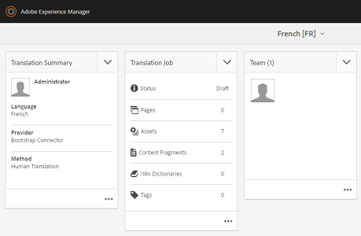

# Applying translation cloud services to folders {#applying-translation-cloud-services-to-folders}

Adobe Experience Manager(AEM)을 사용하면 원하는 번역 제공업체에서 클라우드 기반의 번역 서비스를 이용할 수 있으므로 요구 사항에 따라 에셋을 변환할 수 있습니다.

번역 워크플로우 동안 활용할 수 있도록 번역 클라우드 서비스를 자산 폴더에 직접 적용할 수 있습니다.

## 번역 서비스 적용 {#applying-the-translation-services}

번역 클라우드 서비스를 자산 폴더에 직접 적용하면 번역 워크플로우를 만들거나 업데이트할 때 번역 서비스를 구성할 필요가 없습니다.

1. 자산 UI에서 번역 서비스를 적용할 폴더를 선택합니다.
1. 도구 모음에서 **[!UICONTROL 속성]** 아이콘을 클릭/탭하여 **[!UICONTROL 폴더 속성]** 페이지를 표시합니다.

   

1. Cloud Services **[!UICONTROL 탭으로]** 이동합니다.
1. Cloud Service 구성 목록에서 원하는 번역 공급자를 선택합니다. 예를 들어 Microsoft의 번역 서비스를 사용하려면 **[!UICONTROL Microsoft Translator를 선택합니다]**.

   

1. 변환 공급자에 대한 커넥터를 선택합니다.

   

1. 도구 모음에서 **[!UICONTROL 저장을]**&#x200B;클릭/탭한 다음 **[!UICONTROL 확인을]** 클릭하여 대화 상자를 닫습니다.번역 서비스가 폴더에 적용됩니다.

## 사용자 정의 번역 커넥터 적용  {#applying-custom-translation-connector}

번역 워크플로우에서 사용할 번역 서비스의 사용자 지정 커넥터를 적용하려는 경우 사용자 지정 커넥터를 적용하려면 먼저 패키지 관리자에서 커넥터를 설치합니다. 그런 다음 Cloud Services 콘솔에서 커넥터를 구성합니다. 커넥터를 구성한 후에는 변환 서비스 적용 [에 설명된 Cloud Services 탭의 커넥터 목록에서 사용할 수 있습니다](transition-cloud-services.md#applying-the-translation-services). 사용자 정의 커넥터를 적용하고 번역 워크플로우를 실행하면 번역 프로젝트의 **[!UICONTROL 번역 요약]** 타일에 헤드 **[!UICONTROL 제공자]** 및 **[!UICONTROL 메서드 아래에 커넥터 세부 정보가]**&#x200B;표시됩니다.

1. 패키지 관리자에서 커넥터를 설치합니다.
1. AEM 로고를 클릭/탭하고 **[!UICONTROL 도구 > 배포 > Cloud Services으로 이동합니다]**.
1. Cloud Services **[!UICONTROL 페이지에서]** 타사 서비스 **[!UICONTROL 아래에 설치한 커넥터를]** 찾습니다.

   

1. 지금 구성 **[!UICONTROL 링크를 클릭/탭하여 구성]** 만들기 **** 대화 상자를 엽니다.

   

1. 커넥터의 제목과 이름을 지정한 다음 만들기를 클릭/ **[!UICONTROL 탭합니다]**. 사용자 지정 커넥터는 번역 서비스 **[!UICONTROL 적용 단계 5에 설명된 Cloud Services]** 탭의 커넥터 [목록에서 사용할 수 있습니다](#applying-the-translation-services).
1. 사용자 지정 커넥터를 적용한 후 [번역 프로젝트](translation-projects.md) 만들기에 설명된 변환 워크플로우를 실행합니다. 프로젝트 콘솔에서 번역 프로젝트의 **[!UICONTROL 번역 요약]** 타일에 있는 커넥터의 세부 사항을 **[!UICONTROL 확인합니다]** .

   
