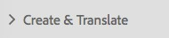
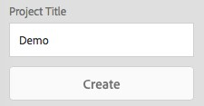
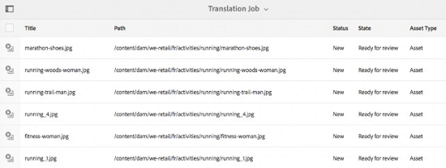
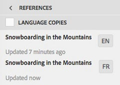
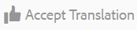

# 번역 프로젝트 만들기 {#creating-translation-projects}

>[!CAUTION]
>
>AEM 6.4가 확장 지원이 종료되었으며 이 설명서는 더 이상 업데이트되지 않습니다. 자세한 내용은 [기술 지원 기간](https://helpx.adobe.com/kr/support/programs/eol-matrix.html). 지원되는 버전 찾기 [여기](https://experienceleague.adobe.com/docs/).

언어 사본을 만들려면 자산 UI의 참조 레일에서 사용할 수 있는 다음 언어 복사 워크플로우 중 하나를 트리거하십시오.

**만들기 및 번역**

이 워크플로우에서 번역할 자산이 번역하려는 언어의 언어 루트에 복사됩니다. 또한 선택한 옵션에 따라 프로젝트 콘솔에서 자산에 대한 번역 프로젝트가 만들어집니다. 설정에 따라 번역 프로젝트를 수동으로 시작하거나 번역 프로젝트를 만드는 즉시 자동으로 실행할 수 있습니다.

**언어 사본 업데이트**

이 워크플로우를 실행하여 추가 자산 그룹을 번역하고 특정 로케일의 언어 복사본에 포함합니다. 이 경우 번역된 자산은 이미 이전에 번역된 자산이 들어 있는 대상 폴더에 추가됩니다.

>[!NOTE]
>
>자산 바이너리는 번역 서비스 공급자가 바이너리 변환을 지원하는 경우에만 변환됩니다.

>[!NOTE]
>
>PDF 및 InDesign 파일과 같은 복잡한 자산에 대한 번역 워크플로우를 실행하는 경우, 해당 하위 자산 또는 표현물이 번역을 위해 제출되지 않습니다.

## 워크플로우 만들기 및 번역 {#create-and-translate-workflow}

작성 및 번역 워크플로우를 사용하여 처음으로 특정 언어의 언어 사본을 생성할 수 있습니다. 워크플로우는 다음 옵션을 제공합니다.

* 구조만 생성
* 새 번역 프로젝트 만들기
* 기존 번역 프로젝트에 추가

### 구조만 생성 {#create-structure-only}

Use the **Create structure only** option to create a target folder hierarchy within the target language root to match the hierarchy of the source folder within the source language root. In this case, source assets are copied to the destination folder. However, no translation project is generated.

1. Assets UI에서 대상 언어 루트에서 구조를 만들 소스 폴더를 선택합니다.
1. Open the **[!UICONTROL References]** pane and click/tap **[!UICONTROL Language Copies]** under **[!UICONTROL Copies]**.

   

1. 클릭/탭 **[!UICONTROL 작성 및 번역]** 아래에 있습니다.

   

1. 에서 **[!UICONTROL Target 언어]** 목록에서 폴더 구조를 만들 언어를 선택합니다.

   

1. From the **[!UICONTROL Project]** list, choose **[!UICONTROL Create structure only]**.

   

1. Click/tap **[!UICONTROL Create]**. 대상 언어의 새 구조는 아래에 나와 있습니다 **[!UICONTROL 언어 복사]**.

   

1. 목록에서 구조를 클릭/탭한 다음, 클릭/탭합니다 **[!UICONTROL 자산에 표시]** 대상 언어 내에서 폴더 구조로 이동합니다.

   

### 새 번역 프로젝트 만들기 {#create-a-new-translation-project}

이 옵션을 사용하면 변환할 자산이 번역할 언어의 언어 루트에 복사됩니다. 선택한 옵션에 따라 프로젝트 콘솔에서 자산에 대한 번역 프로젝트가 만들어집니다. 설정에 따라 번역 프로젝트를 수동으로 시작하거나 번역 프로젝트를 만드는 즉시 자동으로 실행할 수 있습니다.

1. Assets UI에서 언어 사본을 만들 소스 폴더를 선택합니다.
1. Open the **[!UICONTROL References]** pane and click/tap **[!UICONTROL Language Copies]** under **[!UICONTROL Copies]**.

   

1. 클릭/탭 **[!UICONTROL 작성 및 번역]** 아래에 있습니다.

   

1. From the **[!UICONTROL Target Languages]** list, select the language(s) for which you want to create a folder structure.

   

1. 에서 **[!UICONTROL 프로젝트]** 목록, 선택 **[!UICONTROL 새 번역 프로젝트 만들기]**.

   

1. In the **[!UICONTROL Project Title]** field, enter a title for the project.

   

1. 클릭/탭 **[!UICONTROL 만들기]**. 소스 폴더의 자산이 4단계에서 선택한 로케일의 대상 폴더에 복사됩니다.

   

1. 폴더로 이동하려면 언어 사본을 선택하고 **[!UICONTROL 자산에 표시]**.

   

1. 프로젝트 콘솔로 이동합니다. 번역 폴더가 프로젝트 콘솔에 복사됩니다.

   

1. 폴더를 열어 번역 프로젝트를 확인합니다.

   

1. 프로젝트를 클릭/탭하여 세부 사항 페이지를 엽니다.

   

1. 번역 작업의 상태를 보려면 아래 줄임표를 클릭합니다 **[!UICONTROL 번역 작업]** 타일.

   

   작업 상태에 대한 자세한 내용은 [번역 작업 상태 모니터링](/help/sites-administering/tc-manage.md#monitoring-the-status-of-a-translation-job).

1. 자산 UI로 이동하고 번역된 각 자산에 대한 속성 페이지를 열어 번역된 메타데이터를 확인합니다.

   

   >[!NOTE]
   >
   >이 기능은 자산과 폴더에 모두 사용할 수 있습니다. 폴더 대신 자산을 선택하면 언어 루트에 대한 폴더의 전체 계층 구조가 복사되어 자산에 대한 언어 사본을 만듭니다.

### 기존 번역 프로젝트에 추가 {#add-to-existing-translation-project}

이 옵션을 사용하는 경우 이전 번역 워크플로우를 실행한 후 소스 폴더에 추가하는 자산에 대해 번역 워크플로우가 실행됩니다. 새로 추가된 자산만 이전에 번역된 자산이 포함된 대상 폴더에 복사됩니다. 이 경우에는 새 번역 프로젝트가 생성되지 않습니다.

1. 자산 UI에서 번역되지 않은 자산이 포함된 소스 폴더로 이동합니다.
1. Select an asset you want to translate, and open the **[!UICONTROL Reference pane]**. The **[!UICONTROL Language Copies]** section displays the number of translation copies that are currently available.
1. Click/tap **[!UICONTROL Language Copies]** under **[!UICONTROL Copies]**. A list of available translation copies is displayed.
1. 클릭/탭 **[!UICONTROL 작성 및 번역]** 아래에 있습니다.

   

1. From the **[!UICONTROL Target Languages]** list, select the language(s) for which you want to create a folder structure.

   

1. From the **[!UICONTROL Project]** list, select **[!UICONTROL Add to existing translation project]** to run the translation workflow on the folder.

   

   >[!NOTE]
   >
   >을(를) 선택하는 경우 **[!UICONTROL 기존 번역 프로젝트에 추가]** 옵션을 선택하면 프로젝트 설정이 기존 프로젝트의 설정과 정확히 일치하는 경우에만 번역 프로젝트가 기존 프로젝트에 추가됩니다. 그렇지 않으면 새 프로젝트가 만들어집니다.

1. 에서 **[!UICONTROL 기존 번역 프로젝트]** 목록에서 프로젝트를 선택하여 변환할 자산을 추가합니다.

   

1. Click/tap **[!UICONTROL Create]**. The assets to be translated are added to the target folder. The updated folder is listed under the **[!UICONTROL Language Copies]** section.

   

1. 프로젝트 콘솔로 이동하고 추가한 기존 번역 프로젝트를 엽니다.
1. 프로젝트 세부 사항 페이지에서 번역 프로젝트 보기를 클릭/탭합니다.

   

1. 아래쪽의 줄임표를 클릭/탭합니다 **번역 작업** 타일을 사용하여 번역 워크플로우에서 자산을 볼 수 있습니다. 번역 작업 목록에는 에셋 메타데이터와 태그에 대한 항목도 표시됩니다. 이 항목들은 에셋의 메타데이터와 태그도 번역됨을 나타냅니다.

   >[!NOTE]
   >
   >태그나 메타데이터의 항목을 삭제하는 경우, 자산에 대해 태그나 메타데이터가 번역되지 않습니다.

   >[!NOTE]
   >
   >기계 번역을 사용하는 경우 자산 바이너리가 번역되지 않습니다.

   >[!NOTE]
   >
   >번역 작업에 추가하는 자산에 하위 자산이 포함되어 있는 경우, 하위 자산을 선택하고 번역을 위해 해당 자산을 제거하여 결함 없이 진행합니다.

1. 자산에 대한 번역을 시작하려면, **[!UICONTROL 번역 작업]** 타일을 선택하고 **[!UICONTROL 시작]** 참조하십시오.

   

   번역 작업 시작을 알리는 메시지가 나타납니다.

   

1. 번역 작업의 상태를 보려면 페이지의 맨 아래에 있는 줄임표를 클릭/탭합니다 **[!UICONTROL 번역 작업]** 타일.

   

   자세한 내용은 [번역 작업 상태 모니터링](/help/sites-administering/tc-manage.md#monitoring-the-status-of-a-translation-job).

1. 번역이 완료되면 상태가 검토 준비로 변경됩니다. 자산 UI로 이동하고 번역된 각 자산에 대한 속성 페이지를 열어 번역된 메타데이터를 확인합니다.

## 언어 사본 업데이트 {#update-language-copies}

이 워크플로우를 실행하여 추가 자산 세트를 번역하고 특정 로케일의 언어 복사본에 포함합니다. 이 경우 번역된 자산은 이미 이전에 번역된 자산이 들어 있는 대상 폴더에 추가됩니다. 옵션 선택에 따라 번역 프로젝트가 만들어지거나 새 자산에 대해 기존 번역 프로젝트가 업데이트됩니다. 언어 사본 업데이트 워크플로우에는 다음 옵션이 포함됩니다.

* 새 번역 프로젝트 만들기
* 기존 번역 프로젝트에 추가

### 새 번역 프로젝트 만들기 {#create-a-new-translation-project-1}

이 옵션을 사용하는 경우 언어 사본을 업데이트할 자산 세트에 대해 번역 프로젝트가 만들어집니다.

1. Assets UI에서 자산을 추가한 소스 폴더를 선택합니다.
1. Open the **[!UICONTROL References]** pane, and click/tap **[!UICONTROL Language Copies]** under **[!UICONTROL Copies]** to display the list of language copies.
1. Select the check box before **[!UICONTROL Language Copies]**, and then select the target folder corresponding to the appropriate locale.

   

1. 클릭/탭 **[!UICONTROL 언어 사본 업데이트]** 아래에 있습니다.

   

1. 에서 **[!UICONTROL 프로젝트]** 목록, 선택 **[!UICONTROL 새 번역 프로젝트 만들기]**.

   

1. In the **[!UICONTROL Project Title]** field, enter a title for the project.

   

1. Click/tap **[!UICONTROL Start]**.
1. 프로젝트 콘솔로 이동합니다. 번역 폴더가 프로젝트 콘솔에 복사됩니다.

   

1. 폴더를 열어 번역 프로젝트를 확인합니다.

   

1. 프로젝트를 클릭/탭하여 세부 사항 페이지를 엽니다.

   

1. 자산의 번역을 시작하려면 **[!UICONTROL 번역 작업]** 타일을 선택하고 **[!UICONTROL 시작]** 참조하십시오.

   

   번역 작업 시작을 알리는 메시지가 나타납니다.

   

1. 번역 작업의 상태를 보려면 페이지의 맨 아래에 있는 줄임표를 클릭/탭합니다 **[!UICONTROL 번역 작업]** 타일.

   

   작업 상태에 대한 자세한 내용은 [번역 작업 상태 모니터링](../sites-administering/tc-manage.md#monitoring-the-status-of-a-translation-job).

1. 자산 UI로 이동하고 번역된 각 자산에 대한 속성 페이지를 열어 번역된 메타데이터를 확인합니다.

### 기존 번역 프로젝트에 추가 {#add-to-existing-translation-project-1}

이 옵션을 사용하는 경우 자산 세트가 기존 번역 프로젝트에 추가되어 선택한 로케일의 언어 사본을 업데이트합니다.

1. 자산 UI에서 자산 폴더를 추가한 소스 폴더를 선택합니다.
1. Open the **[!UICONTROL References pane]**, and click/tap **[!UICONTROL Language Copies]** under **[!UICONTROL Copies]** to display the list of language copies.

   

1. Select the check box before **[!UICONTROL Language Copies]**, which selects all language copies. Unselect other copies except the language copy (copies) corresponding to the locale(s) to which you want to translate.

   

1. 클릭/탭 **[!UICONTROL 언어 사본 업데이트]** 아래에 있습니다.

   

1. 에서 **[!UICONTROL 프로젝트]** 목록, 선택 **[!UICONTROL 기존 번역 프로젝트에 추가]**.

   

1. 에서 **[!UICONTROL 기존 번역 프로젝트]** 목록에서 프로젝트를 선택하여 변환할 자산을 추가합니다.

   

1. Click/tap **[!UICONTROL Start]**.
1. 9-14단계를 참조하십시오 [기존 번역 프로젝트에 추가](translation-projects.md#add-to-existing-translation-project) 나머지 절차를 마치다.

## 임시 언어 사본 만들기 {#creating-temporary-language-copies}

번역 워크플로우를 실행하여 편집된 원래 자산의 버전으로 언어 사본을 업데이트하면 번역된 자산을 승인할 때까지 기존 언어 사본이 유지됩니다. [!DNL Experience Manager] Assets는 새로 번역된 자산을 임시 위치에 저장하고, 명시적으로 자산을 승인한 후 기존 언어 사본을 업데이트합니다. 자산을 거부하면 언어 사본은 변경되지 않은 상태로 유지됩니다.

1. Click/tap the source root folder under **[!UICONTROL Language Copies]** for which you already created a languag copy, and then click/tap **[!UICONTROL Reveal in Assets]** to open the folder in Assets.[!DNL Experience Manager]

   

1. Assets UI에서 이미 번역한 자산을 선택하고 **[!UICONTROL 편집]** 아이콘을 클릭하여 자산을 편집 모드로 엽니다.

   

1. 자산을 편집한 다음 변경 사항을 저장합니다.
1. 2-14단계를 수행합니다. [기존 번역 프로젝트에 추가](#add-to-existing-translation-project) 언어 사본 업데이트 절차
1. 아래쪽의 줄임표를 클릭/탭합니다 **[!UICONTROL 번역 작업]** 타일. 의 자산 목록에서 **[!UICONTROL 번역 작업]** 페이지에서 번역된 버전의 자산이 저장되는 임시 위치를 명확하게 볼 수 있습니다.

   

1. 옆에 있는 확인란을 선택합니다 **[!UICONTROL 제목]**.
1. From the toolbar, click/tap **[!UICONTROL Accept Translation]** and then click/tap **[!UICONTROL Accept]** in the dialog to overwrite the translated asset in the target folder with the translated version of the edited asset.

   

   >[!NOTE]
   >
   >번역 워크플로우에서 대상 자산을 업데이트하도록 하려면 자산과 메타데이터를 모두 수락합니다.

   클릭/탭 **[!UICONTROL 번역 거부]** 원래 번역된 버전의 자산을 대상 로케일 루트에서 유지하고 편집된 버전을 거부하려면 다음을 수행하십시오.

   

1. 자산 콘솔로 이동하고 번역된 각 자산에 대한 속성 페이지를 열어 번역된 메타데이터를 확인합니다.

자산에 대한 메타데이터를 효율적으로 번역하는 방법에 대한 팁은 다음 보관된 페이지를 참조하십시오. [메타데이터를 효율적으로 번역하는 5단계](https://web.archive.org/web/20181217033517/https://blogs.adobe.com/experiencedelivers/experience-management/translate_aemassets_metadata/).
