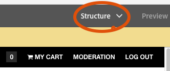

# 3D 사이트 구성 요소 작업 {#working-with-the-d-sites-component}

AEM 3D에는 웹 페이지에서 3D 모델의 대화형 보기를 구현하는 데 사용할 수 있는 AEM Sites 구성 요소가 포함되어 있습니다.

3D 구성 요소를 추가한 후 해당 구성 요소의 3D 자산을 [볼 수 있습니다.](viewing-3d-assets.md)

## 페이지 템플릿에 3D 구성 요소 추가 {#adding-the-d-component-to-the-page-template}

페이지에서 3D 구성 요소를 활성화해야 페이지에 배치할 수 있습니다. 템플릿에서 [구성 요소](/help/sites-authoring/templates.md#editing-a-template-layout-template-author) 활성화에 대한 자세한 내용은 템플릿 편집을 참조하십시오.

**페이지 템플릿에 3D 구성 요소 추가**:

1. 도구 > **[!UICONTROL 일반 > 템플릿으로 이동합니다]**.

1. 에서 3D 구성 요소를 활성화할 페이지 템플릿으로 이동하고 템플릿을 선택합니다.

1. 편집을 **[!UICONTROL 눌러]** 템플릿을 엽니다.
1. 페이지의 오른쪽 위 근처에 있는 드롭다운 메뉴에서 구조 **** 모드를 선택합니다(아직 활성화되지 않은 경우).

   

1. 레이아웃 컨테이너 **[!UICONTROL 영역을]** 눌러 선택합니다.

1. 정책 **[!UICONTROL 단추를]** 눌러 **[!UICONTROL 정책 편집기를 엽니다]**.
1. [ **[!UICONTROL 속성]** ] 섹션에서 **[!UICONTROL 3D]** 체크 표시를 선택한 다음 **[!UICONTROL 완료를]** 눌러 변경 사항을 저장하고 **** Policy Editor을 닫습니다.

   이제 이 템플릿을 사용하는 모든 페이지에 3D 사이트 구성 요소를 배치할 수 있습니다.

## 웹 페이지에 3D 뷰어 구성 요소 추가 {#adding-the-d-viewer-component-to-a-web-page}

>[!CAUTION]
>
>이 버전의 AEM 3D는 각 웹 페이지에서 3D 구성 요소의 인스턴스를 하나만 지원합니다. 동일한 페이지의 여러 3D 구성 요소가 제대로 작동하지 않습니다.

**웹 페이지에 3D 뷰어 구성 요소를 추가하려면**:

1. AEM Sites을 열고 3D 구성 요소를 추가할 웹 페이지를 선택합니다.

1. 편집 **** (연필) 아이콘을 눌러 페이지를 페이지 편집기로 엽니다. 페이지 오른쪽 **[!UICONTROL 상단]** 근처에 있는 편집 모드가 선택되어 있는지 확인합니다.

   

1. 레일 선택기를 눌러 사이드 패널을 엽니다.

1. 더하기 기호 아이콘을 눌러 구성 요소 **[!UICONTROL 목록을]** 엽니다.

1. [ **[!UICONTROL 구성 요소]** ] 목록에서 **[!UICONTROL 3D 뷰어]** 구성 요소를 3D 뷰어를 표시할 페이지의 위치로 드래그합니다.

## 3D 구성 요소 구성 {#configuring-the-d-component}

1. AEM Sites 페이지 편집기에서 이전에 페이지에 추가한 **[!UICONTROL 3D 뷰어]** 구성 요소를 선택합니다.

1. 구성 **[!UICONTROL 아이콘]** (렌치)을 눌러 구성 요소 구성 대화 상자를 엽니다.

   다음 구성 요소 속성을 설정할 수 있습니다.

   <table> 
    <tbody> 
    <tr> 
    <td>속성</td> 
    <td>설명</td> 
    <td>적용 가능성</td> 
    </tr> 
    <tr> 
    <td>높이(픽셀)</td> 
    <td>3D 구성 요소의 원하는 높이를 픽셀 단위로 지정합니다. 비워 두면 기본값은 600픽셀입니다.</td> 
    <td> </td> 
    </tr> 
    <tr> 
    <td>스테이지 이름</td> 
    <td>
사용 가능한 단계 목록에서 3D 단계를 선택합니다. 스테이지는 배경과 조명을 제공합니다.
 
See <a href="/help/assets/about-the-use-of-stages-in-aem-3d.md" target="_blank">About the use of stages in AEM 3D Sites</a>.
 </td> 
    <td>Adobe Dimension 자산에 대해 무시됨.</td> 
    </tr> 
    <tr> 
    <td>자동 회전 속도(RPM)</td> 
    <td>
3D 뷰어는 로드 및 재설정 후 카메라를 지속적으로 공전합니다. 자동 회전은 사용자가 수동 궤도 작업을 시작할 때 종료됩니다.
 
다음 값을 사용하여 회전 속도를 RPM으로 지정할 수 있습니다.
 
        <ul> 
        <li>오른쪽으로 회전하려면 양수 값 설정</li> 
        <li>왼쪽으로 회전하도록 음수 값 설정</li> 
        <li>자동 회전을 비활성화하려면 0 값을 설정합니다.</li> 
        </ul> 
기본값은 3 RPM이며 전체 회전당 20초에 해당합니다.    <strong>참고:</strong> 회전 속도는 60/초 프레임 속도를 가정합니다. 이러한 속도는 일반적으로 강력한 그래픽 하드웨어에서 소형 또는 중간 크기의 모델을 사용하여 가능합니다. 더 큰 모델 또는 더 느린 장치는 더 낮은 속도로 자동 회전합니다.
 </td> 
    <td>Adobe Dimension 자산에 대해 무시됨.</td> 
    </tr> 
    <tr> 
    <td>탐색 단추 색상</td> 
    <td>색상 피커를 사용하여 뷰어의 컨트롤 단추에 사용할 기본 색상을 선택합니다.</td> 
    <td>Adobe Dimension 에스에 대해 무시됨</td> 
    </tr> 
    <tr> 
    <td>탐색 호버 색상</td> 
    <td>색상 피커를 사용하여 뷰어의 컨트롤 단추에 대해 호버/선택한 색상을 선택합니다.</td> 
    <td>Adobe Dimension 자산에 대해 무시됨.</td> 
    </tr> 
    <tr> 
    <td>색상 견본 표시</td> 
    <td>나중에 사용할 수 있습니다.</td> 
    <td>Adobe Dimension 자산에 대해 무시됨.</td> 
    </tr> 
    <tr> 
    <td>GLTF 카메라 사전 설정 표시</td> 
    <td>Adobe Dimension 자산에 있을 수 있는 카메라 사전 설정을 표시하거나 숨깁니다.</td> 
    <td>Adobe Dimension 자산에만 해당됩니다.</td> 
    </tr> 
    <tr> 
    <td>GLTF 배경색</td> 
    <td>3D 모델에 배경이 없는 경우 기본 배경색입니다.</td> 
    <td>Adobe Dimension 자산에만 해당됩니다.</td> 
    </tr> 
    </tbody> 
   </table>

1. 확인 표시를 눌러 변경 사항을 저장합니다.

   구성 요소 구성 대화 상자에서 사용할 수 있는 설정 외에도 CRXDE Lite을 통해 수정할 수 있는 다양한 전역 구성 설정을 사용할 수 있습니다.
이러한 [전역 설정에 대한 자세한 내용은 고급 구성](advanced-config-3d.md) 설정을 참조하십시오.

## 구성 요소에 3D 모델 할당 {#assigning-a-d-model-to-the-component}

1. AEM Sites 페이지 편집기에서 **[!UICONTROL 자산]** 아이콘을 클릭하여 사이드 패널에서 자산 목록을 엽니다.

1. 원하지 않는 자산 유형을 숨기려면 **[!UICONTROL 3D 모델]** 필터를 선택합니다.

   

1. 편집하는 페이지에서 보려는 3D 자산을 검색하거나 스크롤합니다.

1. 자산 목록에서 3D 자산을 **[!UICONTROL 페이지에]** 이전에 배치한 **[!UICONTROL 3D 뷰어]** 구성 요소로드래그합니다.

   Adobe Dimension 에셋은 glTF open standard를 기반으로 하는 새로운 뷰어 기술을 사용하여 렌더링되지만 다른 모든 3D 에셋 유형은 클래식 AEM 3D webGL 뷰어에 의존합니다. 구성 요소는 3D 모델의 유형에 따라 적절한 뷰어를 자동으로 선택합니다.

## 3D 구성 요소가 있는 웹 페이지 미리 보기 {#previewing-a-web-page-that-has-a-d-component}

웹 페이지가 **[!UICONTROL 편집]** 모드에 있는 동안 3D 구성 요소는 3D 모델을 표시하지만 모델과 상호 작용할 수는 없습니다.

3D 구성 요소의 기능에 대한 전체 액세스 권한을 사용하여 페이지 편집기에서 웹 페이지를 미리 볼 수 있습니다.

사이트 [3D 구성 요소에서 3D 자산 보기를 참조하십시오](viewing-3d-assets.md#viewing-d-assets-in-the-sites-d-component).

**3D 구성 요소가 있는 웹 페이지를 미리 보려면 다음을 수행하십시오**.

1. 다음 중 하나를 수행합니다.

   * 페이지 오른쪽 상단에서 미리 보기를 클릭하여 미리 **[!UICONTROL 보기]** 모드로 전환합니다.
   * 브라우저의 페이지 URL `/edit.html` 에서 삭제합니다.

## 페이지 및 자산 게시 {#publishing-the-page-and-assets}

자산을 [게시하는 방법에 대한 자세한 내용은 자산](managing-assets-touch-ui.md) 게시를 참조하십시오. 페이지 [게시](/help/sites-authoring/publishing-pages.md) 방법에 대한 자세한 내용은 페이지 게시를 참조하십시오.

>[!NOTE]
>
>페이지 정보 **[!UICONTROL 메뉴의 페이지]** 게시 **[!UICONTROL 메뉴 항목을 사용하면]** 페이지와 모든 기본 페이지종속성이 게시됩니다. 3D 모델 및/또는 3D 단계(예: 텍스처 맵 및 IBL 이미지)에서 참조할 수 있는 보조 종속성은 페이지를 이러한 방식으로 게시할 때 게시되지 않습니다.
>
>Adobe은 이러한 자산을 참조하는 웹 페이지를 게시하기 전에 AEM Assets에서 직접 모든 3D 자산 및 해당 종속성을 게시하는 것이 좋습니다.

