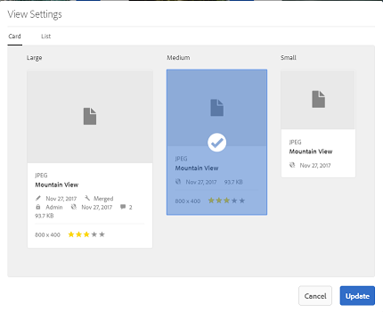
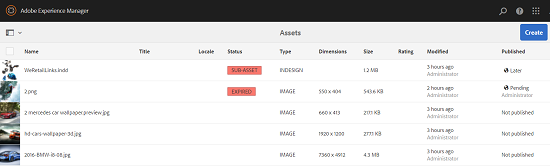

# 자산 {#user-experience-enhancements-in-assets}의 사용자 경험 개선 사항

AEM 6.4 Assets에는 완벽한 사용자 경험을 제공하고 생산성을 향상시켜주는 몇 가지 유용성 개선 사항이 포함되어 있습니다. 시장 진입 컨텐츠를 제작/관리할 수 있는 속도가 증가하면 비즈니스 컨텐츠의 속도가 향상됩니다.

인터페이스는 응답 속도가 빠릅니다. 이 경우 대규모 자산 포트폴리오를 효율적으로 관리할 수 있습니다. 긴 항목 목록을 빠르게 검색, 표시, 정렬 및 부드럽게 스크롤할 수 있습니다.

카드, 목록 및 열 보기 등 다양한 보기를 개인화할 수 있습니다. 예를 들어 카드 보기에 표시할 축소판의 크기를 구성할 수 있습니다. 목록 보기의 경우 목록의 자산에 대해 표시할 세부 정보 수준을 구성할 수 있습니다. AEM 6.4 자산에는 자산 저장소를 편리하게 탐색하고 자산을 찾을 수 있는 새로운 트리 보기가 포함되어 있습니다.

## {#lazy-loading} 로드를 지연합니다.

AEM 6.4 자산에서 자산을 검색/검색할 때, 한 번에 최대 200개의 자산이 표시됩니다. 결과를 빠르게 스크롤할 수 있습니다. 이는 긴 결과 목록을 탐색할 때 특히 유용합니다. 한 번에 많은 수의 에셋이 로드되므로 검색 환경이 원활합니다.

자산을 탭/클릭하여 세부 사항 페이지를 검토할 경우, 도구 모음에서 [뒤로] 단추를 탭/클릭하여 결과 페이지로 돌아갈 수 있습니다.

## 카드 보기 개선 사항 {#card-view-improvements}

사용하는 장치 및 필요한 세부 사항에 따라 카드 보기에서 자산 축소판의 크기를 조정할 수 있습니다. 이렇게 하면 보기를 개인화하고 표시되는 축소판 수를 제어할 수 있습니다.

카드 보기에서 축소판의 크기를 조정하려면 다음 단계를 수행합니다.

1. 도구 모음에서 레이아웃 아이콘을 탭/클릭한 다음 **[!UICONTROL 설정 보기]** 옵션을 선택합니다.

   

1. **[!UICONTROL 설정 보기]** 대화 상자에서 원하는 축소판 크기를 선택한 다음 **[!UICONTROL 업데이트]**&#x200B;를 탭/클릭합니다.

   

1. 선택한 크기로 표시되는 축소판을 검토합니다.

   

이제 카드 보기의 타일에 게시 상태와 같은 추가 정보가 표시됩니다.

## 목록 보기 개선 사항 {#list-view-improvements}

이제 목록 보기에서 첫 번째 열에 기본적으로 자산의 파일 이름이 표시됩니다. 게시 및 처리 상태 및 로케일과 같은 추가 정보도 표시됩니다.

표시할 세부 사항의 양을 구성할 수 있습니다. 레이아웃 아이콘을 탭/클릭하고 **[!UICONTROL 설정 보기]** 옵션을 선택한 다음 **[!UICONTROL 설정 보기]** 대화 상자에 표시할 열을 지정합니다.

## 열 보기 개선 사항 {#column-view-improvements}

카드 보기 및 목록 보기 외에도 이제 열 보기에서 자산의 세부 사항 페이지로 이동할 수 있습니다. 열 보기에서 자산을 선택한 다음 자산 스냅숏 아래에 있는 **[!UICONTROL 추가 세부 정보]**&#x200B;를 탭/클릭합니다.

## 트리 보기 {#tree-view}

AEM 6.4 자산에는 편리하게 자산 계층 구조를 탐색하고 원하는 자산 또는 폴더로 이동할 수 있는 트리 보기가 포함되어 있습니다.

트리 보기를 열려면 `Assets UI`에서 GlobalNav 아이콘을 탭/클릭하고 메뉴에서 **[!UICONTROL 컨텐츠 트리]**&#x200B;를 선택합니다.

컨텐츠 계층에서 원하는 자산으로 이동합니다.

## 자산 세부 정보 탐색 {#navigating-asset-details}

이제 자산 세부 사항 페이지에 도구 모음에 [이전] 및 [다음] 단추가 포함되므로 폴더의 모든 이미지를 순서대로 볼 수 있습니다.

장치에 따라 키보드의 화살표 키를 스와이프하거나 사용하여 이미지 사이를 이동할 수도 있습니다.

선택한 레이아웃에 따라 다음과 같은 방법으로 자산에 대한 세부 정보 페이지를 열 수 있습니다.

| **보기** | **자산 세부 사항 페이지를 여는 방법** |
|---|---|
| [!UICONTROL 카드 보기] | 자산 타일을 탭/클릭합니다. |
| [!UICONTROL 목록 보기] | 목록에서 자산의 행 항목을 탭/클릭합니다. |
| [!UICONTROL 열 보기] | 자산 스냅숏에서 **[!UICONTROL 추가 세부 정보]** 단추를 탭/클릭합니다. |

[이전/다음] 단추를 사용하여 에셋 간에 앞뒤로 이동합니다.

