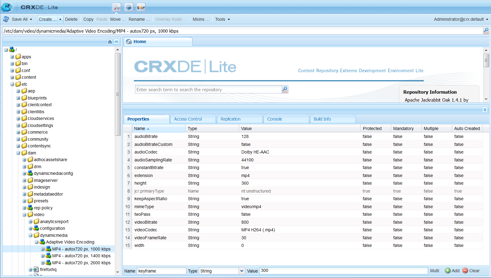

# Dynamic Media 비디오 프로필 {#video-profiles}

Dynamic Media에는 미리 정의된 응용 비디오 인코딩 프로필이 이미 포함되어 있습니다. 이 기본 프로필의 설정은 최상의 보기 환경을 고객에게 제공하기 위해 최적화되어 있습니다. 응용 비디오 인코딩 프로필을 사용하여 마스터 비디오를 인코딩할 때 재생 중에 비디오 플레이어는 고객의 인터넷 연결 속도에 따라 비디오 스트림의 품질을 자동으로 조정합니다. 이를 응용 스트리밍이라고 합니다.

다음은 비디오의 품질을 결정하는 다른 요소입니다.

* **업로드된 마스터 비디오의 해상도**

   MP4 비디오가 240p 또는 360p와 같은 저해상도로 기록된 경우 고해상도로 스트리밍될 수 없습니다.

* **비디오 플레이어 크기**

   기본적으로 응용 비디오 인코딩 프로필의 **[!UICONTROL 너비]**&#x200B;는 **[!UICONTROL 자동]**&#x200B;으로 설정됩니다. 재생하는 동안 플레이어의 크기에 따라 최상의 품질이 사용됩니다.

[비디오 인코딩에 대한 우수 사례](video.md#best-practices-for-encoding-videos)도 참조하십시오.

>[!NOTE]
>
>비디오의 메타데이터와 관련 비디오 이미지 축소판을 생성하려면 비디오 자체가 Dynamic Media의 인코딩 프로세스를 거쳐야 합니다. AEM에서, 동적 미디어를 활성화하고 비디오 클라우드 서비스를 설정한 경우 **[!UICONTROL Dynamic Media Encode Video]** 워크플로우는 비디오를 인코딩합니다. 이 워크플로우는 워크플로우 프로세스 내역 및 실패 정보를 캡처합니다.
>
>[비디오 인코딩 및 YouTube 게시 진행 모니터링](video.md#monitoring-video-encoding-and-youtube-publishing-progress)을 참조하십시오. Dynamic Media을 활성화하고 비디오 클라우드 서비스를 설정한 경우 비디오를 업로드할 때 **[!UICONTROL Dynamic Media 비디오 인코딩]** 워크플로우가 자동으로 적용됩니다. 동적 미디어를 사용하지 않는 경우 **[!UICONTROL DAM 자산 업데이트]** 워크플로우가 적용됩니다.
>
>메타데이터는 자산을 검색할 때 유용합니다. 축소판은 인코딩 중에 생성된 정적 비디오 이미지입니다. AEM 시스템이 필요하며 사용자 인터페이스에서 비디오를 시각적으로 식별하는 데 도움이 되도록 사용하여 **[!UICONTROL 카드 보기]**, **[!UICONTROL 검색 결과]** 보기 및 **[!UICONTROL 자산 목록]** 보기에서 비디오를 확인합니다. 인코딩된 비디오의 **[!UICONTROL 표현물]** 아이콘(페인터의 팔레트)을 누르면 생성된 축소판이 표시됩니다.

비디오 프로필 만들기를 완료하면 폴더 또는 여러 폴더에 해당 프로필을 적용합니다. [폴더에 비디오 프로필 적용을 참조하십시오.](#applying-a-video-profile-to-folders)

다른 자산 유형에 대한 고급 처리 매개 변수를 정의하려면 [자산 처리 구성](config-dms7.md#configuring-asset-processing)을 참조하십시오.

## 응용 비디오 인코딩 사전 설정 {#adaptive-video-encoding-presets}

다음 표는 모바일 및 태블릿 디바이스 및 데스크탑 컴퓨터에 적응형 비디오 스트리밍을 위한 인코딩 프로필을 식별합니다. 모든 종횡비 비디오에 이러한 사전 설정을 사용할 수 있습니다.

<table> 
 <tbody> 
  <tr> 
   <td><strong>비디오 형식 코덱</strong></td> 
   <td><strong>비디오 크기 - 너비(px)</strong></td> 
   <td><strong>비디오 크기 - 높이(px)</strong></td> 
   <td><strong>종횡비를 유지합니까?</strong></td> 
   <td><strong>비디오 비트 전송률(Kbps)</strong></td> 
   <td><strong>비디오 프레임 속도(Fps)</strong></td> 
   <td><strong>오디오 코덱</strong></td> 
   <td><strong>오디오 비트 전송률(Kbps)</strong></td> 
  </tr> 
  <tr> 
   <td>
MP4 H.264(mp4)
 </td> 
   <td>auto</td> 
   <td>360</td> 
   <td>예</td> 
   <td>730년</td> 
   <td>30</td> 
   <td>Dolby HE-AAC</td> 
   <td>128년</td> 
  </tr> 
  <tr> 
   <td>
MP4 H.264(mp4)
 </td> 
   <td>auto</td> 
   <td>540년</td> 
   <td>예</td> 
   <td>2000  </td> 
   <td>30</td> 
   <td>Dolby HE-AAC</td> 
   <td>128년</td> 
  </tr> 
  <tr> 
   <td>
MP4 H.264(mp4)
 </td> 
   <td>auto</td> 
   <td>720  </td> 
   <td>예</td> 
   <td>3000  </td> 
   <td>30</td> 
   <td>Dolby HE-AAC</td> 
   <td>128년</td> 
  </tr> 
 </tbody> 
</table>

## 적응형 스트리밍을 위한 Dynamic Media 비디오 인코딩 프로필 만들기 {#creating-a-video-encoding-profile-for-adaptive-streaming}

Dynamic Media에는 이미 최상의 보기 경험을 위해 최적화된 MP4 H.264-용 비디오 업로드 설정 그룹, 사전 정의된 응용 비디오 인코딩 프로필이 포함되어 있습니다. 비디오를 업로드할 때 이 프로필을 사용할 수 있습니다.

그러나 사전 정의된 이 프로필이 사용자의 요구 사항을 충족하지 않을 경우 자신만의 응용 비디오 인코딩 프로필을 만들도록 선택할 수 있습니다. 응용 스트리밍을 위해 **[!UICONTROL 인코딩]**-*최적의 방법* 설정을 사용하는 경우 프로파일에 추가하는 모든 인코딩 사전 설정의 유효성을 검사하여 모든 비디오의 종횡비가 동일한지 확인합니다. 또한 인코딩된 비디오는 스트리밍을 위한 다중 비트 전송률 세트로 처리됩니다.

비디오 인코딩 프로필을 만들면 대부분의 인코딩 옵션이 권장되는 기본 설정으로 미리 채워져 있는 것을 확인할 수 있습니다. 그러나 권장 기본값 이외의 값을 선택하는 경우 재생 중 비디오 품질이 저하되거나 다른 성능 문제가 발생할 수 있습니다.

따라서 프로필의 모든 MP4 H.264 비디오 인코딩 사전 설정에 대해 다음 값의 유효성이 검사되어 프로필의 개별 인코딩 사전 설정에서 동일한지 확인하여 적응형 스트리밍을 가능하게 만듭니다.

* 비디오 포맷 코덱스 - MP4 H.264(.mp4)
* 오디오 코덱
* 오디오 비트율
* 종횡비 유지
* 2패스 인코딩
* 상수 비트율
* H264 프로필
* 오디오 샘플링 속도

값이 동일하지 않으면 프로파일을 그대로 계속 만들 수 있습니다. 그러나 적응형 스트리밍은 가능하지 않습니다. 대신 단일 비트 전송률 스트리밍을 경험할 수 있습니다. 프로필의 개별 인코딩 사전 설정에서 동일한 값을 사용하도록 인코딩 설정을 편집하는 것이 좋습니다. 응용 스트리밍에 대해 인코딩&#x200B;**[!UICONTROL 이 활성화되어 있으면 비디오 프로필/사전 설정 편집기가 응용 비디오 인코딩 설정의 패리티를 적용해야 합니다.]**

점진적 스트리밍을 위한 비디오 인코딩 프로필 만들기[를 참조하십시오.](#creating-a-video-encoding-profile-for-progressive-streaming)

[비디오 인코딩에 대한 우수 사례](video.md#best-practices-for-encoding-videos)도 참조하십시오.

다른 자산 유형에 대한 고급 처리 매개 변수를 정의하려면 [자산 처리 구성](config-dms7.md#configuring-asset-processing)을 참조하십시오.

비디오 프로필 만들기를 완료하면 폴더 또는 여러 폴더에 해당 프로필을 적용합니다.

**적응형 스트리밍을 위한 Dynamic Media 비디오 인코딩 프로필을 만들려면 다음을 수행하십시오**.

1. AEM 로고를 탭하거나 클릭하고 **[!UICONTROL 도구 > 자산 > 비디오 프로필]**&#x200B;으로 이동합니다.
1. **[!UICONTROL 만들기]**&#x200B;를 눌러 새 비디오 프로필을 추가합니다.

1. 프로필의 이름과 설명을 입력합니다.
1. 응용 스트리밍을 위해 **[!UICONTROL 인코딩이 선택되었는지 확인합니다(기본값).]**
1. **[!UICONTROL 비디오 인코딩 사전 설정 추가]**&#x200B;를 누릅니다.
1. **[!UICONTROL 기본]** 탭에서 비디오 및 오디오 옵션을 설정합니다.

   선택한 비디오 형식 코덱에 따라 추가 설명이나 권장 설정을 보려면 각 옵션 옆에 있는 정보 아이콘을 누릅니다.

1. 비디오 크기 머리글 아래에서 **[!UICONTROL 종횡비 유지]**&#x200B;가 선택되어 있는지 확인합니다.
1. 비디오 프레임 크기 해상도를 픽셀 단위로 설정합니다. 소스 종횡비(폭과 높이 비율)에 맞게 자동으로 크기를 조절하려면 **[!UICONTROL 자동]** 값을 사용합니다. 예: 자동 x 480 또는 640 x 자동.

   다음 중 하나를 수행하십시오.

   * **[!UICONTROL 너비]** 필드에 **[!UICONTROL 자동]**&#x200B;을 입력합니다. **[!UICONTROL 높이]** 필드에 값을 픽셀 단위로 입력합니다.
   * 비디오 크기를 시각화하는 데 도움이 되도록 **[!UICONTROL 높이]**&#x200B;의 오른쪽에 있는 **[!UICONTROL 정보]** 아이콘(i)을 눌러 **[!UICONTROL 크기 계산기]** 페이지를 엽니다. **[!UICONTROL 크기 계산기]**&#x200B;를 사용하여 원하는 비디오 크기(파란색 상자로 표시됨)를 설정합니다. 완료되면 오른쪽 위 모서리의 **[!UICONTROL X]**&#x200B;을 누릅니다.

1. (선택 사항) **[!UICONTROL 고급]** 탭을 누르고 **[!UICONTROL 기본값 사용]** 확인란이 선택되어 있는지 확인합니다(권장). 또는 고급 비디오 및 오디오 설정을 수정합니다.
1. 페이지의 오른쪽 위 모서리에서 **[!UICONTROL 저장]**&#x200B;을 눌러 사전 설정을 저장합니다.
1. 다음 중 하나를 수행하십시오.

   * 5-10단계를 반복하여 추가 인코딩 사전 설정을 만듭니다. 응용 비디오 스트리밍에는 둘 이상의 비디오 사전 설정이 필요합니다.
   * 페이지의 오른쪽 위 모서리에서 **[!UICONTROL 저장]**&#x200B;을 다시 눌러 프로필을 저장합니다.

## 인코딩 작업 진행 모니터링 {#monitoring-the-progress-of-an-encoding-job}

비디오 인코딩 작업의 진행 상태를 시각적으로 모니터링할 수 있도록 처리 표시기(또는 진행률 막대)가 표시됩니다.

또한 `error.log` 파일을 보면 인코딩 작업의 진행 상태를 모니터링하거나 인코딩이 완료되었는지 확인하거나 작업 오류를 확인할 수 있습니다. `error.log`은 AEM 인스턴스가 설치된 `logs` 폴더에 있습니다.

## 점진적 스트리밍을 위한 Dynamic Media 비디오 인코딩 프로필 만들기 {#creating-a-video-encoding-profile-for-progressive-streaming}

응용 스트리밍을 위해 **[!UICONTROL 인코딩]** 옵션을 사용하지 않기로 선택한 경우 프로파일에 추가하는 모든 인코딩 사전 설정은 단일 비트 전송률 스트리밍 또는 점진적 비디오 전달을 위한 개별 비디오 변환으로 취급됩니다. 또한 모든 비디오 표현물의 종횡비가 동일한지 확인할 수 있는 확인이 없습니다.

실행 중인 모드에 따라 지원되는 비디오 형식 코덱은 다음과 같습니다.

* Dynamic Media-Scene7 모드:H.264(.mp4)
* Dynamic Media-하이브리드 모드:H.264(.mp4), WebM

응용 스트리밍을 위한 비디오 인코딩 프로필 만들기[를 참조하십시오.](#creating-a-video-encoding-profile-for-adaptive-streaming)

[비디오 인코딩에 대한 우수 사례](video.md#best-practices-for-encoding-videos)도 참조하십시오.

다른 자산 유형에 대한 고급 처리 매개 변수를 정의하려면 [자산 처리 구성](config-dms7.md#configuring-asset-processing)을 참조하십시오.

비디오 프로필 만들기를 완료하면 폴더 또는 여러 폴더에 해당 프로필을 적용합니다.

**점진적 스트리밍을 위한 Dynamic Media 비디오 인코딩 프로필을 만들려면:**

1. AEM 로고를 누르고 **[!UICONTROL 도구 > 자산 > 비디오 프로필]**&#x200B;으로 이동합니다.
1. **[!UICONTROL 만들기]**&#x200B;를 눌러 새 비디오 프로필을 추가합니다.
1. 프로필의 이름과 설명을 입력합니다.
1. 응용 스트리밍을 위해 **[!UICONTROL 인코딩]** 확인란을 선택 취소합니다.
1. **[!UICONTROL 비디오 인코딩 사전 설정 추가]**&#x200B;를 누릅니다.
1. **[!UICONTROL 기본]** 탭에서 비디오 및 오디오 옵션을 설정합니다.

   선택한 비디오 형식 코덱에 따른 추가 설명 또는 권장 설정을 보려면 각 옵션 옆에 있는 **[!UICONTROL 정보]** 아이콘을 누릅니다.

1. (선택 사항) **비디오 크기** 머리글 아래에서 **[!UICONTROL 종횡비 유지]**&#x200B;의 선택을 취소합니다.
1. **[!UICONTROL 너비]** 필드에 **[!UICONTROL 자동]**;을 입력합니다.**[!UICONTROL 높이]** 필드 오른쪽에 있는 **[!UICONTROL 정보]** 아이콘을 누릅니다. **[!UICONTROL 크기 계산기]** 페이지를 사용하여 원하는 비디오 차원(파란색 상자)을 추가로 설정합니다. 완료되면 **[!UICONTROL X]**&#x200B;을 누릅니다.
1. (선택 사항) 다음 중 하나를 수행합니다.

   * **[!UICONTROL 고급]** 탭을 누르고 **[!UICONTROL 기본값 사용]** 확인란이 선택되어 있는지 확인합니다(권장).
   * **[!UICONTROL 기본값 사용]** 확인란의 선택을 취소하고 원하는 비디오 설정과 오디오 설정을 지정합니다.

      선택한 비디오 형식 코덱에 따른 추가 설명 또는 권장 설정을 보려면 각 옵션 옆에 있는 **[!UICONTROL 정보]** 아이콘을 누릅니다.

1. 페이지의 오른쪽 위 모서리에서 **[!UICONTROL 저장]**&#x200B;을 눌러 사전 설정을 저장합니다.
1. 다음 중 하나를 수행하십시오.

   * 5-10단계를 반복하여 추가 인코딩 사전 설정을 만듭니다.
   * 페이지의 오른쪽 위 모서리에서 **[!UICONTROL 저장]**&#x200B;을 눌러 프로필을 저장합니다.

## 사용자 정의 추가 비디오 인코딩 매개 변수 {#using-custom-added-video-encoding-parameters} 사용

AEM에서 비디오 프로필을 만들거나 편집할 때 사용자 인터페이스에 없는 고급 비디오 인코딩 매개 변수를 활용하려면 기존 비디오 인코딩 프로필을 편집할 수 있습니다. 사용자 정의 프로필에는 **[!UICONTROL minBitrate]** 및 **[!UICONTROL maxBitrate]**&#x200B;와 같은 하나 이상의 고급 매개 변수를 추가합니다.

**사용자 정의 추가 비디오 인코딩 매개 변수를 사용하려면 다음을 수행하십시오**.

1. AEM 로고를 누른 다음 **[!UICONTROL 도구 > 일반 > CRXDE Lite]**&#x200B;로 이동합니다.
1. **[!UICONTROL CRXDE Lite]** 페이지의 왼쪽에 있는 **[!UICONTROL 탐색기]** 패널에서 다음 항목으로 이동합니다.

   `/conf/global/settings/dam/dm/presets/video/*name_of_video_encoding_profile_to_edit*`

1. 페이지 오른쪽 하단의 패널에서 **[!UICONTROL 속성]** 탭에서 사용할 매개 변수의 **[!UICONTROL 이름]**, **[!UICONTROL 유형]** 및 **[!UICONTROL 값]**&#x200B;을 지정합니다.

   다음 고급 매개 변수를 사용할 수 있습니다.

   <table> 
    <tbody> 
    <tr> 
    <td><strong>이름</strong></td> 
    <td><strong>설명</strong>  </td> 
    <td><strong>유형</strong>  </td> 
    <td><strong>값</strong></td> 
    </tr> 
    <tr> 
    <td><code>h264Level</code></td> 
    <td>인코딩에 사용할 H.264 수준입니다. 일반적으로 사용 중인 인코딩 설정에 따라 자동으로 결정됩니다.</td> 
    <td><code>String</code></td> 
    <td>
10 * h264 레벨
 
예를 들어 3.0 = 30, 1.3 = 13)
 
기본값이 없습니다.
 </td> 
    </tr> 
    <tr> 
    <td><code>keyframe</code></td> 
    <td>키프레임 사이의 대상 프레임 수입니다. 이 값을 계산하여 2-10초마다 키프레임을 생성합니다. 예를 들어 초당 30프레임인 경우 키프레임 간격은 60-300이어야 합니다.    키프레임 간격을 줄여 적응 비디오 인코딩에 대한 스트림 검색 및 스트림 전환 동작을 향상시킬 수 있으며 모션이 많은 비디오의 품질을 향상시킬 수 있습니다. 그러나 키프레임은 파일 크기를 증가하므로 키프레임 간격이 작으면 지정된 비트 전송률로 전반적인 비디오 품질이 낮아집니다.</td> 
    <td><code>String</code></td> 
    <td>
양수입니다.
 
기본값은 300입니다.
 
HLS(HTTP Live Streaming)에 대한 권장 값은 60-90입니다.
 </td> 
    </tr> 
    <tr> 
    <td><code>minBitrate</code></td> 
    <td>
가변 비트 전송률 인코딩을 허용하는 최소 비트 전송률(Kbps/초당 킬로비트)입니다.
 
이 매개 변수는 비디오 인코딩 프로필을 만들거나 편집할 때 [고급] 탭에서 [상수 비트 전송률 사용<strong>]이 선택 해제된 경우에만 적용됩니다.</strong>
 
<a href="/help/assets/video.md#bitrate">비트 전송률</a>도 참조하십시오.
 </td> 
    <td><code>String</code></td> 
    <td>
양수입니다(Kbps).
 
기본값이 없습니다.
 </td> 
    </tr> 
    <tr> 
    <td><code>maxBitrate</code></td> 
    <td>
가변 비트 전송률 인코딩을 허용하는 최대 비트 전송률(Kbps)입니다.
 
이 매개 변수는 비디오 인코딩 프로필을 만들거나 편집할 때 [고급] 탭에서 [상수 비트 전송률 사용<strong>]이 선택 해제된 경우에만 적용됩니다.</strong>
 
<a href="/help/assets/video.md#bitrate">비트 전송률</a>도 참조하십시오.
 </td> 
    <td><code>String</code></td> 
    <td>
양수입니다(Kbps).
 
기본값이 없습니다. 그러나 인코딩 비트 전송률의 최대 2배까지 권장되는 값입니다.
 </td> 
    </tr> 
    <tr> 
    <td><code>audioBitrateCustom</code></td> 
    <td>오디오 코덱에서 지원하는 경우 오디오 스트림의 고정 비트 전송률을 적용하려면 값을 <code>true</code>으로 설정합니다.</td> 
    <td><code>String</code></td> 
    <td>
<code>true</code>/<code>false</code>
 
기본값은 <code>false</code>입니다.
 
HLS(HTTP Live Streaming)에 대한 권장 값은 <code>false</code>입니다.
 
 
 </td> 
    </tr> 
    </tbody> 
   </table>

   

1. 페이지의 오른쪽 아래 모서리 근처에 있는 **[!UICONTROL 추가]**&#x200B;를 탭합니다.
1. 다음 중 하나를 수행하십시오.

   * 3-4단계를 반복하여 비디오 인코딩 프로필에 다른 매개 변수를 추가합니다.
   * 페이지의 왼쪽 위 모서리 근처에 있는 **[!UICONTROL 모두 저장]**&#x200B;을 탭합니다.

1. **[!UICONTROL CRXDE Lite]** 페이지의 왼쪽 위 모서리에서 **[!UICONTROL 뒤로 홈]** 아이콘을 눌러 AEM으로 돌아갑니다.

### Dynamic Media 비디오 인코딩 프로필 {#editing-a-video-encoding-profile} 편집

해당 프로필 내에서 비디오 사전 설정을 추가, 편집 또는 삭제하기 위해 만든 모든 비디오 인코딩 프로필을 편집할 수 있습니다.

기본적으로 Dynamic Media과 함께 제공된 사전 정의된 기본 **[!UICONTROL 응용 비디오 인코딩]** 프로필을 편집할 수 없습니다. 대신 프로파일을 쉽게 복사하고 새 이름으로 저장할 수 있습니다. 그런 다음 복사한 프로필에서 원하는 사전 설정을 편집할 수 있습니다.

[비디오 인코딩에 대한 우수 사례](video.md#best-practices-for-encoding-videos)도 참조하십시오.

다른 자산 유형에 대한 고급 처리 매개 변수를 정의하려면 [자산 처리 구성](config-dms7.md#configuring-asset-processing)을 참조하십시오.

**Dynamic Media 비디오 인코딩 프로필을 편집하려면 다음을 수행하십시오**.

1. AEM 로고를 누르고 **[!UICONTROL 도구 > 자산 > 비디오 프로필]**&#x200B;으로 이동합니다.
1. **[!UICONTROL 비디오 프로필]** 페이지에서 비디오 프로필 이름을 하나 선택합니다.
1. 도구 모음에서 **[!UICONTROL 편집]**&#x200B;을 누릅니다.
1. **[!UICONTROL 비디오 인코딩 프로필]** 페이지에서 원하는 대로 이름과 설명을 편집합니다.
1. 적응형 스트리밍을 위해 **[!UICONTROL 인코딩]** 확인란이 선택되어 있는지 확인하는 것이 좋습니다.

   적응형 스트리밍에 대한 설명을 보려면 정보 아이콘을 누릅니다. 점진적 비디오 프로필을 편집하는 경우 이 확인란을 선택하지 마십시오.

1. **[!UICONTROL 비디오 인코딩 사전 설정]** 머리글 아래에서 프로필을 구성하는 비디오 인코딩 사전 설정을 추가, 편집 또는 삭제합니다.

   선택한 비디오 형식 코덱에 따라 추가 설명 또는 권장 설정을 보려면 **[!UICONTROL 기본]** 및 **[!UICONTROL 고급]** 탭의 각 옵션 옆에 있는 **[!UICONTROL 정보]** 아이콘을 누릅니다.

1. 페이지 상단 오른쪽에서 **[!UICONTROL 저장]**&#x200B;을 탭합니다.

### Dynamic Media 비디오 인코딩 프로필 {#copying-a-video-encoding-profile} 복사

1. AEM 로고를 누르고 **[!UICONTROL 도구 > 자산 > 비디오 프로필]**&#x200B;으로 이동합니다.
1. **[!UICONTROL 비디오 프로필]** 페이지에서 비디오 프로필 이름을 하나 선택합니다.
1. 도구 모음에서 **[!UICONTROL 복사]**&#x200B;를 누릅니다.
1. **[!UICONTROL 비디오 인코딩 프로필]** 페이지에서 프로필의 새 이름을 입력합니다.
1. 적응형 스트리밍을 위해 **[!UICONTROL 인코딩]** 확인란이 선택되어 있는지 확인하는 것이 좋습니다. 적응형 스트리밍에 대한 설명을 보려면 정보 아이콘을 누릅니다. 점진적 비디오 프로필을 복사하는 경우 확인란을 선택하지 마십시오.

   Dynamic Media - 하이브리드 모드에서 WebM 비디오 사전 설정이 비디오 프로필의 일부인 경우 모든 사전 설정이 MP4여야 하므로 응용 스트리밍을 위해 **[!UICONTROL 인코딩을 수행할 수 없습니다.]**
1. **[!UICONTROL 비디오 인코딩 사전 설정]** 머리글 아래에서 프로필을 구성하는 비디오 인코딩 사전 설정을 추가, 편집 또는 삭제합니다.

   권장 설정 및 설명을 보려면 **[!UICONTROL 기본]** 및 **[!UICONTROL 고급]** 탭의 각 옵션 옆에 있는 **[!UICONTROL 정보]** 아이콘을 누릅니다.

1. 페이지 상단 오른쪽에서 **[!UICONTROL 저장]**&#x200B;을 탭합니다.

### Dynamic Media 비디오 인코딩 프로필 {#deleting-a-video-encoding-profile} 삭제

1. AEM 로고를 누르고 **[!UICONTROL 도구 > 자산 > 비디오 프로필]**&#x200B;으로 이동합니다.
1. **[!UICONTROL 비디오 프로필]** 페이지에서 하나 이상의 비디오 프로필 이름을 확인합니다.
1. 도구 모음에서 **[!UICONTROL 삭제]**&#x200B;를 누릅니다.
1. **[!UICONTROL OK]**&#x200B;을 누릅니다.

## 폴더 {#applying-a-video-profile-to-folders}에 Dynamic Media 비디오 프로필 적용

비디오 프로필을 폴더에 할당하면 모든 하위 폴더는 해당 상위 폴더의 프로필을 자동으로 상속합니다. 즉, 하나의 비디오 프로필만 폴더에 할당할 수 있습니다. 따라서 에셋을 업로드, 저장, 사용 및 보관하는 폴더 구조를 주의 깊게 고려합니다.

폴더에 다른 비디오 프로필을 할당하면 새 프로필이 이전 프로필을 무시합니다. 이전 기존 폴더 자산은 변경되지 않습니다. 새 프로필이 나중에 폴더에 추가되는 자산에 적용됩니다.

프로필이 할당된 폴더는 카드 이름에 나타나는 프로필의 이름으로 사용자 인터페이스에 표시됩니다.

특정 폴더에 비디오 프로필을 적용하거나 모든 자산에 전체적으로 적용할 수 있습니다.

### 특정 폴더 {#applying-video-profiles-to-specific-folders}에 비디오 프로필 적용

**[!UICONTROL 도구]** 메뉴 내에서 또는 폴더에 있는 경우 **[!UICONTROL 속성]**&#x200B;에서 비디오 프로필을 폴더에 적용할 수 있습니다. 이 섹션에서는 두 가지 방법으로 폴더에 비디오 프로필을 적용하는 방법을 설명합니다.

프로파일이 이미 할당된 폴더가 폴더 이름 바로 아래에 프로파일 이름이 표시되어 표시됩니다.

#### 프로필 사용자 인터페이스 {#applying-video-profiles-to-folders-from-profiles-user-interface}의 폴더에 Dynamic Media 비디오 프로필 적용

1. AEM 로고를 누르고 **[!UICONTROL 도구 > 자산 > 비디오 프로필]**&#x200B;으로 이동합니다.
1. 폴더 또는 여러 폴더에 적용할 비디오 프로필을 선택합니다.
1. **[!UICONTROL 폴더에 프로필 적용]**&#x200B;을 누르고 새로 업로드된 자산을 받는 데 사용할 폴더 또는 여러 폴더를 선택하고 **[!UICONTROL 적용]**&#x200B;을 탭합니다. 프로파일이 이미 할당된 폴더가 폴더 이름 바로 아래에 프로파일 이름이 표시되어 표시됩니다.

#### 속성 {#applying-video-profiles-to-folders-from-properties}의 폴더에 Dynamic Media 비디오 프로필 적용

1. AEM 로고를 누르고 **[!UICONTROL 자산]**&#x200B;으로 이동한 다음 비디오 프로필을 적용할 폴더로 이동합니다.
1. 폴더에서 확인 표시를 눌러 선택한 다음 **[!UICONTROL 속성]**&#x200B;을 누릅니다.
1. **[!UICONTROL 비디오 프로필]** 탭을 선택하고 드롭다운 메뉴에서 프로필을 선택하고 **[!UICONTROL 저장 및 닫기]**&#x200B;를 누릅니다. 프로파일이 이미 할당된 폴더가 폴더 이름 바로 아래에 프로파일 이름이 표시되어 표시됩니다.

   

### Dynamic Media 비디오 프로필을 전역적으로 적용 {#applying-a-video-profile-globally}

프로필을 폴더에 적용하는 것 외에도 하나의 프로필을 전역적으로 적용할 수 있으므로 모든 폴더의 AEM 자산에 업로드된 콘텐트에 선택한 프로필이 적용되도록 할 수 있습니다.

**Dynamic Media 비디오 프로필을 전체적으로 적용하려면 다음을 수행하십시오**.

1. 다음 노드로 CRXDE Lite으로 이동합니다.`/content/dam/jcr:content`.
1. 속성 **[!UICONTROL videoProfile]** 추가:`/etc/dam/video/dynamicmedia/<name_of_video_encoding_profile>`
1. **[!UICONTROL 모두 저장]**&#x200B;을 누릅니다.

## {#removing-a-video-profile-from-folders} 폴더에서 Dynamic Media 비디오 프로필 제거

폴더에서 비디오 프로필을 제거하면 모든 하위 폴더는 해당 상위 폴더에서 자동으로 프로필 제거를 상속합니다. 그러나 폴더 내에서 발생한 파일 처리는 그대로 유지됩니다.

**[!UICONTROL 도구]** 메뉴 내에서 또는 폴더에 있는 경우 **[!UICONTROL 폴더 설정]**&#x200B;에서 비디오 프로필을 제거할 수 있습니다. 이 섹션에서는 두 가지 방법으로 폴더에서 비디오 프로필을 제거하는 방법에 대해 설명합니다.

### 프로필 사용자 인터페이스 {#removing-video-profiles-from-folders-via-profiles-user-interface}을(를) 통해 폴더에서 Dynamic Media 비디오 프로필 제거

1. AEM 로고를 누르고 **[!UICONTROL 도구 > 자산 > 비디오 프로필]**&#x200B;으로 이동합니다.
1. 폴더 또는 여러 폴더에서 제거할 비디오 프로필을 선택합니다.
1. **[!UICONTROL 폴더에서 프로필 제거]**&#x200B;를 누르고 프로필을 제거하는 데 사용할 폴더 또는 여러 폴더를 선택하고 **[!UICONTROL 제거]**&#x200B;를 누릅니다.

   이름이 폴더 이름 아래에 더 이상 나타나지 않으므로 비디오 프로필이 폴더에 더 이상 적용되지 않음을 확인할 수 있습니다.

### {#removing-video-profiles-from-folders-via-properties} 속성을 통해 폴더에서 Dynamic Media 비디오 프로필 제거

1. AEM 로고를 누르고 **[!UICONTROL 자산]**&#x200B;으로 이동한 다음 비디오 프로필을 제거할 폴더로 이동합니다.
1. 폴더에서 확인 표시를 눌러 선택한 다음 **[!UICONTROL 속성]**&#x200B;을 누릅니다.
1. **[!UICONTROL 비디오 프로필]** 탭을 선택하고 드롭다운 메뉴에서 **[!UICONTROL 없음]**&#x200B;을 선택하고 **[!UICONTROL 저장 및 닫기]**&#x200B;를 누릅니다. 프로파일이 이미 할당된 폴더가 폴더 이름 바로 아래에 프로파일 이름이 표시되어 표시됩니다.

