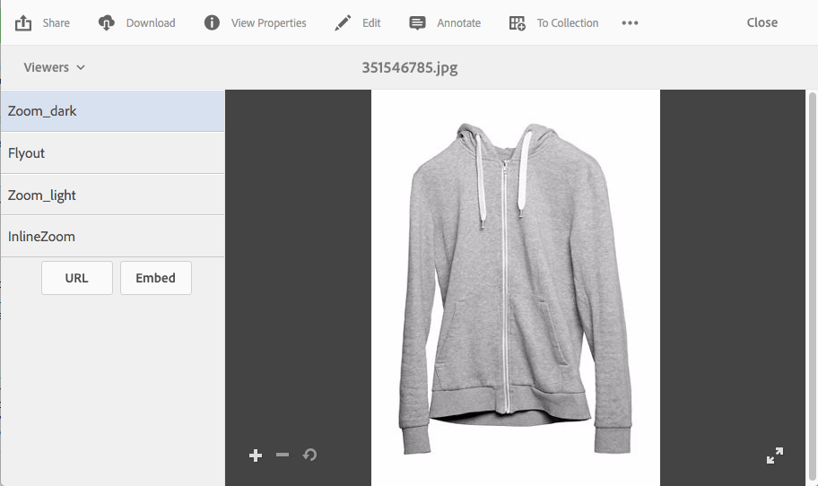

# Dynamic Media 뷰어 사전 설정 적용 {#applying-viewer-presets}

>[!CAUTION]
>
>AEM 6.4가 확장 지원이 종료되었으며 이 설명서는 더 이상 업데이트되지 않습니다. 자세한 내용은 [기술 지원 기간](https://helpx.adobe.com/kr/support/programs/eol-matrix.html). 지원되는 버전 찾기 [여기](https://experienceleague.adobe.com/docs/).

뷰어 사전 설정은 사용자가 컴퓨터 화면과 모바일 장치에서 리치 미디어 자산을 보는 방법을 결정하는 설정 모음입니다. 관리자가 만든 모든 뷰어 사전 설정을 자산에 적용할 수 있습니다.

관리자가 뷰어 사전 설정을 관리, 만들기, 정렬 및 삭제해야 하는 경우 를 참조하십시오 [뷰어 사전 설정 관리](managing-viewer-presets.md).

참조 - [뷰어 사전 설정 게시](managing-viewer-presets.md#publishing-viewer-presets).

사용 중인 게시 모드에 따라 뷰어 사전 설정을 게시할 필요가 없을 수 있습니다.
뷰어 사전 설정에 대한 모든 문제는 [Dynamic Media 문제 해결 - Scene7](troubleshoot-dms7.md#viewers).

## 자산에 Dynamic Media 뷰어 사전 설정 적용 {#applying-a-viewer-preset-to-an-asset}

1. Open the asset and in the left rail, and tap **[!UICONTROL Viewers]**.

   

   * The **[!UICONTROL URL]** and **[!UICONTROL Embed]** buttons appear after you select a viewer preset.
   * The system shows numerous viewer presets when you select Viewers in an asset&#39;s **[!UICONTROL Detail View]**. You can increase the number of presets seen. See [Increasing the number of viewer presets that display](managing-viewer-presets.md).

1. 왼쪽 창에서 뷰어를 선택하여 오른쪽 창에 표시된 대로 자산에 적용합니다. 다음을 수행할 수도 있습니다 [공유할 URL 복사](linking-urls-to-yourwebapplication.md) 다른 사용자와 공유할 수 있습니다.

## 뷰어 사전 설정 URL 가져오기 {#obtaining-viewer-preset-urls}

뷰어 사전 설정에 대한 URL을 가져오려면 다음을 참조하십시오 [URL을 웹 애플리케이션에 연결](linking-urls-to-yourwebapplication.md).
