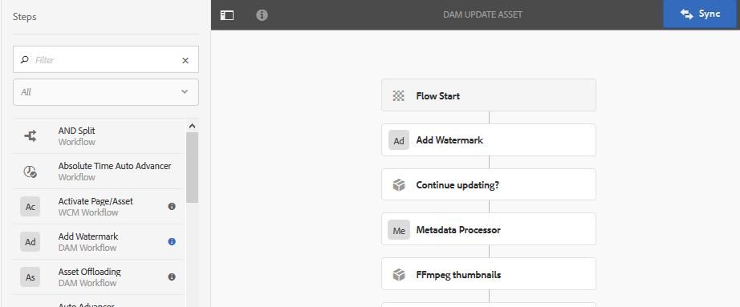

# 자산에 워터마크 지정 {#watermarking}

Adobe Experience Manager(AEM) 자산은 사용자가 자산의 인증 및 저작권 소유권을 확인하는 데 도움이 되는 이미지에 디지털 워터마크를 추가할 수 있습니다. AEM Assets은 PNG 및 JPEG 파일에서 워터마크로 사용할 텍스트를 지원합니다.

자산에 워터마크를 적용하려면 [!UICONTROL DAM 자산 업데이트] 워크플로우에서 [!UICONTROL 워터마크] 단계를 추가하십시오.

1. AEM 로고를 누르고 **[!UICONTROL 도구]** > **[!UICONTROL 워크플로우]** > **[!UICONTROL 모델]**&#x200B;으로 이동합니다.
1. 워크플로우 모델 페이지에서 **[!UICONTROL DAM 자산 업데이트]** 워크플로우를 선택하고 **[!UICONTROL 편집]**&#x200B;을 클릭합니다.

1. 사이드 패널에서 **[!UICONTROL 워터마크]** 추가 단계를 드래그하여 [!UICONTROL DAM 자산 업데이트] 워크플로우에 추가합니다.

   

   >[!NOTE]
   >
   >[!UICONTROL Process Thumbnail] 단계 앞에 [!UICONTROL 워터마크 추가] 단계를 배치합니다.

1. 속성을 표시하려면 **[!UICONTROL 워터마크 추가]** 단계를 엽니다.
1. **[!UICONTROL 인수]** 탭에서 텍스트, 글꼴 유형, 크기, 색상, 위치, 방향 등을 포함한 다양한 필드에 유효한 값을 지정합니다. 변경 내용을 확인하려면 완료 아이콘을 탭/클릭합니다.

   

1. [!UICONTROL 워터마크] 단계로 **[!UICONTROL DAM 자산 업데이트]** 작업 과정을 저장합니다.
1. AEM 사용자 인터페이스에서 샘플 자산을 업로드합니다. 워터마크는 위 단계에서 구성한 위치에 글꼴 크기, 색상 등과 함께 나타납니다.

프로그래밍 방식으로 또는 동적 정보로 PDF 문서를 워터마킹하려면 [AEM Document Services](/help/forms/using/overview-aem-document-services.md) 제공을 사용하는 것이 좋습니다.
