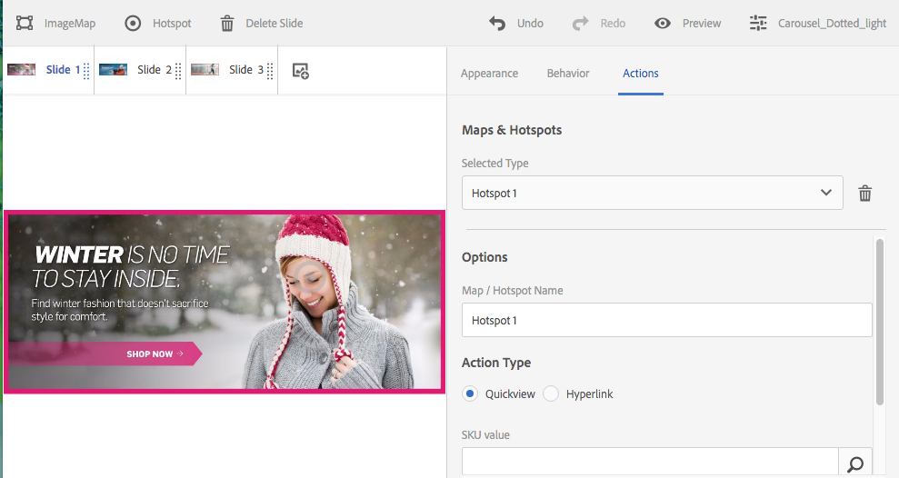

# 선택기를 사용한 작업 {#working-with-selectors}

>[!CAUTION]
>
>AEM 6.4가 확장 지원이 종료되었으며 이 설명서는 더 이상 업데이트되지 않습니다. 자세한 내용은 [기술 지원 기간](https://helpx.adobe.com/kr/support/programs/eol-matrix.html). 지원되는 버전 찾기 [여기](https://experienceleague.adobe.com/docs/).

대화형 이미지, 대화형 비디오 또는 회전 배너를 사용하여 작업하는 경우 자산을 선택하고 핫스팟과 연결할 이미지 맵의 사이트 및 제품을 선택합니다. 이미지 세트, 스핀 세트 및 멀티미디어 세트로 작업할 때 자산 선택기가 있는 자산도 선택합니다.

이 항목에서는 선택기 탐색, 필터링, 정렬 기능을 포함하여 제품, 사이트 및 자산 선택기를 사용하는 방법을 설명합니다.

회전판 세트를 만들고 핫스팟과 이미지 맵을 추가하고 대화형 비디오와 이미지를 만드는 동안 선택기에 액세스합니다.

예를 들어, 이 회전 배너에서는 핫스팟이나 이미지 맵을 Quickview 페이지에 연결하는 경우 제품 선택기를 사용합니다. 핫스팟이나 이미지 맵을 하이퍼링크에 연결하는 경우에는 사이트 선택기를 사용합니다. 새 슬라이드를 만들 때 자산 선택기를 사용합니다.

핫스팟이나 이미지 맵이 있는 위치를 수동으로 입력하지 않고 선택하면 선택기를 사용합니다. 사이트 선택기는 AEM Sites 고객인 경우에만 작동합니다. 제품 선택기도 AEM Commerce가 필요합니다.

## 제품 선택 {#selecting-products}

제품 선택기를 사용하여 핫스팟이나 이미지 맵이 제품 카탈로그의 특정 제품에 Quickview를 제공하려는 경우 제품을 선택합니다.

1. Navigate to the Carousel Set, Interactive Image, or Interactive Video, and tap the **[!UICONTROL Actions]** tab (only available if you have defined a hotspot or image map).

   제품 선택기는 **[!UICONTROL 작업 유형]** 영역.

   

1. 탭하기 **[!UICONTROL 제품 선택기]** 아이콘(확대경)을 클릭하여 카탈로그의 제품으로 이동합니다.

   

   를 탭하여 키워드 또는 태그로 필터링할 수도 있습니다 **[!UICONTROL 필터]** 키워드 입력, 태그 선택 또는 둘 다

   

   AEM에서 을 탭하여 제품 데이터를 탐색하는 위치를 변경할 수 있습니다 **[!UICONTROL 찾아보기]** 다른 폴더로 이동합니다.

   

   탭 **[!UICONTROL 정렬]** AEM을 가장 최근 항목에서 가장 오래된 항목순으로 또는 가장 오래된 항목순으로 정렬할지 여부를 변경합니다.

   

   Tap **[!UICONTROL View as]** to change how you view products – either **[!UICONTROL List View]** or **[!UICONTROL Card View]**.

   

1. 제품을 선택하면 필드가 제품 축소판과 이름으로 채워집니다.

   

1. 설정 **[!UICONTROL 미리 보기]** 모드에서는 핫스팟이나 이미지 맵을 탭하고 Quickview의 모양을 확인할 수 있습니다.

   

## 사이트 선택 {#selecting-sites}

AEM Sites 내에서 관리되는 웹 페이지에 핫스팟이나 이미지 맵을 연결하려는 경우 사이트 선택기를 사용하여 웹 페이지를 선택합니다.

1. Navigate to the Carousel Set, Interactive Image, or Interactive Video, and tap the **[!UICONTROL Actions]** tab (only available if you have defined a hotspot or image map).

   The Site Selector is in the **[!UICONTROL Action Type]** area.

   

1. Tap the **[!UICONTROL Site Selector]** icon (folder with magnifying glass) and navigate to a page in your AEM sites that you want to link the hotspot or image map to.

   

1. 사이트를 선택하면 필드가 경로로 채워집니다.

   

1. 설정 **[!UICONTROL 미리 보기]** 모드 핫스팟이나 이미지 맵을 탭하면 지정한 AEM 사이트 페이지로 이동합니다.

## 자산 선택 {#selecting-assets}

회전판 배너, 대화형 비디오, 이미지 세트, 혼합 미디어 세트 및 스핀 세트에서 사용할 이미지를 선택하려면 이 선택기를 사용합니다. 대화형 비디오에서 자산을 탭할 때 자산 선택기를 사용할 수 있습니다 **[!UICONTROL 자산 선택]** 에서 **[!UICONTROL 컨텐츠]** 탭. 회전판 세트에서 새 슬라이드를 만들 때 자산 선택기를 사용할 수 있습니다. 이미지 세트, 혼합 미디어 세트 및 스핀 세트에서 각각 새 이미지 세트, 혼합 미디어 세트 또는 스핀 세트를 만들 때 자산 선택기를 사용할 수 있습니다.

참조 - [자산 선택기](asset-selector.md) 추가 정보.

1. 회전판 세트로 이동하고 새 슬라이드를 만듭니다. 또는 대화형 비디오로 이동하여 **[!UICONTROL 컨텐츠]** 탭하고 자산을 선택합니다. 또는 혼합 미디어 세트, 이미지 세트 또는 스핀 세트를 만듭니다.
1. Tap the **[!UICONTROL Asset Selector]** icon (folder with magnifying glass) and navigate to an asset.

   

   를 탭하여 키워드 또는 태그로 필터링할 수도 있습니다 **[!UICONTROL 필터]** 키워드 입력, 기준 추가 또는 둘 다

   

   AEM에서 의 다른 폴더로 이동하여 자산을 탐색하는 위치를 변경할 수 있습니다 **[!UICONTROL 경로]** 필드.

   탭 **[!UICONTROL 컬렉션]** 컬렉션 내의 자산만 검색하기 위해.

   

   Tap **[!UICONTROL View as]** to change how you view products - either **[!UICONTROL List View]**, **[!UICONTROL Column View]**, or **[!UICONTROL Card View]**.

   

1. 확인 표시를 눌러 자산을 선택합니다. 자산이 표시됩니다.

   
