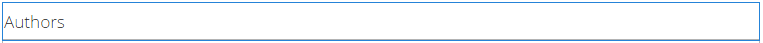

# 블로그 기능 {#blog-feature}

>[!CAUTION]
>
>AEM 6.4가 확장 지원이 종료되었으며 이 설명서는 더 이상 업데이트되지 않습니다. 자세한 내용은 [기술 지원 기간](https://helpx.adobe.com/kr/support/programs/eol-matrix.html). 지원되는 버전 찾기 [여기](https://experienceleague.adobe.com/docs/).

## 소개 {#introduction}

AEM Communities의 블로그 기능은 작성 활동에서 게시 환경에서 발생하는 진정한 커뮤니티 활동으로 전환되었습니다.

블로그 기능은 저널링 형식으로 커뮤니티 정보를 제공할 수 있도록 지원합니다. 블로그 항목은 승인된 구성원(등록된 로그인 사용자)이 게시 환경에서 만듭니다.

블로그 기능은 다음을 제공합니다.

* 블로그 문서와 댓글의 게시 측 작성
* 리치 텍스트 편집
* 인라인 이미지(드래그 앤 드롭을 지원)
* 포함된 소셜 네트워킹 콘텐츠([포함 지원](blog-developer-basics.md#allowing-rich-media))
* 초안 모드
* 예약된 게시
* 대신 작성(A) [권한 있는 멤버](users.md#privileged-members-group) 다른 커뮤니티 구성원을 대신하여 컨텐츠를 작성할 수 있음)
* [컨텍스트 내 및 벌크 조정](moderate-ugc.md) 블로그 문서 및 댓글

설명서의 이 섹션에서는 다음 사항에 대해 설명합니다

* AEM 사이트에 블로그 기능 추가
* 블로그 구성 요소에 대한 구성 설정

>[!NOTE]
>
>구성 요소 `Journal`및 `Journal Sidebar` 제목이 지정됩니다. `Blog` 및 `Blog Sidebar`.
>
>AEM 6.0 및 이전 릴리스에 있는 블로그 기능이 이제 제거되었습니다. 이 템플릿은 템플릿을 기반으로 하며 작성자만 작성 환경에서 컨텐츠를 만들 수 있도록 했습니다.

## 페이지에 블로그 구성 요소 추가 {#adding-blog-components-to-a-page}

작성자 모드에서 페이지에 블로그를 추가하려면 구성 요소 브라우저를 사용하여 를 찾습니다

* `Communities / Blog`
* `Communities / Blog Sidebar`

그리고 블로그를 표시할 페이지에 드래그합니다.

필요한 정보를 보려면 [커뮤니티 구성 요소 기본 사항](basics.md).

이 [필수 클라이언트 측 라이브러리](blog-developer-basics.md#essentials-for-client-side) 포함된 경우, 다음과 같이 하십시오 `Blog`구성 요소가 표시됩니다.

그리고 `Blog Sidebar` 이 표시됩니다.

### 블로그 구성 {#configuring-blog}

배치된 항목을 선택합니다 `Blog` 액세스하여 선택할 구성 요소 `Configure` 아이콘 편집 대화 상자를 엽니다.

 

#### 설정 탭 {#settings-tab}

아래에 **[!UICONTROL 설정]** 탭에서 블로그의 기본 기능을 지정합니다.

* **[!UICONTROL 첨부 파일 축소판 허용]**
이 옵션을 선택하면 연결된 이미지의 축소판이 생성됩니다.

* **[!UICONTROL 최대 첨부 축소판 크기]**
첨부 파일 축소판 이미지의 최대 크기(픽셀 단위)입니다. 기본값은 800 x 800입니다.

* **[!UICONTROL 축소판의 최소 이미지 크기]**
인라인 이미지의 축소판을 생성하기 위한 이미지의 최소 크기(바이트)입니다. 기본값은 100000바이트(100kb)입니다.

* **[!UICONTROL 최대 축소판 크기]**
인라인 이미지에 대한 축소판 이미지의 최대 크기(픽셀 단위)입니다. 기본값은 800 x 800입니다.

* **[!UICONTROL 권한이 있는 구성원 허용]**
이 옵션을 선택하면 권한이 있는 멤버만 컨텐츠를 만들 수 있습니다.

* **[!UICONTROL 허용된 권한이 있는 구성원]**
컨텐츠를 만들 수 있는 권한이 있는 구성원을 추가합니다.

* **[!UICONTROL 작성자 편집 모드에서 사용자가 생성한 컨텐츠 차단]**
활성화된 경우 작성자 모드에서 편집하는 동안 사용자가 생성한 컨텐츠를 차단합니다.

* **[!UICONTROL 분개 제목]**
페이지에 표시할 블로그 제목입니다.
   >메모:
   >저널 제목은 블로그의 URL을 자동으로 만드는 데 사용됩니다. 여기서 지정하는 저널 제목에서 최대 50자(고유성의 경우 5자 추가)가 사용되어 블로그의 URL을 만듭니다.

* **[!UICONTROL 분개 설명]**
블로그 설명입니다.

* **[!UICONTROL 페이지당 주제 수]**

   페이지당 표시되는 블로그 항목/댓글 수를 정의합니다. 기본값은 10입니다.

* **[!UICONTROL 중재됨]**

   이 확인란을 선택하면 블로그 항목 및 댓글이 게시 사이트에 표시되기 전에 게시 승인을 받아야 합니다. 기본값은 선택 취소되어 있습니다.

* **[!UICONTROL 닫힘]**

   이 옵션을 선택하면 블로그가 새로운 블로그 항목 및 댓글에 대해 닫힙니다. 기본값은 선택 취소되어 있습니다.

* **[!UICONTROL 리치 텍스트 편집기]**

   이 옵션을 선택하면 블로그 항목 및 댓글에 마크업이 있을 수 있습니다. 기본값이 선택되어 있습니다.

* **[!UICONTROL 태깅 허용]**

   이 확인란을 선택하면 구성원이 게시물에 태그 레이블을 추가할 수 있습니다( **[!UICONTROL 태그 필드]** 탭). 기본값은 선택 취소되어 있습니다.

* **[!UICONTROL 파일 업로드 허용]**

   이 옵션을 선택하면 블로그 항목 또는 댓글에 파일 첨부 파일을 추가할 수 있습니다. 기본값은 선택 취소되어 있습니다.

* **[!UICONTROL 최대 파일 크기]**

   관련성이 있는 경우에만 `Allow File Uploads` 이(가) 선택되어 있습니다. 이 필드는 업로드된 파일의 크기(바이트)를 제한합니다. 기본값은 104857600(10Mb)입니다.

* **[!UICONTROL 허용되는 파일 유형]**

   관련성이 있는 경우에만 `Allow File Uploads` 이(가) 선택되어 있습니다. 점이 구분되어 있는 쉼표로 구분된 파일 확장자 목록입니다. 예: .jpg, .jpeg, .png, .doc, .docx, .pdf 파일 유형을 지정하면, 지정되지 않은 파일 유형은 업로드할 수 없습니다. 기본값은 지정되지 않아서 모든 파일 유형이 허용됩니다.

* **[!UICONTROL 이미지 첨부 파일 최대 크기]**

   파일 업로드 허용 이 선택된 경우에만 관련됩니다. 업로드된 이미지 파일의 최대 바이트 수입니다. 기본값은 2097152(2Mb)입니다.

* **[!UICONTROL 답글 허용]**

   이 옵션을 선택하면 블로그 항목에 게시된 댓글에 대한 답글을 허용합니다. 기본값은 선택 취소되어 있습니다.

* **[!UICONTROL 사용자가 주석 및 주제를 삭제하도록 허용]**

   이 옵션을 선택하면 구성원이 게시한 댓글 및 블로그 항목을 삭제할 수 있습니다. 기본값은 선택 취소되어 있습니다.

* **[!UICONTROL 다음 허용]**

   이 옵션을 선택하면 구성원이 게시될 수 있는 블로그 문서에 다음 기능을 포함하십시오 [알림](notifications.md) 새 게시물입니다. 기본값은 선택 취소되어 있습니다.

* **[!UICONTROL 이메일 구독 허용]**

   이 확인란을 선택하면 구성원이 이메일로 새 게시물에 대한 알림을 받을 수 있습니다([구독](subscriptions.md)). 필요한 경우 `Allow Following` 확인 후 [전자 메일 구성](email.md). 기본값은 선택 취소되어 있습니다.

* **[!UICONTROL 투표 허용]**

   선택한 경우 블로그 항목에 투표 기능을 포함하십시오. 기본값은 선택 취소되어 있습니다.

* **[!UICONTROL 배지 표시]**

   선택한 경우, 기한 및 지정된 항목을 표시합니다 [배지](implementing-scoring.md) 구성원의 블로그 항목 사용. 기본값은 선택 취소되어 있습니다.

* **[!UICONTROL 특별 포함된 컨텐츠 허용]**

   이 옵션을 선택하면 [주요 콘텐츠](featured.md). 기본값은 선택 취소되어 있습니다.

#### 사용자 중재 탭 {#user-moderation-tab}

아래에 **[!UICONTROL 사용자 중재]** 탭에서 중재 설정을 지정합니다.

* **[!UICONTROL 게시물 거부]**

   이 확인란을 선택하면 신뢰할 수 있는 구성원 중재자가 게시물을 거부하고 공개 포럼에 게시물이 표시되지 않도록 할 수 있습니다. 기본값은 선택 취소되어 있습니다.

* **[!UICONTROL 항목 닫기/다시 열기]**

   이 옵션을 선택하면 신뢰할 수 있는 멤버 중재자는 항목을 닫고 추가 편집 및 주석을 편집할 수 있으며 항목을 다시 열 수도 있습니다. 기본값은 선택 취소되어 있습니다.

* **[!UICONTROL 게시물 플래그 지정]**

   이 확인란을 선택하면 구성원이 다른 사용자의 주제나 댓글에 대해 부적절한 플래그를 지정할 수 있습니다. 기본값은 선택 취소되어 있습니다.

* **[!UICONTROL 플래그 이유 목록]**

   이 확인란을 선택하면 구성원이 드롭다운 목록에서 주제 또는 댓글에 대한 플래그 지정을 부적절한 것으로 선택할 수 있습니다. 기본값은 선택 취소되어 있습니다.

* **[!UICONTROL 사용자 지정 플래그 이유]**

   이 옵션을 선택하면 구성원이 주제 또는 댓글에 대한 플래그 지정 이유를 부적절한 것으로 입력할 수 있습니다. 기본값은 선택 취소되어 있습니다.

* **[!UICONTROL 관리 임계값]**

   중재자에게 통지하기 전에 구성원에 의해 주제나 댓글에 플래그를 지정해야 하는 횟수를 입력합니다. 기본값은 1입니다(한 번).

* **[!UICONTROL 플래그 지정 제한]**

   주제 또는 댓글이 공개 보기에서 숨겨지기 전에 플래그를 지정해야 하는 횟수를 입력합니다. -1로 설정하면 플래그가 지정된 주제나 주석이 공개 보기에서 숨겨지지 않습니다. 그렇지 않은 경우 이 숫자는 중재 임계값보다 크거나 같아야 합니다. 기본값은 5입니다.

#### 태그 필드 탭 {#tag-field-tab}

아래에 **[!UICONTROL 태그 필드]** 탭에서 적용할 태그를 지정합니다 **[!UICONTROL 태깅 허용]** 이(가) **[!UICONTROL 설정]** 탭:

* **[!UICONTROL 허용되는 네임스페이스]**

   관련 있는 경우 `Allow Tagging` 이(가) **[!UICONTROL 설정]** 탭. 적용할 수 있는 태그는 선택한 네임스페이스 카테고리 내의 태그로 제한됩니다. 네임스페이스 목록에는 &quot;표준 태그&quot;(기본 네임스페이스)와 &quot;모든 태그 포함&quot;이 포함되어 있습니다. 기본값이 선택되어 있지 않으므로 모든 네임스페이스가 허용됩니다.

* **[!UICONTROL 제안 한도]**

   포럼에 게시하기 위해 회원에게 제안으로 표시할 태그의 수를 입력합니다. 값이 -1이면 제한이 없습니다. 기본값은 0입니다.

### 블로그 사이드바 구성 {#configuring-blog-sidebar}

를 두 번 클릭하면 `Blog Sidebar` 구성 요소로, 편집 대화 상자가 열립니다.

아래에 **[!UICONTROL 저널 사이드바 설정]** 탭에서 아카이브의 날짜 형식과 사이드바에서 표시할 항목 유형을 지정합니다.

* **[!UICONTROL 날짜 형식]**

   블로그 항목 보관에 표시하는 데 사용되는 형식입니다. 형식은 Java 규칙 다음에 오는 자리 표시자를 사용합니다.

   * yyyy: &#39;2015&#39;와 같은 일년
   * 예: &#39;15&#39;처럼 짧은 해
   * MMMMM: 6월처럼 한 달
   * MMM: 6월처럼 짧은 달
   * MM: 월 번호(예: 06)

   기본값은 &quot;yyyy MMMMM&quot;이며, 예를 들어 &quot;2015년 6월&quot;이 표시됩니다

* **[!UICONTROL 보기 유형]**

   사이드바에 표시할 블로그 항목의 제목 및 유형입니다. 다음 중 하나를 선택합니다

   * 작성자
   * 범주
   * 아카이브

* **[!UICONTROL 저널 구성 요소 경로]**

   *(선택 사항)* 블로그 문서가 나열될 블로그 리소스의 위치입니다. 비워 두면 resourceType의 구성 요소를 사용합니다 `social/journal/components/hbs/journal` 같은 페이지에 표시됩니다.

   * 예, `/content/sites/engage/en/blog/jcr:content/content/primary/blog`

* **[!UICONTROL 제안 한도]**

   표시할 블로그 문서의 수입니다. -1이라는 값은 제한이 없음을 의미합니다. 기본값은 -1입니다.

## 사이트 방문자 경험 {#site-visitor-experience}

게시 환경에서 블로그 기능은 가장 최근 블로그 기사, 그 뒤에 이전 블로그 글이 순서대로 작성 순서로 표시됩니다. 블로그 차원을 사용하면 사이트 방문자가 필터를 적용하여 표시된 블로그 문서의 선택을 제한할 수 있습니다.

블로그 문서 뒤에는 게시물 또는 댓글 보기에 대한 링크가 옵니다.

블로그 문서를 선택하면 블로그 문서와 댓글이 표시됩니다(활성화된 경우).

기타 기능은 사이트 방문자가 중재자, 관리자, 커뮤니티 구성원, 권한이 있는 구성원 또는 익명 구성원인지 여부에 따라 다릅니다.

### 문서 작업 {#working-with-articles}

새 블로그 문서를 만들 때 선택할 수 있습니다

1. 즉시 게시
1. 초안 게시
1. 예약된 날짜 및 시간에 게시

블로그 문서는 게시에서 작성할 수 있는 구성원에게 적절한 탭(게시됨, 초안 또는 예약됨) 아래에 표시됩니다.

#### 중재자 및 관리자 {#moderators-and-administrators}

로그인한 사용자에게 중재자 또는 관리자 권한이 있는 경우 다음을 수행할 수 있습니다 [조정 작업](moderate-ugc.md) (구성 요소 구성에서 허용하는 경우) 모든 블로그 문서와 블로그에 게시된 댓글에 대해 지정합니다.

### 구성원 {#members}

로그인한 사용자가 커뮤니티 멤버이거나 [권한 있는 멤버](users.md#privileged-members-group) (구성에 따라) `New Article` 새 블로그 문서를 만들고 게시하기 위해

특히 다음 작업을 수행할 수 있습니다.

* 새 블로그 문서 만들기
* 다른 구성원을 대신하여 새 블로그 문서 게시
* 블로그 문서에 주석 게시
* 자신의 블로그 기사 또는 댓글 편집
* 자신의 블로그 기사 또는 댓글 삭제
* 다른 사람의 블로그 문서 또는 댓글에 플래그 지정

 

### 익명 {#anonymous}

로그인하지 않은 사이트 방문자는 게시된 블로그 문서와 주석만 읽고, 지원되는 경우 번역하거나, 블로그 기사나 댓글을 추가하거나, 다른 사람의 기사나 댓글에 플래그를 지정하지 않을 수 있습니다.

## 추가 정보 {#additional-information}

자세한 내용은 [블로그 핵심 사항](blog-developer-basics.md) 개발자를 위한 페이지입니다.

블로그 항목 및 댓글의 조정에 대해서는 [사용자가 생성한 컨텐츠 중재](moderate-ugc.md).

블로그 항목 및 댓글에 태깅하려면 다음을 참조하십시오 [사용자 생성 컨텐츠에 태깅](tag-ugc.md).

블로그 항목 및 댓글 번역에 대해서는 [사용자가 생성한 컨텐츠 번역](translate-ugc.md).
