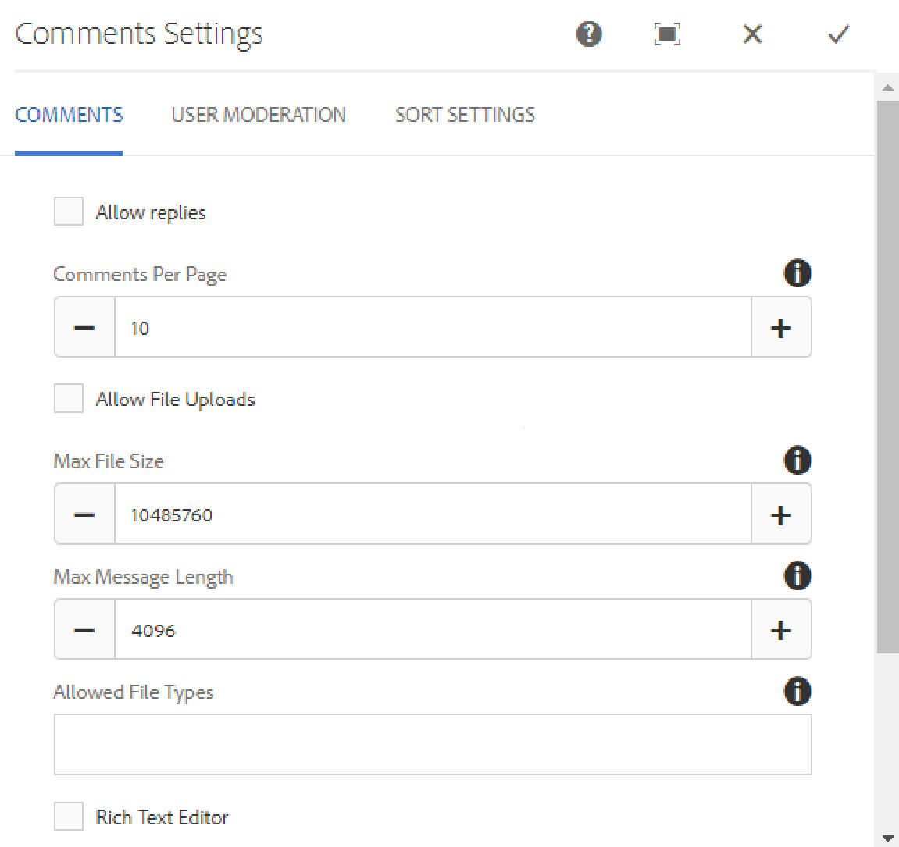

# 댓글 사용 {#using-comments}

>[!CAUTION]
>
>AEM 6.4가 확장 지원이 종료되었으며 이 설명서는 더 이상 업데이트되지 않습니다. 자세한 내용은 [기술 지원 기간](https://helpx.adobe.com/kr/support/programs/eol-matrix.html). 지원되는 버전 찾기 [여기](https://experienceleague.adobe.com/docs/).

## 소개 {#introduction}

댓글 기능은 로그인한 사이트 방문자(구성원)가 사이트의 컨텐츠에 대한 의견 및 지식을 공유할 수 있도록 하는 데 사용됩니다. 이 기능은 종종 다른 기능에 이미 있지만 모든 웹 사이트에 추가할 수 있습니다.

설명서의 이 섹션에서는 다음 사항에 대해 설명합니다

* 추가 중 `Comments`페이지를
* 에 대한 구성 설정 `Comments`구성 요소

>[!NOTE]
>
>댓글 익명 게시는 지원되지 않습니다. 사이트 방문자는 등록(구성원 자격)하고 로그인해야 참여합니다.

## 페이지에 주석 추가 {#adding-comments-to-a-page}

을(를) 추가하려면 `Comments`구성 요소를 페이지에 작성자 모드에서 사용하려면 구성 요소 브라우저를 사용하여 를 찾습니다

* `Communities / Comments`

그리고 이 파일을 페이지(예: 사용자가 주석을 달 수 있는 기능을 기준으로 하는 위치 또는 페이지 하단)에 배치합니다.

필요한 정보를 보려면 [커뮤니티 구성 요소 기본 사항](basics.md).

이 [필수 클라이언트 측 라이브러리](essentials-comments.md#essentials-for-client-side) 포함된 경우, 다음과 같이 하십시오 `Comments`구성 요소가 나타납니다.

>[!NOTE]
>
>하나만 `Comments`구성 요소가 페이지에 있을 수 있습니다. 일부 Communities 기능에는 블로그, 일정, 포럼, QnA, 검토 등의 댓글이 이미 포함되어 있습니다.

## 댓글 구성 {#configuring-comments}

배치된 항목을 선택합니다 `Comments` 액세스하여 선택할 구성 요소 `Configure` 아이콘 편집 대화 상자를 엽니다.

 

### 댓글 탭 {#comments-tab}

아래에 **[!UICONTROL 댓글]** 탭에서 방문자가 댓글을 입력하는 방법을 지정합니다.

* **[!UICONTROL 답글 허용]**

   이 옵션을 선택하면 구성원이 기존 주석에 응답할 수 있습니다. 기본값은 선택 취소되어 있습니다.

* **[!UICONTROL 페이지당 댓글]**

   표시된 답글 수와 페이지당 표시되는 댓글 수를 제한합니다. 기본값은 10입니다.

* **[!UICONTROL 파일 업로드 허용]**

   이 옵션을 선택하면 파일 업로드 옵션이 텍스트 입력 상자가 표시됩니다. 기본값은 선택 취소되어 있습니다.

* **[!UICONTROL 최대 파일 크기]**

   파일 업로드 허용 이 선택된 경우에만 관련됩니다. 이 값은 업로드된 파일 크기를 제한합니다. 기본 제한은 10MB입니다.

* **[!UICONTROL 최대 메시지 길이]**

   텍스트 상자에 입력할 수 있는 최대 문자 수입니다. 기본값은 4096자입니다.

* **[!UICONTROL 허용되는 파일 유형]**

   파일 업로드 허용 이 선택된 경우에만 관련됩니다. &quot;점&quot; 구분 기호가 있는 쉼표로 구분된 파일 확장자 목록입니다. 예: .jpg, .jpeg, .png, .doc, .docx, .pdf 파일 형식을 지정하면 지정하지 않은 파일 형식이 허용되지 않습니다. 기본값은 지정되지 않아서 모든 파일 유형이 허용됩니다.

* **[!UICONTROL 리치 텍스트 편집기]**

   이 옵션을 선택하면 마크업에 주석을 입력할 수 있습니다. 기본값은 선택 취소되어 있습니다.

* **[!UICONTROL 투표 허용]**

   이 옵션을 선택하면 위 또는 아래로 투표하는 옵션이 텍스트 입력 상자가 표시됩니다. 기본값은 선택 취소되어 있습니다.

* **[!UICONTROL 다음 허용]**

   이 옵션을 선택하면 구성원이 댓글을 따를 수 있습니다. 기본값은 선택 취소되어 있습니다.

* **[!UICONTROL 배지 표시]**

   이 옵션을 선택하면 획득된 배지와 수여된 배지를 표시할 수 있습니다. 기본값은 선택 취소되어 있습니다.

### 사용자 중재 탭 {#user-moderation-tab}

아래에 **[!UICONTROL 사용자 중재]** 탭에서 게시된 주석을 관리하는 방법을 지정합니다. 자세한 내용은 [사용자가 생성한 컨텐츠 중재](moderate-ugc.md).

* **[!UICONTROL 사전 관리]**

   이 확인란을 선택하면 게시 사이트에 주석이 표시되기 전에 승인해야 합니다. 기본값은 선택 취소되어 있습니다.

* **[!UICONTROL 댓글 삭제]**

   이 옵션을 선택하면 댓글을 게시한 구성원이 댓글을 삭제할 수 있습니다. 기본값은 선택 취소되어 있습니다.

* **[!UICONTROL 댓글 거부]**

   이 확인란을 선택하면 중재자가 댓글을 거부할 수 있습니다. 기본값은 선택 취소되어 있습니다.

* **[!UICONTROL 댓글 닫기 / 다시 열기]**

   이 확인란을 선택하면 중재자가 주석을 닫고 다시 열 수 있습니다. 기본값은 선택 취소되어 있습니다.

* **[!UICONTROL 댓글에 플래그 지정]**

   이 옵션을 선택하면 구성원이 댓글을 부적절한 것으로 플래그를 지정할 수 있습니다. 기본값은 선택 취소되어 있습니다.

* **[!UICONTROL 플래그 이유 목록]**

   이 확인란을 선택하면 구성원이 드롭다운 목록에서 선택할 수 있습니다. 댓글에 대한 플래그 지정 이유가 부적절한 것으로 표시됩니다. 기본값은 선택 취소되어 있습니다.

* **[!UICONTROL 사용자 지정 플래그 이유]**

   이(가) 선택된 경우, 구성원이 댓글 플래그 지정 이유를 부적절한 것으로 입력할 수 있도록 허용합니다. 기본값은 선택 취소되어 있습니다.

* **[!UICONTROL 관리 임계값]**

   중재자에게 통지하기 전에 구성원이 댓글에 플래그를 지정해야 하는 횟수를 입력합니다. 기본값은 1회(1)입니다.

* **[!UICONTROL 플래그 지정 제한]**

   공개 보기에서 주석이 숨겨지기 전에 플래그를 지정해야 하는 횟수를 입력합니다. 이 숫자는 다음보다 크거나 같아야 합니다 **[!UICONTROL 중재 임계값]**. 기본값은 5입니다.

### 정렬 설정 탭 {#sort-settings-tab}

아래에 **[!UICONTROL 정렬 설정]** 탭에서 표시되는 경우 게시된 주석이 정렬되는 방법을 지정합니다.

* **[!UICONTROL 정렬 필드]**

   아래로 당기면 다음 중 하나를 선택합니다. `Newest, Oldest, Last Updated, Most Viewed, Most Active, Most Followed`, 또는 `Most Liked`.

* **[!UICONTROL 정렬 순서]**

   아래로 당기면 다음 중 하나를 선택합니다. `Ascending` 또는 `Descending`.

### 사용자 지정 주석 유형으로 변경 {#changing-to-a-custom-comment-type}

주석 리소스 유형을 변경하면 주석 시스템은 더 이상 기본값을 사용하여 주석의 인스턴스를 생성하지 않고 개발자가 사용자 지정(확장)한 인스턴스를 생성합니다.

사용자 정의 리소스 유형을 알려면 다음을 입력합니다. [디자인 모드](../../help/sites-authoring/default-components-designmode.md) 그리고 위치를 두 번 클릭합니다 `Comments` 추가 탭이 있는 대화 상자를 여는 구성 요소입니다.

아래에 **[!UICONTROL 리소스 유형]** 탭에서 `Comments or Voting`구성 요소:

* **[!UICONTROL 댓글 리소스 유형]**

   확장의 resourceType으로 이동합니다. `comment`/apps 의 구성 요소(단일 주석)입니다. 예, `/apps/social/commons/components/hbs/comments/comment`

   이 리소스는 방문자가 댓글을 게시할 때 생성된 UGC의 resourceType을 식별합니다.

* **[!UICONTROL 투표 리소스 유형]**

   확장의 resourceType으로 이동합니다. `voting`/apps의 구성 요소입니다. 예, `/apps/social/components/hbs/voting`

   이 리소스는 방문자가 투표를 게시할 때 생성된 UGC의 리소스 유형을 식별합니다.

* **[!UICONTROL 댓글 시스템 리소스 유형]**

   확장의 resourceType으로 이동합니다. `comments`/apps 의 구성 요소(주석 시스템)입니다. 페이지 템플릿을 제외하고 비워 둡니다. [동적으로 포함](scf.md#add-or-include-a-communities-component) 페이지에 리소스(주석 노드)로 추가되지 않고, 기본 스크립트의 주석 시스템 을 사용하십시오. 자세한 내용은 [{{include}} 도우미](handlebars-helpers.md#include).

## 사이트 방문자 경험 {#site-visitor-experience}

### 중재자 및 관리자 {#moderators-and-administrators}

로그인한 사용자에게 중재자 또는 관리자 권한이 있는 경우 댓글을 작성한 사람에 관계없이 구성 요소의 구성에서 허용하는 중재 작업을 수행할 수 있습니다.

### 구성원 {#members}

사이트 방문자가 로그인하면 구성에 따라 로그인할 수 있습니다

* 새 댓글 게시
* 자신의 댓글 편집
* 자신의 댓글 삭제
* 다른 사용자의 댓글 플래그 지정

### 익명 {#anonymous}

로그인하지 않은 사이트 방문자는 게시된 댓글을 읽고, 지원되는 경우 번역하거나, 댓글을 추가하거나, 다른 사용자의 댓글에 플래그를 지정하지 않을 수 있습니다.

## 추가 정보 {#additional-information}

자세한 내용은 [주석 핵심 사항](essentials-comments.md) 개발자를 위한 페이지입니다.

게시된 댓글 조정에 대해서는 [사용자가 생성한 컨텐츠 중재](moderate-ugc.md).

게시된 댓글 번역에 대해서는 [사용자가 생성한 컨텐츠 번역](translate-ugc.md).
