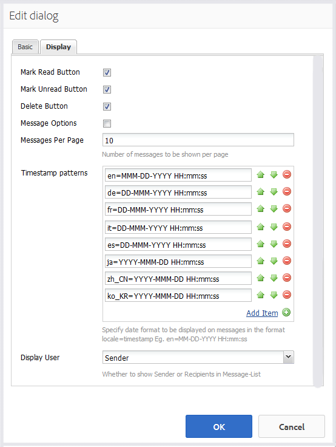

# 메시징 기능 {#messaging-feature}

포럼 및 주석에서 발생하는 공개되는 상호 작용 외에도 AEM Communities의 메시징 기능을 사용하면 커뮤니티 멤버가 보다 비공개로 상호 작용할 수 있습니다.

이 기능은 [커뮤니티 사이트](overview.md#communitiessites)가 생성될 때 포함될 수 있습니다.

메시징 기능은 다음과 같은 기능을 제공합니다.

* 하나 이상의 커뮤니티 구성원에게 메시지 보내기
* 커뮤니티 구성원 그룹에 메시지 보내기
* 첨부 파일이 있는 메시지 보내기
* 메시지 전달
* 메시지에 회신
* 메시지 삭제
* 삭제된 메시지 복원

메시징 기능을 활성화하고 수정하려면 다음을 참조하십시오.

* [관리자용 ](messaging.md) 메시지 구성
* [개발자용 ](essentials-messaging.md) 메시징 개념

>[!NOTE]
>
>작성자 편집 모드의 페이지에 `Compose Message, Message, or Message List` 구성 요소(`Communities`구성 요소 그룹에 있음)를 추가하는 것은 지원되지 않습니다.

## 메시징 구성 요소 {#configuring-messaging-components} 구성

커뮤니티 사이트에 대해 메시징이 활성화되면 추가 구성 없이 완전히 설정됩니다. 이 정보는 기본 구성을 변경해야 하는 경우 제공됩니다.

### 메시지 목록 구성(메시지 상자) {#configuring-message-list-messagebox}

**받은 편지함**, **보낸 항목** 및 메시징 기능의 **휴지통** 페이지에 대한 메시지 목록 구성을 수정하려면 [작성 편집 모드](sites-console.md#authoring-site-content)에서 사이트를 엽니다.

`Preview` 모드에서 **[!UICONTROL 메시지]** 링크를 선택하여 기본 메시징 페이지를 엽니다. 그런 다음 **[!UICONTROL 받은 편지함, 보낸 항목 또는 휴지통]**&#x200B;을 선택하여 해당 메시지 목록에 대한 구성 요소를 구성합니다.

`Edit` 모드에서 페이지에서 구성 요소를 선택합니다.

구성 대화 상자에 액세스하려면 `link`아이콘을 선택하여 상속을 취소해야 합니다.

구성이 완료되면 `broken link` 아이콘을 선택하여 상속을 복원해야 합니다.

상속이 취소되면 `configure` 아이콘을 선택하여 구성 대화 상자를 열 수 있습니다.

#### 기본 탭 {#basic-tab}

* **[!UICONTROL 서비스 선택기]**
 (*필수*) 이 값을  `serviceSelector.name` AEM Communities Messaging Operations Service 의 속성 값으로 설정합니다.

* **[!UICONTROL 페이지 작성]**
(*필수*) 구성원이 단추를 클릭할 때 열  `Reply` 페이지입니다. 대상 페이지에는 **[!UICONTROL 메시지 작성]** 양식이 있어야 합니다.

* **[!UICONTROL 리소스로 회신/]**
보기이 확인란을 선택하면 회신 URL 및 보기 URL이 리소스를 참조하고, 그렇지 않으면 데이터가 URL에서 쿼리 매개 변수로 전달됩니다.

* **[!UICONTROL 프로필 표시]**
양식보낸 사람 프로필을 표시하는 데 사용할 프로필 양식입니다.

* **[!UICONTROL 휴지통]**
폴더선택된 경우 이 메시지 목록 구성 요소는 삭제된 것으로 플래그가 지정된 메시지(휴지통)만 표시합니다.

* **[!UICONTROL 폴더 경로]**
(*필수*)  `inbox.path.name` AEM Communities 메시징 작업 서비스 `sentitems.path.name` 에서 및  [에 설정된 값](messaging.md#messaging-operations-service)을 참조합니다. `Inbox`에 대해 구성할 때 `inbox.path.name` 값을 사용하여 하나의 항목을 추가하십시오. `Outbox`에 대해 구성할 때 `sentitems.path.name` 값을 사용하여 하나의 항목을 추가하십시오. `Trash`에 대해 구성할 때 두 값을 모두 가진 두 항목을 추가합니다.

#### 탭 {#display-tab} 표시

* **[!UICONTROL 읽기 단추]**
표시If를 선택하면 
`Read`메시지를 읽음으로 표시할 수 있는 단추입니다.

* **[!UICONTROL 읽지 않은 상태로]**
표시이 옵션을 선택하면 
`Mark Unread` 메시지를 읽음으로 표시할 수 있는 단추입니다.

* **[!UICONTROL 삭제]**
단추선택 시 
`Delete`메시지를 읽음으로 표시할 수 있는 단추입니다. **`Message Options`** 도 선택되어 있으면 삭제 기능이 복제됩니다.

* **[!UICONTROL 메시지]**
옵션선택된 경우 
**`Reply`**,  **`Reply All`**&#x200B;및  **`Forward`**   **`Delete`** 버튼을 사용하여 메시지를 다시 전송하거나 삭제할 수 있습니다. **`Delete Button`** 도 선택되어 있으면 삭제 기능이 복제됩니다.

* **[!UICONTROL Messages]**
Per Page지정된 수는 페이지 매김 구성표에 페이지당 표시되는 최대 메시지 수입니다. 번호를 지정하지 않은 경우(비워 두면) 모든 메시지가 표시되고 페이지 매김이 없습니다.

* **[!UICONTROL 타임스탬프]**
패턴하나 이상의 언어에 대한 타임스탬프 패턴을 제공합니다. 기본값은 en, de, fr, es, ja, zh_CN, ko_KR입니다.

* **[!UICONTROL 사용자]**
표시다음 중 하나를 선택합니다 
**`Sender`** 또는  **`Recipients`** 을 입력하여 발신자 또는 수신자를 표시할지 여부를 결정합니다.

### 작성 메시지 구성 {#configuring-compose-message}

메시지 작성 페이지의 구성을 수정하려면 [작성 편집 모드](sites-console.md#authoring-site-content)에서 사이트를 엽니다.

`Preview`모드에서 **[!UICONTROL 메시지]** 링크를 선택하여 기본 메시징 페이지를 엽니다. 그런 다음 새 메시지 단추를 선택하여 `Compose Message` 페이지를 엽니다.

`Edit` 모드에서 메시지 본문이 포함된 페이지의 기본 구성 요소를 선택합니다.

구성 대화 상자에 액세스하려면 `link`아이콘을 선택하여 상속을 취소해야 합니다.

구성이 완료되면 `broken link` 아이콘을 선택하여 상속을 복원해야 합니다.

상속이 취소되면 `configure` 아이콘을 선택하여 구성 대화 상자를 열 수 있습니다.

#### 기본 탭 {#basic-tab-1}

* **[!UICONTROL 리디렉션]**
URL메시지를 보낸 후 표시되는 페이지의 URL을 입력합니다. 예, 
`../messaging.html`.

* **[!UICONTROL 취소]**
보낸 사람이 메시지를 취소할 경우 표시되는 페이지의 URL을 입력합니다. 예, 
`../messaging.html`.

* **[!UICONTROL 메시지 제목 최대]**
길이제목 필드에 허용되는 최대 문자 수입니다. 예를 들면 500입니다. 기본값은 제한이 없습니다.

* **[!UICONTROL 최대 메시지]**
본문 길이컨텐츠 필드에 허용되는 최대 문자 수입니다. 예: 10000. 기본값은 제한이 없습니다.

* **[!UICONTROL 서비스 선택기]**
 (*필수*) 이 값을  **`serviceSelector.name`** AEM Communities Messaging Operations Service 의 속성 값으로 설정합니다.

#### 탭 {#display-tab-1} 표시

* **[!UICONTROL 제목]**
필드 표시선택 시 
`Subject` 필드를 설정하고 메시지에 제목을 추가할 수 있습니다. 기본값은 선택되어 있지 않습니다.

* **[!UICONTROL 제목]**
레이블다음 항목 옆에 표시할 텍스트를 입력합니다 
`Subject` 필드. 기본값은 `Subject`입니다.

* **[!UICONTROL 파일 첨부]**
필드 표시이 확인란을 선택하면 
`Attachment` 필드를 작성하고 메시지에 첨부 파일을 추가할 수 있습니다. 기본값은 선택되어 있지 않습니다.

* **[!UICONTROL 파일]**
레이블 첨부다음 옆에 표시할 텍스트를 입력합니다 
`Attachment` 필드. 기본값은 **`Attach File`**&#x200B;입니다.

* **[!UICONTROL 컨텐츠 필드]**
표시선택 시 
`Content` 필드를 설정하고 메시지 본문을 추가할 수 있습니다. 기본값은 선택되어 있지 않습니다.

* **[!UICONTROL 콘텐츠]**
레이블다음 옆에 표시할 텍스트를 입력합니다 
`Content` 필드. 기본값은 **`Body`**&#x200B;입니다.

* **[!UICONTROL 리치 텍스트 편집기]**
를 선택하면 자체 리치 텍스트 편집기가 있는 사용자 지정 컨텐츠 텍스트 상자의 사용을 나타냅니다. 기본값은 선택되어 있지 않습니다.

* **[!UICONTROL 타임스탬프]**
패턴하나 이상의 언어에 대한 타임스탬프 패턴을 제공합니다. 기본값은 en, de, fr, es, ja, zh_CN, ko_KR입니다.
