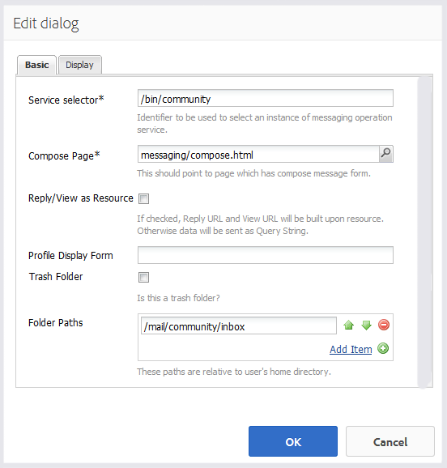

# 메시징 기능 {#messaging-feature}

포럼과 주석에서 발생하는 공개적으로 보이는 상호 작용 이외에도, AEM Communities의 메시지 기능을 통해 커뮤니티 회원들은 더욱 비공개로 상호 작용할 수 있습니다.

이 기능은 [커뮤니티 사이트를](overview.md#communitiessites) 만들 때 포함될 수 있습니다.

메시징 기능은 다음과 같은 기능을 제공합니다.

* 하나 이상의 커뮤니티 멤버에게 메시지 보내기
* 커뮤니티 구성원 그룹에 메시지 보내기
* 첨부 파일이 있는 메시지 보내기
* 메시지 전달
* 메시지에 회신
* 메시지 삭제
* 삭제된 메시지 복원

메시징 기능을 활성화하고 수정하려면

* [관리자용 메시지](messaging.md) 구성
* [Messaging Essentials](essentials-messaging.md) for developers

>[!NOTE]
>
>작성 편집 모드에서 구성 요소( `Compose Message, Message, or Message List` `Communities`구성 요소 그룹에 있음)를 페이지에 추가하는 것은 지원되지 않습니다.

## 메시징 구성 요소 구성 {#configuring-messaging-components}

커뮤니티 사이트에 대한 메시징이 활성화되면 추가 구성 없이 완전히 설정됩니다. 이 정보는 기본 구성을 변경해야 할 경우 제공됩니다.

### 메시지 목록 구성(메시지 상자) {#configuring-message-list-messagebox}

메시지 **받은 편지함**, 보낸 항목 **및**&#x200B;휴지통 **의 메시지 목록 구성을 수정하려면, 메시지 기능** 의 [작성 모드](sites-console.md#authoring-site-content)에서 사이트를엽니다.

모드에서 `Preview` 메시지 **** 링크를 선택하여 기본 메시지 페이지를 엽니다. 그런 다음 해당 메시지 **[!UICONTROL 목록에 대한 구성 요소를 구성하려면 받은 편지함, 보낸]** 항목 또는 휴지통을 선택합니다.

모드에서 `Edit` 페이지에서 구성 요소를 선택합니다.

구성 대화 상자에 액세스하려면 `link`아이콘을 선택하여 상속을 취소해야 합니다.

구성이 완료되면 `broken link` 아이콘을 선택하여 상속을 복원해야 합니다.

상속이 취소되면 구성 대화 상자를 여는 `configure` 아이콘을 선택할 수 있습니다.

#### Basic tab {#basic-tab}

* **[!UICONTROL 서비스 선택기]**(*필수*`serviceSelector.name` ) 이 값을 [AEM Communities 메시징 작업 서비스](messaging.md#messaging-operations-service)의 속성 값으로 설정합니다.

* **[!UICONTROL 페이지 작성]**(*필수*) 구성원이 `Reply` 단추를 클릭할 때 열리는 페이지입니다. 대상 페이지에는 메시지 작성 **[!UICONTROL 양식이]** 포함되어야 합니다.

* **[!UICONTROL 리소스로 답글/]**&#x200B;보기이 확인란을 선택하면 회신 URL 및 보기 URL이 리소스를 참조하고, 그렇지 않은 데이터는 URL의 쿼리 매개 변수로 전달됩니다.

* **[!UICONTROL 프로필 표시 양식]**&#x200B;발신자 프로필을 표시하는 데 사용할 프로필 양식입니다.

* **[!UICONTROL 휴지통 폴더]**&#x200B;이 선택된 경우, 이 메시지 목록 구성 요소는 삭제된 것으로 표시된 메시지(휴지통)만 표시합니다.

* **[!UICONTROL 폴더 경로]**(*필수*`inbox.path.name` ) `sentitems.path.name` AEM Communities 메시징 작업 서비스 [에 대해 설정된 값](messaging.md#messaging-operations-service)을 참조합니다. 에 대해 구성할 때 `Inbox`의 값을 사용하여 하나의 항목을 추가합니다 `inbox.path.name`. 에 대해 구성할 때 `Outbox`의 값을 사용하여 하나의 항목을 추가합니다 `sentitems.path.name`. 을(를) 구성할 때 두 값 `Trash`으로 두 항목을 추가합니다.

#### 표시 탭 {#display-tab}

* **[!UICONTROL 읽기 단추]**&#x200B;표시를 선택하면 
`Read`단추를 클릭하여 메시지를 읽음으로 표시할 수 있습니다.

* **[!UICONTROL 읽지 않은 단추 표시]**&#x200B;이 선택된 경우 
`Mark Unread` 단추를 클릭하여 메시지를 읽음으로 표시할 수 있습니다.

* **[!UICONTROL 삭제 단추]**&#x200B;를 선택하면 
`Delete`단추를 클릭하여 메시지를 읽음으로 표시할 수 있습니다. 이 확인란을 선택하면 삭제 기능 **`Message Options`** 이 복제됩니다.

* **[!UICONTROL 메시지 옵션]**&#x200B;이 선택된 경우 
**`Reply`**, **`Reply All`****`Forward`** 및 **`Delete`** 단추를 사용하여 메시지를 재전송하거나 삭제할 수 있습니다. 이 확인란을 선택하면 삭제 기능 **`Delete Button`** 이 복제됩니다.

* **[!UICONTROL 페이지당 메시지]**&#x200B;지정된 수는 페이지 매김 구성표에 페이지당 표시되는 최대 메시지 수입니다. 번호가 지정되지 않은 경우(비워 둔 경우) 모든 메시지가 표시되고 페이지 매김이 없습니다.

* **[!UICONTROL 타임스탬프 패턴]**&#x200B;하나 이상의 언어에 대한 타임스탬프 패턴을 제공합니다. 기본값은 en, de, fr, it, es, ja, zh_CN, ko_KR입니다.

* **[!UICONTROL 사용자]**&#x200B;표시다음 중 하나를 선택합니다. 
**`Sender`** 발신자 또는 수신자를 표시할지 여부를 **`Recipients`** 결정합니다.

### 메시지 작성 구성 {#configuring-compose-message}

메시지 작성 페이지의 구성을 수정하려면 [작성 편집 모드에서 사이트를 엽니다](sites-console.md#authoring-site-content).

`Preview`모드에서 메시지 **[!UICONTROL 링크를 선택하여 기본 메시지 페이지를 엽니다]** . 그런 다음 새 메시지 단추를 선택하여 `Compose Message` 페이지를 엽니다.

모드에서 메시지 본문을 포함하는 페이지의 기본 구성 요소를 `Edit` 선택합니다.

구성 대화 상자에 액세스하려면 `link`아이콘을 선택하여 상속을 취소해야 합니다.

구성이 완료되면 `broken link` 아이콘을 선택하여 상속을 복원해야 합니다.

상속이 취소되면 구성 대화 상자를 여는 `configure` 아이콘을 선택할 수 있습니다.

#### Basic tab {#basic-tab-1}

* **[!UICONTROL 리디렉션 URL]**&#x200B;메시지가 전송된 후 표시되는 페이지의 URL을 입력합니다. 예, 
`../messaging.html`.

* **[!UICONTROL 취소 URL]**&#x200B;발신자가 메시지를 취소하는 경우 표시되는 페이지의 URL을 입력합니다. 예, 
`../messaging.html`.

* **[!UICONTROL 메시지 제목]**&#x200B;의 최대 길이제목 필드에 허용되는 최대 문자 수입니다. 예: 500. 기본값은 제한이 없습니다.

* **[!UICONTROL 메시지 본체의 최대 길이]**&#x200B;컨텐츠 필드에 허용되는 최대 문자 수입니다. 예: 10000. 기본값은 제한이 없습니다.

* **[!UICONTROL 서비스 선택기]**(*필수***`serviceSelector.name`** ) 이 값을 [AEM Communities 메시징 작업 서비스](messaging.md#messaging-operations-service)의 속성 값으로 설정합니다.

#### 표시 탭 {#display-tab-1}

* **[!UICONTROL 제목 필드 표시]**&#x200B;선택한 경우 
`Subject` 필드를 만들고 메시지에 제목을 추가할 수 있습니다. 기본값은 선택되어 있지 않습니다.

* **[!UICONTROL 제목 레이블]**&#x200B;의 옆에 표시할 텍스트를 입력합니다. 
`Subject` 필드. 기본값은 `Subject`입니다.

* **[!UICONTROL 파일 첨부 필드]**&#x200B;표시 
`Attachment` 을 클릭하고 메시지에 첨부 파일을 추가할 수 있습니다. 기본값은 선택되어 있지 않습니다.

* **[!UICONTROL 파일 레이블]**&#x200B;을 첨부하기 
`Attachment` 필드. 기본값은 **`Attach File`**&#x200B;입니다.

* **[!UICONTROL 컨텐츠 필드 표시]**&#x200B;선택한 경우 
`Content` 필드 및 메시지 본문 추가를 활성화합니다. 기본값은 선택되어 있지 않습니다.

* **[!UICONTROL 컨텐츠 레이블]**&#x200B;의 옆에 표시할 텍스트를 입력합니다. 
`Content` 필드. 기본값은 **`Body`**&#x200B;입니다.

* **[!UICONTROL 리치 텍스트 편집기 사용]**&#x200B;이 선택된 경우 자체 리치 텍스트 편집기가 있는 사용자 지정 컨텐츠 텍스트 상자의 사용을 나타냅니다. 기본값은 선택되어 있지 않습니다.

* **[!UICONTROL 타임스탬프 패턴]**&#x200B;하나 이상의 언어에 대한 타임스탬프 패턴을 제공합니다. 기본값은 en, de, fr, it, es, ja, zh_CN, ko_KR입니다.

