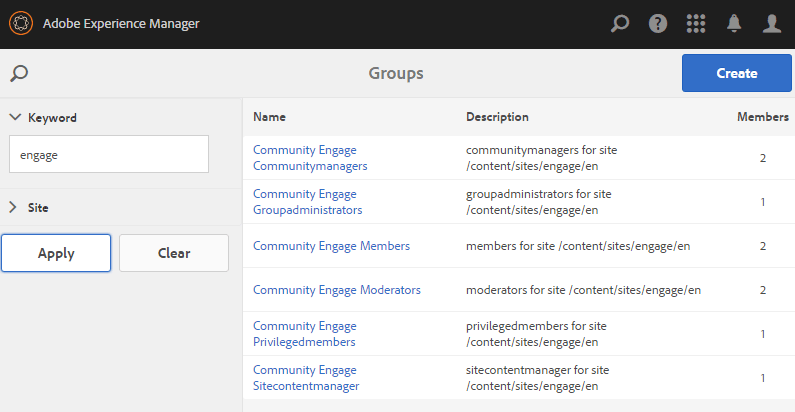

# 새 커뮤니티 사이트 {#author-a-new-community-site} 작성

## 새 커뮤니티 사이트 {#create-a-new-community-site} 만들기

작성 인스턴스를 사용하여 새 커뮤니티 사이트 만들기

* 관리자 권한으로 로그인
* 전역 탐색에서:**[!UICONTROL 탐색 > 커뮤니티 > 사이트]**

커뮤니티 사이트 콘솔은 커뮤니티 사이트를 만드는 단계를 안내하는 마법사를 제공합니다. 마지막 단계에서 사이트를 커밋하기 전에 `Next`단계 또는 `Back`로 이전 단계로 이동할 수 있습니다.

새 커뮤니티 사이트 만들기를 시작하려면 다음을 수행하십시오.

* `Create` 단추 선택

### 1단계:사이트 템플릿 {#step-site-template}

[사이트 템플릿 단계](sites-console.md#step2013asitetemplate)에서 제목, 설명, URL의 이름을 입력하고 커뮤니티 사이트 템플릿을 선택합니다. 예:

* **[!UICONTROL 커뮤니티 사이트 제목]**: `Getting Started Tutorial`

* **[!UICONTROL 커뮤니티 사이트 설명]**: `A site for engaging with the community.`

* **[!UICONTROL 커뮤니티 사이트 루트]**:(기본 루트에 대해서는 비워  `/content/sites`둡니다.

* **[!UICONTROL 클라우드 구성]**:(클라우드 구성이 지정되지 않은 경우 비워 두십시오) 지정된 클라우드 구성에 대한 경로를 제공합니다.
* **[!UICONTROL 커뮤니티 사이트 기본 언어]**:(단일 언어로 변경하지 않고 유지:영어)의 풀다운 메뉴를 사용하여 독일어, 이탈리아어, 프랑스어, 일본어, 스페인어, 포르투갈어(브라질), 중국어(번체) 및 중국어(간체) 등 사용 가능한  ** 언어에서 하나 이상의 기본 언어를 선택합니다. 추가된 각 언어에 대해 하나의 커뮤니티 사이트가 생성되고 [다국어 사이트에 대한 컨텐츠 번역](../../help/sites-administering/translation.md)에 설명된 우수 사례 다음에 동일한 사이트 폴더 내에 존재합니다. 각 사이트의 루트 페이지에는 선택한 언어 중 하나의 언어 코드에 의해 이름이 지정된 하위 페이지가 포함됩니다(예: 영어의 경우 &#39;en&#39;, 프랑스어의 경우 &#39;fr&#39;).

* **[!UICONTROL 커뮤니티 사이트 이름]**:참여

   * 사이트를 만든 후 쉽게 변경되지 않으므로 이름을 다시 확인하십시오.
   * 초기 URL이 커뮤니티 사이트 이름 아래에 표시됩니다.
   * 유효한 URL의 경우 기본 언어 코드 + &quot;.html&quot;을 추가합니다.
   * *예*: http://localhost:4502/content/sites/  `engage/en.html`

* **[!UICONTROL 템플릿]**:아래로 이동하여 선택  `Reference Site`

**[!UICONTROL 다음]**&#x200B;을 선택합니다

### 2단계:{#step-design} 디자인

디자인 단계는 테마와 브랜딩 배너를 선택하는 두 개의 섹션에 표시됩니다.

#### 커뮤니티 사이트 테마 {#community-site-theme}

템플릿에 적용할 원하는 스타일을 선택합니다. 이 옵션을 선택하면 테마가 체크 표시로 겹쳐 표시됩니다.

#### 커뮤니티 사이트 브랜딩 {#community-site-branding}

(선택 사항) 배너 이미지를 업로드하여 사이트 페이지에 표시합니다. 배너는 커뮤니티 사이트 헤더와 메뉴(탐색 링크) 사이의 브라우저의 왼쪽 가장자리에 고정됩니다. 배너 높이는 120픽셀로 잘립니다. 브라우저 폭과 120픽셀 높이에 맞게 배너의 크기를 조정할 수 없습니다.

 

**[!UICONTROL 다음]**&#x200B;을 선택합니다.

### 3단계:설정 {#step-settings}

설정 단계에서 `Next`을 선택하기 전에 사용자 관리, 태깅, 중재, 그룹 관리, 분석, 번역 및 활성화와 관련된 구성에 대한 액세스를 제공하는 7개의 섹션이 있음을 알 수 있습니다.

지원 기능 작업을 경험하려면 [AEM Communities을 사용하여 시작하기](getting-started-enablement.md) 자습서를 참조하십시오.

#### 사용자 관리 {#user-management}

[사용자 관리](sites-console.md#user-management)의 모든 확인란을 선택합니다.

* 사이트 방문자가 직접 등록하도록 허용하려면
* 사이트 방문자가 로그인하지 않고 사이트를 보도록 허용
* 구성원이 다른 커뮤니티 구성원에게 메시지를 보내고 받을 수 있도록 허용하려면
* 프로필을 등록 및 만드는 대신 Facebook에 로그인을 허용하려면
* 프로필을 등록 및 만드는 대신 Twitter에 로그인을 허용하려면

>[!NOTE]
>
>제작 환경의 경우 사용자 지정 Facebook 및 Twitter 애플리케이션을 만들어야 합니다. [Facebook 및 Twitter와 소셜 로그인](social-login.md)을 참조하십시오.

#### {#tagging} 태깅

커뮤니티 콘텐츠에 적용할 수 있는 태그는 [태깅 콘솔](../../help/sites-administering/tags.md#tagging-console)(예: [Tutorial 네임스페이스](setup.md#create-tutorial-tags))을 통해 이전에 정의된 AEM 네임스페이스를 선택하여 제어합니다.

사전 문자 검색을 사용하면 네임스페이스를 손쉽게 찾을 수 있습니다. 예,

* &#39;tut&#39;을 입력합니다.
* 선택 `Tutorial`

#### 역할 {#roles}

[커뮤니티 구성원 ](users.md) 롤은 역할 섹션의 설정을 통해 할당됩니다.

커뮤니티 구성원(또는 구성원 그룹)이 사이트를 커뮤니티 관리자로 경험하도록 하려면 사전 유형 검색을 사용하고 드롭다운의 옵션에서 구성원 또는 그룹 이름을 선택합니다.

예,

* &quot;q&quot;를 입력합니다.
* [퀸 하퍼](enablement-setup.md#publishcreateenablementmembers) 선택

>[!NOTE]
>
>[터널 ](https://helpx.adobe.com/experience-manager/6-3/communities/using/deploy-communities.html#tunnel-service-on-author) 서비스를 통해 게시 환경에만 있는 구성원 및 그룹을 선택할 수 있습니다.

#### 중재 {#moderation}

[중재](sites-console.md#moderation) 사용자가 생성한 콘텐츠(UGC)에 대한 기본 전역 설정을 적용합니다.

#### 분석 {#analytics}

Adobe Analytics에 라이선스가 부여되고 Analytics 클라우드 서비스 및 프레임워크가 구성된 경우 Analytics를 활성화하고 프레임워크를 선택할 수 있습니다.

[커뮤니티 기능에 대한 분석 구성](analytics.md)을 참조하십시오.

#### 번역 {#translation}

[번역 설정](sites-console.md#translation)은 사이트의 기본 언어와 UGC를 번역할 수 있는지 여부와 언어(있는 경우)를 지정합니다.

* **[!UICONTROL 기계 번역 허용]** 확인
* 기본 기계 번역 서비스를 사용하여 번역용으로 기본 언어를 선택된 상태로 유지
* 기본 번역 공급자 및 구성 유지
* 언어 사본이 없기 때문에 글로벌 스토어를 할 필요가 없습니다.
* **[!UICONTROL 전체 페이지 번역]** 선택
* 기본 지속성 옵션 유지

#### 지원 {#enablement}

참여 커뮤니티를 만들 때는 비워 둡니다.

[지원 커뮤니티](overview.md#enablement-community)을(를) 빠르게 만들기 위한 유사한 자습서는 [AEM Communities for Enablement 시작](getting-started-enablement.md)을 참조하십시오.

**[!UICONTROL 다음]**&#x200B;을 선택합니다.

### 4단계:커뮤니티 사이트 {#step-create-communities-site} 만들기

**[!UICONTROL 만들기]**&#x200B;를 선택합니다.

프로세스가 완료되면 커뮤니티 - 사이트 콘솔에 새 사이트에 대한 폴더가 표시됩니다.

## 새 커뮤니티 사이트 {#publish-the-new-community-site} 게시

만들어진 사이트는 새 사이트를 만들 수 있는 콘솔과 동일한 콘솔인 커뮤니티 - 사이트 콘솔에서 관리해야 합니다.

커뮤니티 사이트를 열 폴더를 선택한 후 사이트 아이콘 위로 마우스를 가져가면 4개의 작업 아이콘이 표시됩니다.

네 번째 줄임표 아이콘(추가 작업)을 선택하면 사이트 내보내기 및 사이트 삭제 옵션이 표시됩니다.

왼쪽에서 오른쪽으로:

* **사이트**
열기연필 아이콘을 선택하여 작성 편집 모드에서 커뮤니티 사이트를 열고 페이지 구성 요소를 추가 및/또는 구성합니다.

* **사이트**
편집속성 아이콘을 선택하여 커뮤니티 사이트를 열어 제목과 같은 속성을 수정하거나 테마를 변경합니다

* **사이트**
게시커뮤니티 사이트를 게시하려면 월드 아이콘을 선택합니다(예: 게시 서버가 로컬 컴퓨터에서 실행 중인 경우 기본적으로 localhost:4503으로 이동).

* **내보내기**
사이트내보내기 아이콘을 선택하여  [패키지 관리자에 저장되고 다운로드한 커뮤니티 사이트 패키지를 ](../../help/sites-administering/package-manager.md) 만듭니다.

   UGC는 사이트 패키지에 포함되지 않습니다.

* **사이트 삭제**

   **[!UICONTROL 커뮤니티 > 사이트 콘솔]** 내에서 커뮤니티 사이트를 삭제하려면 삭제 아이콘을 선택합니다. 이 작업은 UGC, 사용자 그룹, 자산 및 데이터베이스 레코드 등 사이트와 연관된 모든 항목을 제거합니다.

>[!NOTE]
>
>게시 인스턴스에 기본 포트 4503을 사용하지 않는 경우 기본 복제 에이전트를 편집하여 포트 번호를 올바른 값으로 설정합니다.
>
>작성자 인스턴스의 주 메뉴에서
>
>1. **[!UICONTROL 도구 > 작업 > 복제]** 메뉴로 이동합니다.
>1. 작성자&#x200B;]**의**[!UICONTROL &#x200B;에이전트 선택
>1. **[!UICONTROL 기본 에이전트(게시)]** 선택
>1. **[!UICONTROL 설정]** 옆에 있는 **[!UICONTROL 편집]**
>1. [에이전트 설정]에 대한 팝업 대화 상자에서 [전송] 탭을 선택합니다.
>1. URI에서 포트 번호 4503을 원하는 포트 번호로 변경합니다.

>
>
예를 들어 포트 6103을 사용하려면 다음을 수행합니다.`http://localhost:6103/bin/receive?sling:authRequestLogin=1`
>
>1. **[!UICONTROL 확인]** 선택
>1. (선택 사항) 복제 큐를 재설정하려면 `Clear` 또는 `Force Retry`을 선택합니다.

### 게시{#select-publish}를 선택합니다 

게시 서버가 실행 중인지 확인한 후 커뮤니티 사이트를 게시할 월드 아이콘을 선택합니다.

커뮤니티 사이트가 성공적으로 게시되면 다음과 같은 메시지가 잠깐 표시됩니다.

### 새 커뮤니티 사용자 그룹 {#notice-new-community-user-groups} 알림

새 커뮤니티 사이트와 함께 다양한 관리 기능에 적절한 권한이 설정된 새 사용자 그룹이 만들어집니다. 자세한 내용은 커뮤니티 사이트에 대한 [사용자 그룹](users.md#usergroupsforcommunitysites)을 참조하십시오.

이 새 커뮤니티 사이트의 경우 1단계에서 사이트 이름이 &quot;참여&quot;인 경우 4개의 새 사용자 그룹이 [그룹 콘솔](members.md)(전역 탐색:커뮤니티, 그룹):

* Community Engage Cpunitymanagers
* 커뮤니티 참여 그룹 관리자
* 커뮤니티 참여 구성원
* 커뮤니티 참여 중재자
* 커뮤니티 참여 권한을 가진 구성원
* 커뮤니티 참여 Siteontentmanager

[Aaron McDonald](tutorials.md#demo-users)이(가)

* Community Engage Cpunitymanagers
* 커뮤니티 참여 중재자
* 커뮤니티 참여 구성원(중재자 그룹의 구성원으로서 간접적으로)

#### http://localhost:4503/content/sites/engage/en.html {#http-localhost-content-sites-engage-en-html}

## 인증 구성 오류 {#configure-for-authentication-error}

사이트가 구성되고 게시로 푸시되면 게시 인스턴스에서 [로그인 매핑](sites-console.md#configure-for-authentication-error)( `Adobe Granite Login Selector Authentication Handler`)을 구성합니다. 로그인 자격 증명을 올바르게 입력하지 않으면 인증 오류가 오류 메시지와 함께 커뮤니티 사이트의 로그인 페이지가 다시 표시됩니다.

`Login Page Mapping`을(를)

* /content/sites/engage/en/sign:/content/sites/engage/en

## 옵션 단계 {#optional-steps}

### 기본 홈 페이지 {#change-the-default-home-page} 변경

데모를 위해 게시 사이트를 사용할 때 기본 홈 페이지를 새 사이트로 변경하는 것이 유용할 수 있습니다.

이렇게 하려면 [CRXDE](http://localhost:4503/crx/de) Lite를 사용하여 게시에서 [리소스 매핑](../../help/sites-deploying/resource-mapping.md) 테이블을 편집해야 합니다.

시작하려면 다음을 수행하십시오.

1. 게시 시 관리자 권한으로 로그인
1. [http://localhost:4503/crx/de](http://localhost:4503/crx/de)로 이동합니다.
1. 프로젝트 브라우저에서 `/etc/map` 확장
1. `http` 노드 선택

   * **[!UICONTROL 노드 만들기]**&#x200B;를 선택합니다.

      * **** Namelocalhost.4503

         (do *not* use `:`)

      * **유형** [지정:매핑](https://sling.apache.org/documentation/the-sling-engine/mappings-for-resource-resolution.html)

1. 새로 만든 `localhost.4503` 노드가 선택된 상태에서

   * 속성 추가

      * **이름** 지정:일치
      * **TypeString** 
      * **** Valuelocalhost.4503/\$

         (&#39;$&#39; 문자로 끝나야 합니다.)
   * 속성 추가

      * **이름** 지정:internalRedirect
      * **TypeString** 
      * **값** /content/sites/engage/en.html

1. **[!UICONTROL 모두 저장]** 선택
1. (선택 사항) 검색 내역 삭제
1. http://localhost:4503/으로 이동

   * http://localhost:4503/content/sites/engage/en.html에 도착

>[!NOTE]
>
>비활성화하려면 `sling:match` 속성 값을 &#39;x&#39; - `xlocalhost.4503/$` 및 **[!UICONTROL 모두 저장]**&#x200B;으로 프리펜드하면 됩니다.

#### 문제 해결:맵 {#troubleshooting-error-saving-map} 저장 중 오류 발생

변경 내용을 저장할 수 없는 경우 노드 이름이 `localhost.4503`이고 &#39;dot&#39; 구분 기호가 있고 &#39;콜론&#39; 구분 기호가 있는 `localhost:4503`은(는) 올바른 네임스페이스 접두어가 아닙니다.`localhost`

#### 문제 해결:{#troubleshooting-fail-to-redirect} 리디렉션 실패

정규 표현식 `sling:match`문자열의 끝에 있는 &#39;**$**&#39;은(는) 매우 중요하므로 정확히 `http://localhost:4503/`만 매핑되고, 그렇지 않으면 리디렉션 값이 URL의 server:port 다음에 존재할 수 있는 경로에 프리펜됩니다. 따라서 AEM에서 로그인 페이지로 리디렉션하려고 하면 실패합니다.

### 사이트 {#modify-the-site} 수정

사이트가 처음 만들어지면 작성자는 [사이트 열기 아이콘](sites-console.md#authoring-site-content)을 사용하여 표준 AEM 작성 활동을 수행할 수 있습니다.

또한 관리자는 [사이트 편집 아이콘](sites-console.md#modifying-site-properties)을 사용하여 제목과 같은 사이트의 속성을 수정할 수 있습니다.

수정 후에는 **저장** 및 **사이트를 다시 게시**&#x200B;해야 합니다.

>[!NOTE]
>
>AEM에 익숙하지 않은 경우 [기본 처리](../../help/sites-authoring/basic-handling.md)에 대한 설명서와 [빠른 페이지 작성 안내서](../../help/sites-authoring/qg-page-authoring.md)를 참조하십시오.