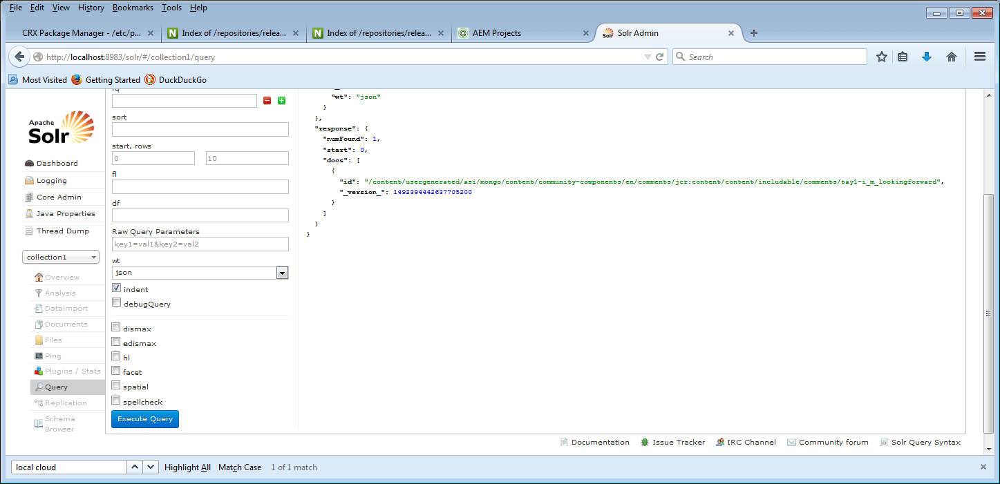

# 데모 {#how-to-setup-mongodb-for-demo}에 대한 MongoDB를 설정하는 방법

## 소개 {#introduction}

이 자습서에서는 *하나의 작성자* 인스턴스 및 *하나의 게시* 인스턴스에 대해 [MSRP](msrp.md)을 설정하는 방법을 설명합니다.

이 설정을 사용하면 UGC(사용자 생성 컨텐츠)를 전달하거나 역복제할 필요 없이 작성자 및 게시 환경 모두에서 커뮤니티 컨텐츠에 액세스할 수 있습니다.

이 구성은 개발 및/또는 데모처럼 *비프로덕션* 환경에 적합합니다.

**프로덕션  ** 환경은 다음 조건을 충족해야 합니다.**

* 복제본 세트를 사용하여 MongoDB 실행
* SolrCloud 사용
* 여러 게시자 인스턴스 포함

## MongoDB {#mongodb}

### MongoDB {#install-mongodb} 설치

* [https://www.mongodb.org/](https://www.mongodb.org/)에서 MongoDB를 다운로드합니다.

   * OS 선택:

      * Linux
      * Mac 10.8
      * Windows 7
   * 버전 선택:

      * 최소한 버전 2.6 사용

* 기본 구성

   * MongoDB 설치 지침을 따릅니다
   * Mongoy에 대한 구성

      * 관리 또는 공유를 구성할 필요가 없음
   * 설치된 MongoDB 폴더를 &lt;mongo-install>이라고 합니다.
   * 정의된 데이터 디렉토리 경로는 &lt;mongo-dbpath>라고 합니다

* MongoDB는 AEM과 동일한 호스트에서 실행하거나 원격으로 실행할 수 있습니다

### MongoDB {#start-mongodb} 시작

* &lt;mongo-install>/bin/mongoom —dbpath  &lt;mongo-dbpath>

이렇게 하면 기본 포트 27017을 사용하여 MongoDB 서버가 시작됩니다.

* Mac의 경우 시작 인수 &#39;ulimit -n 2048&#39;로 제한 값을 늘립니다

>[!NOTE]
>
>MongoDB가 *AEM 다음에*&#x200B;시작되면, **다시 시작** 모든 **AEM** 인스턴스를 다시 시작하여 MongoDB에 올바르게 연결합니다.

### 데모 프로덕션 옵션:MongoDB 복제본 세트 {#demo-production-option-setup-mongodb-replica-set} 설정

다음 명령은 localhost에 3개의 노드가 있는 복제본 세트를 설정하는 예제입니다.

* bin/mongod —port 27017 —dbpath 데이터 —replSet rs0&amp;
* bin/mongo

   * cfg = {&quot;_id&quot;:&quot;rs0&quot;,&quot;version&quot;:1, &quot;구성원&quot;:[{&quot;_id&quot;:0,&quot;host&quot;:&quot;127.0.0.1:27017&quot;}]}
   * rs.initiate(cfg)

* bin/mongod —port 27018 —dbpath data1 —replSet rs0&amp;
* bin/mongod —port 27019 —dbpath data2 —replSet rs0&amp;
* bin/mongo

   * rs.add(&quot;127.0.0.1:27018&quot;)
   * rs.add(&quot;127.0.0.1:27019&quot;)
   * rs.status()

## Solr {#solr}

### Solr {#install-solr} 설치

* [Apache Lucene](https://archive.apache.org/dist/lucene/solr/)에서 솔루션을 다운로드합니다.

   * 모든 OS에 적합
   * 버전 4.10 또는 버전 5 사용
   * 솔루션이 Java 1.7 이상 필요

* 기본 구성

   * &#39;example&#39; Solr 설정을 따릅니다.
   * 서비스가 필요하지 않습니다
   * 설치된 Solr 폴더를 &lt;solr-install>이라고 합니다.

### AEM Communities에 대한 솔루션 구성 {#configure-solr-for-aem-communities}

데모 목적으로 MSRP용 Solr 컬렉션을 구성하려면 다음 두 가지 결정을 수행해야 합니다(자세한 내용은 기본 설명서에 대한 링크 선택).

1. 독립형 또는 [SolrCloud 모드에서 Solr 실행](msrp.md#solrcloudmode)
1. [standard](msrp.md#installingstandardmls) 또는 [고급](msrp.md#installingadvancedmls) 다국어 검색(MLS)을 설치합니다

### 독립형 솔루션 {#standalone-solr}

Solr 실행 방법은 설치 버전 및 방식에 따라 다를 수 있습니다. [Solr 참조 안내서](https://archive.apache.org/dist/lucene/solr/ref-guide/)는 신뢰할 수 있는 문서입니다.

간단히 설명하자면 버전 4.10을 예로 사용하여 Solr를 독립형 모드로 시작합니다.

* cd to &lt;solrinstall>/example
* java -jar start.jar

기본 포트 8983을 사용하여 Solr HTTP 서버가 시작됩니다. Solr 콘솔로 이동하여 테스트할 Solr 콘솔을 가져올 수 있습니다.

* 기본 콘솔:[http://localhost:8983/solr/](http://localhost:8983/solr/)

>[!NOTE]
>
>Solr Console을 사용할 수 없는 경우 &lt;solrinstall>/example/logs 아래의 로그를 확인합니다. SOLR이 확인할 수 없는 특정 호스트 이름(예:&quot;user-macbook-pro&quot;)
이 경우 etc/hosts 파일을 이 호스트 이름의 새 항목(예: 127.0.0.1 user-macbook-pro)으로 업데이트하면 Solr이 제대로 시작됩니다.

### SolrCloud {#solrcloud}

매우 기본적인(프로덕션 아님) solrCloud 설정을 실행하려면 다음을 사용하여 솔루션을 시작합니다.

* java -Dbootstrap_confdir=./solr/collection1/conf -Dbootstrap_conf=true -DzkRun -jar start.jar

## MongoDB를 일반 저장소로 식별 {#identify-mongodb-as-common-store}

필요한 경우 작성자 및 게시 AEM 인스턴스를 시작합니다.

AEM이 MongoDB가 시작되기 전에 실행 중이라면 AEM 인스턴스를 다시 시작해야 합니다.

기본 설명서 페이지의 지침을 따르십시오.[MSRP - MongoDB 공용 저장소](msrp.md)

## 테스트 {#test}

MongoDB 공용 저장소를 테스트하고 확인하려면 게시 인스턴스에 주석을 게시하고 작성자 인스턴스에서 보고 MongoDB 및 Solr에서 UGC를 확인합니다.

1. 게시 인스턴스에서 [커뮤니티 구성 요소 안내서](http://localhost:4503/content/community-components/en/comments.html) 페이지로 이동하여 설명 구성 요소를 선택합니다.
1. 댓글을 게시하려면 로그인:
1. 주석 텍스트 입력 상자에 텍스트를 입력하고 **[!UICONTROL Post]**&#x200B;를 클릭합니다.

   

1. [작성자 인스턴스](http://localhost:4502/content/community-components/en/comments.html)에 대한 설명을 보면 됩니다(관리자 / 관리자로 계속 로그인됨).

   

   참고:작성자의 *asipath* 아래에 JCR 노드가 있지만 이는 SCF 프레임워크에 대한 것입니다. 실제 UGC는 JCR에 없으며 MongoDB에 있습니다.

1. mongodb **[!UICONTROL 커뮤니티 > 컬렉션 > 콘텐츠]**&#x200B;에서 UGC 보기

   

1. 솔더에서 UGC 보기:

   * 솔루션 대시보드로 이동합니다.[http://localhost:8983/solr/](http://localhost:8983/solr/)
   * `core selector` 사용자가 `collection1` 선택
   * 선택 `Query`
   * 선택 `Execute Query`

   

## 문제 해결 {#troubleshooting}

### UGC가 표시되지 않음 {#no-ugc-appears}

1. MongoDB가 설치되어 제대로 실행 중인지 확인하십시오.

1. MSRP가 기본 공급자로 구성되었는지 확인합니다.

   * 모든 작성자 및 게시 AEM 인스턴스에서 [스토리지 구성 콘솔](srp-config.md)을 다시 방문하여

   또는 AEM 저장소를 확인합니다.

   * JCR에서 [/etc/socialconfig](http://localhost:4502/crx/de/index.jsp#/etc/socialconfig/)인 경우

      * [srpc](http://localhost:4502/crx/de/index.jsp#/etc/socialconfig/srpc) 노드를 포함하지 않습니다. 즉, 스토리지 공급자가 JSRP임을 의미합니다
      * srpc 노드가 있고 [defaultconfiguration](http://localhost:4502/crx/de/index.jsp#/etc/socialconfig/srpc/defaultconfiguration) 노드가 포함된 경우 기본 구성의 속성은 MSRP를 기본 공급자로 정의해야 합니다

1. MSRP를 선택한 후 AEM이 다시 시작되었는지 확인합니다.
