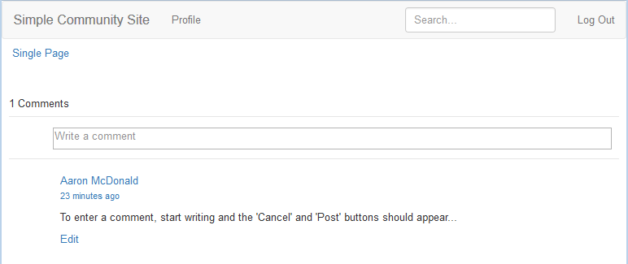

# 모양 변경(HBS) {#alter-the-appearance-hbs}

>[!CAUTION]
>
>AEM 6.4가 확장 지원이 종료되었으며 이 설명서는 더 이상 업데이트되지 않습니다. 자세한 내용은 [기술 지원 기간](https://helpx.adobe.com/kr/support/programs/eol-matrix.html). 지원되는 버전 찾기 [여기](https://experienceleague.adobe.com/docs/).

애플리케이션 디렉토리(/apps)의 사용자 지정 주석 시스템에 대한 구성 요소가 배치되었으므로, resourceSuperType이 기본 주석 시스템을 참조하고 사용자 지정 모델/보기가 등록된 상태로 구현을 수정할 수 있습니다.

간단한 데모에서는 댓글을 게시한 로그인한 사용자의 아바타가 제거됩니다.

>[!NOTE]
>
>확장을 사용하려면 웹 사이트에서 주석 시스템의 인스턴스가 영향을 받을(/content)의 인스턴스를 resourceType을 사용자 지정 주석 시스템으로 설정해야 합니다.

## HBS 스크립트 수정 {#modify-the-hbs-scripts}

사용 [CRXDE Lite](../../help/sites-developing/developing-with-crxde-lite.md):

* 열기 [/apps/custom/components/comments/comment/comment.hbs](http://localhost:4502/crx/de/index.jsp#/apps/custom/components/comments/comment/comment.hbs)

   * 주석 게시물에 대한 아바타가 포함된 태그를 주석 처리합니다(~ 21행).

      ```
      <!--
       <</img>
       -->
      ```

* 열기 [/apps/custom/components/comments/comments.hbs](http://localhost:4502/crx/de/index.jsp#/apps/custom/components/comments/comments.hbs)

   * 다음 주석 항목(~ 44행)에 대한 아바타가 포함된 태그를 주석 처리하십시오.

      ```
      <!--
       </img>
       -->
      ```

* 선택 **모두 저장**

## 사용자 지정 앱 복제 {#replicate-custom-app}

애플리케이션이 수정된 후에는 사용자 지정 구성 요소를 다시 복제해야 합니다.

한 가지 방법은 다음과 같습니다

* 주 메뉴에서

   * 선택 **[!UICONTROL 도구 > 작업 > 복제]**
   * 선택 `Activate Tree`
   * 설정 `Start Path`: to `/apps/custom`
   * 선택을 취소합니다 `Only Modified`
   * 선택 `Activate` 버튼

## 게시된 샘플 페이지에서 수정된 주석 보기 {#view-modified-comment-on-published-sample-page}

[경험 계속](extend-sample-page.md#publish-sample-page) 여전히 동일한 사용자로 로그인한 게시 인스턴스에서 게시 환경의 페이지를 새로 고쳐 아바타를 제거할 수정 사항을 볼 수 있습니다.



## 샘플 주석 확장 패키지 {#sample-comment-extension-package}

이 자습서에서 만든 사용자 정의 댓글 응용 프로그램 패키지가 첨부됩니다.

[파일 가져오기](assets/sample-comment-extension-6-1-fp3.zip)
