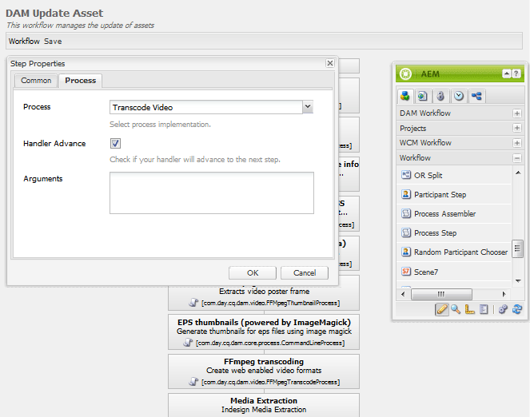

# 커뮤니티용 FFmpeg {#ffmpeg-for-communities}

>[!CAUTION]
>
>AEM 6.4가 확장 지원이 종료되었으며 이 설명서는 더 이상 업데이트되지 않습니다. 자세한 내용은 [기술 지원 기간](https://helpx.adobe.com/kr/support/programs/eol-matrix.html). 지원되는 버전 찾기 [여기](https://experienceleague.adobe.com/docs/).

## 개요 {#overview}

FFmpeg는 오디오 및 비디오를 변환 및 스트리밍하는 솔루션이며, 설치된 경우 를 적절한 코드 변환에 사용합니다 [비디오 자산](../../help/sites-authoring/default-components-foundation.md#video) 뿐만 아니라 AEM Communities 지원 기능도 제공합니다.

FFmpeg는 작성 환경에서 업로드된 지원 리소스에 대한 메타데이터를 가져오고 지원 리소스를 나열할 때 표시할 축소판을 생성하는 데 사용됩니다.

## FFmpeg 설치 {#installing-ffmpeg}

FFmpeg는 AEM을 호스팅하는 서버에 설치해야 합니다 *작성자* 인스턴스.

1. 이동 [https://www.ffmpeg.org](https://www.ffmpeg.org/)
1. 특정 환경을 위한 최신 버전의 FFmpeg를 다운로드합니다(Macintosh, Windows 또는 Linux)

   * 이전 버전의 보안 취약점으로 인해 FFmpeg를 최신 상태로 유지하는 것이 중요합니다

1. OS에 대한 지침에 따라 FFmpeg를 설치합니다.

1. FFmpeg 실행 파일이 시스템 경로에 설정되어 있는지 확인합니다.

   시스템의 모든 디렉토리에서 FFmpeg를 실행할 수 있습니다.

   * 예, `ffmpeg -version`

## FFmpeg 코드 변환 서비스 구성 {#configure-ffmpeg-transcoding-service}

기본적으로 FFmpeg가 설치되면 DAM 자산 업데이트 워크플로우 정의에 따라 여러 표현물이 구성(전송)됩니다.

전송은 CPU가 많이 사용되므로 대상 표현물 목록을 수정하는 것이 좋습니다. 대부분의 경우 코드 변환이 필요하지 않습니다.

DAM 자산 업데이트 워크플로우를 수정하려면 다음을 수행합니다. 이 예에서는 코드 변환을 끄십시오.

* 관리자 권한으로 작성자 인스턴스에 로그인합니다.
* 전역 탐색에서: **[!UICONTROL 도구 > 워크플로우 > 모델]**
* 찾기 **[!UICONTROL DAM 자산 업데이트]**
* 클래식 UI에서 편집할 워크플로우를 두 번 클릭하여 엽니다

   결과 위치: [http://localhost:4502/cf#/etc/workflow/models/dam/update_asset.html](http://localhost:4502/cf#/etc/workflow/models/dam/update_asset.html)

* 를 두 번 클릭합니다. **[!UICONTROL FFmpeg 코드 변환]** 단계 속성 대화 상자에 액세스하는 단계
* 아래에 **[!UICONTROL 프로세스]** 탭:

   * **[!UICONTROL 배치]**: 코드 변환을 비활성화하려면 모든 항목을 선택 취소합니다. 기본값: `profile:firefoxhq,profile:hq,profile:flv,profile:iehq`

* 선택 **[!UICONTROL 확인]** 를 `Step Properties` 대화 상자

* 선택 **[!UICONTROL 저장]** 를 `DAM Update Asset` 워크플로우

   (왼쪽 위 모서리)
