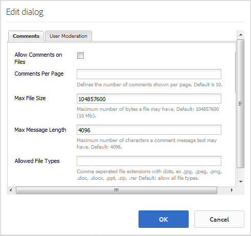

# 파일 라이브러리 기능 {#file-library-feature}

## 소개 {#introduction}

파일 라이브러리 기능은 커뮤니티 사이트 내에서 파일을 업로드, 관리 및 다운로드할 수 있는 로그인 사이트 방문자(커뮤니티 구성원)를 위한 공간을 제공합니다.

설명서의 이 섹션에서는 다음 사항에 대해 설명합니다

* AEM 사이트에 파일 라이브러리 기능 추가
* `File Library` 구성 요소에 대한 구성 설정

## 페이지에 파일 라이브러리 추가 {#adding-a-file-library-to-a-page}

작성자 모드의 페이지에 `File Library` 구성 요소를 추가하려면 구성 요소를 찾습니다

* `Communities / File Library`

페이지로 끌어서 놓습니다.

필요한 정보를 보려면 [커뮤니티 구성 요소 기본 사항](basics.md)을 방문하십시오.

필요한 [클라이언트 측 라이브러리](essentials-file-library.md#essentials-for-client-side)가 포함된 경우 이 방법으로 `File Library` 구성 요소가 표시됩니다.

## 파일 라이브러리 구성 {#configuring-file-library}

액세스할 배치된 `File Library` 구성 요소를 선택하고 편집 대화 상자를 여는 `Configure` 아이콘을 선택합니다.

 

### 댓글 탭 {#comments-tab}

**[!UICONTROL 댓글]** 탭에서 업로드된 파일에 대한 주석이 표시되는 여부와 방법을 지정합니다.

* **[!UICONTROL 파일에 대한 주석]**
허용이 선택되면 업로드된 파일에 대한 주석을 허용합니다. 기본값은 선택 취소되어 있습니다.

* **[!UICONTROL 페이지당]**
주석페이지당 표시되는 댓글 수와 표시된 답글 수를 제한합니다. 기본값은 입니다. 
**10**.

* **[!UICONTROL 최대 파일]**
크기 이 값은 업로드된 파일 크기를 제한합니다. 기본 제한은 104857600(10Mb)입니다.

* **[!UICONTROL 최대 메시지]**
길이텍스트 상자에 입력할 수 있는 최대 문자 수입니다. 기본값은 4096자입니다.

* **[!UICONTROL 허용되는 파일]**
형식에서는 &quot;점&quot; 구분 기호를 사용하여 쉼표로 구분된 파일 확장자 목록입니다. 예:.jpg, .jpeg, .png, .doc, .docx, .pdf 파일 유형을 지정하면 지정되지 않은 파일 유형이 허용되지 않습니다. 기본값은 지정되지 않아서 모든 파일 유형이 허용됩니다.

* **[!UICONTROL 리치 텍스트]**
편집기이 옵션을 선택하면 마크업에 주석을 입력할 수 있습니다. 기본값은 선택 취소되어 있습니다.

* **[!UICONTROL 주석]**
삭제이 옵션을 선택하면 사용자가 자신의 주석을 삭제할 수 있습니다. 기본값이 선택되어 있습니다.

* **[!UICONTROL 태깅]**
허용 옵션을 선택하면 파일에 태그를 추가하는 기능이 활성화됩니다. 기본값은 선택 취소되어 있습니다.

* **[!UICONTROL 허용되는 네임스페이스]**
태깅 허용 을 선택하면 사용 가능한 태그는 선택한 네임스페이스로 제한됩니다. 아무것도 선택하지 않으면 모든 것이 허용됩니다. 기본값은 모든 네임스페이스입니다.

* **[!UICONTROL 제안]**
제한태깅 허용 을 선택하면 이 설정은 표시할 제안된 태그의 수를 제한합니다. -1로 설정하면 제한이 없습니다. 기본값은 -1입니다.

* **[!UICONTROL 투표]**
허용이 선택되면 파일에 대한 투표자 기능을 사용할 수 있습니다. 기본값은 선택 취소되어 있습니다.

* **[!UICONTROL 허용]**
이 선택되면 블로그 문서에 다음 기능을 포함시켜 구성원이 새 게시물에 대한 알림을   받을 수 있습니다. 기본값은 선택 취소되어 있습니다.

* **[!UICONTROL 스레드]**
답글 허용이 선택되면 게시된 댓글에 답글을 허용합니다. 기본값은 선택 취소되어 있습니다.

### 사용자 중재 탭 {#user-moderation-tab}

**[!UICONTROL 사용자 중재]** 탭에서 댓글이 허용된 경우 댓글의 조정을 구성합니다.

* **[!UICONTROL 사전]**
조정이 확인란을 선택하면 게시 사이트에 게시하기 전에 주석이 승인되어야 합니다. 기본값은 선택 취소되어 있습니다.

* **[!UICONTROL 댓글]**
삭제이 확인란을 선택하면 댓글을 게시한 방문자에게 댓글을 삭제할 수 있는 기능이 제공됩니다. 기본값이 선택되어 있습니다.

* **[!UICONTROL 주석]**
거부 이 확인란을 선택하면 신뢰할 수 있는 멤버 중재자가 주석을 거부할 수 있습니다. 기본값은 선택 취소되어 있습니다.

* **[!UICONTROL 설명 닫기/]**
다시 열기이 옵션을 선택하면 신뢰할 수 있는 멤버 중재자가 댓글을 닫고 다시 열 수 있습니다. 기본값은 선택 취소되어 있습니다.

* **[!UICONTROL 플래그]**
설명이 선택되면 방문자가 주석을 부적절한 것으로 플래그를 지정할 수 있습니다. 기본값은 선택 취소되어 있습니다.

* **[!UICONTROL 플래그 이유]**
목록 이 확인란을 선택하면 방문자가 드롭다운 목록에서 주석을 부적절하게 표시하는 이유를 선택할 수 있습니다. 기본값은 선택 취소되어 있습니다.

* **[!UICONTROL 사용자 지정 플래그]**
사유이 선택되면 방문자가 댓글에 대한 플래그 지정 이유를 부적당하다고 입력할 수 있습니다. 기본값은 선택 취소되어 있습니다.

* **[!UICONTROL 중재]**
임계값중재자에게 알리기 전에 방문자가 댓글에 플래그를 지정해야 하는 횟수를 입력합니다. 기본값은 한 번입니다(
**1**).

* **[!UICONTROL 플래그 지정]**
제한공용 보기에서 주석이 숨겨지기 전에 플래그를 지정해야 하는 횟수를 입력합니다. 이 숫자는 다음보다 크거나 같아야 합니다 
**관리 임계값**. 기본값은 5입니다.

## 추가 정보 {#additional-information}

개발자를 위한 [파일 라이브러리 필수 패키지](essentials-file-library.md) 페이지에서 자세한 정보를 찾을 수 있습니다.

게시된 항목 및 댓글에 대한 중복을 보려면 [사용자 생성 콘텐츠 중재](moderate-ugc.md)를 참조하십시오.

게시된 항목 및 댓글에 태깅하려면 [사용자 생성 컨텐츠 태깅](tag-ugc.md)을 참조하십시오.
