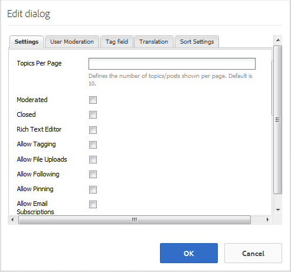

# 포럼 기능 {#forum-feature}

## 소개 {#introduction}

포럼 기능은 게시 환경에서 로그인한 사이트 방문자(커뮤니티 구성원)를 위한 영역을 제공합니다.

* 새 항목 만들기
* 주제 보기 및 회신
* 항목을 따르십시오
* 포럼 검색
* 포럼 컨텐츠 중재 도움말
* 한 페이지에서 다른 페이지로 포럼 주제 이동

설명서의 이 섹션에서는 다음 사항에 대해 설명합니다

* AEM 사이트에 포럼 기능 추가
* `Forum`구성 요소에 대한 구성 설정

## 페이지에 포럼 추가 {#adding-a-forum-to-a-page}

작성자 모드의 페이지에 `Forum` 구성 요소를 추가하려면 구성 요소 브라우저를 사용하여 을 찾습니다

* `Communities / Forum`

포럼이 나타날 페이지로 끌어서 놓습니다.

필요한 정보를 보려면 [커뮤니티 구성 요소 기본 사항](basics.md)을 방문하십시오.

필요한 [클라이언트 측 라이브러리](essentials-forum.md#essentials-for-client-side)가 포함된 경우 이 방법으로 `Forum`구성 요소가 표시됩니다.

## 포럼 구성 {#configuring-a-forum}

액세스할 배치된 `Forum` 구성 요소를 선택하고 편집 대화 상자를 여는 `Configure` 아이콘을 선택합니다.

 

### 설정 탭 {#settings-tab}

**[!UICONTROL 설정]** 탭에서 주제 및 답글에 대한 설정을 지정합니다.

* **[!UICONTROL 페이지당 항목]**
페이지당 표시되는 항목/게시물 수를 정의합니다. 기본값은 10입니다.

* ****
중재이 확인란을 선택하면 게시 사이트에 표시되기 전에 주제 및 댓글 게시를 승인해야 합니다. 기본값은 선택 취소되어 있습니다.

* ****
닫힘(Closed)이 선택되면 포럼이 새 주제와 주석으로 닫힙니다. 기본값은 선택 취소되어 있습니다.

* **[!UICONTROL 리치 텍스트]**
편집기이 옵션을 선택하면 항목 및 주석을 마크업에 입력할 수 있습니다. 기본값은 선택 취소되어 있습니다.

* **[!UICONTROL 태깅]**
허용 이 선택되면 구성원이 게시물에 태그 레이블을 추가할 수 있도록 합니다(태그  **[!UICONTROL 필드]** 탭 참조). 기본값은 선택 취소되어 있습니다.

* **[!UICONTROL 파일 업로드]**
허용이 선택된 경우 항목 또는 주석에 첨부 파일을 추가할 수 있습니다. 기본값은 선택 취소되어 있습니다.

* **[!UICONTROL 허용]**
이 선택되면 포럼 게시물에 다음과 같은 기능을 포함시켜 구성원에게 새 게시물에   대한 알림을 제공할 수 있습니다. 기본값은 선택 취소되어 있습니다.

* **[!UICONTROL 고정]**
허용이 선택된 경우 포럼 주제가 주제 목록의 맨 위에 고정될 수 있습니다. 기본값은 선택 취소되어 있습니다.

* **[!UICONTROL 추천 콘텐츠]**
허용 을 선택하면 추천 콘텐츠를  [주요 콘텐츠로 식별할 수 있습니다](featured.md). 기본값은 선택 취소되어 있습니다.

* **[!UICONTROL 이메일 구독]**
허용 이 확인란을 선택하면 구성원에게 이메일([구독](subscriptions.md))로 새 게시물에 대한 알림을 받을 수 있습니다. `Allow Following`을(를) 선택해야 하고 [구성된 ](email.md)로 이메일을 보내야 합니다. 기본값은 선택 취소되어 있습니다.

* **[!UICONTROL 최대 파일]**
크기관련성 
`Allow File Uploads` 이(가) 선택되어 있습니다. 이 필드는 업로드된 파일의 크기(바이트)를 제한합니다. 기본값은 104857600(10Mb)입니다.

* **[!UICONTROL 허용되는 파일]**
형식관련성이 있는 경우에만 
`Allow File Uploads` 이(가) 선택되어 있습니다. 점이 구분되어 있는 쉼표로 구분된 파일 확장자 목록입니다. 예:.jpg, .jpeg, .png, .doc, .docx, .pdf 파일 유형을 지정하면, 지정되지 않은 파일 유형은 업로드할 수 없습니다. 기본값은 지정되지 않아서 모든 파일 유형이 허용됩니다.

* **[!UICONTROL 최대 첨부 이미지 파일]**
크기파일 업로드 허용(Allow File Upload)이 선택된 경우에만 관련됩니다. 업로드된 이미지 파일의 최대 바이트 수입니다. 기본값은 2097152(2Mb)입니다.

* **[!UICONTROL 스레드]**
답글 허용이 선택되면 주제에 게시된 댓글에 대한 답글을 허용합니다. 기본값은 선택 취소되어 있습니다.

* **[!UICONTROL 사용자가 댓글 및 항목 삭제]**
허용이 선택되면 구성원이 게시된 댓글 및 항목을 삭제할 수 있습니다. 기본값은 선택 취소되어 있습니다.

* **[!UICONTROL 투표]**
허용이 선택된 경우, 투표용 기능을 주제에 포함하십시오. 기본값은 선택 취소되어 있습니다.

* **[!UICONTROL 탐색]**
표시이 확인란을 선택하면 항목 페이지에 탐색 표시를 표시합니다. 기본값이 선택되어 있습니다.

* **[!UICONTROL 배지]**
표시이 옵션을 선택하면, 멤버 블로그 항목  에 기한 및 지정된 배지를 표시합니다. 기본값은 선택 취소되어 있습니다.

>[!NOTE]
>
>주제에 대한 설명을 활성화하려면 `AllowThreaded Replies` 및 `Allow users to Delete Comments and Topics` 모두 확인해야 할 수 있습니다.

### 사용자 중재 탭 {#user-moderation-tab}

**[!UICONTROL 사용자 중재]** 탭에서 게시된 항목 및 답글(사용자가 생성한 컨텐츠)을 관리하는 방법을 지정합니다. 자세한 내용은 [사용자 생성 콘텐츠 중재](moderate-ugc.md)를 참조하십시오.

* **[!UICONTROL 게시물]**
거부 이 확인란을 선택하면 신뢰할 수 있는 구성원 중재자가 게시물을 거부하고 공개 포럼에 게시물이 표시되지 않도록 할 수 있습니다. 기본값은 선택 취소되어 있습니다.

* **[!UICONTROL 주제]**
닫기/다시 열기이 옵션을 선택하면 신뢰할 수 있는 멤버 중재자가 항목을 닫고 추가 편집 및 주석을 확인할 수 있으며 항목을 다시 열 수도 있습니다. 기본값은 선택 취소되어 있습니다.

* **[!UICONTROL 항목]**
이동이 선택된 경우 게시 측 중재자가 항목을 이동할 수 있도록 허용합니다. 기본값이 선택되어 있습니다.

* **[!UICONTROL 게시물]**
플래그 지정 이 선택되면 구성원이 다른 항목의 주제나 댓글을 부적절한 것으로 표시할 수 있습니다. 기본값은 선택 취소되어 있습니다.

* **[!UICONTROL 플래그]**
이유 목록이 옵션을 선택하면 구성원이 드롭다운 목록에서 주제 또는 댓글에 대한 플래그 지정 이유를 부적절한 것으로 선택할 수 있습니다. 기본값은 선택 취소되어 있습니다.

* **[!UICONTROL 사용자 지정 플래그]**
사유이 선택되면 구성원이 주제 또는 댓글에 대한 플래그 지정 이유를 부적합으로 입력할 수 있습니다. 기본값은 선택 취소되어 있습니다.

* **[!UICONTROL 중재]**
임계값중재자에게 알리기 전에 구성원에 의해 주제나 댓글에 플래그를 지정해야 하는 횟수를 입력합니다. 기본값은 1입니다(한 번).

* **[!UICONTROL 플래그 지정]**
제한주제 또는 댓글이 공용 보기에서 숨겨지기 전에 플래그를 지정해야 하는 횟수를 입력합니다. -1로 설정하면 플래그가 지정된 주제나 주석이 공개 보기에서 숨겨지지 않습니다. 그렇지 않은 경우 이 숫자는 중재 임계값보다 크거나 같아야 합니다. 기본값은 5입니다.

### 태그 필드 탭 {#tag-field-tab}

**[!UICONTROL 태그 필드]** 탭 아래에서 **[!UICONTROL 설정]** 탭에서 허용되는 경우 적용할 수 있는 태그는 선택한 네임스페이스에 따라 제한됩니다.

* **[!UICONTROL 허용되는 네임스페이스]**
설정 탭 `Allow Tagging` 에서 이 확인되면  **** 관련성이 있습니다. 적용할 수 있는 태그는 선택한 네임스페이스 카테고리 내의 태그로 제한됩니다. 네임스페이스 목록에는 &quot;표준 태그&quot;(기본 네임스페이스)와 &quot;모든 태그 포함&quot;이 포함되어 있습니다. 기본값이 선택되어 있지 않으므로 모든 네임스페이스가 허용됩니다.

* **[!UICONTROL 제안]**
제한포럼에 게시하기 위해 제안으로 표시할 태그의 수를 입력합니다. 기본값은 입니다. 
**-** 1(제한 없음).

### 번역 탭 {#translation-tab}

**[!UICONTROL 번역]** 탭 아래에서 커뮤니티 사이트에 대해 번역이 활성화되면 전체 토픽 또는 선택한 게시물을 번역하도록 번역을 설정할 수 있습니다.

* **[!UICONTROL 모두]**
번역이 선택된 경우 포럼 스레드가 사용자의 기본 언어로 번역됩니다. 기본값은 선택 취소되어 있습니다.

### 정렬 설정 탭 {#sort-settings-tab}

**[!UICONTROL 정렬 설정]** 탭에서 게시된 주석이 표시될 때 정렬되는 방법을 지정합니다.

* **[!UICONTROL 정렬 기준]**
허용되는 모든 정렬 선택 항목 확인: 
`Newest, Oldest, Last Updated, Most Viewed, Most Active, Most Followed and Most Liked`. 기본값은 `Newest, Oldest, Last Updated`입니다.

* **[!UICONTROL 기본값으로]**
표시할 선택된 정렬 옵션 중 하나를 선택하려면 기본값으로 설정합니다. 기본값은 입니다. 
`Newest`.

* **[!UICONTROL Analytics SortingDown에 대한]**
시간 옵션 을 선택하여 다음 중 하나를 선택합니다 
`All, Last 24 Hours, Last 7 Days, Last 30 Days`. 기본값은 `All`입니다.

## 추가 정보 {#additional-information}

개발자를 위한 [포럼 필수 요소인](essentials-forum.md) 페이지에서 자세한 내용을 확인할 수 있습니다.

게시된 항목 및 댓글에 대한 중복을 보려면 [사용자 생성 콘텐츠 중재](moderate-ugc.md)를 참조하십시오.

게시된 항목 및 댓글에 태깅하려면 [사용자 생성 컨텐츠 태깅](tag-ugc.md)을 참조하십시오.

게시된 항목 및 댓글에 대한 번역은 [사용자 생성 컨텐츠 번역](translate-ugc.md)을 참조하십시오.
