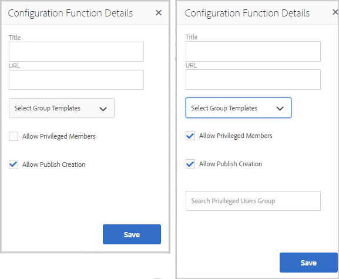
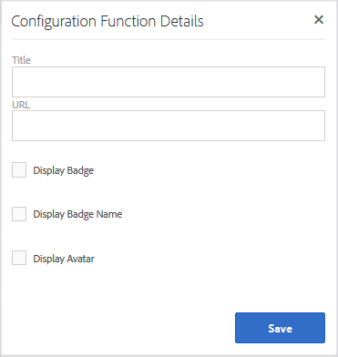

# 커뮤니티 기능 {#community-functions}

커뮤니티 경험에서 예상되는 기능 유형은 잘 알려져 있습니다. 커뮤니티 기능은 커뮤니티 기능으로 사용할 수 있습니다. 기본적으로 이 구성 요소는 작성 모드에서 페이지에 구성 요소를 추가하는 것 이상의 것이 필요한 커뮤니티 기능을 구현하기 위해 미리 연결된 하나 이상의 페이지입니다. 커뮤니티 사이트가 [만들어지는](sites.md) 커뮤니티 사이트 템플릿 [구조를 정의하는 데 사용되는 기본](sites-console.md)블록입니다.

커뮤니티 사이트가 만들어지면 표준 [AEM 작성 모드를 사용하여 결과 페이지에 컨텐츠가 추가될 수 있습니다](../../help/sites-authoring/editing-content.md).

커뮤니티 기능 콘솔에서 보듯이 다양한 커뮤니티 기능을 즉시 사용할 수 있습니다. 향후 릴리스에는 더 많은 커뮤니티 기능이 제공되고 사용자 정의 기능도 제공될 수 있습니다.

>[!NOTE]
>
>작성 환경에서만 사용할 수 있는 [커뮤니티 사이트](sites-console.md), [커뮤니티 사이트 템플릿](sites.md), [커뮤니티 그룹 템플릿](tools-groups.md) 및 [커뮤니티 기능](functions.md) 의 콘솔입니다.

## 커뮤니티 기능 콘솔 {#community-functions-console}

작성 환경에서 커뮤니티 기능 콘솔에 도달하려면

* 전역 탐색에서: **[!UICONTROL 도구 > 커뮤니티 > 커뮤니티 함수]**

## 사전 빌드 함수 {#pre-built-functions}

다음은 AEM Communities과 함께 제공되는 기능에 대한 간략한 설명입니다. 각 함수는 커뮤니티 사이트 템플릿에 손쉽게 통합되는 기능으로 연결된 커뮤니티 구성 요소를 포함하는 하나 이상의 AEM 페이지로 [구성됩니다](sites.md).

커뮤니티 사이트 템플릿은 로그인, 사용자 프로필, 알림, 메시지, 사이트 메뉴, 검색, 테마 및 브랜딩 기능을 포함한 커뮤니티 사이트의 구조를 제공합니다.

### 제목 및 URL 설정 {#title-and-url-settings}

**제목** 및 **URL** 은 모든 커뮤니티 기능에 공통인 속성입니다.

커뮤니티 사이트 템플릿에 커뮤니티 기능을 추가하거나 커뮤니티 사이트의 구조를 [수정할](sites-console.md#modifying-site-properties) 때 추가된 경우, 제목 및 URL을 구성할 수 있도록 함수의 대화 상자가 열립니다.

#### 구성 기능 세부 사항 {#configuration-function-details}

* **[!UICONTROL 제목]**
(
*필수*) 사이트 기능 메뉴에 표시되는 텍스트입니다.

* **[!UICONTROL URL]**(*필수*) URI를 생성하는 데 사용되는 이름입니다. 이 이름은 AEM 및 JCR에서 [지정한 이름 지정 규칙을](../../help/sites-developing/naming-conventions.md) 준수해야 합니다.

예를 들어, 시작 자습서  에 따라 만든 사이트를 사용하는 경우

* Title = 웹 페이지
* URL = 페이지

페이지의 URL은 http://local_host:4503/content/sites/engage/en/page.html이고 페이지의 메뉴 링크는 다음과 같이 표시됩니다.

### 활동 스트림 기능 {#activity-stream-function}

활동 스트림 기능은 모든 보기(모든 활동, 사용자 활동 및 [다음)가 선택된 활동 스트림 구성](activities.md) 요소가 있는 페이지입니다. 개발자를 위한 [Activity Stream Essentials](essentials-activities.md) 도 참조하십시오.

템플릿에 추가하면 다음 대화 상자가 열립니다.

#### 구성 기능 세부 사항 {#configuration-function-details-1}

* 제목 [및 URL 설정 참조](#title-and-url-settings)
* **[!UICONTROL &quot;내 활동&quot; 보기]**&#x200B;표시 이 확인란을 선택하면 활동 페이지에 현재 구성원이 커뮤니티 내에서 생성한 활동을 기준으로 하는 탭이 포함됩니다. 기본값은 선택되어 있습니다.

* **[!UICONTROL &quot;모든 활동&quot; 보기]**&#x200B;가 선택된 경우 활동 페이지에는 현재 구성원이 액세스할 수 있는 커뮤니티 내에서 생성된 모든 활동이 포함된 탭이 포함됩니다. 기본값은 선택되어 있습니다.

* **[!UICONTROL &quot;뉴스 피드&quot; 보기]**&#x200B;를 표시합니다. 이 확인란을 선택하면 활동 페이지에 현재 구성원이 팔로우하는 활동을 필터링하는 탭이 포함됩니다. 기본값은 선택되어 있습니다.

### 지정 기능 {#assignments-function}

assignments 함수는 [커뮤니티 사이트를 정의하는 기본 기능입니다](overview.md#enablement-community). 커뮤니티 구성원에게 역량 강화 리소스를 할당할 수 있습니다. 개발자를 [위한 Assignments Essentials](essentials-assignments.md) 도 참조하십시오.

이 함수는 [활성 추가 기능의 기능으로 사용할 수 있습니다](enablement.md). 활성화 추가 기능을 사용하려면 프로덕션 환경에서 사용할 추가 라이선스가 필요합니다.

템플릿에 추가되면 [제목 및 URL 설정만 구성됩니다](#title-and-url-settings).

### 블로그 기능 {#blog-function}

블로그 기능은 태그 지정, 파일 업로드, 팔로우, [멤버가 직접 편집, 투표 및 중재할 수 있도록 구성된](blog-feature.md) 블로그 구성요소가 있는 페이지입니다. Blog [Essentials](blog-developer-basics.md) for developers를 참조하십시오.

템플릿에 추가하면 다음 대화 상자가 열립니다.

* 제목 [및 URL 설정 참조](#title-and-url-settings)
* **[!UICONTROL 권한 있는 멤버]**&#x200B;허용 이 확인란을 선택하면 권한 있는 멤버는 [권한 있는 구성원 그룹을 선택하여 아티클을 만들 수 있습니다](users.md#privileged-members-group). 이 확인란을 선택하지 않으면 모든 커뮤니티 멤버가 만들 수 있습니다. 기본값은 선택 취소입니다.

* **[!UICONTROL 파일 업로드]**&#x200B;허용 이 확인란을 선택하면 블로그에는 구성원이 파일을 업로드하는 기능이 포함됩니다. 기본값은 선택되어 있습니다.

* **[!UICONTROL 스레드 답글 허용]**&#x200B;이 선택되지 않으면 블로그에 아티클에 대한 답글(댓글)이 허용되지만 댓글에 대한 답글은 허용되지 않습니다. 기본값은 선택되어 있습니다.

* **[!UICONTROL 주요 컨텐츠 허용]**&#x200B;이 선택된 경우 이 아이디어를 [주요 컨텐츠로 식별할 수 있습니다](featured.md). 기본값은 선택되어 있습니다.

### 달력 기능 {#calendar-function}

달력 기능은 태그 지정을 허용하도록 [달력 구성](calendar.md) 요소가 구성된 페이지입니다. 개발자를 위한 [Calendar](calendar-basics-for-developers.md) Essentials도 참조하십시오.

템플릿에 추가하면 다음 대화 상자가 열립니다.

* 제목 [및 URL 설정 참조](#title-and-url-settings)
* **[!UICONTROL 고정]**&#x200B;허용 이 확인란을 선택하면 포럼 내에서 주제 답글을 댓글 목록의 시작 부분에 고정시킬 수 있습니다. 기본값은 선택되어 있습니다.

* **[!UICONTROL 권한 있는 멤버]**&#x200B;허용 이 확인란을 선택하면 권한 있는 멤버는 [권한 있는 구성원 그룹을 선택하여 아티클을 만들 수 있습니다](users.md#privileged-members-group). 이 확인란을 선택하지 않으면 모든 커뮤니티 멤버가 만들 수 있습니다. 기본값은 선택 취소입니다.

* **[!UICONTROL 파일 업로드]**&#x200B;허용 이 확인란을 선택하면 블로그에는 구성원이 파일을 업로드하는 기능이 포함됩니다. 기본값은 선택되어 있습니다.

* **[!UICONTROL 스레드 답글 허용]**&#x200B;이 선택되지 않으면 블로그에 아티클에 대한 답글(댓글)이 허용되지만 댓글에 대한 답글은 허용되지 않습니다. 기본값은 선택되어 있습니다.

* **[!UICONTROL 주요 컨텐츠 허용]**&#x200B;이 선택된 경우 이 아이디어를 [주요 컨텐츠로 식별할 수 있습니다](featured.md). 기본값은 선택되어 있습니다.

### 카탈로그 기능 {#catalog-function}

카탈로그 함수는 [활성 커뮤니티](overview.md#enablement-community) 구성원이 할당되지 않은 활성 리소스를 검색하는 기능을 제공합니다. 개발자 [를 위한 태깅 지원 리소스](tag-resources.md) 및 [Catalog Essentials](catalog-developer-essentials.md) 를 참조하십시오.

속성이 true로 설정된 경우 커뮤니티 사이트에 대한 모든 활성 리소스 및 학습 경로 ` [Show in Catalog](resources.md)`가 모든 카탈로그에 표시됩니다. 리소스와 학습 경로를 명시적으로 포함하려면 [사전 필터를 카탈로그에 적용해야](catalog-developer-essentials.md#pre-filters) 합니다.

템플릿에 추가하면 구성이 사이트 방문자에게 제공되는 태그 필터를 구성하는 데 사용되는 태그 네임스페이스를 지정할 수 있습니다.

* 제목 [및 URL 설정 참조](#title-and-url-settings)
* **[!UICONTROL [모든 네임스페이스] 선택]**

   * 선택한 태그 네임스페이스는 방문자가 선택할 수 있는 태그를 정의하여 카탈로그에 나열된 활성 리소스 목록을 필터링합니다.
   * 이 확인란을 선택하면 커뮤니티 사이트에 허용된 모든 태그 네임스페이스를 사용할 수 있습니다.
   * 선택 취소하면 커뮤니티 사이트에 대해 허용되는 하나 이상의 네임스페이스를 선택할 수 있습니다.
   * 기본값은 선택되어 있습니다.

### 주요 컨텐츠 함수 {#featured-content-function}

주요 컨텐츠 기능은 주석을 추가하고 삭제하도록 [구성된 주요 컨텐츠 구성](featured.md) 요소가 있는 페이지입니다.

구성 요소별로 기능에 대한 기능이 허용되거나 허용되지 않을 수 있습니다( [블로그 함수](#blog-function), [달력 기능](#calendar-function), [포럼 기능](#forum-function), Ideation 함수 [, Ideation Function 및 QnQnFunction 참조](#ideation-function)).

템플릿에 추가되면 [제목 및 URL 설정만 구성됩니다](#title-and-url-settings).

### 파일 라이브러리 기능 {#file-library-function}

파일 라이브러리 함수는 주석을 추가하고 삭제할 수 있도록 [파일 라이브러리 구성](file-library.md) 요소가 구성된 페이지입니다.

템플릿에 추가되면 [제목 및 URL 설정만 구성됩니다](#title-and-url-settings).

### 포럼 기능 {#forum-function}

포럼 함수는 태그 지정, 파일 업로드, 팔로우, [멤버가 직접 편집, 투표 및 중재할 수 있도록 구성된](forum.md) 포럼 구성요소가 있는 페이지입니다.

템플릿에 추가하면 다음 대화 상자가 열립니다.

#### 구성 기능 세부 사항 {#configuration-function-details-2}

* 제목 [및 URL 설정 참조](#title-and-url-settings)
* **[!UICONTROL 고정]**&#x200B;허용 이 확인란을 선택하면 포럼 내에서 주제 답글을 댓글 목록의 시작 부분에 고정시킬 수 있습니다. 기본값은 선택되어 있습니다.

* **[!UICONTROL 권한이 있는 구성원]**&#x200B;허용 이 확인란을 선택하면 권한 있는 구성원이 [권한 있는 구성원 그룹을 선택할 수 있도록 허용하여 토픽을 게시할 수 있습니다](users.md#privileged-members-group). 선택하지 않으면 모든 커뮤니티 구성원이 게시할 수 있습니다. 기본값은 선택 취소입니다.

* **[!UICONTROL 파일 업로드]**&#x200B;허용 이 확인란을 선택하면 구성원들이 파일을 업로드하는 기능이 포럼에 포함됩니다. 기본값은 선택되어 있습니다.

* **[!UICONTROL 스레드 답글 허용]**&#x200B;이 선택되어 있지 않으면 포럼에 주제에 대한 댓글이 허용되지만 해당 댓글에 대한 답글은 허용되지 않습니다. 기본값은 선택되어 있습니다.

* **[!UICONTROL 주요 컨텐츠 허용]**&#x200B;이 선택된 경우 이 아이디어를 [주요 컨텐츠로 식별할 수 있습니다](featured.md). 기본값은 선택되어 있습니다.

### 그룹 함수 {#groups-function}

>[!CAUTION]
>
>그룹 함수는 사이트 구조나 커뮤니티 사이트 템플릿에서 *첫 번째* 함수이거나 유일한 ** 함수여야 합니다.
>
>페이지 함수 등 다른 모든 함수를 먼저 포함하여 나열해야 합니다.

그룹 기능은 커뮤니티 구성원이 게시 환경의 커뮤니티 사이트 내에서 하위 커뮤니티를 만드는 기능을 제공합니다.

그룹 기능이 [커뮤니티 사이트 템플릿에](sites-console.md#groupmanagement) 포함되는 [설정에](sites.md)따라 그룹은 공개 또는 비공개 그룹일 수 있으며, 커뮤니티 그룹이 실제로 생성될 때(예: 게시 환경)에서 템플릿을 선택할 수 있도록 하나 이상의 커뮤니티 그룹 템플릿을 구성할 수 있습니다. 커뮤니티 [그룹 템플릿은](tools-groups.md) 포럼 및 달력과 같이 그룹 페이지에 대해 만든 커뮤니티 기능을 지정합니다.

커뮤니티 그룹이 만들어지면 새 그룹에 대해 구성원 그룹이 동적으로 만들어지고 구성원을 할당하거나 참여할 수 있습니다. 자세한 내용은 사용자 및 사용자 그룹 [관리를 참조하십시오](users.md).

커뮤니티 [기능 팩 1](deploy-communities.md#latestfeaturepack)의 경우, 커뮤니티 그룹은 [커뮤니티 사이트 그룹 콘솔을](groups.md)사용하여 작성 환경에서 생성되며 활성화되면 게시 환경에서 만들 수 있습니다.

템플릿에 추가하면 다음 대화 상자가 열립니다.

* 제목 [및 URL 설정 참조](#title-and-url-settings)
* **[!UICONTROL 그룹 템플릿]**&#x200B;을 선택합니다. 풀다운 메뉴로 하나 이상의 활성 그룹 템플릿을 선택할 수 있습니다. 이 메뉴에서 새 커뮤니티 그룹의 생성자가 선택할 수 있습니다(게시 환경).

* **[!UICONTROL 권한이 있는 구성원]**&#x200B;허용 이 확인란을 선택하면 권한 있는 구성원이 [권한 있는 구성원 보안 그룹을 선택할 수 있도록 허용하여 토픽을 게시할 수 있습니다](users.md#privileged-members-group). 선택하지 않으면 모든 커뮤니티 구성원이 게시할 수 있습니다. 기본값은 선택 취소입니다.

* **[!UICONTROL 게시 작성 허용]**&#x200B;이 선택된 경우 승인된 커뮤니티 구성원이 게시 환경에서 그룹을 만들 수 있습니다. 이 확인란을 선택하지 않으면 새 그룹(하위 커뮤니티)은 커뮤니티 사이트 그룹 콘솔의 작성 환경에서만 만들 수 있습니다.

   기본값은 `checked`입니다.

### 관념화 기능 {#ideation-function}

관념화 함수는 하나의 [관념화 구성 요소가 있는 페이지입니다](ideation-feature.md).

템플릿에 추가하면 기본 제목 및 URL 이름과 템플릿의 기본 표시 설정을 지정하는 다음 대화 상자가 열립니다.

* 제목 [및 URL 설정 참조](#title-and-url-settings)
* **[!UICONTROL 권한이 있는 구성원]**&#x200B;허용 이 확인란을 선택하면 권한 있는 구성원이 [권한 있는 구성원 보안 그룹을 선택할 수 있도록 허용하여 토픽을 게시할 수 있습니다](users.md#privileged-members-group). 선택하지 않으면 모든 커뮤니티 구성원이 게시할 수 있습니다. 기본값은 선택 취소입니다.

* **[!UICONTROL 파일 업로드]**&#x200B;허용 이 확인란을 선택하면 구성원이 파일을 업로드하는 기능이 포함됩니다. 기본값은 선택되어 있습니다.

* **[!UICONTROL 스레드 답글 허용]**&#x200B;이 선택되어 있지 않으면 아이디어가 주제에 대한 답글(댓글)을 허용하지만 댓글에 대한 답글은 허용되지 않습니다. 기본값은 선택되어 있습니다.

* **[!UICONTROL 주요 컨텐츠 허용]**&#x200B;이 선택된 경우 이 아이디어를 [주요 컨텐츠로 식별할 수 있습니다](featured.md). 기본값은 선택되어 있습니다.

### 리더보드 기능 {#leaderboard-function}

leaderboard 함수는 하나의 [리더보드 구성 요소가 있는 페이지입니다](enabling-leaderboard.md).

**참고**: 리더보드 구성 요소는 커뮤니티 사이트에서 만든 *후* Leaderboard 기능을 포함하는 추가 구성이 필요합니다. 커뮤니티 사이트에 대한 [점수 및 배지](enabling-leaderboard.md#rules-tab) 구성에 따라 달라지는 리더보드 구성 요소의 [규칙을](implementing-scoring.md) 지정해야 합니다.

템플릿에 추가하면 기본 제목 및 URL 이름과 템플릿의 기본 표시 설정을 지정하는 다음 대화 상자가 열립니다.

* 제목 [및 URL 설정 참조](#title-and-url-settings)
* **[!UICONTROL 배지 표시]**&#x200B;가 선택된 경우 배지 아이콘에 대한 열이 리더보드에 포함됩니다.

   기본값은 선택 취소입니다.

* **[!UICONTROL 배지 이름]**&#x200B;표시를 선택하면 배지 이름의 열이 리더보드에 포함됩니다.

   기본값은 선택 취소입니다.

* **[!UICONTROL 디스플레이 아바타]**&#x200B;이 선택된 경우 멤버의 아바타 이미지는 구성원 프로필로 연결되는 이름 링크 옆에 있는 리더보드에 포함됩니다.

   기본값은 선택 취소입니다.

### 페이지 기능 {#page-function}

페이지 함수는 커뮤니티 사이트의 기능에 연결된 빈 페이지를 커뮤니티 사이트에 추가합니다. 로그인, 메뉴, 알림, 메시지, 테마 및 브랜딩. 컨텐츠는 [표준 AEM 작성 모드를 사용하여 페이지에 추가할 수 있습니다](../../help/sites-authoring/editing-content.md).

템플릿에 추가되면 [제목 및 URL 설정만 구성됩니다](#title-and-url-settings).

### QnA 기능 {#qna-function}

QnA 함수는 태그 지정, 파일 업로드, [팔로잉, 자체 편집, 투표 및 중재를 위해 구성된 QnA 구성](working-with-qna.md) 요소가 있는 페이지입니다.

템플릿에 추가되면 권한이 있는 구성원에 대한 제한을 허용합니다.

* 제목 [및 URL 설정 참조](#title-and-url-settings)
* **[!UICONTROL 고정]**&#x200B;허용 이 확인란을 선택하면 포럼 내에서 주제 답글을 댓글 목록의 시작 부분에 고정시킬 수 있습니다. 기본값은 선택되어 있습니다.

* **[!UICONTROL 권한 있는 멤버]**&#x200B;허용 이 확인란을 선택하면 권한 있는 멤버만 [권한 있는 멤버 그룹을 선택할 수 있도록 허용하여 질문을 게시할 수 있습니다](users.md#privileged-members-group). 선택하지 않으면 모든 커뮤니티 구성원이 게시할 수 있습니다. 기본값은 선택 취소입니다.

* **[!UICONTROL 파일 업로드]**&#x200B;허용 이 확인란을 선택하면 QnA 포럼에 구성원이 파일을 업로드하는 기능이 포함됩니다. 기본값은 선택되어 있습니다.

* **[!UICONTROL 스레드 답글]**&#x200B;허용 이 확인란을 선택하지 않으면 QnA 포럼에서는 게시된 질문에 대한 댓글(대답)을 허용하지만 응답에 대한 답글은 허용되지 않습니다. 기본값은 선택되어 있습니다.

* **[!UICONTROL 주요 컨텐츠 허용]**&#x200B;이 선택된 경우 이 아이디어를 [주요 컨텐츠로 식별할 수 있습니다](featured.md). 기본값은 선택되어 있습니다.

## 커뮤니티 기능 만들기 {#create-community-function}

커뮤니티 기능 콘솔 상단에 있는 `Create Community Function` 아이콘을 선택하면 커뮤니티 기능을 만들 수 있습니다. 동일한 AEM Blueprint를 기반으로 하는 여러 함수를 만든 다음 작성자 편집 모드에서 열어 고유하게 사용자 정의할 수 있습니다.

### 커뮤니티 기능 이름 {#community-function-name}

커뮤니티 기능 이름 패널에서 이름, 설명 및 함수의 활성화 또는 비활성화 여부가 구성됩니다.

* **[!UICONTROL 커뮤니티 함수 이름]**&#x200B;표시 및 저장소에 사용되는 함수 이름

* **[!UICONTROL 커뮤니티 함수 설명]**&#x200B;표시할 함수 설명입니다.

* **[!UICONTROL 사용 안 함/]**&#x200B;사용함 함수의 참조 여부를 제어하는 전환 스위치입니다.

### AEM 블루프린트 {#aem-blueprint}

패널에서 `AEM Blueprint` 커뮤니티 기능의 기본 구현인 청사진을 선택할 수 있습니다.

커뮤니티 함수는 로그인, 사용자 프로필, 알림, 메시지, 사이트 메뉴, 검색, 테마 및 브랜딩 기능을 포함하여 커뮤니티 사이트에 포함할 수 있도록 미리 연결된 하나 이상의 페이지로 구성된 미니 사이트입니다. 함수가 만들어지면 작성 편집 모드에서 함수 [를](#open-community-function) 열고 페이지 및/또는 구성 요소 설정을 사용자 정의할 수 있습니다.

커뮤니티 함수는 [블루프린트](../../help/sites-administering/msm.md#live-copies) 의 [live copy](../../help/sites-administering/msm-livecopy.md#creatingablueprint)로 구현되므로, 해당 기능을 포함하는 [커뮤니티 사이트 템플릿](sites.md) 또는 커뮤니티 그룹 템플릿 [에 생성된 모든 사이트 페이지에 영향을 주는 기능에 변경 사항을 롤아웃할 수](tools-groups.md) 있습니다. 또한 페이지 수준을 수정하기 위해 상위 블루프린트와 페이지의 연결을 해제할 수도 있습니다.

다중 사이트 [관리자를 참조하십시오](../../help/sites-administering/msm.md).

### 썸네일 {#thumbnail}

[축소판] 패널에서 이미지를 업로드하여 [커뮤니티 기능 콘솔에 표시할 수 있습니다](#community-functions-console).

## 커뮤니티 기능 열기 {#open-community-function}

페이지 컨텐츠를 작성하고 기능 구성 요소의 구성을 수정하는 작성자 편집 모드로 전환하려면 `Open Community Function` 아이콘을 선택합니다.

### 구성 요소 구성 {#configuring-components}

커뮤니티 기능은 AEM Blueprint의 Live Copy로 구현되며 세부 사항은 [Multi Site Manager에 설명되어 있습니다](../../help/sites-administering/msm.md).

페이지 컨텐츠를 제작할 뿐만 아니라 구성 요소를 구성할 수도 있습니다.

만들어진 커뮤니티 사이트의 페이지에 구성 요소를 구성하는 경우 구성 요소를 구성하려면 [상속을](../../help/sites-administering/msm-livecopy.md#changing-live-copy-content) 취소해야 할 수 있습니다. 구성이 완료되면 상속을 다시 설정해야 합니다.

구성에 대한 자세한 내용은 작성자를 [위한 커뮤니티 구성](author-communities.md) 요소를 참조하십시오.

## 커뮤니티 기능 편집 {#edit-community-function}

기능 활성화 또는 비활성화 등 커뮤니티 함수 `Edit Community Function` 만들기와 동일한 패널을 사용하여 함수의 속성을 편집하려면 아이콘을 선택합니다.
