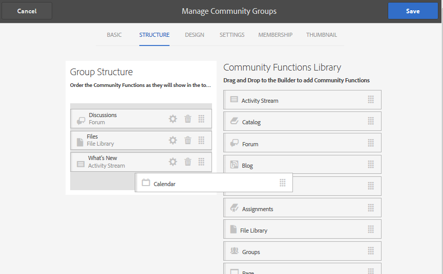

# 커뮤니티 그룹 콘솔 {#community-groups-console}

그룹 콘솔에서는 커뮤니티 사이트의 [템플릿 구조에](sites-console.md#step1) 그룹 기능이 포함된 경우 커뮤니티 그룹을 만들 수 [있는 액세스 권한을 제공합니다](functions.md#groups-function).

* 그룹은 다른 그룹 내에 중첩될 수 있습니다. 이 문제는 새 그룹의 [구조에 그룹](tools-groups.md) 함수가 들어 있을 때 발생합니다.
* 작성 환경에만 사이트 만들기 마법사와 유사한 그룹 만들기 마법사가 있습니다.
* 커뮤니티 사이트 구조나 커뮤니티 그룹 구조에 그룹 기능을 추가할 때 구성원이 게시 환경에서 그룹을 만들 수 있는지 여부를 구성할 수 있습니다.

포함된 세 개의 그룹 템플릿 중 `Reference Group` 템플릿에만 그룹 기능이 포함되어 있습니다.

커뮤니티 그룹의 몇 가지 패싯은 다음과 같습니다.

* 작성: 작성자 및 선택적으로 게시 시 새 그룹을 만들 수 있습니다.
* 컨트롤: 그룹 공개 또는 비밀
* 중첩: 그룹에 0개 이상의 그룹이 포함될 수 있습니다.

>[!NOTE]
>
>커뮤니티 그룹 콘솔이 [존재하기](https://helpx.adobe.com/in/experience-manager/6-3/communities/using/version-history.html#FeaturePack1FP1)전에 게시 환경에서 만들어진 커뮤니티 그룹은 커뮤니티 그룹 콘솔에 나열되지 않으므로 콘솔을 사용하여 수정할 수 없습니다.

>[!NOTE]
>
>커뮤니티 사이트 콘솔에서만 액세스할 수 있는 이 그룹 콘솔은 구성원 그룹을 관리하기 위한 구성원 [그룹 콘솔과](members.md) 혼동되지 않습니다.
>
>구성원 그룹은 게시 환경에 등록되어 [터널 서비스를 사용하여 작성 환경에서 액세스되는 사용자 그룹입니다](deploy-communities.md#tunnel-service-on-author).

## 그룹 생성 {#group-creation}

그룹 콘솔에 액세스하려면

* 작성자의 경우 관리자 권한으로 로그인
* 전역 탐색에서: **[!UICONTROL 커뮤니티 > 사이트]**
* 기존 커뮤니티 사이트 폴더를 선택하여 엽니다.
* 폴더 내의 커뮤니티 사이트 인스턴스 선택

   * 커뮤니티 사이트의 구조는 그룹 기능을 포함해야 합니다.
   * 이러한 스크린샷은 게시에서 그룹을 [만든 후 시작하기 자습서에서 가져옵니다](published-site.md)

[ **[!UICONTROL 그룹] 폴더를]** 선택하여 엽니다.

열면 작성자 또는 게시 시 생성된 모든 기존 그룹이 표시됩니다.

이 그룹 콘솔에서 새 그룹을 작성할 수 있습니다.

* 그룹 **[!UICONTROL 만들기]** 단추 선택

### 1단계: 커뮤니티 그룹 템플릿 {#step-community-group-template}

* **[!UICONTROL 커뮤니티 그룹 제목]**: 그룹의 표시 제목입니다.

   그룹의 게시된 사이트에 제목이 나타납니다.

* **[!UICONTROL 커뮤니티 그룹 설명]**: 그룹에 대한 설명입니다.
* **[!UICONTROL 커뮤니티 그룹 루트]**: 그룹의 루트 경로입니다.

   기본 루트는 상위 사이트이지만 루트가 웹 사이트 내의 임의의 위치로 이동할 수 있습니다. 변경하지 않는 것이 좋습니다.

* **[!UICONTROL 추가 사용 가능한 커뮤니티 그룹 언어]** 메뉴: 풀다운 메뉴를 사용하여 사용 가능한 커뮤니티 그룹 언어를 선택합니다. 메뉴는 상위 커뮤니티 사이트를 만든 모든 언어를 표시합니다. 사용자는 이러한 언어 중에서 선택하여 이 단일 단계에서 여러 로케일에 그룹을 만들 수 있습니다. 동일한 그룹이 각 커뮤니티 사이트의 그룹 콘솔에서 지정된 여러 언어로 만들어집니다.

* **[!UICONTROL 커뮤니티 그룹 이름]**: URL에 나타나는 그룹 루트 페이지의 이름

   * 그룹을 만든 후 쉽게 변경되지 않으므로 이름을 다시 확인하십시오
   * 기본 URL이 `Community Group Name`
   * 유효한 URL의 경우 &quot;.html&quot;을 추가합니다.

      *예*, `http://localhost:4502/content/sites/mysight/en/mygroup.html`

* **[!UICONTROL 커뮤니티 그룹 템플릿]** 메뉴: 풀다운 메뉴를 사용하여 사용 가능한 [커뮤니티 그룹 템플릿을 선택합니다](tools.md).

### 2단계: 디자인 {#step-design}

#### COMMUNITY GROUP THEME {#community-group-theme}

이 프레임워크는 [Twitter Bootstrap](https://twitterbootstrap.org/) 를 사용하여 반응형 유연한 디자인을 사이트에 가져옵니다. 미리 로드된 여러 Bootstrap 테마 중 하나를 선택하여 선택한 커뮤니티 그룹 템플릿의 스타일을 지정하거나 Bootstrap 테마를 업로드할 수 있습니다.

이 옵션을 선택하면 테마가 불투명하고 파란색 확인 표시로 겹쳐 표시됩니다.

상위 사이트의 테마와 다른 테마를 선택할 수 있습니다.

커뮤니티 사이트가 게시된 후에는 속성을 [편집하고 다른 테마를 선택할](#modifying-group-properties) 수 있습니다.

#### COMMUNITY GROUP BRANDING {#community-group-branding}

커뮤니티 사이트 브랜딩은 각 페이지의 맨 위에 머리글로 표시되는 이미지입니다. 다른 사이트 페이지와 다른 그룹의 배너를 표시할 수 있습니다.

이미지는 브라우저에서 페이지 표시 예상치와 높이가 120픽셀만큼 넓어야 합니다.

이미지를 만들거나 선택할 때는 다음 사항에 주의하십시오.

* 이미지 높이가 이미지의 위쪽 가장자리에서 측정된 120픽셀로 잘립니다
* 이미지가 브라우저 창의 왼쪽 가장자리에 고정되어 있습니다.
* 이미지 너비가 ...일 때와 같이 이미지의 크기를 조정할 필요가 없습니다.

   * 브라우저 폭보다 작으면 이미지가 가로로 반복됩니다
   * 브라우저 폭보다 큰 이미지는 잘리는 것으로 나타납니다

### 3단계: 설정 {#step-settings}

#### MODERATION {#moderation}

기본적으로 상위 커뮤니티 사이트의 중재자 목록은 상속됩니다.

다음과 같이 그룹에 특정 중재자를 추가할 수 있습니다.

* 구성원(게시 환경에서)을 검색하여 중재자로 추가

#### MEMBERSHIP {#membership}

멤버십 설정을 사용하면 커뮤니티 그룹을 보호하는 세 가지 방법 중 하나를 선택할 수 있습니다.

* 선택적 멤버십

   선택하는 경우 커뮤니티 그룹은 공개 그룹입니다. 사이트 구성원은 그룹에 명시적으로 참여하지 않고 그룹에 참여하고 게시할 수 있습니다. 기본값이 선택됩니다.
* 필수 멤버십

   선택하는 경우 커뮤니티 그룹은 열린 그룹입니다. 커뮤니티 사이트 구성원은 그룹의 콘텐트를 볼 수 있지만 콘텐트를 게시하기 전에 그룹에 가입해야 합니다. 구성원은 게시 환경에서 `Join` 단추를 선택하여 참여할 수 있습니다. 기본값은 선택되어 있지 않습니다.

* 제한된 멤버십

   선택하는 경우 커뮤니티 그룹은 비밀 그룹입니다. 커뮤니티 구성원은 명시적으로 초대되어야 합니다. 초대 멤버가 검색 상자에 입력됩니다. 구성원 및 그룹 콘솔을 사용하여 작성자 환경을 [나중에](members.md) 구성원을 추가할 수 있습니다. 기본값은 선택되어 있지 않습니다.

#### 축소판 {#thumbnail}

축소판은 작성 및 게시 시 그룹에 대해 표시할 이미지입니다.

그룹 이미지의 최적 크기는 지원되는 이미지 형식(예: JPG 또는 PNG)으로 170 x 90픽셀입니다.

이미지가 추가되지 않으면 기본 이미지가 표시됩니다.

### 4단계: 그룹 만들기 {#step-create-group}

조정이 필요한 경우 [ **뒤로** ] 단추를 사용하여 조정합니다.

만들기 **를** 선택하고 시작하면 그룹을 만드는 프로세스가 중단되지 않습니다.

프로세스가 완료되면, 작성자가 페이지 컨텐츠를 추가하거나 관리자가 사이트의 속성을 수정할 수 있는 커뮤니티 사이트(그룹)의 카드가 커뮤니티 사이트 그룹 콘솔에 표시됩니다.

>[!NOTE]
>
>그룹은 1단계에서 지정한 모든 언어로 [생성됩니다. 커뮤니티 그룹 템플릿](groups.md#step1communitygrouptemplate) (추가 사용 가능한 커뮤니티 그룹 언어)을 참조하십시오.

## 그룹 컨텐츠 작성 {#authoring-group-content}

그룹의 페이지 컨텐츠는 다른 AEM 페이지와 동일한 도구로 작성할 수 있습니다. 작성할 그룹을 열려면 그룹 카드 위로 마우스를 가져가면 나타나는 사이트 열기 아이콘을 선택합니다.

## 그룹 속성 수정 {#modifying-group-properties}

커뮤니티 그룹 생성 프로세스 중에 지정된 기존 하위 커뮤니티 사이트의 속성은 그룹 카드 위에 마우스를 놓을 때 나타나는 사이트 편집 아이콘을 선택하여 수정할 수 있습니다.

다음 속성의 세부 사항은 [그룹 생성](#group-creation) 섹션에 제공된 설명과 일치합니다. 게시 환경이나 작성 환경에서 생성된 중첩 그룹은 모두 수정할 수 있습니다.

### 기본 수정 {#modify-basic}

BASIC 패널에서

* 커뮤니티 그룹 제목
* 커뮤니티 그룹 설명

커뮤니티 그룹 이름은 수정할 수 없습니다.

템플릿과 사이트 간에 연결되지 않으므로 다른 커뮤니티 그룹 템플릿을 선택해도 기존 커뮤니티 그룹 사이트에 영향을 주지 않습니다.

대신 하위 [커뮤니티의](#modify-structure) STRUCTURE를 수정할 수 있습니다.

### 구조 수정 {#modify-structure}

구조 패널에서는 작성자 또는 게시 환경에서 하위 커뮤니티 사이트를 만들 때 선택한 커뮤니티 그룹 템플릿에서 처음 만든 구조를 수정할 수 있습니다. 패널에서

* 추가 [커뮤니티 기능을 사이트 구조에](functions.md) 드래그 앤 드롭
* 사이트 구조에서 커뮤니티 함수 인스턴스:

   * **`gear icon`**

      표시 제목 및 URL 이름과 권한이 있는 구성원 그룹을 비롯한 설정 [편집](users.md#privilegedmembersgroups)

   * **`trashcan icon`**

      사이트 구조에서 함수 제거(삭제)

   * **`grid icon`**

      사이트의 최상위 탐색 막대에 표시되는 함수 순서 수정

>[!CAUTION]
>
>표시 제목은 부작용없이 변경할 수 있지만 커뮤니티 사이트에 속하는 커뮤니티 함수의 URL 이름은 편집하지 않는 것이 좋습니다.
>
>예를 들어, URL의 이름을 바꾸면 기존 UGC가 이동하지 않으므로 &#39;손실&#39; UGC가 영향을 받습니다.

>[!CAUTION]
>
>그룹 함수는 사이트 구조의 *첫 번째* 함수이거나 유일한 ** 함수여야 합니다.
>
>페이지 함수 등 다른 모든 함수를 먼저 포함하여 나열해야 합니다.

#### 예: 하위 커뮤니티(그룹) 구조에 달력 함수 추가 {#example-adding-a-calendar-function-to-a-sub-community-group-structure}

### 디자인 수정 {#modify-design}

DESIGN 패널에서 테마를 수정할 수 있습니다.

* [커뮤니티 그룹 테마](#community-group-theme)
* [커뮤니티 그룹 브랜딩](#community-group-branding)

   * 패널 아래쪽으로 스크롤하여 브랜드 이미지 변경

### 설정 수정 {#modify-settings}

설정 패널에서는 커뮤니티 중재자를 추가할 수 [있습니다](#moderation).

### 멤버십 수정 {#modify-membership}

[ [멤버십](#membership) ] 패널은 정보 제공용으로만 제공됩니다. 설정되는 그룹 구성원 자격 유형은 선택 사항이든, 필수 또는 제한적이든 변경할 수 없습니다.

### 축소판 수정 {#modify-thumbnail}

[ [축소판](#thumbnail) ] 패널에서는 이미지를 업로드하여 게시 환경의 사이트 방문자와 작성 환경의 커뮤니티 사이트 그룹 콘솔에서 커뮤니티 그룹을 나타낼 수 있습니다.

## 그룹 게시 {#publishing-the-group}

커뮤니티 그룹을 새로 만들거나 수정한 후에는 아이콘을 선택하여 그룹을 게시(활성화)할 수 `Publish Site` 있습니다.

그룹이 성공적으로 게시되면 다음과 같은 메시지가 나타납니다.

>[!CAUTION]
>
>상위 커뮤니티 사이트 및 상위 그룹이 이미 게시되었어야 합니다.
>
>커뮤니티 사이트와 중첩 그룹은 위에서 아래로 게시해야 합니다.

## 그룹 삭제 {#deleting-the-group}

마우스로 그룹을 가리키면 나타나는 그룹 삭제 아이콘을 선택하여 커뮤니티 그룹 콘솔 내에서 그룹을 삭제합니다.

그러면 그룹과 연관된 모든 항목이 제거됩니다. 예를 들어 그룹의 모든 컨텐츠가 영구적으로 삭제되고 사용자 멤버십이 시스템에서 제거됩니다.
