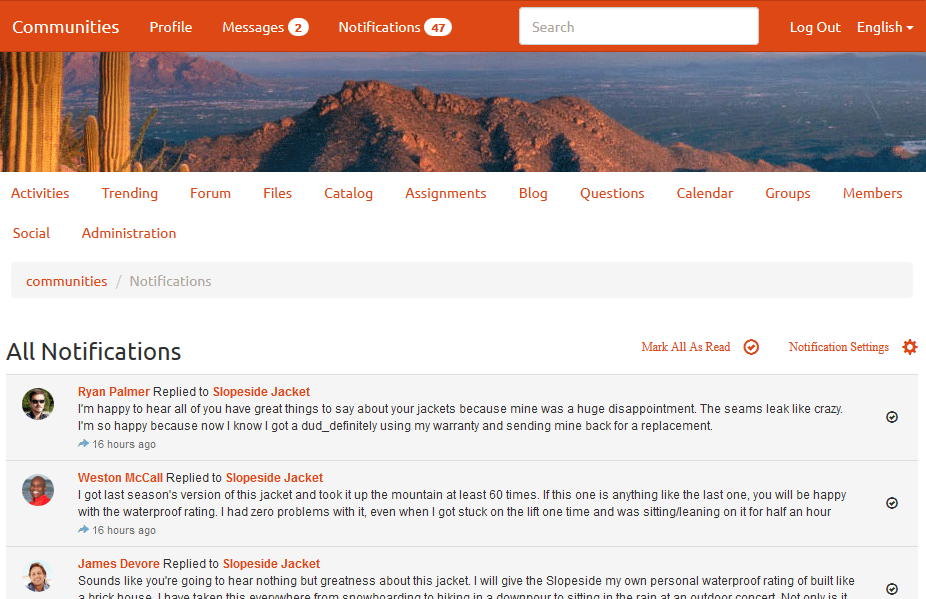

# 커뮤니티 알림 {#communities-notifications}

>[!CAUTION]
>
>AEM 6.4가 확장 지원이 종료되었으며 이 설명서는 더 이상 업데이트되지 않습니다. 자세한 내용은 [기술 지원 기간](https://helpx.adobe.com/kr/support/programs/eol-matrix.html). 지원되는 버전 찾기 [여기](https://experienceleague.adobe.com/docs/).

## 개요 {#overview}

AEM Communities에서는 로그인한 커뮤니티 구성원에게 관심 이벤트를 표시하는 알림 섹션을 제공합니다.

알림은 과 유사합니다 [활동](essentials-activities.md) 및 [구독](subscriptions.md) 그들이

* 컨텐츠 게시 멤버
* 다른 멤버를 따르도록 선택한 멤버
* 특정 주제, 문서 및 기타 컨텐츠 스레드를 따르도록 선택한 구성원

활동 및 구독과 알림을 구분하는 것은 무엇입니까

* 알림 섹션에 대한 링크가 항상 커뮤니티 사이트의 헤더에 표시됩니다
   * 활동을 위해서는 [활동 스트림 함수](functions.md#activity-stream-function) 커뮤니티 사이트의 구조에 포함되도록 함
   * 구독에는 다음이 필요합니다 [이메일 구성](email.md)
* 알림의 구현은 확장 가능한 채널을 통해 수행됩니다
   * 활동은 웹에서만 사용할 수 있습니다
   * 구독은 이메일을 사용해야만 사용할 수 있습니다

커뮤니티 기준 [FP1](deploy-communities.md#latestfeaturepack), 사용 가능한 알림 채널은

* 웹 채널이며, `Notifications` 링크
* 이메일이 올바르게 구성된 경우 사용할 수 있는 이메일 채널

향후 채널은 모바일 및 데스크탑입니다.

### 요구 사항 {#requirements}

**이메일 구성**

알림이 작동하도록 이메일 채널을 구성하려면 이메일을 구성해야 합니다.

이메일 설정에 대한 지침은 [이메일 구성](analytics.md).

**팔로우 활성화**

다음을 사용하도록 구성 요소를 구성해야 합니다. 다음을 허용하는 기능은 다음과 같습니다 [블로그](blog-feature.md), [포럼](forum.md), [QnA](working-with-qna.md), [달력](calendar.md), [파일 라이브러리](file-library.md), 및 [댓글](comments.md).

참고 사항

* 커뮤니티 내에서 사용되는 구성 요소 [사이트 템플릿](sites.md) 및 [그룹 템플릿](tools-groups.md) 다음을 허용하도록 이미 구성되어 있을 수 있음

* 구성원 프로필이 이미 다른 구성원이 팔로우할 수 있도록 구성되어 있습니다

## 다음에서 알림 {#notifications-from-following}

다음 **팔로우** 버튼은 활동, 구독 및/또는 알림으로 항목을 따르는 수단을 제공합니다. 매번 **팔로우** 단추를 선택하면 선택 항목을 켜거나 끌 수 있습니다. 다음 `Email Subscriptions` 선택 항목은 구성된 경우에만 나타납니다.

다음 방법을 선택하면 단추의 텍스트가 **다음**. 편의를 위해 선택할 수 있습니다 `Unfollow All` 를 눌러 모든 메서드를 해제합니다.

다음 **팔로우** 버튼이 나타납니다.

* 다른 구성원의 프로파일을 볼 때
* 포럼, QnA 및 블로그 등의 기본 기능 페이지
   * 일반 기능에 대한 모든 활동을 따릅니다
* 포럼 주제, 질문 또는 블로그 문서와 같은 특정 항목의 경우
   * 특정 항목에 대한 모든 활동을 따릅니다

## 알림 설정 관리 {#managing-notification-settings}

[알림] 페이지에서 [알림 설정] 링크를 선택하면 각 구성원이 알림 수신 방식을 관리할 수 있습니다.

웹 채널은 항상 활성화되어 있습니다.

적절한 채널에 의존하는 이메일 채널입니다 [이메일 구성](email.md)에서는 웹 채널과 동일한 설정을 제공합니다.

이메일 채널은 기본적으로 꺼져 있습니다.

구성원에 의해 설정될 수 있지만 구성된 이메일에 따라 다릅니다.

## 알림 보기 {#viewing-notifications}

### 웹 알림 {#web-notifications}

A [마법사가 만든 커뮤니티 사이트](sites-console.md) 이제 에는 `Notifications` 배너 위에 있는 사이트의 헤더 막대에 있는 기능입니다. 메시지와 달리, 모든 커뮤니티 사이트에 대한 알림이 생성되지만 사이트 작성 프로세스 중에 메시지를 활성화해야 합니다.

게시된 사이트를 방문할 때 `Notifications` 링크에 구성원의 모든 알림이 표시됩니다.

### 이메일 알림 {#email-notifications}

이메일 채널이 활성화되면 구성원은 웹의 컨텐츠에 대한 링크가 포함된 이메일을 수신하게 됩니다.

