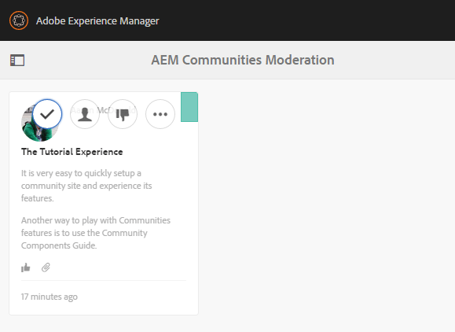

# 게시된 사이트 경험 {#experience-the-published-site}

>[!CAUTION]
>
>AEM 6.4가 확장 지원이 종료되었으며 이 설명서는 더 이상 업데이트되지 않습니다. 자세한 내용은 [기술 지원 기간](https://helpx.adobe.com/kr/support/programs/eol-matrix.html). 지원되는 버전 찾기 [여기](https://experienceleague.adobe.com/docs/).

## 게시할 때 새 사이트 찾아보기 {#browse-to-new-site-on-publish}

새로 만든 커뮤니티 사이트가 게시되었으므로 사이트를 만들 때 표시되는 URL(예: 게시 서버)로 이동합니다.

* 작성자 URL = http://localhost:4502/content/sites/engage/en.html
* 게시 URL = http://localhost:4503/content/sites/engage/en.html

작성자 및 게시에서 로그인한 구성원에 대한 혼동을 최소화하기 위해 각 인스턴스에 대해 서로 다른 브라우저를 사용하는 것이 좋습니다.

게시된 사이트에 처음 도달하면 사이트 방문자는 일반적으로 아직 로그인하지 않으며 익명 상태가 됩니다.

## http://localhost:4503/content/sites/engage/en.html {#http-localhost-content-sites-engage-en-html}

## 익명 사이트 방문자 {#anonymous-site-visitor}

익명의 사이트 방문자는 UI에서 다음을 볼 수 있습니다.

* 사이트의 제목입니다. 시작하기 자습서
* 프로필 링크 없음
* 메시지 링크 없음
* 알림 링크 없음
* 검색 필드
* 로그인 링크
* 브랜드 배너
* 참조 사이트 템플릿에 포함된 구성 요소의 메뉴 링크

다양한 링크를 선택하면 해당 링크가 읽기 전용 모드임을 알 수 있습니다.

## JCR에 대한 익명 액세스 방지 {#prevent-anonymous-access-on-jcr}

하지만 알려진 제한은 jcr 컨텐츠 및 json 을 통해 커뮤니티 사이트 컨텐츠를 익명 방문자에게 노출합니다 **익명 액세스 허용** 사이트 컨텐츠에 대해 이 비활성화되어 있습니다. 그러나 해결 방법으로 Sling 제한을 사용하여 이 동작을 제어할 수 있습니다.

jcr 컨텐츠 및 json 을 통해 익명의 사용자가 커뮤니티 사이트의 컨텐츠를 액세스하지 못하도록 보호하려면 다음 단계를 수행합니다.

1. AEM 작성자 인스턴스에서 https://으로 이동합니다.&lt;host>:&lt;port>/editor.html/content/site/&lt;sitename>.html

   >[!NOTE]
   >
   >현지화된 사이트로 이동하지 마십시오.

1. 이동 **[!UICONTROL 페이지 속성]**.

   

1. 이동 **[!UICONTROL 고급]** 탭.

   

1. 활성화 **[!UICONTROL 인증 요구 사항]**.
1. 로그인 페이지의 경로를 추가합니다. (예: `/content/......./GetStarted`)
1. 페이지를 게시합니다.

## 신뢰할 수 있는 커뮤니티 구성원 {#trusted-community-member}

이 경험은 [아론 맥도날드](tutorials.md#demo-users) 의 역할이 할당되었습니다. [커뮤니티 관리자 및 중재자](create-site.md#roles). 없는 경우 작성 환경으로 돌아가서 [사이트 설정 수정](sites-console.md#modifying-site-properties) 및 커뮤니티 관리자 및 중재자로 Aaron McDonald를 선택합니다.

오른쪽 상단 모서리에서 을(를) 선택합니다. `Log in`, 그리고 사용자 이름 &quot;aaron.mcdonald@mailinator.com&quot; 및 암호 &quot;password&quot;로 서명합니다. twitter 또는 Facebook 자격 증명으로 로그인할 수 있는 기능을 확인합니다.

로그인하면 새로운 메뉴 항목이 있습니다. `Administration`: 구성원에게 중재자 역할이 부여되었기 때문에 나타납니다. 이제 다양한 링크를 선택하는 것이 더 흥미롭습니다.

선택한 참조 사이트 템플릿에 먼저 달력 기능이 포함되고 활동 스트림 함수, 포럼 함수 등이 추가되었기 때문에 달력 페이지가 홈 페이지가 됩니다. 이 구조가 [사이트 템플릿](sites.md#edit-site-template) 콘솔 또는 작성 환경에서 사이트 속성 수정 시:

>[!NOTE]
>
>커뮤니티 구성 요소 및 기능에 대한 자세한 내용은
>
>* [커뮤니티 구성 요소](author-communities.md) (작성자용)
>* [구성 요소, 기능 및 기능 핵심 사항](essentials.md) (개발자용)
>

## 포럼 링크 {#forum-link}

포럼 링크를 선택하여 기본 포럼 기능을 확인합니다.

구성원은 새 주제를 게시하거나 주제를 따를 수 있습니다.

사이트 방문자는 게시물을 보고 다양한 방법으로 정렬할 수 있습니다.

## 그룹 링크 {#groups-link}

Aaron은 그룹 관리자이므로 그룹 링크를 선택하면 Aaron이 그룹 템플릿, 이미지, 그룹 열기 또는 비밀 여부를 선택하고 구성원을 초대하여 새 커뮤니티 그룹을 생성할 수 있습니다.

게시 환경에서 그룹이 만들어지는 예입니다.

또한 그룹은 작성 환경에서 만들고 작성 환경의 커뮤니티 사이트(즉, [커뮤니티 그룹 콘솔](groups.md)). 의 경험 [작성자에 대한 그룹 만들기](nested-groups.md) 이 튜토리얼의 옆에 있습니다.

참조 그룹 만들기:

1. 선택 **[!UICONTROL 새 그룹]**
1. **[!UICONTROL 설정 탭]**
   * 그룹 이름: `Sports`
   * 설명: `A parent group for various sporting groups`
   * 그룹 URL 이름: `sports`
   * 선택 `Open Group` (모든 커뮤니티 구성원이 참여할 수 있도록 허용)
1. **[!UICONTROL 템플릿 탭]**
   * 선택 `Reference Group` (중첩 그룹을 허용하는 구조 내 그룹 함수 포함)
1. 선택 **[!UICONTROL 그룹 만들기]**

새 그룹이 만들어지면, **새 스포츠 그룹 선택** 두 그룹(중첩된 그룹)을 만들려면 다음을 수행하십시오. 사이트 구조는 그룹 함수로 시작할 수 없으므로 Sports 그룹을 연 후에는 그룹 링크를 선택해야 합니다.

다음으로 시작하는 두 번째 링크 세트 `Blog`: 현재 선택된 그룹인 `Sports`그룹에 속해 있어야 합니다. 스포츠 선택 `Groups` link, Sports 그룹 내에 두 그룹을 중첩할 수 있습니다.

예를 들어, 두 개의 n을 추가합니다 `ew groups.`

* 이름이 지정된 `Baseball`
   * 설정된 대로 둡니다. `Open Group` (필수 멤버십)
   * 템플릿 탭에서 을(를) 선택합니다 `Conversational Group`
* 이름이 지정된 `Gymnastics`
   * 설정을 로 변경 `Member Only Group` (제한된 멤버십)
   * 템플릿 탭에서 을(를) 선택합니다 `Conversational Group`

**알림**:

* 두 그룹이 모두 표시되기 전에 페이지를 새로 고쳐야 할 수 있습니다
* 이 템플릿에는 그룹 기능이 포함되지 *않으므로 더 이상 그룹을 중첩할 수 없습니다.
* 작성자에서 [그룹 콘솔](groups.md) 세 번째 선택 사항 제공 - a `Public Group` (선택적 멤버십)

두 그룹이 모두 만들어지면, 야구 그룹과 열린 그룹을 선택하고 해당 링크를 확인합니다. `Discussions` `What's New` `Members`
그룹의 링크는 기본 사이트의 링크 아래에 표시되고 결과는 다음과 같습니다.

작성자 시 - 관리 권한이 있는 경우 [커뮤니티 그룹 콘솔](members.md) 그리고 Weston McCall을 `Community Engage Gymnastics <uid> Members` 그룹에 속해 있어야 합니다.

계속 게시를 계속하려면 Aaron McDonald로 로그아웃하고 Sports Group의 그룹을 익명 사이트 방문자로 확인합니다.

* 홈 페이지에서
* 선택 `Groups`링크
* 선택 `Sports`링크
* 스포츠 선택 `Groups`링크

야구 팀만 보입니다.

Weston McCall(weston.mccall@dodgit.com / 암호)로 로그인하고 동일한 위치로 이동합니다. 웨스턴이 `Join` 오픈 `Baseball` 그룹 및 `enter or Leave` 개인 `Gymnastics`그룹에 속해 있어야 합니다.

## 웹 페이지 링크 {#web-page-link}

웹 페이지 링크를 선택하여 사이트에 포함된 기본 웹 페이지를 봅니다. 표준 AEM 작성 도구를 사용하여 작성 환경에서 이 페이지에 컨텐츠를 추가할 수 있습니다.

예를 들어, 다음 위치로 이동하십시오. **작성자** instance, open `engage` 폴더의 [커뮤니티 사이트 콘솔](sites-console.md)에서 을(를) 선택합니다. **사이트 열기** 아이콘을 사용하여 작성자 편집 모드를 시작합니다. 그런 다음 미리 보기 모드를 선택하여 `Web Page`링크를 클릭한 다음 편집 모드를 선택하여 제목 및 텍스트 구성 요소를 추가합니다. 마지막으로, 페이지 또는 전체 사이트를 다시 게시합니다.

## 관리 링크 {#administration-link}

커뮤니티 구성원에게 중재 권한이 있으면 관리 링크가 표시되며 이 링크를 선택하면 게시된 커뮤니티 콘텐츠가 표시되고 권한이 부여됩니다 [중재자](moderate-ugc.md) 그와 비슷한 방법으로 [중재 콘솔](moderation.md) 작성 환경에서 을 선택합니다.

브라우저의 뒤로 단추를 사용하여 게시된 사이트로 돌아갑니다. 대부분의 콘솔은 게시 환경의 전역 탐색에서 액세스할 수 없습니다.

## 자체 등록 {#self-registration}

로그아웃한 후 새 사용자 등록을 만들 수 있습니다.

* 선택 `Log In`
* 선택 `Sign up for a new account`

 

기본적으로 이메일 주소는 로그인 ID입니다. 선택하지 않으면 방문자는 자신의 로그인 ID(사용자 이름)를 입력할 수 있습니다. 사용자 이름은 게시 환경에서 고유해야 합니다.

사용자 이름, 이메일 및 암호를 지정한 후 선택 `Sign Up`사용자가 만들어지고 해당 사용자가 로그인할 수 있도록 합니다.

로그인하면 표시되는 첫 번째 페이지가 해당 페이지의 `Profile`페이지를 만들 수 있습니다.

구성원이 로그인 ID를 잊어버리면 전자 메일 주소를 사용하여 복구할 수 있습니다.

