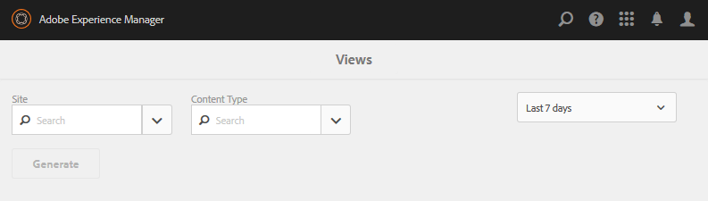

# 보고서 콘솔 {#reports-console}

## 개요 {#overview}

AEM Communities의 경우 작성 환경에서 여러 가지 방법으로 액세스할 수 있는 다양한 보고서가 있습니다.

일반적으로 다양한 보고서는 다음과 같습니다.

* [할당 보고서](#assignments-report) - [역량 강화 커뮤니티의 경우](overview.md#enablement-community)SCORM 표준을 구현할 경우 연관된 점수를 비롯하여 학습자의 과제 진행 상황에 대한 개요를 제공합니다
* [보기 보고서](#views-report) - 모든 커뮤니티 사이트에 대한 커뮤니티 구성원 및 사이트 방문자별 컨텐츠 보기 차트를 제공합니다.
* [게시물 보고서](#posts-report) - 커뮤니티 구성원이 모든 커뮤니티 사이트에 게시물 유형에 따라 다양한 형식의 차트를 제공합니다

Adobe Analytics이 활성화되면 보고서에는 시간에 따른 각 활성 리소스에 대한 보기, 재생, 댓글 및 등급 수가 포함됩니다

테이블 형식 보고서를 후속 처리를 위해 .csv 형식으로 내보낼 수 있습니다.

## 보고 콘솔 {#reporting-consoles}

### 커뮤니티 사이트에 대한 보고서 {#reports-for-community-sites}

* 전역 탐색에서: **[!UICONTROL 탐색 > 커뮤니티 > 보고서]**
* 선택 항목
   * **[!UICONTROL 할당 보고서]**
      * 선택한 커뮤니티 사이트, 사용자 또는 그룹 및 할당에 대한 보고서 생성
   * **[!UICONTROL 게시물 보고서]**
      * 선택한 커뮤니티 사이트, 콘텐츠 유형 및 기간에 대한 보고서 생성
   * **[!UICONTROL 보기 보고서]**
      * 선택한 커뮤니티 사이트, 콘텐츠 유형 및 기간에 대한 보고서 생성
         

### 지원 리소스 및 학습 경로에 대한 보고서 {#reports-for-enablement-resources-and-learning-paths}

* 전역 탐색에서: **[!UICONTROL 탐색 > 커뮤니티 > 리소스]**
* 기존 활성 커뮤니티 사이트 선택
   * 모든 **[!UICONTROL 활성 리소스를 포함하는 보고서를 생성하려면 보고서]** 아이콘을 선택합니다.
   * 활성 학습 경로 선택
   * 보고서 **** 아이콘을 선택하여
      * 포함된 지원 리소스
      * 학습 경로에 할당된 수강생
* 이 보고서에서는 다음을 제공합니다.
   * 테이블 데이터, CSV로 다운로드 가능
      * 수강생 식별
      * 그들의 상태
      * 카탈로그를 통해 할당하거나 액세스했는지 여부
      * 작성한 댓글 수
      * 별 등급 지정

자세한 내용은 리소스 콘솔 [의 보고서 섹션](resources.md#report) 을 참조하십시오.

## 할당 보고서 {#assignments-report}

[할당] 콘솔에서는 활성 커뮤니티 사이트, 사용자 또는 그룹 및 할당으로 보고서를 필터링할 수 있습니다.

이 보고서에서는 제공되는 의견 또는 등급뿐만 아니라 진행 상황에 대한 정보를 제공합니다.

보고서 기준을 선택합니다.

* **[!UICONTROL 사이트]**&#x200B;지원 커뮤니티 사이트 선택
* **[!UICONTROL 사용자 및 그룹]**
   * 수강생 한 명을 위한 보고서를 생성하려면 사용자를 선택합니다.
   * 수강생 그룹에 대한 보고서를 생성하려면 그룹을 선택하십시오.터널 서비스는 게시 환경에서 구성원 및 구성원 그룹에 액세스하게 됩니다
* **[!UICONTROL 할당]**&#x200B;선택한 수강생에게 할당된 활성 리소스 중에서 선택합니다.

생성을 **[!UICONTROL 선택하여]** 보고서를 만듭니다.

## 보기 보고서 {#views-report}

보기 콘솔을 사용하면 지정된 기간 동안 커뮤니티 기능별로 페이지 보기에서 보고서를 생성할 수 있습니다.

보고서 기준을 선택합니다.

* **[!UICONTROL 사이트]**&#x200B;커뮤니티 사이트 선택
* **[!UICONTROL 컨텐츠 유형]**&#x200B;모든 컨텐츠를 선택하거나 사이트에 있는 기능 중 하나를 선택할 수 있습니다.
* 시간대다음 중 하나를 선택합니다.
   * 최근 7일
   * 최근 30일
   * 최근 90일
   * 지난 해

생성을 **[!UICONTROL 선택하여]** 보고서를 만듭니다.

## 게시물 보고서 {#posts-report}

게시물 콘솔에서는 지정된 기간 동안 커뮤니티 기능에 대한 게시물 수에 대한 보고서를 생성할 수 있습니다.

보고서 기준을 선택합니다.

* **[!UICONTROL 사이트]**&#x200B;커뮤니티 사이트 선택
* **[!UICONTROL 컨텐츠 유형]**&#x200B;모든 컨텐츠를 선택하거나 사이트에 있는 기능 중 하나를 선택할 수 있습니다.
* 시간대다음 중 하나를 선택합니다.
   * 최근 7일
   * 최근 30일
   * 최근 90일
   * 지난 해

생성을 **[!UICONTROL 선택하여]** 보고서를 만듭니다.

## 문제 해결 {#troubleshooting}

### 나열된 커뮤니티 사이트 없음 {#no-community-sites-listed}

목록에 커뮤니티 사이트가 없으면 사이트에 대해 Adobe Analytics이 활성화되어 있는지 확인합니다. 할당에 대한 보고서를 선택하는 경우 할당 기능이 커뮤니티 사이트의 구조에 있는지 확인합니다.
