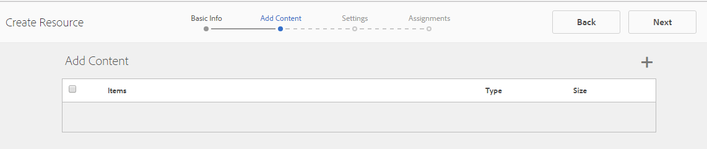

# 활성 리소스 만들기 및 할당 {#create-and-assign-enablement-resources}

## 지원 리소스 {#add-an-enablement-resource} 추가

새 커뮤니티 사이트에 활성 리소스를 추가하려면:

* 작성 인스턴스에서
   * 예: [http://localhost:4502/](http://localhost:4503/)
* 시스템 관리자로 로그인
* 전역 탐색에서 **커뮤니티 > [리소스](resources.md)**를 선택합니다.

   
   
* 지원 리소스를 추가할 커뮤니티 사이트를 선택합니다.
   * 선택 `Enablement Tutorial`
* 메뉴에서 ` Create`
* **[!UICONTROL 리소스]** 선택

### 기본 정보 {#basic-info}

리소스에 대한 기본 정보를 입력합니다.

* **[!UICONTROL 사이트 이름]**:선택한 커뮤니티 사이트의 이름으로 설정합니다.지원 자습서
* **[!UICONTROL 리소스 이름(&amp;A)]**:스키 레슨 1
* **[!UICONTROL 태그]**:자습서:스포츠 / 스키
* **[!UICONTROL 카탈로그에 표시]**:설정
* **[!UICONTROL 설명]**:초보자용 눈 위로 미끄러져
* **[!UICONTROL 이미지 추가]**:이미지를 추가하여 할당 보기에서 구성원에게 리소스를 표시합니다.
   
* **[!UICONTROL 다음]**&#x200B;을 선택합니다

### 컨텐트 추가 {#add-content}

여러 리소스를 선택할 수 있는 것처럼 보이지만 하나만 허용됩니다.

소스를 식별하여 리소스를 선택하는 프로세스를 시작하려면 오른쪽 위 모서리에서 `'+' icon`을 선택합니다.

 

리소스 업로드를 참조하십시오. 비디오 리소스가 있는 경우, 비디오 재생이 시작되기 전에 표시할 사용자 정의 이미지를 업로드하거나, 비디오에서 축소판이 생성되도록 허용합니다(몇 분 정도 걸릴 수 있지만 기다릴 필요가 없습니다).

* **[!UICONTROL 다음]** 선택

### 설정 {#settings}

* **[!UICONTROL 소셜]**
설정학습자의 주석 달기 및 역량 강화 리소스 등급을 경험하려면 기본 설정을 그대로 둡니다.
* **[!UICONTROL 기한]**

   *(선택 사항)* 지정을 완료해야 하는 날짜를 선택할 수 있습니다.
* **[!UICONTROL 리소스 작성자]**

   *(선택 사항)* 비워 둡니다.
* **[!UICONTROL 리소스 연락처(&amp;A);]**

   *(필수)* 풀다운 메뉴를 사용하여 구성원을 선택합니다 `Quinn Harper`.
* **[!UICONTROL 리소스 전문가]**

   *(선택 사항)* 비워 둡니다.
   **참고**:사용자나 그룹이 표시되지 않으면 해당 사용자 또는 그룹이 그룹에 추가되었는지 확인하고  `Community Enable Members` 게시  ** 인스턴스를 저장하십시오.
   
* **[!UICONTROL 다음]**&#x200B;을 선택합니다

### 할당 {#assignments}

* **[!UICONTROL Add]**
Assignees이 지원 리소스가 학습 경로에 추가되므로 설정이 해제된 상태로 둡니다. 개별 활성 리소스 및 활성 리소스가 포함된 학습 경로에 수강생이 할당되면 수강생이 활성 리소스에 두 번 할당됩니다.

* **[!UICONTROL 만들기]**&#x200B;를 선택합니다

리소스를 성공적으로 만들면 새로 만든 리소스가 선택된 상태로 리소스 콘솔로 돌아갑니다. 이 콘솔에서 학습자를 게시, 추가 및 기타 설정을 변경할 수 있습니다.

활성 리소스의 새 버전을 업로드하려면 새 리소스를 만든 다음 이전 버전에서 구성원을 등록 취소하고 새 버전에 등록하는 것이 좋습니다.

### 리소스 {#publish-the-resource} 게시

등록자가 할당된 강좌를 보려면 먼저 게시해야 합니다.

* `Publish`월드 아이콘 선택

활성화는 성공 메시지와 함께 확인됩니다.

## 두 번째 지원 리소스 {#add-a-second-enablement-resource} 추가

위 단계를 반복하여 학습 경로를 만들 두 번째 관련 지원 리소스를 만들고 게시합니다.

**두** 번째 리소스를 게시합니다.

리소스 지원 자습서 목록으로 돌아갑니다.

*힌트:두 리소스가 모두 표시되지 않으면 페이지를 새로 고칩니다.*

## 학습 경로 {#add-a-learning-path} 추가

학습 경로는 강좌를 구성하는 활성 리소스의 논리적 그룹입니다.

* 리소스 콘솔에서 `+ Create`
* **[!UICONTROL 학습 경로]**&#x200B;를 선택합니다.

**[!UICONTROL 기본 정보]**&#x200B;를 추가합니다.

* **[!UICONTROL 학습 경로 이름]**:스키 레슨
* **[!UICONTROL 태그]**:자습서:스키
* **[!UICONTROL 카탈로그에 표시]**:선택 안 함
* **[!UICONTROL 리소스 콘솔]** 에서 학습 경로를 나타내는 이미지 업로드

* **[!UICONTROL 다음]**&#x200B;을 선택합니다

추가할 필수 학습 경로가 없으므로 다음 패널을 건너뛰십시오.

* **[!UICONTROL 다음]**&#x200B;을 선택합니다

리소스 추가 패널에서

* 학습 경로에 추가할 2개의 스키 세션 리소스를 선택하려면 `+ Add Resources`을 선택합니다.

   참고:**게시된** 리소스만 선택할 수 있습니다.

>[!NOTE]
>
>학습 경로와 동일한 수준에서 사용 가능한 리소스만 선택할 수 있습니다. 예를 들어, 그룹에서 만든 학습 경로의 경우 그룹 수준 리소스만 사용할 수 있습니다.커뮤니티 사이트에서 만든 학습 경로의 경우 해당 사이트의 리소스를 학습 경로에 추가할 수 있습니다.

* **[!UICONTROL 제출]**&#x200B;을 선택합니다.

 

* **[!UICONTROL 다음]**&#x200B;을 선택합니다

* **[!UICONTROL 할당]**
추가풀다운 메뉴를 사용하여 
`Community Ski Class` 그룹 - 구성원 `Riley Taylor` 과  `Sidney Croft.`

* **[!UICONTROL 학습 경로 연락처(&amp;A);]**

   *(필수)* 풀다운 메뉴를 사용하여 구성원을 선택합니다 `Quinn Harper`.

* **[!UICONTROL 만들기]**&#x200B;를 선택합니다

학습 경로를 성공적으로 만들면 새로 만든 학습 경로를 선택한 상태로 리소스 콘솔로 돌아갑니다. 이 콘솔에서 학습자를 게시, 추가 및 기타 설정을 변경할 수 있습니다.

**학습** 경로를 게시합니다.

