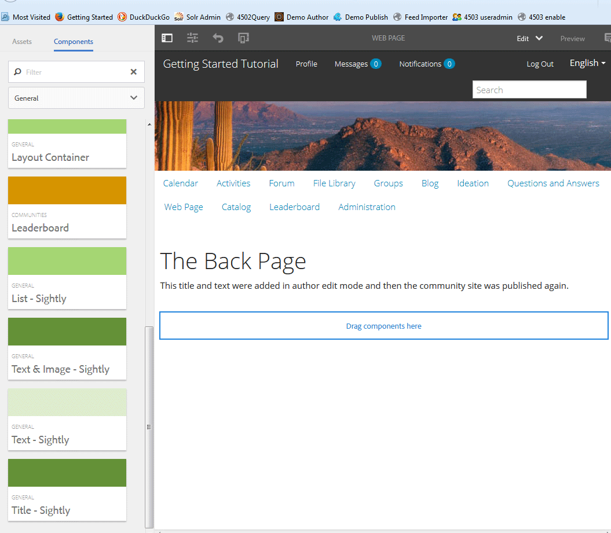
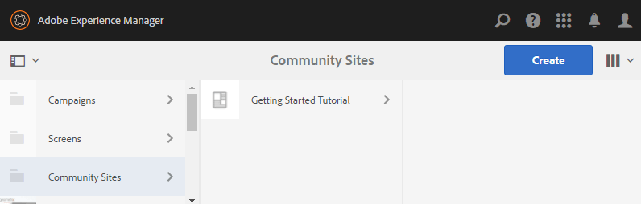

# 커뮤니티 사이트 콘솔 {#communities-sites-console}

Communities Sites 콘솔에서는 다음 항목에 액세스할 수 있습니다.

* 사이트 제작
* 사이트 편집
* 사이트 관리
* [중첩된 그룹](groups.md) 만들기 및 편집(하위 커뮤니티)

작성 환경 [에서](getting-started.md) 커뮤니티 사이트를 신속하게 만드는 방법, 작성 및 게시 환경에서 커뮤니티 그룹을 만드는 방법을 보려면 AEM Communities 시작하기를 참조하십시오.

>[!NOTE]
>
>커뮤니티 사이트 [,](sites-console.md)커뮤니티 사이트 템플릿 [,](sites.md)커뮤니티 그룹 템플릿 [및](tools-groups.md) 커뮤니티 기능  을 만들기 위한 기본 커뮤니티 메뉴는 작성 환경에서만 사용할 수 있습니다.

## 전제 조건 {#prerequisites}

커뮤니티 사이트를 만들기 전에 다음을 *수행해야* 합니다.

* 하나 이상의 게시 인스턴스가 실행 중인지 확인
* 구성원 및 구성원 그룹을 [관리할 터널 서비스](deploy-communities.md#tunnel-service-on-author) 활성화
* 기본 [게시자 식별](deploy-communities.md#primary-publisher)
* [기본 게시자 포트가 기본값이 아닌 경우 복제](deploy-communities.md#replication-agents-on-author) 구성(4503)

사이트가 많은 기능을 지원할 수 있도록 준비되도록 하려면 다음 단계를 수행하는 것이 좋습니다.

* [최신 기능 팩 설치](deploy-communities.md#latestfeaturepack)
* AEM Communities에 [Adobe Analytics](analytics.md) 사용
* 이메일 [구성](email.md)
* 커뮤니티 [관리자 식별](users.md#creating-community-members)
* [소셜 로그인에 대한 OAuth](social-login.md#adobe-granite-oauth-authentication-handler) 핸들러 사용

## 커뮤니티 사이트 콘솔 액세스 {#accessing-communities-sites-console}

작성 환경에서 커뮤니티 사이트 콘솔에 도달하려면 다음을 수행하십시오.

* 전역 탐색에서: **[!UICONTROL 커뮤니티 > 사이트]**

커뮤니티 사이트 콘솔에는 기존 커뮤니티 사이트가 표시됩니다. 이 콘솔에서 커뮤니티 사이트를 만들고, 편집하고, 관리하고 삭제할 수 있습니다.

새 커뮤니티 사이트를 만들려면 만들기 **아이콘을** 선택합니다.

기존 커뮤니티 사이트에 액세스하려면 중첩된 그룹을 작성, 수정, 게시, 내보내기 또는 추가할 목적으로 사이트의 폴더 아이콘을 선택합니다.

예를 들어 다음 이미지는 두 커뮤니티 사이트의 폴더를 표시하는 기본 커뮤니티 사이트 콘솔을 보여 줍니다. [활성화](getting-started-enablement.md) 및 [참여](getting-started.md):

## 사이트 제작 {#site-creation}

사이트 제작 콘솔은 선택한 [커뮤니티 사이트 템플릿](sites.md) 및 설정을 기반으로 사이트의 기능을 취합하는 단계별 접근 방식을 제공합니다.

사이트 방문자가 컨텐츠를 게시하거나 메시지를 보내거나 그룹에 참여하기 전에 로그인해야 하기 때문에 만들어진 모든 사이트에는 로그인 기능이 포함되어 있습니다. 사용자 프로필, 메시지, 알림, 사이트 메뉴, 검색, 테마 및 브랜딩이 포함되어 있습니다.

이 프로세스는 커뮤니티 사이트 콘솔 상단에 있는 `Create` 단추를 선택하여 시작됩니다.

작성 프로세스는 구성할 기능 세트가 포함된 패널로 표시된 일련의 단계입니다(하위 패널로 표시됨). 마지막 단계에서 사이트를 커밋하기 전에 **다음** 단계 또는 **이전** 단계로이동할 수 있습니다.

### 1단계:사이트 템플릿 {#step-site-template}

사이트 템플릿 패널에서 제목, 설명, 사이트 루트, 기본 언어, 이름 및 사이트 템플릿이 지정됩니다.

* **[!UICONTROL 커뮤니티 사이트 제목]**:사이트의 표시 제목입니다.

   제목은 게시된 사이트와 사이트 관리자 UI에 표시됩니다.

* **[!UICONTROL 커뮤니티 사이트 설명]**:사이트에 대한 설명입니다.

   설명은 게시된 사이트에 표시되지 않습니다.

* **[!UICONTROL 커뮤니티 사이트 루트]**:사이트의 루트 경로입니다.

   기본 루트는 `/content/sites`사용되지만 루트는 웹 사이트 내의 모든 위치로 이동할 수 있습니다.

* **[!UICONTROL 커뮤니티 사이트 기본 언어]**:(단일 언어 이외의 언어 유지:영어) 풀다운 메뉴를 사용하여 독일어, 이탈리아어, 프랑스어, 일본어, 스페인어, 포르투갈어(브라질), 중국어(번체) 및 중국어(간체) 등 사용 가능한 언어에서 하나 *이상의* 기본 언어를 선택합니다. 추가된 각 언어에 대해 하나의 커뮤니티 사이트가 생성되고, 다국어 사이트에 대한 컨텐츠 번역 [에 설명된 우수 사례 다음에 동일한 사이트 폴더 내에 존재합니다](../../help/sites-administering/translation.md). 각 사이트의 루트 페이지에는 선택한 언어 중 하나의 언어 코드에 의해 이름이 지정된 하위 페이지가 포함됩니다(예: &#39;en&#39;, &#39;fr&#39;, 프랑스어).

* **[!UICONTROL 커뮤니티 사이트 이름]**:URL에 나타나는 사이트 루트 페이지의 이름

   * 사이트를 만든 후 쉽게 변경되지 않으므로 이름을 다시 확인하십시오
   * 기본 URL( `https://*server:port/site root/site name*)` `Community Site Name`
   * 유효한 URL의 경우 기본 언어 코드 + &quot;.html&quot;을 추가합니다.

      *예*, `http://localhost:4502/content/sites/mysight/en.html`

* **[!UICONTROL 커뮤니티 사이트 템플릿]** 메뉴:풀다운 메뉴를 사용하여 사용 가능한 [커뮤니티 사이트 템플릿을 선택합니다](tools.md).

**[!UICONTROL 다음]**&#x200B;을 선택합니다

### 2단계:디자인 {#step-design}

디자인 패널에는 테마와 브랜딩 배너를 선택할 수 있는 2개의 하위 패널이 있습니다.

#### COMMUNITY SITE THEME {#community-site-theme}

이 프레임워크는 [Twitter Bootstrap](https://twitterbootstrap.org/) 를 사용하여 반응형 유연한 디자인을 사이트에 가져옵니다. 미리 로드된 여러 Bootstrap 테마 중 하나를 선택하여 선택한 커뮤니티 사이트 템플릿의 스타일을 지정하거나 Bootstrap 테마를 업로드할 수 있습니다.

이 옵션을 선택하면 테마가 불투명하고 파란색 확인 표시로 겹쳐 표시됩니다.

커뮤니티 사이트가 게시된 후에는 속성을 [편집하고 다른 테마를 선택할](#modifying-site-properties) 수 있습니다.

#### COMMUNITY SITE BRANDING {#community-site-branding}

커뮤니티 사이트 브랜딩은 각 페이지의 맨 위에 머리글로 표시되는 이미지입니다.

이미지는 브라우저에서 페이지 표시 예상치와 높이가 120픽셀만큼 넓어야 합니다.

이미지를 만들거나 선택할 때는 다음 사항에 주의하십시오.

* 이미지 높이가 이미지의 위쪽 가장자리에서 측정된 120픽셀로 잘립니다
* 이미지가 브라우저 창의 왼쪽 가장자리에 고정되어 있습니다.
* 이미지 너비가 ...일 때와 같이 이미지의 크기를 조정할 필요가 없습니다.

   * 브라우저 폭보다 작으면 이미지가 가로로 반복됩니다
   * 브라우저 폭보다 큰 이미지는 잘리는 것으로 나타납니다

**[!UICONTROL 다음]**&#x200B;을 선택합니다.

### 3단계:설정 {#step-settings}

설정 패널에는 사이트를 만들기 위해 마지막 단계로 이동하기 전에 구성할 수 있는 기능을 제공하는 여러 하위 패널이 있습니다.

* [사용자 관리](#user-management)
* [태그 지정](#tagging)
* [역할](#roles)
* [중재](#moderation)
* [분석](#analytics)
* [번역](#translation)
* [지원](#enablement)

>[!NOTE]
>
>**터널 서비스 사용**
>
>여러 설정 하위 패널에서 신뢰할 수 있는 멤버를 지정하여 게시 환경에서 활성 리소스를 중재하거나 그룹을 관리하거나 담당자를 지정할 수 있습니다.
>
>게시 측 [사용자 및 사용자 그룹](users.md) (구성원 및 구성원 그룹)은 작성 환경에서 복제되지 않도록 합니다.
>
>따라서 작성 환경에서 커뮤니티 사이트를 만들고 신뢰할 수 있는 구성원을 다양한 역할에 할당할 때는 게시 환경에서 멤버 데이터를 검색해야 합니다.
>
>이 작업은 작성 환경 ` [AEM Communities Publish Tunnel Service](deploy-communities.md#tunnel-service-on-author)`에 대해 활성화하여 수행됩니다.

#### USER MANAGEMENT {#user-management}

>[!NOTE]
>
>역량 강화 [커뮤니티 사이트는](overview.md#enablement-community) 비공개로 유지하는 것이 좋습니다(자세한 내용은 계정 담당자에게 문의).
>
>익명의 사이트 방문자가 액세스가 거부되면 커뮤니티 사이트는 비공개 사이트이고, 자가 등록을 할 수 없으며, 소셜 로그인을 사용할 수 없습니다.

* **[!UICONTROL 사용자 등록 허용]**

   이 확인란을 선택하면 사이트 방문자가 직접 등록하여 커뮤니티 회원이 될 수 있습니다.

   이 옵션을 선택하지 않으면 커뮤니티 사이트가 *제한되고* 사이트 방문자는 커뮤니티 사이트의 구성원 그룹에 할당되어 요청을 하거나 이메일로 초대장을 보내야 합니다. 이 옵션을 선택하지 않으면 익명 액세스가 허용되지 않습니다.

   비공개 *커뮤니티 사이트* 선택을 취소합니다. 기본값은 선택되어 있습니다.

* **[!UICONTROL 익명 액세스 허용]**

   이 확인란을 선택하면 커뮤니티 사이트가 *열려* 있고 사이트 방문자가 사이트에 액세스할 수 있습니다.

   이 확인란을 선택하지 않으면 로그인한 구성원만 사이트에 액세스할 수 있습니다.

   비공개 *커뮤니티 사이트* 선택을 취소합니다. 기본값은 선택되어 있습니다.

* **[!UICONTROL 메시지 허용]**

   이 확인란을 선택하면 구성원은 다른 사용자와 커뮤니티 사이트 내의 그룹에 메시지를 보낼 수 있습니다.

   선택하지 않으면 커뮤니티에 대한 메시지가 설정되지 않습니다.

   기본값은 선택 취소입니다.

* **[!UICONTROL 소셜 로그인 허용: Facebook]**

   이 확인란을 선택하면 사이트 방문자가 Facebook 계정 자격 증명으로 로그인할 수 있습니다. 커뮤니티 사이트를 만든 후 커뮤니티 사이트의 구성원 그룹에 사용자를 [추가하도록 선택한 Facebook 클라우드](social-login.md#create-a-facebook-connect-cloud-service) 구성을 구성해야 합니다.

   이 확인란을 선택하지 않으면 Facebook 로그인이 표시되지 않습니다.

   개인 *의* 커뮤니티 사이트에 대해 선택 취소 상태를 유지합니다. 기본값은 선택 취소입니다.

* **[!UICONTROL 소셜 로그인 허용: Twitter]**

   이 확인란을 선택하면 사이트 방문자가 Twitter 계정 자격 증명으로 로그인할 수 있습니다. 커뮤니티 사이트를 만든 후 커뮤니티 사이트의 구성원 그룹에 사용자를 [추가하도록 선택한 Twitter 클라우드](social-login.md#create-a-twitter-connect-cloud-service) 구성을 구성해야 합니다.

   이 확인란을 선택하지 않으면 Twitter 로그인이 표시되지 않습니다.

   개인 *의* 커뮤니티 사이트에 대해 선택 취소 상태를 유지합니다. 기본값은 선택 취소입니다.

>[!NOTE]
>
>**[!UICONTROL 소셜 로그인 허용]**
>
>샘플 Facebook 및 Twitter 구성이 존재하거나 선택할 수 있지만 [제작 환경의](../../help/sites-administering/production-ready.md)경우 사용자 정의 Facebook 및 Twitter 애플리케이션을 만들어야 합니다. Facebook 및 [Twitter로 소셜 로그인을 참조하십시오](social-login.md).

#### TAGGING {#tagging}

커뮤니티 컨텐츠에 적용할 수 있는 태그는 태그 지정 콘솔을 통해 이전에 정의된 태그 네임스페이스를 선택하여 [제어합니다](../../help/sites-administering/tags.md#tagging-console).

또한 커뮤니티 사이트의 태그 네임스페이스를 선택하면 카탈로그 및 리소스를 정의할 때 표시되는 선택이 제한됩니다. 중요 [정보는 태깅 지원 리소스](tag-resources.md) 를 참조하십시오.

* 텍스트 검색 상자:사이트에서 사용할 수 있는 태그를 식별하는 입력 시작

#### ROLES {#roles}

커뮤니티 멤버의 [역할은](users.md) 이러한 설정과 함께 할당됩니다.

사전 입력 검색을 사용하면 커뮤니티 구성원을 손쉽게 찾을 수 있습니다.

* **[!UICONTROL 커뮤니티 관리자]**

   커뮤니티 구성원 및 구성원 그룹을 관리할 수 있는 하나 이상의 커뮤니티 구성원 또는 구성원 그룹을 선택하려면 입력을 시작합니다.

* **[!UICONTROL 커뮤니티 중재자]**

   사용자 생성 콘텐츠의 중재자로 신뢰할 수 있는 하나 이상의 커뮤니티 구성원 또는 구성원 그룹을 선택하려면 입력을 시작합니다.

* **[!UICONTROL 커뮤니티 권한이 있는 구성원]**

   커뮤니티 기능을 위해 선택한 경우 새 컨텐츠를 만들 수 있는 기능을 부여받을 하나 이상의 커뮤니티 구성원 또는 구성원 그룹 `Allow Privileged Member` 을 선택하려면 [입력을 시작합니다](functions.md).

#### MODERATION {#moderation}

사용자 생성 콘텐츠(UGC)를 중재하기 위한 전역 설정은 이러한 설정에 의해 제어됩니다. 개별 구성 요소에는 조정을 제어하는 추가 설정이 있습니다.

* **[!UICONTROL 컨텐츠가 미리 중재되었음]**

   이 확인란을 선택하면 사회자가 승인하기 전까지 게시된 커뮤니티 컨텐츠가 나타나지 않습니다. 기본값은 선택 취소입니다. 자세한 내용은 커뮤니티 콘텐츠 [중재를 참조하십시오](moderate-ugc.md#premoderation).

* **[!UICONTROL 컨텐츠가 숨겨지기 전에 임계값에 플래그 지정]**

   0보다 큰 경우, 토픽이나 게시물이 공개 보기에서 숨겨지기 전에 플래그로 표시되어야 하는 횟수입니다. -1로 설정하면 플래그 지정된 주제 또는 게시물이 공개 보기에서 숨겨지지 않습니다. 기본값은 5입니다.

#### ANALYTICS {#analytics}

* **[!UICONTROL Analytics 활성화]**

   Adobe Analytics이 커뮤니티 기능에 대해 [구성된](analytics.md) 경우에만 사용할 수 있습니다.

   기본값은 선택 취소입니다. 이 확인란을 선택하면 추가 선택 메뉴가 나타납니다.

* **[!UICONTROL Cloud 구성 프레임워크 참조]**

   풀다운 메뉴에서 이 커뮤니티 사이트에 대해 구성된 Analytics 클라우드 서비스 프레임워크를 선택합니다.

   `Communities`는 Analytics Configuration for Communities [Features 설명서의 프레임워크](analytics.md#aem-analytics-framework-configuration) 예입니다.

#### TRANSLATION {#translation}

* **[!UICONTROL 기계 번역]**&#x200B;허용(기본값 선택 안 함)이 선택되면 사이트 내의 UGC에 대해 기계 번역이 활성화됩니다. 사이트가 다국어 사이트로 설정된 경우에도 페이지 컨텐츠와 같은 다른 컨텐트에는 영향을 주지 않습니다. AEM Communities [에 대한 라이센스 번역](translate-ugc.md) 서비스 구성에 대한 자세한 내용은 사용자 생성 컨텐츠 번역을 참조하십시오. 전체 [개요는 다국어 사이트를](../../help/sites-administering/translation.md) 위한 콘텐츠 번역을 참조하십시오.

* **[!UICONTROL 선택한 언어에 대한 기계 번역 사용]**

   기계 번역에 대해 활성화된 언어는 [번역 통합 구성에 의해 지정된 시스템 설정에 기본적으로 사용됩니다](translate-ugc.md#translation-integration-configuration). 이러한 기본 설정은 기본값을 삭제하고 풀다운 메뉴에서 다른 언어를 선택하여 이 사이트에 대해 무시될 수 있습니다.

* **[!UICONTROL 번역 제공자 선택]**

   기본적으로 이 서비스 제공업체는 데모 전용 `microsoft`을 사용하는 시험버전 서비스입니다. 번역 서비스 공급자에 라이센스가 부여되지 않은 경우 기계 **번역** 허용을 선택 취소해야 합니다.

* **[!UICONTROL 글로벌 공유 스토어 선택]**

   언어 복사본이 여러 개인 웹 사이트의 경우 글로벌 공유 스토어는 각 언어 복사본에서 볼 수 있는 단일 대화 스레드를 제공합니다. 언어 사본으로 포함된 언어 중 하나를 선택하면 됩니다. 기본값은 전역 *공유 스토어 없음입니다*.

* **[!UICONTROL 번역 제공자 구성 선택]**

   라이선스 번역 제공업체를 위해 만든 [번역 통합 프레임워크를](../../help/sites-administering/tc-tic.md) 선택합니다.

* **커뮤니티 사이트에 대한 번역 옵션 선택**

   * **[!UICONTROL 전체 페이지 번역]**

      이 옵션을 선택하면 페이지의 모든 UGC가 페이지의 기본 언어로 변환됩니다.

      기본값은 선택되지 *않습니다*.

   * **[!UICONTROL 선택 사항만 번역]**

      이 옵션을 선택하면 개별 게시물을 페이지의 기본 언어로 변환할 수 있는 번역 옵션이 각 게시물 옆에 나타납니다.

      기본값이 *선택됩니다*.

* **지속성 옵션 선택**

   * **[!UICONTROL 사용자 요청에 대한 기여도를 번역한 후 유지]**

      이 옵션을 선택하면 컨텐츠가 요청이 있을 때까지 번역되지 않습니다. 번역 후 번역은 저장소에 저장됩니다.

      기본값은 선택되지 *않습니다*.

   * **[!UICONTROL 번역을 유지하지 않습니다]**

      선택한 경우 번역은 저장소에 저장되지 않습니다.

      선택하지 않으면 번역이 유지됩니다.

      기본값은 선택되지 *않습니다*.

* **[!UICONTROL 스마트 렌더링]**&#x200B;다음 중 하나 선택

   * `Always show contributions in the original language` (기본값)
   * `Always show contributions in user preferred language`
   * `Show contributions in user preferred language for only logged-in users`

#### ENABLEMENT {#enablement}

이 `ENABLEMENT`설정은 선택한 커뮤니티 사이트 템플릿에 [assignments 함수가](functions.md#assignments-function)포함되어 있을 때 적용되며, 활성화 기능이 라이선스가 부여되고 [구성되어 있을 때 사용할 수 있습니다](enablement.md). 할당 기능을 포함하는 참조 사이트 템플릿은 `Reference Structured Learning Site Template.`

* **[!UICONTROL 지원 관리자]**

   (필수) 이 활성 커뮤니티를 관리하기 위해 `Community Enablementmanagers` 그룹의 구성원만 선택할 수 있습니다. 역량 강화 관리자는 리소스에 멤버를 할당할 책임이 있습니다. 사용자 [및 사용자 그룹 관리를 참조하십시오](users.md).

* **[!UICONTROL Marketing Cloud 조직 ID]**

   (선택 사항) [비디오 하트비트 분석 라이센스의](analytics.md#video-heartbeat-analytics) ID.

**[!UICONTROL 다음]**&#x200B;을 선택합니다.

### 4단계:커뮤니티 사이트 만들기 {#step-create-communities-site}

조정이 필요한 경우 [ **뒤로** ] 단추를 사용하여 조정합니다.

만들기 **를** 선택하고 시작하면 사이트 만들기 프로세스가 중단되지 않습니다.

사이트가 만들어지면

* URL(노드 이름) 변경은 지원되지 않습니다.
* 커뮤니티 사이트 템플릿의 향후 변경 사항은 생성된 커뮤니티 사이트에 영향을 주지 않습니다
* 커뮤니티 사이트 템플릿을 비활성화해도 생성된 커뮤니티 사이트에 영향을 주지 않습니다.
* 커뮤니티 사이트의 속성을 수정하여 [STRUCTURE](#modify-structure) 를 편집할 수 있습니다.

프로세스가 완료되면 새 사이트의 폴더가 커뮤니티 사이트 콘솔에 표시됩니다. 여기서 작성자는 페이지 컨텐츠를 추가하거나 관리자는 사이트의 속성을 수정할 수 있습니다.

커뮤니티 사이트를 수정하려면 해당 프로젝트 폴더를 선택하여 엽니다.

마우스로 사이트 위에 마우스를 올려 놓거나 사이트 카드를 만지는 경우, 작성 모드에서 [사이트](#authoring-site-content)를 [편집하거나 수정할](#modifying-site-properties)사이트 속성을 [편집할 수 있도록 해주는 아이콘](#publishing-the-site)이 나타나며 사이트 [를](#exporting-the-site)게시하거나 사이트를 [내보내는 등 사이트를](#deleting-the-site)내보내거나 사이트를 삭제하는 등의 작업을 수행합니다.

## 사이트 컨텐츠 작성 {#authoring-site-content}

사이트의 컨텐츠는 다른 AEM 웹 사이트와 동일한 도구를 사용하여 작성할 수 있습니다. 작성할 사이트를 열려면 마우스로 사이트를 마우스로 가리키면 나타나는 아이콘을 선택합니다. `Open Site` 사이트가 새 탭에서 열리므로 커뮤니티 사이트 콘솔에 액세스할 수 있습니다.

>[!NOTE]
>
>AEM에 익숙하지 않은 경우 [기본 처리](../../help/sites-authoring/basic-handling.md) 및 페이지 작성에 대한 [빠른 안내서에 대한 설명서를 봅니다](../../help/sites-authoring/qg-page-authoring.md).

## 사이트 속성 수정 {#modifying-site-properties}

사이트 작성 프로세스 중에 지정된 기존 사이트의 속성은 마우스로 사이트에 나타나는 `Edit Site`아이콘을 선택하여 수정할 수 있습니다.

`Details of the following properties match the descriptions provided in the` [사이트 만들기](#site-creation) 섹션.

### 기본 수정 {#modify-basic}

BASIC 패널에서

* 커뮤니티 사이트 제목
* 커뮤니티 사이트 설명

커뮤니티 사이트 이름은 수정할 수 없습니다.

템플릿과 사이트 간에 연결되지 않으므로 다른 커뮤니티 사이트 템플릿을 선택해도 기존 커뮤니티 사이트에 영향을 주지 않습니다.

대신 커뮤니티 사이트의 [STRUCTURE](#modify-structure) 를 수정할 수 있습니다.

### 구조 수정 {#modify-structure}

구조 패널에서는 선택한 커뮤니티 사이트 템플릿에서 처음 만든 구조를 수정할 수 있습니다. 패널에서

* 추가 [커뮤니티 기능을 사이트 구조에](functions.md) 드래그 앤 드롭
* 사이트 구조에서 커뮤니티 함수 인스턴스:

   * **`gear icon`**

      표시 제목 및 URL name&amp;ast;

      권한 있는 구성원 그룹뿐만 아니라 [함께](users.md#privilegedmembersgroups)

   * **`trashcan icon`**

      사이트 구조에서 함수 제거(삭제)

   * **`grid icon`**

      사이트의 최상위 탐색 막대에 표시되는 함수 순서 수정

>[!NOTE]
>
>맨 위에 있는 함수를 제외하고 사이트 구조에서 모든 함수의 순서를 변경할 수 있습니다. 따라서 커뮤니티 사이트의 홈 페이지는 변경할 수 없습니다.

>[!CAUTION]
>
>표시 제목은 부작용없이 변경할 수 있지만 커뮤니티 사이트에 속하는 커뮤니티 함수의 URL 이름은 편집하지 않는 것이 좋습니다.
>
>예를 들어, URL의 이름을 바꾸면 기존 UGC가 이동하지 않으므로 &#39;손실&#39; UGC가 영향을 받습니다.

>[!CAUTION]
>
>그룹 함수는 사이트 구조의 *첫 번째* 함수이거나 유일한 ** 함수여야 합니다.
>
>페이지 함수 등 다른 모든 함수를 먼저 포함하여 나열해야 합니다.

#### 예:커뮤니티 사이트 구조에 카탈로그 함수 추가 {#example-adding-a-catalog-function-to-a-community-site-structure}

### 디자인 수정 {#modify-design}

디자인 패널에서 새로운 테마를 적용할 수 있습니다.

* [커뮤니티 사이트 테마](#community-site-theme)
* [커뮤니티 사이트 브랜딩](#community-site-branding)
   * 패널 아래쪽으로 스크롤하여 브랜드 이미지 변경

### 설정 수정 {#modify-settings}

설정 패널에서는 커뮤니티 사이트 생성 단계 3에 대한 하위 패널 아래의 대부분의 설정에 액세스할 수 있습니다.

* [사용자 관리](#user-management)
* [태그](#tagging)
* [중재](#moderation)
* [구성원 역할](#roles)
* [분석](#analytics)
* [번역](#translation)

### 축소판 수정 {#modify-thumbnail}

축소판 패널에서 이미지를 업로드하여 커뮤니티 사이트 콘솔에서 사이트를 나타낼 수 있습니다.

### 지원 수정 {#modify-enablement}

[활성] 패널에서는 커뮤니티 사이트를 만드는 동안 제공된 설정에 액세스할 수 있습니다.

ENABLEMENT [설명을](#enablement) 참조하십시오.

## 사이트 게시 {#publishing-the-site}

커뮤니티 사이트를 새로 만들거나 수정한 후에는 마우스로 사이트 위에 나타나는 아이콘을 선택하여 사이트를 게시(활성화)할 수 `Publish Site` 있습니다.

사이트가 성공적으로 게시된 후에 표시가 나타납니다.

### 중첩 그룹을 사용하여 게시 {#publishing-with-nested-groups}

커뮤니티 사이트를 게시한 후에는 [그룹 콘솔을 사용하여 만든 각 하위 커뮤니티(중첩된 그룹)를 개별적으로 게시해야 합니다](groups.md).

## 사이트 내보내기 {#exporting-the-site}

내보내기 아이콘을 선택하고 사이트 위로 마우스를 가져가면 [패키지 관리자에](../../help/sites-administering/package-manager.md) 저장되고 다운로드한 커뮤니티 사이트의 패키지를 만들 수 있습니다.\
UGC는 사이트 패키지에 포함되지 않습니다.

## 사이트 삭제 {#deleting-the-site}

커뮤니티 사이트를 삭제하려면 커뮤니티 사이트 콘솔의 사이트 위로 마우스를 가져가면 나타나는 사이트 삭제 아이콘을 선택합니다. 이 작업은 UGC, 사용자 그룹, 자산 및 데이터베이스 레코드 등 사이트와 연관된 모든 항목을 제거합니다.

## 만든 커뮤니티 사용자 그룹 {#created-community-user-groups}

새 커뮤니티 사이트가 게시되면 다양한 관리 및 멤버 역할에 대해 적절한 권한이 설정된 새 구성원 그룹(사용자 그룹이 게시 환경에서 생성됨)이 게시됩니다.

구성원 그룹에 대해 만들어진 이름에는 다른 커뮤니티 사이트 루트에 대해 동일한 사이트 이름을 갖는 커뮤니티 사이트 및 그룹과의 충돌을 방지하기 *위한 고유한 ID와* 1단계  (URL에 나타나는 이름)에 지정된 사이트 이름이 포함됩니다.

예를 들어 이름이 &quot;시작하기 자습서&quot;라는 사이트에 대해 &quot;참여&quot;인 경우 중재자에 대한 사용자 그룹은 다음과 같습니다.

* 제목:커뮤니티 참여 중재자
* 이름:community-*engage-uid*-moderators

사이트를 만드는 동안 중재자 또는 그룹 관리자로 역할을 할당한 모든 구성원은 구성원 그룹뿐만 아니라 적절한 그룹에 할당됩니다. 이 그룹 및 구성원 할당은 새 사이트가 게시될 때 게시 시 생성됩니다.

자세한 내용은 사용자 [및 사용자 그룹 관리를 참조하십시오](users.md).

>[!NOTE]
>
>소셜 [로그인을 허용하는 경우:Facebook](#user-management) 사용, 사용자 그룹
>
>* community-*&lt;site-name>**&lt;uid>*-members

가 만들어지면, 적용된 [Facebook 클라우드](social-login.md#createafacebookcloudservice) 서비스를 구성하여 이 그룹에 사용자를 추가해야 합니다.

## 인증 구성 오류 {#configure-for-authentication-error}

기본적으로 커뮤니티 사이트는 사용자가 잘못된 자격 증명을 입력하고 로그인하지 못할 때 샘플 로그인 페이지로 리디렉션됩니다. 이 샘플 로그인은 [프로덕션 서버에](../../help/sites-administering/production-ready.md)없습니다.

사이트를 구성하고 게시하도록 푸시된 후 올바르게 리디렉션하려면 다음 단계를 완료하여 인증 실패를 커뮤니티 사이트로 리디렉션합니다.

* 각 AEM 게시 인스턴스에서
* 관리자 권한으로 로그인
* 웹 [콘솔 액세스](../../help/sites-deploying/configuring-osgi.md)
   * 예: [http://localhost:4503/system/console/configMgr](http://localhost:4503/system/console/configMgr)

* 찾기 `Adobe Granite Login Selector Authentication Handler`
* 편집할 구성을 열려면 `pencil`아이콘을 선택합니다.
* 다음과 같이 **[!UICONTROL 로그인 페이지 매핑을]** 입력합니다.

   `/content/sites/<site-name>/path/to/login/page:/content/sites/<site-name>`

   예:

   `/content/sites/engage/en/signin:/content/sites/engage/en`

* **[!UICONTROL 저장]**&#x200B;을 선택합니다

### 인증 리디렉션 테스트 {#test-authentication-redirection}

커뮤니티 사이트에 대한 로그인 페이지 매핑으로 구성된 동일한 AEM 게시 인스턴스에서 다음을 수행합니다.

* 커뮤니티 사이트 홈 페이지 찾아보기
   * 예: [http://localhost:4503/content/sites/engage/en.html](http://localhost:4503/content/sites/engage/en.html)

* 로그아웃 선택
* 로그인 선택
* 사용자 이름 &quot;x&quot; 및 암호 &quot;x&quot;과 같은 잘못된 자격 증명을 입력하십시오.
* 로그인 페이지가 &quot;잘못된 로그인&quot; 오류와 함께 표시되어야 합니다.

## 기본 사이트 콘솔에서 커뮤니티 사이트 액세스 {#accessing-community-sites-from-main-sites-console}

전역 탐색 사이트 콘솔에서 커뮤니티 사이트는 `Community Sites` 폴더에 있습니다.

이러한 방식으로 커뮤니티 사이트에 액세스할 수 있지만 관리 작업의 경우 커뮤니티 사이트 콘솔에서 커뮤니티 사이트에 액세스해야 합니다.

