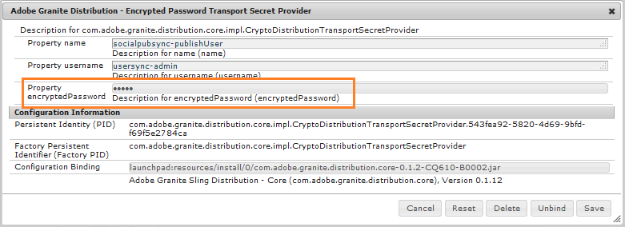

# 커뮤니티 사용자 동기화 {#communities-user-synchronization}

## 소개 {#introduction}

AEM Communities의 게시 환경(구성된 권한에 따라)에서 *사이트 방문자는* *회원이*&#x200B;되고, *사용자 그룹*&#x200B;을 *만들고,*&#x200B;구성원 프로필을 편집할 수 있습니다.

*사용자 데이터* 는 *사용자*, *사용자 프로필* 및 *사용자 그룹을 참조하는 데 사용되는 용어입니다*.

*멤버는* 작성 환경에 등록된 사용자와 달리 게시 환경에 등록된 *사용자를* 참조하는 데 사용되는 용어입니다.

사용자 데이터에 대한 자세한 내용은 사용자 및 사용자 그룹 [관리를 참조하십시오](users.md).

## 게시 팜에서 사용자 동기화 {#synchronizing-users-across-a-publish-farm}

기본적으로 게시 환경에서 만들어진 사용자 데이터는 작성 환경에 표시되지 않습니다.

작성 환경에서 생성된 대부분의 사용자 데이터는 작성 환경에 그대로 유지되도록 되어 있으며, 인스턴스를 게시하기 위해 동기화되거나 복제되지 않습니다.

토폴로지 [가](topologies.md) 게시 팜인 [](../../help/sites-deploying/recommended-deploys.md#tarmk-farm)경우 한 게시 인스턴스에 대해 수행된 등록 및 수정 사항은 다른 게시 인스턴스와 동기화되어야 합니다. 멤버는 로그인하여 게시 노드에서 해당 데이터를 볼 수 있어야 합니다.

사용자 동기화가 활성화되면 사용자 데이터가 팜의 게시 인스턴스 간에 자동으로 동기화됩니다.

### 사용자 동기화 설정 지침 {#user-sync-setup-instructions}

게시 팜 전체의 동기화를 활성화하는 방법에 대한 자세한 단계별 지침은

* [사용자 동기화](../../help/sites-administering/sync.md)

## 백그라운드에서 사용자 동기화  {#user-sync-in-the-background}


* **VLT 패키지**: 는 게시자에서 수행된 모든 변경 사항의 zip 파일입니다. 이 파일은 게시자에게 배포해야 합니다. 게시자를 변경하면 변경 이벤트 리스너가 선택하는 이벤트가 생성됩니다. 이렇게 하면 모든 변경 사항이 포함된 vlt 패키지가 만들어집니다.

* **배포 패키지**: Sling에 대한 배포 정보를 포함합니다. 컨텐츠가 배포되어야 하는 위치와 마지막으로 배포된 시기에 대한 정보입니다.

## ...의 경우 {#what-happens-when}

### 커뮤니티 사이트 콘솔에서 사이트 게시 {#publish-site-from-communities-sites-console}

작성자의 경우 커뮤니티 사이트가 [커뮤니티 사이트 콘솔에서](sites-console.md)게시되면 관련 페이지를 [복제하고](../../help/sites-deploying/configuring.md#replication-reverse-replication-and-replication-agents) Sling은 멤버십을 포함하여 동적으로 생성된 커뮤니티 사용자 그룹을 배포합니다.

### 사용자가 작성되었거나 게시 시 프로필 편집 {#user-is-created-or-edits-profile-on-publish}

게시 환경에서 만들어진 사용자 및 프로필(예: 자가 등록, 소셜 로그인, LDAP 인증 등)은 작성 환경에 나타나지 않습니다.

토폴로지가 [게시 팜](topologies.md) 이고 사용자 동기화가 올바르게 구성된 경우 *사용자* 및 *사용자 프로필은 Sling 배포를 사용하여 게시 팜에서 동기화됩니다* .

### 게시 시 새 커뮤니티 그룹 만들기 {#new-community-group-is-created-on-publish}

게시 인스턴스에서 시작되지만 커뮤니티 그룹 만들기에서 새 사이트 페이지와 새 사용자 그룹이 생성되며 이 작업은 작성자 인스턴스에서 실제로 수행됩니다.

프로세스의 일부로 새 사이트 페이지가 모든 게시 인스턴스에 복제됩니다. 동적으로 생성된 커뮤니티 사용자 그룹 및 해당 멤버십은 모든 게시 인스턴스에 Sling이 배포됩니다.

### 사용자 또는 사용자 그룹은 보안 콘솔을 사용하여 만듭니다. {#users-or-user-groups-are-created-using-security-console}

디자인 측면에서 게시 환경에서 만든 사용자 데이터는 작성 환경에 나타나지 않고 그 반대의 경우도 마찬가지입니다.

게시 환경에서 [사용자 관리 및 보안](../../help/sites-administering/security.md) 콘솔을 사용하여 새 사용자를 추가하는 경우 사용자 동기화는 필요한 경우 새 사용자와 그룹 구성원을 다른 게시 인스턴스와 동기화합니다. 사용자 동기화는 보안 콘솔을 통해 생성된 사용자 그룹도 동기화합니다.

### 사용자가 게시할 컨텐츠 게시 {#user-posts-content-on-publish}

사용자 생성 컨텐츠(UGC)의 경우, 게시 인스턴스에 입력된 데이터는 [구성된 SRP를 통해 액세스됩니다](srp-config.md).

## Best practices {#bestpractices}

기본적으로 사용자 동기화는 **비활성화됩니다**. 사용자 동기화 활성화에는 *기존* OSGi 구성을 수정하는 작업이 포함됩니다. 사용자 동기화를 활성화한 결과로 새 구성을 추가할 필요가 없습니다.

사용자 동기화는 작성 환경에 의존하여 사용자 데이터가 작성자에 만들어지지 않더라도 사용자 데이터 배포를 관리합니다.

**전제 조건**

1. 사용자 및 사용자 그룹이 한 게시자에서 이미 만들어진 경우 사용자 동기화를 구성하고 활성화하기 전에 사용자 데이터를 모든 게시자와 [수동으로](../../help/sites-administering/sync.md#manually-syncing-users-and-user-groups) 동기화하는 것이 좋습니다.

   사용자 동기화가 활성화되면 새로 만든 사용자와 그룹만 동기화됩니다.

1. 최신 코드가 설치되어 있는지 확인합니다.

   * [AEM 플랫폼 업데이트](https://helpx.adobe.com/kr/experience-manager/kb/aem62-available-hotfixes.html)
   * [AEM Communities 업데이트](deploy-communities.md#latestfeaturepack)

AEM Communities에서 사용자 동기화를 사용하려면 다음 구성이 필요합니다. 컨텐츠 배포 실패를 방지하기 위해 이러한 구성이 올바른지 확인하십시오.

### Apache Sling Distribution Agent - Sync Agents Factory {#apache-sling-distribution-agent-sync-agents-factory}

이 구성은 게시자에서 동기화할 컨텐츠를 가져옵니다. 구성은 작성 인스턴스에 있습니다. 작성자는 그곳에 있는 모든 게시자와 모든 정보를 동기화할 위치를 추적해야 합니다.

구성의 기본값은 단일 게시 인스턴스용입니다. 사용자 동기화는 게시 팜과 같은 여러 게시 인스턴스를 동기화하는 데 유용하므로 추가 게시 인스턴스를 구성에 추가해야 합니다.

**컨텐츠는 어떻게 동기화됩니까?**

작성자 인스턴스가 게시자의 내보내기 끝점을 ping합니다. 특정 게시자에 대해 사용자가 작성되거나 업데이트될 때마다(n) 작성자는 내보내기 끝점에서 컨텐츠를 [가져와 다른 게시자(컨텐츠를 가져오는 게시자와 구분되는 n-1)에게](sync.md#main-pars-image-1413756164) 해당 컨텐츠를 푸시합니다.

<!--This section used to be an accordion until converted to straight Markdown. When accordions are enabled, revert-->

### Apache Sling Sync 에이전트 구성을 구성하려면

AEM 작성자 인스턴스의 경우:

1. 관리자 권한으로 로그인합니다.
1. 웹 [콘솔에 액세스합니다](https://helpx.adobe.com/experience-manager/6-4/sites/deploying/using/configuring-osgi.html).

   예: http://localhost:4502/system/console/configMgr [](http://localhost:4502/system/console/configMgr).
1. Apache **[!UICONTROL Sling Distribution Agent - Sync Agent Factory를 찾습니다]**.

   * 편집할 기존 구성을 선택합니다(연필 아이콘).
   * 이름 확인: **`socialpubsync`.**
   * 활성화 **[!UICONTROL 확인란을]** 선택합니다.
   * [ **[!UICONTROL 여러 큐 사용]을 선택합니다]**.
   * 내보내기 **[!UICONTROL 끝점]** 및 **[!UICONTROL 가져오기 끝점]** 지정(더 많은 내보내기 및 가져오기 끝점을 추가할 수 있습니다.)

      이러한 끝점은 콘텐츠를 가져올 위치와 콘텐츠를 푸시할 위치를 정의합니다. 작성자는 지정된 내보내기 끝점의 컨텐츠를 가져오고 해당 컨텐츠를 게시자(컨텐츠를 가져온 게시자 제외)로 푸시합니다.
   

### Adobe GRANITE 배포 - 암호화된 암호 전송 암호 공급자 {#adobe-granite-distribution-encrypted-password-transport-secret-provider}

작성자가 작성자로부터 게시까지의 사용자 데이터를 동기화할 수 있는 권한을 가지므로 권한이 있는 사용자를 식별할 수 있습니다.

모든 게시 인스턴스에서 만들어진 [권한이 있는](../../help/sites-administering/sync.md#createauthuser) 사용자는 게시자가 작성자와 연결하고 작성자에 대한 Sling 배포를 구성하는 데 도움이 됩니다. 이 권한이 있는 사용자는 모든 필수 [ACL을 가지고 있습니다](../../help/sites-administering/sync.md#howtoaddacl).

게시자에서 데이터를 설치하거나 가져올 때마다 작성자는 이 구성에 설정된 자격 증명(사용자 이름 및 암호)을 사용하여 게시자와 연결합니다.

<!--This section used to be an accordion until converted to straight Markdown. When accordions are enabled, revert-->

### 권한이 있는 사용자를 사용하여 작성자와 발행자를 연결하려면

AEM 작성자 인스턴스의 경우:

1. 관리자 권한으로 로그인합니다.
1. 웹 [콘솔에 액세스합니다](../../help/sites-deploying/configuring-osgi.md).

   예: http://localhost:4502/system/console/configMgr [](http://localhost:4502/system/console/configMgr).
1. [ **[!UICONTROL Adobe [화강암 배포] - [암호화된 암호 전송 암호 공급자]를 찾습니다]**.
1. 편집할 기존 구성을 선택합니다(연필 아이콘).

   속성 `name:` \- **`socialpubsync`를`publishUser`확인합니다.**
1. 사용자 이름과 암호를 [권한이 있는 사용자에게 설정합니다](../../help/sites-administering/sync.md#createauthorizeduser).

   예: **`usersync`\-admin **

   

### Apache Sling Distribution Agent - Queue Agent Factory {#apache-sling-distribution-agent-queue-agents-factory}

이 구성은 게시자 간에 동기화할 데이터를 구성하는 데 사용됩니다. 데이터가 생성/업데이트된 경우 **[!UICONTROL 허용된 루트]**&#x200B;경로에 &quot;var/community/distribution/diff&quot;가 활성화되고 생성된 복제기가 게시자의 데이터를 가져와서 다른 게시자에 설치합니다.

<!--This section used to be an accordion until converted to straight Markdown. When accordions are enabled, revert-->

### 동기화할 데이터(노드 경로)를 구성하려면

AEM 게시 인스턴스의 경우:

1. 관리자 권한으로 로그인합니다.
1. 웹 [콘솔에 액세스합니다](https://helpx.adobe.com/experience-manager/6-4/sites/deploying/using/configuring-osgi.html).

   예: http://localhost:4503/system/console/configMgr [](http://localhost:4503/system/console/configMgr).
1. Apache **[!UICONTROL Sling Distribution Agent - Queue Agent Factory를 찾습니다]**.
1. 편집할 기존 구성을 선택합니다(연필 아이콘).

   이름 확인: `socialpubsync` \-reverse.
1. 활성화 **[!UICONTROL 확인란을]** 선택하고 저장합니다.
1. 허용된 루트에서 복제할 노드 경로를 **[!UICONTROL 지정합니다]**.
1. 각 인스턴스에 대해 `publish` 반복합니다.

   

### Adobe Granite Distribution - Diff Observer Factory {#adobe-granite-distribution-diff-observer-factory}

이 구성은 게시자 간에 그룹 멤버십을 동기화합니다.\
한 게시자에서 그룹 멤버십을 변경해도 다른 게시자에 대한 멤버십이 업데이트되지 않는 경우 **ref:members** 가 **looked 속성 이름에 추가되었는지 확인하십시오**.

<!--This section used to be an accordion until converted to straight Markdown. When accordions are enabled, revert-->

### 멤버 동기화

각 AEM 게시 인스턴스에서:

1. 관리자 권한으로 로그인합니다.
1. 웹 [콘솔에 액세스합니다](https://helpx.adobe.com/experience-manager/6-4/sites/deploying/using/configuring-osgi.html).

   예: http://localhost:4503/system/console/configMgr [](http://localhost:4503/system/console/configMgr).
1. [ **[!UICONTROL Adobe [화강암 분포] - [비교 옵저버 공장]을 찾습니다]**.
1. 편집할 기존 구성을 선택합니다(연필 아이콘).

   에이전트 **[!UICONTROL 이름]**&#x200B;확인: `socialpubsync` \-reverse&amp;ast;&amp;ast;
1. 활성화 **[!UICONTROL 확인란을]** 선택합니다.
1. 모양 속성 이름 **에`:members`**대한`description`rep를 지정하고&#x200B;**[!UICONTROL 저장을]**지정합니다.

   

### Apache Sling 배포 트리거 - 예약된 트리거 팩토리 {#apache-sling-distribution-trigger-scheduled-triggers-factory}

이 구성을 사용하면 폴링 간격(게시자를 핑하고 작성자가 변경 사항을 가져올 이후)을 구성하여 게시자 간에 변경 사항을 동기화할 수 있습니다.

작성자는 30초마다 게시자를 폴링합니다(기본값). 패키지가 폴더 */var/sling/distribution/packages/socialpubsync - vlt /shared*&#x200B;폴더에 있으면 해당 패키지를 가져와서 다른 게시자에 설치합니다.

<!--This section used to be an accordion until converted to straight Markdown. When accordions are enabled, revert-->

### 폴링 간격을 변경하려면

AEM 작성자 인스턴스의 경우:

1. 관리자 권한으로 로그인합니다.
1. 웹 [콘솔](../../help/sites-deploying/configuring-osgi.md)액세스(예: [http://localhost:4502/system/console/configMgr)](http://localhost:4502/system/console/configMgr)
1. Apache **[!UICONTROL Sling 배포 트리거 찾기 - 예약된 트리거 팩토리]**

   * 편집할 기존 구성 선택(연필 아이콘)
   * \- `Name:` scheduled-trigger **`socialpubsync`확인&#x200B;**
   * 간격(초)을 원하는 간격으로 설정하고 저장합니다.

   

### AEM Communities 사용자 동기화 수신기 {#aem-communities-user-sync-listener}

가입 및 다음에 차이가 있는 Sling 배포의 문제에 대해서는 **[!UICONTROL AEM Communities 사용자 동기화 수신기]** 구성에서 다음 속성이 설정되어 있는지 확인하십시오.

* NodeTypes
* IgnorableProperties
* IgnorableNodes
* DistributedFolders

<!--This section used to be an accordion until converted to straight Markdown. When accordions are enabled, revert-->

### 구독, 팔로잉 및 알림을 동기화하려면

각 AEM 게시 인스턴스에서:

1. 관리자 권한으로 로그인합니다.
1. 웹 [콘솔에 액세스합니다](../../help/sites-deploying/configuring-osgi.md). 예: http://localhost:4503/system/console/configMgr [](http://localhost:4503/system/console/configMgr).
1. AEM Communities **[!UICONTROL 사용자 동기화 수신기를 찾습니다]**.
1. 편집할 기존 구성을 선택합니다(연필 아이콘).

   이름 확인: **`socialpubsync`\-scheduled-trigger **
1. 다음을 **`NodeTypes`** 설정합니다.

   rep:사용자

   `nt` 비정형

   `nt` :리소스

   rep:ACL

   sling:Folder

   sling:OrderedFolder

   이 속성에 지정된 노드 유형이 동기화되고 알림 정보(블로그 및 구성 적용)가 다른 게시자 간에 동기화됩니다.
1. DistributedFolders에서 동기화할 모든 폴더를 **[!UICONTROL 추가합니다]**. 예,

   세그먼트/점수

   소셜/관계

   활동

1. 다음 **`ignorablenodes`** 으로 설정합니다.

   .tokens

   시스템

   rep `:cache` (고정 세션을 사용하기 때문에 이 노드를 다른 게시자와 동기화할 필요가 없습니다.

   

### 고유 슬링 ID {#unique-sling-id}

AEM 작성자 인스턴스는 Sling ID를 사용하여 데이터가 들어오는 위치와 패키지를 다시 보내야 하는 게시자를 식별합니다(그렇지 않은 경우).

게시 팜의 모든 게시자에 고유한 Sling ID가 있는지 확인합니다. 게시 팜의 여러 게시 인스턴스에 대해 Sling ID가 동일한 경우 사용자 동기화가 실패합니다. 작성자는 패키지를 가져올 위치와 패키지를 설치할 위치를 알 수 없으므로

<!--This section used to be an accordion until converted to straight Markdown. When accordions are enabled, revert-->

### 게시 팜에 있는 게시자의 고유한 Sling ID 확인

각 게시 인스턴스에서:

1. https:// [_호스트:port_/system/console/status-slingsettings로 이동합니다](http://localhost:4503/system/console/status-slingsettings).
1. Sling ID의 값을 **[!UICONTROL 확인합니다]**.

   

   게시 인스턴스의 Sling ID가 다른 게시 인스턴스의 Sling ID와 일치하는 경우 다음을 수행합니다.

1. 일치하는 Sling ID가 있는 게시 인스턴스 중 하나를 중지합니다.
1. 디렉토리에서 _sling.id.file라는 파일을 `crx-quickstart/launchpad/felix` 검색하여 삭제합니다.

   *예를 들어 Linux 시스템에서 다음을 수행합니다.*

   `rm -i $(find . -type f -name sling.id.file)`

   *예를 들어 Windows 시스템에서 다음을 수행합니다.*

   `use windows explorer and search for _sling.id.file_`

1. 게시 인스턴스를 시작합니다. 시작 시 새 Sling ID가 할당됩니다.
1. 이제 Sling **[!UICONTROL ID가]** 고유한지 확인합니다.

모든 게시 인스턴스에 고유한 Sling ID가 부여될 때까지 이 단계를 반복합니다.

### 저장소 패키지 빌더 팩토리 {#vault-package-builder-factory}

업데이트를 제대로 동기화하려면 사용자 동기화를 위해 자격 증명 모음 패키지 빌더를 수정해야 합니다.\
에서 `/home/users`노드가 `/rep:cache` 만들어집니다. 노드의 주체 이름에 쿼리하면 이 캐시를 직접 사용할 수 있음을 찾는 데 사용되는 캐시입니다.

게시자 간에 `rep:cache `노드가 동기화되면 사용자 동기화를 중지할 수 있습니다.

<!--This section used to be an accordion until converted to straight Markdown. When accordions are enabled, revert-->

### 발행자 간에 업데이트가 제대로 동기화되는지 확인하려면

각 AEM 게시 인스턴스에서:

1. 웹 [콘솔](../../help/sites-deploying/configuring-osgi.md)(예: http://localhost:4503/system/console/configMgr)에 [액세스합니다](http://localhost:4503/system/console/configMgr).
1. Apache Sling **[!UICONTROL Distribution Packaging - Vault Package Builder Factory Builder 이름을 찾습니다]**. socialpubsync-vlt
1. 편집 아이콘을 선택합니다.
1. 두 개의 패키지 필터 추가:

   * `/home/users|-.\*/.tokens`
   * `/home/users|**+**.\*/rep:cache`
1. 정책 처리
   * 기존 표현 `:policy` 노드를 새 개체로 덮어쓰려면 세 번째 패키지 필터를 추가하십시오.

      `/home/users|**+**.\*/rep:policy`
   * 정책이 배포되지 않도록 하려면

      Acl 처리: 무시


## AEM Communities의 Sling 배포 문제 해결 {#troubleshoot-sling-distribution-in-aem-communities}

Sling 배포가 실패할 경우 다음 디버깅 단계를 시도하십시오.

1. **잘못 추가된 구성을[확인하십시오](../../help/sites-administering/sync.md#improperconfig).** 여러 구성을 추가하거나 편집하지 않고 기존 기본 구성을 편집해야 합니다.
1. **구성을 확인합니다**. 모든 [구성이](sync.md#bestpractices) AEM 작성자 인스턴스에 적절히 설정되어 있는지 확인합니다(우수 사례 [에 명시됨](sync.md#main-pars-header-863110628)).
1. **권한이 있는 사용자 권한을 확인합니다**. 패키지가 제대로 설치되지 않은 경우 첫 번째 게시 인스턴스에서 만든 [권한이 있는 사용자](../../help/sites-administering/sync.md#createauthuser) 의 ACL이 올바른지 확인하십시오.

   이 유효성을 확인하려면, [만들어진 권한이 있는 사용자](../../help/sites-administering/sync.md#createauthuser) 대신 관리자 사용자 자격 증명을 사용하도록 작성자 인스턴스의 [Adobe [화강암 배포 - 암호화된 암호 전송 암호 공급자](../../help/sites-administering/sync.md#adobegraniteencpasswrd) 구성]을 변경합니다. 이제 패키지를 다시 설치해 보십시오. 사용자 동기화가 관리자 자격 증명과 제대로 작동하면 작성된 게시 사용자에게 적절한 ACL이 없음을 의미합니다.

1. **비교 옵저버 팩토리 구성을 확인하십시오**. 게시 팜 간에 특정 노드만 동기화되지 않으면 그룹 구성원이 동기화되지 않습니다. 그런 다음 [Adobe의 [Granite Distribution - Diff Observer Factory](../../help/sites-administering/sync.md#diffobserver) 구성]이 활성화되어 있고 **rep:members** 가 **look 속성 이름으로 설정되어 있는지 확인합니다**.
1. **AEM Communities 사용자 동기화 수신기 구성을 확인합니다.** 생성된 사용자가 동기화되지만 가입 및 팔로어가 작동하지 않는 경우 AEM Communities 사용자 동기화 수신기 구성이 있는지 확인하십시오.

   * 노드 유형- **rep:User, nt:unstructured**, **nt:resource**, **rep:ACL**, ******sling FolderSling, AndOrderedFolder로 설정됩니다.**
   * 무시할 수 있는 노드 - tokens **,**&#x200B;시스템 **및** rep:cache로 설정됩니다 **.**
   * 분산 폴더 - 배포할 폴더에 설정

1. **게시 인스턴스에서 사용자 생성 시 생성된 로그를 확인합니다**. 위의 구성이 적절하게 설정되었지만 사용자 동기화가 작동하지 않는 경우 사용자 생성 시 생성된 로그를 확인하십시오.

   다음과 같이 로그 순서가 동일한지 확인합니다.

   ```shell
   15.05.2016 18:33:01.523 *INFO* [sling-oak-observation-7422] com.adobe.cq.social.sync.impl.PublisherSyncServiceImpl Handing these paths to the distribution subsystem: [/home/users/C, /home/users/C/Cw-5avWqilmqsNn5hCvK]
   15.05.2016 18:33:01.523 *INFO* [sling-oak-observation-7422] org.apache.sling.distribution.agent.impl.SimpleDistributionAgent [agent][socialpubsync-reverse] REQUEST-START DSTRQ2: ADD paths=[/home/users/C, /home/users/C/Cw-5avWqilmqsNn5hCvK], user=communities-user-admin
   15.05.2016 18:33:01.523 *INFO* [sling-oak-observation-7431] com.adobe.cq.social.sync.impl.PublisherSyncServiceImpl Handing these paths to the distribution subsystem: [/home/users/C/Cw-5avWqilmqsNn5hCvK, /home/users/C/Cw-5avWqilmqsNn5hCvK/profile, /home/users/C/Cw-5avWqilmqsNn5hCvK/rep:policy]
   15.05.2016 18:33:01.523 *INFO* [sling-oak-observation-7431] org.apache.sling.distribution.agent.impl.SimpleDistributionAgent [agent][socialpubsync-reverse] REQUEST-START DSTRQ3: ADD paths=[/home/users/C/Cw-5avWqilmqsNn5hCvK, /home/users/C/Cw-5avWqilmqsNn5hCvK/profile, /home/users/C/Cw-5avWqilmqsNn5hCvK/rep:policy], user=communities-user-admin
   15.05.2016 18:33:01.757 *INFO* [sling-oak-observation-7431] org.apache.jackrabbit.vault.packaging.impl.JcrPackageDefinitionImpl unwrapping package sling/distribution:socialpubsync-vlt_1463337181554_ebb27ad9-a861-4405-9342-d64c916654e2:0.0.1
   15.05.2016 18:33:01.820 *INFO* [sling-oak-observation-7422] org.apache.jackrabbit.vault.packaging.impl.JcrPackageDefinitionImpl unwrapping package sling/distribution:socialpubsync-vlt_1463337181554_58811273-5861-48fe-95d2-4aff367b99c3:0.0.1
   15.05.2016 18:33:02.023 *INFO* [sling-oak-observation-7430] com.adobe.cq.social.sync.impl.PublisherSyncServiceImpl Handing these paths to the distribution subsystem: [/home/users/C/Cw-5avWqilmqsNn5hCvK/profile]
   15.05.2016 18:33:02.023 *INFO* [sling-oak-observation-7430] org.apache.sling.distribution.agent.impl.SimpleDistributionAgent [agent][socialpubsync-reverse] REQUEST-START DSTRQ4: ADD paths=[/home/users/C/Cw-5avWqilmqsNn5hCvK/profile], user=communities-user-admin
   15.05.2016 18:33:02.273 *INFO* [sling-oak-observation-7430] org.apache.jackrabbit.vault.packaging.impl.JcrPackageDefinitionImpl unwrapping package sling/distribution:socialpubsync-vlt_1463337182039_f34f4fa6-10b9-42eb-8740-4da9d4d38f99:0.0.1
   ```

   디버깅하려면:

   1. 사용자 동기화 비활성화:
   1. AEM 작성자 인스턴스에서 관리자 권한으로 로그인합니다.

      1. 웹 [콘솔에 액세스합니다](../../help/sites-deploying/configuring-osgi.md). 예: http://localhost:4502/system/console/configMgr [](http://localhost:4502/system/console/configMgr).
      1. Apache Sling **[!UICONTROL Distribution Agent - Sync Agent Factory 구성을 찾습니다]**.

      1. 활성화 **[!UICONTROL 확인란을]** 선택 취소합니다.
      작성자 인스턴스에서 사용자 동기화를 비활성화하면(내보내기 및 가져오기) 끝점이 비활성화되고 작성자 인스턴스가 정적 인스턴스입니다. 작성자가 **[!UICONTROL 배포]** 패키지를 핑하거나 가져오지 않습니다.

      이제 사용자가 게시 인스턴스에 생성되면 **[!UICONTROL vlt]** 패키지가 */var/sling/distribution/packages/socialpubsync - vlt /data* node에서 만들어집니다. 그리고 이러한 패키지가 작성자가 다른 서비스로 푸시되는 경우 이 데이터를 다운로드하고 추출하여 모든 속성이 다른 서비스로 푸시되는지 확인할 수 있습니다.

   1. 게시자로 이동하여 게시자에 사용자를 만듭니다. 따라서 이벤트가 만들어집니다.
   1. 사용자 생성 시 생성된 로그 [순서를](sync.md#troubleshoot-sling-distribution-in-aem-communities)확인합니다.
   1. vlt **[!UICONTROL 패키지]** 생성 여부를 확인하십시오 `/var/sling/distribution/packages/socialpubsync-vlt/data`.
   1. 이제 AEM 작성자 인스턴스에서 사용자 동기화를 활성화합니다.
   1. 게시자의 경우 Apache Sling Distribution Agent - Sync Agents Factory의 **[!UICONTROL 내보내기 또는 가져오기 끝점을 변경합니다]**.

      패키지 데이터를 다운로드하고 추출하여 모든 속성이 다른 게시자에게 푸시되고 어떤 데이터가 손실되는지 확인할 수 있습니다.


