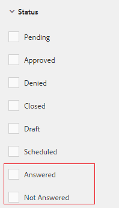
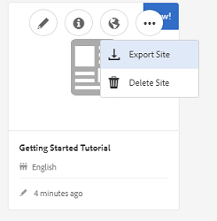

# AEM 6.4 커뮤니티의 새로운 기능 {#what-s-new-in-aem-communities}

AEM Communities은 파트너, 고객 및 직원 간의 공동 작업을 위한 프레임워크를 제공합니다. 웹 사이트 구조에 소셜 기능을 도입하고 이해 관계자에게 지식을 전달하고 참여를 유도하여 브랜드 가치를 높일 수 있습니다.

AEM 6.4 Communities는 커뮤니티 사용자의 경험을 향상시키고 커뮤니티 관리자, 중재자 및 관리자의 일상적인 작업을 간소화하는 기능을 제공합니다.

새로운 기능과 향상된 기능에 대한 빠른 소개를 살펴보십시오. 또한 AEM 6.4 커뮤니티 [릴리스 노트](../release-notes/communities-release-notes.md)를 참조하십시오. AEM 6.4 커뮤니티 문서는 [AEM 6.4 커뮤니티 사용자 안내서](home.md)를 참조하십시오.

## 하위 커뮤니티 또는 커뮤니티 그룹 관리 {#managing-sub-communities-or-community-groups}

커뮤니티 관리자는 AEM Communities을 사용하여 작성 환경에서 미리 정의된 템플릿을 사용하여 커뮤니티 사이트 내에서 그룹 및 하위 그룹을 만들 수 있습니다. 이러한 그룹은 하위 커뮤니티 역할을 하며 상위 사이트의 테마 및 스타일링과 같은 많은 구성을 상속할 수 있습니다. 하지만 이러한 그룹은 상위 사이트와 다를 수 있습니다. 예를 들어 그룹 중재자 세트가 서로 다르거나 보안 수준에 따라 다를 수 있습니다. 이러한 그룹은 다음과 같은 향상된 기능을 통해 권한을 한층 더 부여받은 독립적이고 완전한 규모의 미니 커뮤니티입니다.

### 단일 단계 {#create-multi-locale-groups-in-single-step}에서 다중 로케일 그룹 만들기

커뮤니티 사이트의 일부로 단일 작업에서 다중 언어 그룹을 만들 수 있습니다. **[!UICONTROL 커뮤니티 사이트 내에서]** 새 커뮤니티 그룹을 만드는 동안 사용할 수 있는 커뮤니티 그룹 템플릿 **[!UICONTROL 의 추가 사용 가능한 커뮤니티 그룹 언어 필드]** 를 사용하면  [이](groups.md) 를 구현할 수 있습니다.

이러한 그룹을 만들려면 사이트 콘솔에서 원하는 커뮤니티 사이트의 그룹 컬렉션으로 이동하면 됩니다. 그룹을 만들고 **[!UICONTROL 커뮤니티 그룹 템플릿]** 페이지의 **[!UICONTROL 추가 사용 가능한 커뮤니티 그룹 언어]** 필드에서 원하는 언어를 지정합니다.

### 그룹 콘솔 {#delete-community-groups-from-groups-console}에서 커뮤니티 그룹 삭제

AEM 6.4 Communities는 커뮤니티 사이트 콘솔 내의 커뮤니티 그룹 컬렉션에서 기존 커뮤니티 그룹에 그룹 삭제 아이콘을 제공합니다. 이렇게 하면 [그룹 삭제](groups.md#deleting-the-group)를 한 번의 클릭으로 사용할 수 있으며, 그룹과 연관된 모든 항목(예: 콘텐트 및 사용자 구성원 자격)을 삭제할 수 있습니다.

### 그룹 {#create-and-assign-enablement-resources-within-groups} 내에 활성 리소스 만들기 및 할당

이제 특정 타깃팅된 커뮤니티 구성원을 위해 학습 컨텐츠를 만들고 관리 및 게시할 수 있습니다. 커뮤니티 그룹(전체 커뮤니티 사이트뿐만 아니라 커뮤니티 그룹에 대한 카탈로그 및 할당 기능이 사용 가능하므로, 활성 관리자는 [지원 리소스](resource.md) 및 학습 경로를 소규모 사용자 집합에 할당할 수 있습니다.

## 사용자가 생성한 콘텐츠 중재 중 {#moderating-user-generated-content}

AEM 6.4 Communities는 절제에 대한 몇 가지 개선 사항을 제공하므로 커뮤니티 중재자의 일상 생활을 간소화할 수 있습니다.

### 자동 스팸 감지 {#automatic-spam-detection}

새로운 스팸 감지 엔진은 커뮤니티 사이트 또는 그룹에서 원하지 않는 사용자 생성 콘텐츠를 필터링하는 데 도움이 됩니다. 이 기능을 활성화하면 미리 정의된 스팸 단어 세트를 기반으로 사용자 생성 콘텐츠를 스팸 또는 스팸 아님 중 하나로 표시할 수 있습니다. 중재자는 컨텐츠에 대해 추가로 조치를 취하여 컨텐츠를 거부하거나 게시 인스턴스에 표시할 수 있습니다. 이러한 중재 작업은 인라인 또는 일괄 중재 콘솔을 통해 수행할 수 있습니다.

[스팸 ](moderate-ugc.md#spam-detection) 감지 기능을 통해 사용자가 생성한 특정 컨텐츠를 90% 정확하게 찾아 플래그를 지정합니다. 그러나 이 기능은 기본적으로 활성화되어 있지 않습니다. 이를 활성화하려면 커뮤니티 관리자가 system/console에서 configMgr로 이동하여 스팸 프로세스를 추가해야 합니다.

### QnA {#new-answered-unanswered-filters-for-qna}에 대한 새 필터(답변됨/미답변)

AEM 6.4는 일괄 중재 콘솔에 2개의 [새로운 필터](moderation.md#filter-rail)QnA 질문에 대해 답변됨 및 답변되지 않음&lt;a1/>을 추가합니다. 이러한 필터는 필터 레일의 상태 아래에서 사용할 수 있습니다.

답변됨 상태를 선택하면 답변된 모든 질문이 컨텐츠 영역의 중재자에게 표시됩니다. 반면에 답변되지 않음 상태만 선택된 경우, 중재자는 답변된 질문을 제외한 모든 컨텐츠 유형(모든 컨텐츠 유형)을 볼 수 있습니다. 답변되지 않은 질문 및 포럼 주제, 블로그 기사 또는 댓글과 같은 기타 컨텐츠에는 답변되지 않은 질문에 대한 속성이 없기 때문입니다.

### 책갈피 중재 필터 {#bookmark-moderation-filters}

AEM Communities은 중재 콘솔에서 사전 정의된 중재 필터[에 책갈피를 지정하는 기능을 제공합니다. ](moderation.md#filter-rail) 이러한 저장된 책갈피는 나중에 다시 방문하여 다른 사용자와 공유할 수 있습니다.

사용자는 중재 콘솔의 필터 레일에서 원하는 필터를 선택하면 필터링된 UGC를 보고 브라우저에 필터를 책갈피에 추가해야 합니다. 이러한 필터는 URL 문자열 끝에 추가되므로 나중에 공유, 재사용 및 재방문할 수 있습니다.

## 커뮤니티 사이트 관리 {#managing-community-sites}

AEM 6.4 Communities는 사이트 관리자가 서로 다른 언어의 많은 커뮤니티 사이트를 쉽게 만들고, 관리하고, 삭제할 수 있도록 향상된 사이트 관리 기능을 제공합니다.

### 한 단계로 다중 로케일 커뮤니티 사이트 만들기 {#create-multi-locale-community-sites-in-one-step}

AEM Communities에서는 단일 작업에서 [다중 언어 커뮤니티 사이트](create-site.md)를 만들 수 있습니다. 사이트 콘솔에서 새 커뮤니티 사이트를 만드는 동안 **[!UICONTROL 사이트 템플릿]** 페이지의 **[!UICONTROL 커뮤니티 사이트 기본 언어]** 필드에서 선택할 수 있는 여러 언어가 사용 가능하기 때문에 가능합니다.

사용자는 이러한 모든 사이트에 대해 구성 폴더, 브랜딩 및 기타 여러 구성을 한 번에 선택할 수 있습니다.

### 사이트 콘솔 {#delete-community-sites-from-sites-console}에서 커뮤니티 사이트 삭제

AEM 6.4 Communities는 커뮤니티 사이트 콘솔의 기존 커뮤니티 사이트에서 사이트 삭제 아이콘을 제공합니다. 이렇게 하면 한 번의 클릭으로 [사이트](create-site.md) 및 관련 항목을 삭제할 수 있습니다.

## UGC 및 사용자 프로필 관리 {#managing-ugc-and-user-profiles}

사용자 데이터를 커뮤니티 경험의 중심으로 보호하면 AEM Communities은 [API가 기본적으로](user-ugc-management-service.md) 및 [샘플 servlet](https://github.com/Adobe-Marketing-Cloud/aem-communities-ugc-migration/tree/main/bundles/communities-ugc-management-servlet)을 표시합니다. 이러한 API는 사용자가 생성한 콘텐츠를 일괄 관리(일괄 삭제 및 일괄 내보내기)하고 사용자 프로필을 삭제하는 데 도움이 되며, EU GDPR 준수 요청을 처리하는 데 도움이 됩니다.

## 변경된 사항 {#what-s-changed}

* AEM 6.4 Communities에서는 새로운 커뮤니티 사이트를 만드는 동안 Captcha 확인을 사용할 수 없습니다. 하지만 보안 향상을 위해 [Google 구성 요소 reCAPTCHA](https://helpx.adobe.com/experience-manager/using/aem_recaptcha.html)를 포함하도록 커뮤니티 사이트를 사용자 지정할 수 있습니다.
* 사용자 지정 CSS 업로드 옵션이 커뮤니티 사이트 및 그룹 테마에서 제거되었습니다.
* 컨텐츠 전용 및 검색 아이콘이 일괄 중재 UI의 필터 레일에 추가되었습니다.
* 컨텐츠 경로 필터가 일괄 중재 UI의 필터 레일에 추가되었습니다.
* 벌크 모드로 전환하면 벌크 중재 UI에서 벌크 모드가 제거되었습니다. 다중 선택 모드로 들어가려면 게시물에서 선택( ) 아이콘을 클릭하고 마우스로 마우스로 마우스로 마우스를 가리키거나 게시물(모바일)에서 손가락을 누른 상태로 나타납니다.
