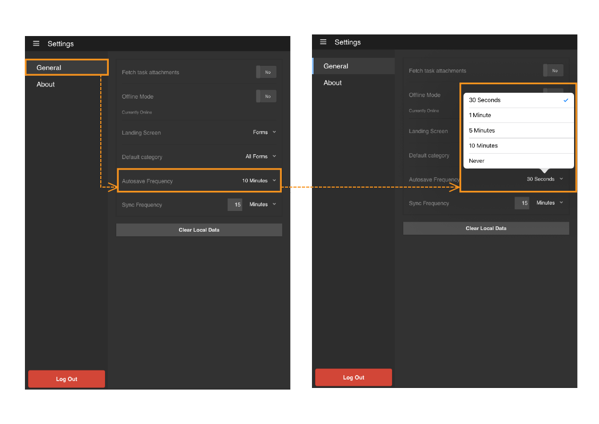

# AEM Forms 앱에서 자동 저장 사용 {#using-autosave-in-aem-forms-app}

>[!CAUTION]
>
>AEM 6.4가 확장 지원이 종료되었으며 이 설명서는 더 이상 업데이트되지 않습니다. 자세한 내용은 [기술 지원 기간](https://helpx.adobe.com/kr/support/programs/eol-matrix.html). 지원되는 버전 찾기 [여기](https://experienceleague.adobe.com/docs/).

사용자가 Adobe Experience Manager Forms 앱에 데이터를 입력하면 자동 저장 기능이 정기적으로 저장됩니다. AEM Forms 앱의 자동 저장 기능을 사용하면 앱이 실수로 닫히는 경우 데이터 손실을 방지할 수 있습니다.

앱이 실수로 닫힐 수 있습니다.

* 배터리 부족으로 장치가 종료되는 경우
* 사용자가 앱을 종료하는 경우
* 예기치 않은 충돌이 발생하는 경우

앱이 입력한 데이터를 저장한 뒤에 간격을 지정할 수 있습니다.

>[!NOTE]
>
>[자동 저장] 빈도를 신중하게 선택합니다. 자주 자동 저장 작업을 수행하면 장치의 성능에 큰 영향을 줄 수 있습니다.

AEM Forms 앱에서 자동 저장 기능을 사용하려면 다음 단계를 수행하십시오.

1. 앱에 로그인하고 다음 위치로 이동합니다 **[!UICONTROL 설정 > 일반]**.
1. 일반 화면에서 **[!UICONTROL 자동 저장 빈도]** 옵션을 선택합니다.
   

1. 앱을 다시 시작하고 동일한 사용자로 로그인하면 저장하지 않은 작업 복구 대화 상자를 사용하여 작업을 복원하라는 메시지가 표시됩니다. 클릭 **[!UICONTROL 확인]** 저장되지 않은 작업 복구 대화 상자에서 저장된 작업 작업을 다시 시작합니다. 을(를) 클릭합니다 **[!UICONTROL 취소]** 마지막으로 트리거한 자동 저장에 해당하는 저장된 데이터를 삭제하고 새 작업 작업을 시작합니다.

   를 클릭하면 **[!UICONTROL 확인]**로 설정되면 앱이 충돌하기 전에 트리거된 최신 자동 저장에 해당하는 데이터가 작업 상태로 복원됩니다. 여기에는 양식 데이터와 작업과 관련된 모든 첨부 파일이 포함됩니다.
   **A.** 진행 중인 작업 양식 **B.** 앱을 강제로 닫았습니다. **C.** 저장하지 않은 작업 복구 대화 상자를 사용하여 앱이 다시 시작되었습니다. **D.** 원본 데이터로 복원된 양식
