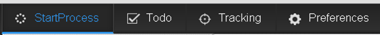

# 인터페이스에서 글꼴 변경 {#changing-the-font-on-the-interface}

>[!CAUTION]
>
>AEM 6.4가 확장 지원이 종료되었으며 이 설명서는 더 이상 업데이트되지 않습니다. 자세한 내용은 [기술 지원 기간](https://helpx.adobe.com/kr/support/programs/eol-matrix.html). 지원되는 버전 찾기 [여기](https://experienceleague.adobe.com/docs/).

AEM Forms 작업 공간에 표시되는 글꼴을 변경할 수 있습니다. 사용자 인터페이스의 특정 섹션에 사용되는 글꼴은 스타일 시트의 해당 섹션에 정의됩니다. 사용자 인터페이스의 글꼴을 선택적으로 변경할 수 있습니다.

다음을 수행합니다 [AEM Forms 작업 공간 사용자 지정을 위한 일반 단계](/help/forms/using/generic-steps-html-workspace-customization.md) 및 요구 사항에 따라 CSS, HTML 또는 둘 다 사용자 지정하는 단계를 따릅니다.

1. 기존 스타일로 글꼴 모음을 변경하거나 추가합니다.
1. HTML 요소에 대한 글꼴 패밀리 인라인을 변경하거나 추가합니다.
1. 스타일을 추가하고 HTML 요소에 사용합니다.

예를 들어, 위쪽 탐색 모음 앵커 텍스트의 글꼴을 Courier New 로 변경하려면 다음 단계를 따르십시오.

1. 에 액세스하여 CRXDE Lite에 로그인합니다. `https://[server]:[port]/lc/crx/de/index.jsp`.
1. 다음 중 하나를 수행하십시오.

   1. 기존 스타일의 font-family를 변경하려면 /apps/ws/css의 newStyle.css 파일에 다음을 추가하십시오.

      ```css
      #topnav a {
         font-family: "Courier New";
      }
      ```

   1. HTML 요소에 대한 글꼴 패밀리 인라인을 추가하려면 `/libs/ws/js/runtime/templates/appnavigation.html` 파일 위치 `/apps/ws/js/runtime/templates/appnavigation.html`.

      다음과 같이 /apps/ws/js/runtime/templates/appnavigation.html 파일을 업데이트합니다.

      ```
      <li class="process"><a href="#" title="<%= $.t('index.header.topnav.startprocess.detail')%>" style="font-family:Courier New;" ><%= $.t('index.header.topnav.startprocess.name')%></a></li>
      <li class="todo"><a href="#/todo" title="<%= $.t('index.header.topnav.todo.detail')%>" style="font-family:Courier New;" ><%= $.t('index.header.topnav.todo.name')%></a></li>
      <li class="track"><a href="#/tracking" title="<%= $.t('index.header.topnav.tracking.detail')%>" style="font-family:Courier New;" ><%= $.t('index.header.topnav.tracking.name')%></a></li>
      <li class="preference"><a href="#/preferences" title="<%= $.t('index.header.topnav.preferences.detail')%>" style="font-family:Courier New;" ><%= $.t('index.header.topnav.preferences.name')%></a></li>
      ```

      편집 및 바꾸기용 /apps/ws/js/registry.js 파일을 엽니다. `text!/lc/libs/ws/js/runtime/templates/appnavigation.html` with `text!/lc/apps/ws/js/runtime/templates/appnavigation.html`.

   1. font-family를 정의하는 스타일을 추가하려면 /apps/ws/css의 newStyle.css 파일에 다음을 추가하십시오.

      ```css
      .myNewFontStyle a {
         font-family: "Courier New";
      }
      ```

      HTML 요소에 대해 font-family 인라인을 추가하려면 /apps/ws/js/runtime/templates의 appnavigation.html 파일에 다음을 추가하십시오.

      ```css
      <div id="topnav" class="myNewFontStyle">
          <ul>
              <li class="process"><a href="#" title="<%= $.t('index.header.topnav.startprocess.detail')%>" ><%= $.t('index.header.topnav.startprocess.name')%></a></li>
              <li class="todo"><a href="#/todo" title="<%= $.t('index.header.topnav.todo.detail')%>"><%= $.t('index.header.topnav.todo.name')%></a></li>
              <li class="track"><a href="#/tracking" title="<%= $.t('index.header.topnav.tracking.detail')%>" ><%= $.t('index.header.topnav.tracking.name')%></a></li>
              <li class="preference"><a href="#/preferences" title="<%= $.t('index.header.topnav.preferences.detail')%>" ><%= $.t('index.header.topnav.preferences.name')%></a></li>
          </ul>
      </div>
      ```

1. 작업 공간을 다시 실행하고 변경 사항이 표시되도록 브라우저 캐시를 지웁니다.


**그림:** *글꼴 사용자 지정 전 위쪽 탐색 모음*


**그림:** *첫 번째 탭의 글꼴 사용자 지정 후 위쪽 탐색 모음*
